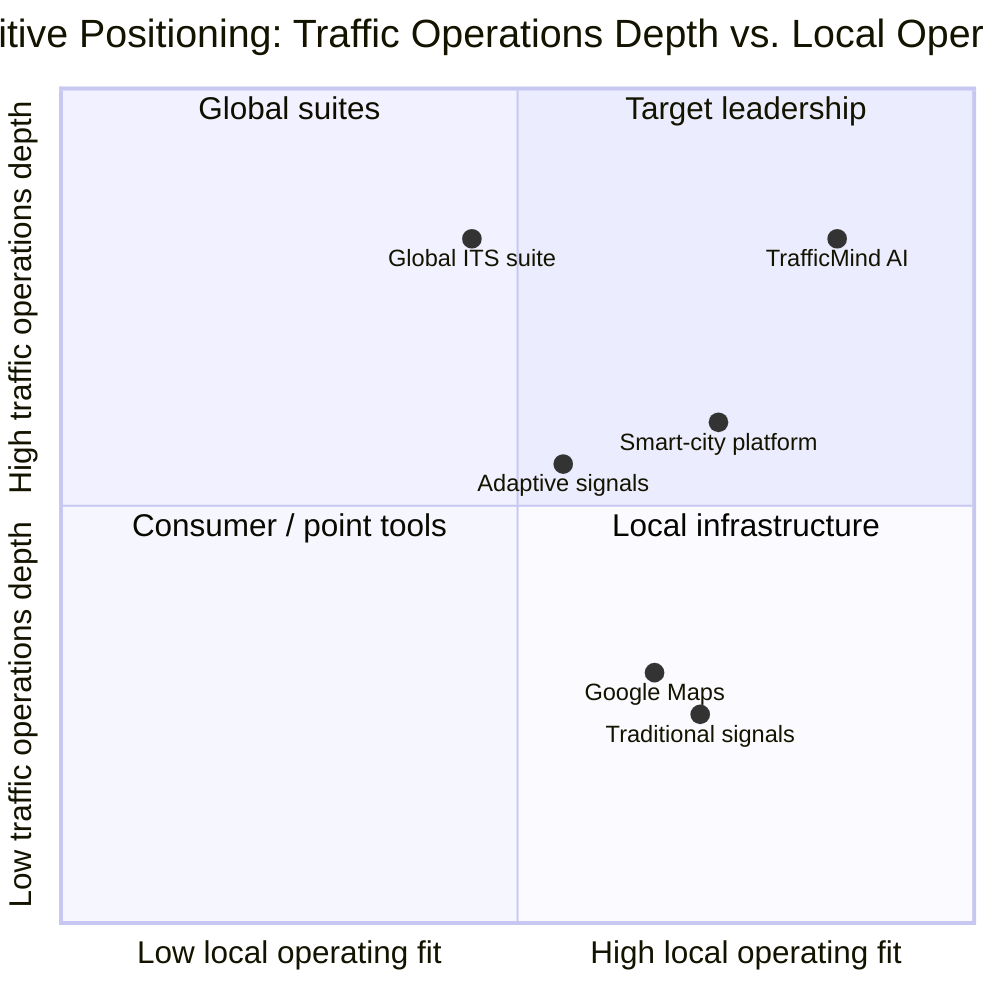
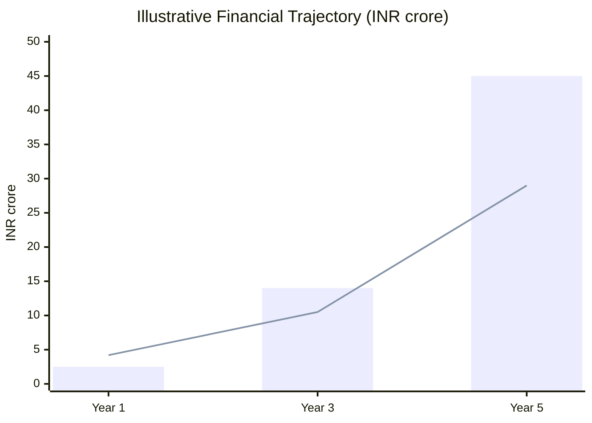
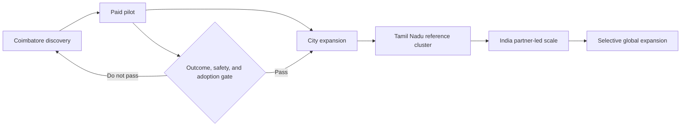
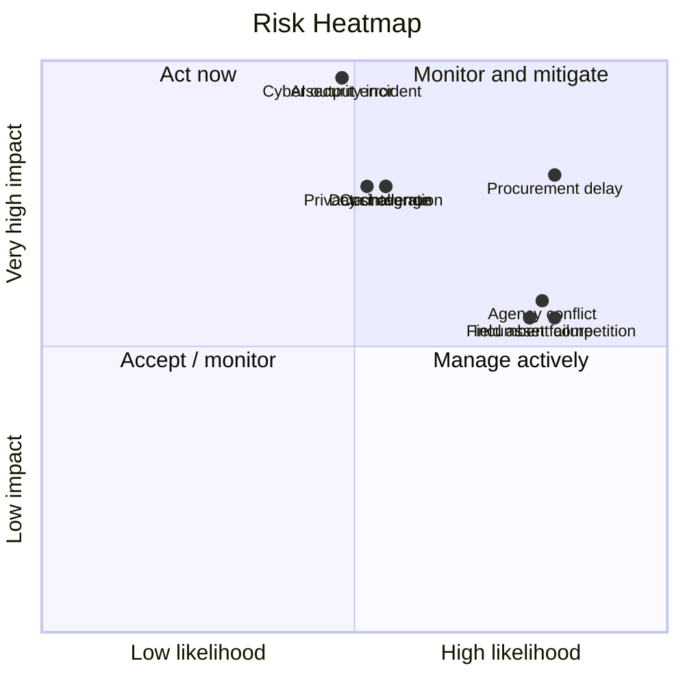

# TrafficMind AI: Business Strategy

**Part:** Phase 03, Part 2 - Business Strategy  
**Project:** TrafficMind AI  
**Tagline:** *Predict. Optimize. Save Lives.*  
**Beachhead city:** Coimbatore, Tamil Nadu, India  
**Date:** 19 July 2026  
**Status:** Strategy model for validation. Pricing, cost, and financial figures are internal planning scenarios, not quotations, commitments, or audited forecasts.

> **Strategic thesis:** TrafficMind AI will win by becoming the accountable operating layer between existing city infrastructure and human decision-makers. The product should complement signals, cameras, ICCCs, dispatch, and field teams - not compete with them as another isolated dashboard.

## 1. Competitor Analysis

### Category Comparison

| Alternative | Core strength | Material limitation | TrafficMind AI position |
|---|---|---|---|
| Traditional fixed-time signals | Predictable, proven, low-complexity local control. | Cannot respond well to incidents, demand variation, or network spillback. | Use existing control as a baseline; add evidence and human decision support where authorized. |
| Adaptive signal systems | Adjust local/corridor timing using detector input. | Often focused on signal efficiency; may not join emergency, safety, maintenance, and citywide workflows. | Complement or integrate with approved controllers; measure network and safety trade-offs. |
| Google Maps / navigation apps | Consumer route guidance, traffic conditions, disruptions, and fastest-route estimates. | Primarily informs travelers; does not give public agencies operational authority, signal control, or governed incident workflow. | Use public mobility information only where legally/licensed; focus on agency decisions and accountability. Google says navigation data helps provide real-time traffic and disruption information. [Google Maps Help](https://support.google.com/maps/answer/10565726?hl=en-GB) |
| Smart-city / ICCC platforms | Integrate municipal feeds, CCTV, city services, and command-centre operations. | May remain broad, vendor-specific, and not optimized for traffic-operating workflows or outcome learning. | Be ICCC-compatible: a traffic-specialist operating capability, not a replacement command centre. |
| Global ITS suites | Mature traffic, tolling, signal, and mobility management capabilities at scale. | Cost, procurement complexity, localization, legacy integration, and operating adoption can be difficult for a tier-2 Indian city. | Compete on Coimbatore/Tamil Nadu operating fit, pragmatic rollout, responsible data governance, and measured public outcomes. Kapsch, for example, positions its suite around multi-system urban traffic management and predictive analysis. [Kapsch](https://www.kapsch.net/en/traffic/urban) |
| AI traffic point solutions | Vision analytics, counting, enforcement, or isolated optimization. | Risk of becoming another dashboard, with weak governance, data integration, or operational ownership. | Link detection to verified action, cross-agency handoffs, safety, recovery, and auditability. |

### Competitive Positioning Matrix

| Capability | Traditional signals | Adaptive signals | Google Maps | ICCC platform | Global ITS suite | TrafficMind AI |
|---|---:|---:|---:|---:|---:|---:|
| Local signal timing | High | High | None | Medium | High | Integration-dependent |
| Citizen navigation | None | None | High | Low | Low | Low / partner-led |
| Traffic Police workflow | Low | Low | Low | Medium | Medium | High |
| Emergency-route coordination | Low | Medium | Low | Medium | High | High, policy-governed |
| Pedestrian/transit outcome measurement | Low | Medium | Low | Medium | Medium | High |
| ICCC compatibility | Low | Medium | Low | High | High | High |
| Coimbatore/Tamil Nadu localization | High locally | Variable | High consumer coverage | High locally | Variable | Core proposition |
| Auditable human decision support | Low | Medium | Low | Medium | High | Core proposition |

**Positioning rule:** do not claim that TrafficMind AI replaces any category. It creates value when it integrates with existing authorized systems and makes city operations more measurable, explainable, and coordinated.

## 2. SWOT Analysis

| Strengths | Weaknesses |
|---|---|
| Coimbatore-specific starting point; strong safety/emergency narrative; ICCC-compatible proposition; outcome-led product strategy; India-ready stakeholder research. | No operating reference deployment yet; dependency on third-party data and field assets; long public procurement cycles; need for local domain credibility and integration partnerships. |
| Opportunities | Threats |
| Smart Cities/ICCC installed base; IndiaAI and startup ecosystem; Tamil Nadu multi-city replication; demand from hospitals, transit, campuses, and industrial corridors; growing road-safety scrutiny. | Large incumbent ITS vendors; procurement delays; security/privacy objections; data access barriers; unreliable cameras/connectivity; public opposition if benefits are not visible. |

## 3. PESTLE Analysis

| Factor | Implication for TrafficMind AI | Strategic response |
|---|---|---|
| Political | City, state, police, and public-service leadership can change priorities. | Tie every deployment to documented public outcomes and multi-agency governance. |
| Economic | Municipal budgets are constrained and O&M is often underfunded. | Offer phased pilots, transparent total-cost-of-ownership, and measurable value gates. |
| Social | Safety, equity, accessibility, language, and surveillance concerns shape legitimacy. | Use Tamil/English engagement, explicit vulnerable-road-user KPIs, and privacy-by-design governance. |
| Technological | Cameras, controllers, communications, and data quality vary by corridor. | Start with data/infrastructure assessment and open, modular integration boundaries. |
| Legal | Data protection, public procurement, emergency-service authority, and evidence retention matter. | Maintain purpose limitation, role-based access, audit trails, and local legal review. |
| Environmental | Heat, rainfall, air quality, and climate disruption affect roads and sensing. | Test field reliability in real conditions; include resilience and avoided-delay measurement. |

## 4. Porter's Five Forces

| Force | Assessment | Rationale | Implication |
|---|---|---|---|
| Rivalry among existing competitors | High | Global ITS suites, local system integrators, signal vendors, and AI point solutions all compete for city budgets. | Differentiate through operational adoption, local fit, and outcome evidence. |
| Buyer power | Very high | Government buyers have formal procurement, long evaluation cycles, and can require customization/integration. | Land with a tightly scoped pilot; establish proof before scaling. |
| Supplier power | Medium-high | Camera/controller vendors, cloud providers, mapping/data sources, and specialist talent can constrain delivery. | Avoid single-vendor lock-in; use documented interfaces and multiple supply options. |
| Threat of new entrants | Medium | Building a demo is easy; building secure, integrated, trusted public operations is hard. | Build defensibility in workflows, local data quality, service operations, and trust. |
| Threat of substitutes | High | Manual traffic management, signal retiming, new roads, enforcement, consumer maps, and generic ICCC features can substitute for parts of the offer. | Sell a complementary outcome layer, not a claim to solve all traffic problems. |

## 5. Business Model Canvas

| Building block | TrafficMind AI model |
|---|---|
| Customer segments | CCMC, CSCL/ICCC, Traffic Police, Tamil Nadu agencies, transit operators, hospitals, airports, industrial campuses, universities, and logistics clusters. |
| Value proposition | Safety-first, human-governed traffic operating intelligence that improves verified incident response, emergency access, reliability, and outcome measurement. |
| Channels | Government discovery workshops, controlled pilots, ICCC/ITS partners, state innovation networks, public procurement, and reference-city case studies. |
| Customer relationships | Long-term enterprise partnership: discovery, pilot, evaluation, deployment, support, annual governance/outcome review. |
| Revenue streams | Government licensing, subscription/SaaS, annual maintenance and support, analytics, consulting, premium modules, and enterprise integrations. |
| Key activities | Product development, integration, data governance, field validation, support, outcome analysis, security assurance, and stakeholder engagement. |
| Key resources | Product/IP, traffic and operations expertise, integration connectors, operating playbooks, implementation team, trusted partners, and measured reference outcomes. |
| Key partners | CSCL, CCMC, Traffic Police, emergency services, transit agencies, IT/system integrators, cloud/edge providers, academic partners, and maintenance contractors. |
| Cost structure | Engineering, cloud/edge, field integration, security, support, operations, sales/procurement, legal/compliance, and partner delivery. |

## 6. Revenue Model

| Revenue stream | Buyer | Pricing basis | Purpose |
|---|---|---|---|
| Government licensing | City/SPV/department | Named city, corridor/junction scope, modules, term. | Core right to use the operating platform. |
| Cloud platform / SaaS | City, campus, hospital, transit or enterprise partner. | Annual subscription by active sites, users, data volume, and service level. | Recurring software and managed-service revenue. |
| Annual maintenance and support | Public/private deployment owner. | Percentage of deployment value or tiered service-level agreement. | Sustain integrations, availability, upgrades, and incident support. |
| Analytics and performance reporting | City, state, transit, or institutional customer. | Recurring report/portfolio scope. | Baselines, safety/reliability analysis, and investment evidence. |
| Consulting | Government agencies and institutions. | Fixed-scope engagement. | Discovery, data maturity, operating model, corridor audit, and pilot design. |
| Premium AI modules | Mature customers with validated data/governance. | Add-on annual module fee. | Forecasting, incident intelligence, safety analytics, simulation, and enterprise reporting. |
| Enterprise solutions | Airport, industrial campus, university, hospital network, logistics cluster. | Multi-site contract with integrations and support. | Diversifies revenue while retaining public-service operating discipline. |

### Commercial Design Principles

1. Price **outcomes and service scope**, not raw camera count alone.
2. Separate one-time discovery/integration from recurring platform, support, and analytics revenue.
3. Include data-governance, security, service levels, and maintenance responsibility in every contract.
4. Do not make emergency or safety performance guarantees that a platform cannot control.

## 7. Pricing Strategy

The following are indicative Indian-market planning bands, exclusive of taxes and major third-party hardware/civil works. They must be replaced by approved scope-based quotations.

| Offer | Ideal customer | Indicative commercial structure | Included focus |
|---|---|---|---|
| Starter | Campus, hospital approach, small corridor, or discovery customer. | Rs 0.75-1.50 crore for a 6-9 month pilot. | Baseline, limited integration, selected operating workflow, evaluation. |
| Professional | Municipal corridor cluster or public-transport route. | Rs 1.20-2.50 crore annually, plus scoped one-time integration. | Multi-junction operations, analytics, support, governance reporting. |
| Enterprise | Citywide multi-corridor / ICCC-integrated deployment. | Rs 3-6 crore annually, plus phased integration. | Multi-agency workflow, enterprise security, premium analytics, higher support level. |
| Government | City/SPV programme. | Rs 6-15 crore over 3 years, based on scope and hardware reuse. | Pilot-to-scale plan, governance, training, support, and outcome review. |
| Statewide | Tamil Nadu multi-city programme. | Rs 20-60 crore over 3-5 years. | Shared standards, multi-city rollout, state reporting, local configuration. |
| National | Framework or multi-state programme. | Bespoke; competitive tender and partner-led. | Interoperability, state configuration, security assurance, and scaled support. |

## 8. Cost Structure

| Cost area | What it covers | Scale behaviour |
|---|---|---|
| Development | Product engineering, testing, integration connectors, documentation. | High initial fixed cost; improves with reusable components. |
| Cloud and edge | Compute, storage, monitoring, data transfer, edge devices where required. | Increases with sites/data; optimize through retention and edge policy. |
| Infrastructure | Approved sensors/cameras/controllers, networking, installation, power, and asset inventory. | Primarily project-specific; reuse existing authorized assets where possible. |
| AI operations | Local validation, quality monitoring, annotation/feedback, governance review. | Requires continuous operational investment, especially during expansion. |
| IoT and field integration | Device onboarding, controller interfaces, telemetry, calibration, and maintenance coordination. | Increases with heterogeneity; standard interfaces lower cost over time. |
| Maintenance | Field repair coordination, spares, preventive work, service assurance. | Recurring and unavoidable; must be priced explicitly. |
| Operations | Control-room enablement, incident playbooks, reporting, programme management. | Grows with customer count; increasingly standardized. |
| Support | Help desk, training, incident response, customer success, documentation. | Recurring; service tiers improve unit economics. |
| Sales, procurement, legal, security | Bid preparation, due diligence, contracts, audits, insurance, and compliance. | High early-stage cost and long lead time in government markets. |

## 9. Financial Projection

### Scenario Assumptions

- Paid Coimbatore pilot in Year 1, followed by conversion/expansion and four additional city contracts by Year 3.
- Fifteen city/institutional deployments plus a statewide analytics/service relationship by Year 5.
- Revenue recognizes software, integration/service, analytics, and support; it excludes pass-through hardware/civil works unless separately contracted.
- Figures are pre-tax, in INR crore, rounded, and **not** a prediction of government awards or investor return.

| Metric | Year 1 | Year 3 | Year 5 |
|---|---:|---:|---:|
| Active paid deployments | 1 | 5 | 15+ |
| Revenue | 2.5 | 14.0 | 45.0 |
| Operating expenses | 4.2 | 10.5 | 29.0 |
| Operating profit/(loss) | (1.7) | 3.5 | 16.0 |
| Operating margin | (68%) | 25% | 36% |
| Growth vs. prior milestone | N/A | 5.6x revenue vs. Year 1 | 3.2x revenue vs. Year 3 |
| Indicative cumulative ROI on Rs 10 crore initial capital* | (17%) | 8% | 153% |

\*Illustrative ROI assumes intervening operating profit/(loss) of Rs 0.5 crore in Year 2 and Rs 7.0 crore in Year 4, with no financing cost, tax, dilution, or working-capital adjustment. It is a planning calculation, not an investor-return promise.

## 10. Go-To-Market Strategy

| Stage | Geographic focus | Objective | Exit gate |
|---|---|---|---|
| Pilot | Coimbatore | Establish a governed, paid proof of value on one or two approved corridor/junction clusters. | Agreed baseline, adoption, safety review, data quality, and outcome evidence. |
| City launch | Coimbatore | Convert pilot into a multi-corridor city programme integrated with authorized ICCC/operating workflows. | Sustainable O&M model, renewal/expansion decision, documented reference case. |
| District / institutional | Coimbatore region | Extend selective use cases to hospitals, campuses, industrial/logistics access, and district partners. | Clear jurisdiction, data-sharing, and measurable value for each use case. |
| State | Tamil Nadu | Replicate city playbook in Chennai, Madurai, Trichy, and Salem with city-specific adaptation. | Multi-city support model, shared governance standards, proven repeatability. |
| National | India | Pursue framework contracts, system-integrator partnerships, and high-readiness cities. | Procurement readiness, security assurance, repeatable economics, reference deployments. |
| Global | Select markets | Adapt for new policy, traffic, language, and procurement contexts only after Indian scale. | Verified international partner, localized compliance, and market-specific demand. |

## 11. Investment Analysis

### Why Investors Should Invest

| Investment case | Rationale |
|---|---|
| Large and durable problem | Congestion, safety, emergency access, and operational fragmentation are persistent public-service problems, not short-lived consumer trends. |
| Clear beachhead | Coimbatore provides a bounded reference environment with an ICCC, junction-safety programme, transport gateways, industry, and education demand. |
| Recurring revenue potential | Subscription, support, analytics, and premium modules can follow initial discovery/integration work. |
| Defensible operations moat | Deep value comes from trusted workflow integration, local data quality, governance, performance evidence, and service delivery - not a single vision model. |
| Replication path | Tamil Nadu offers multiple city environments to validate repeatability before national scale. |
| Policy tailwinds | IndiaAI, Smart Cities assets, Digital India, and Startup India make the ecosystem more receptive, while not replacing sales execution. |

### Expected ROI and Growth Potential

The illustrative financial scenario reaches positive operating profit by Year 3 and a 36% operating margin by Year 5. Its indicative 153% cumulative ROI on Rs 10 crore initial capital is highly sensitive to pilot conversion, public procurement timing, customer support cost, and actual contract scope. Investment should therefore be staged against milestones: paid pilot, verified reference outcome, renewal, second-city deployment, and repeatable multi-city delivery.

> **Investor diligence question:** can TrafficMind AI convert a Coimbatore reference deployment into repeatable, low-customization contracts without compromising security, safety, and local operating ownership? This matters more than a large headline TAM.

## 12. Risk Analysis

### Risk Matrix

| Risk | Category | Likelihood | Impact | Rating | Mitigation and owner |
|---|---|---|---|---|---|
| Procurement delay or scope change | Government / financial | High | High | Critical | Stage paid discovery; maintain public-procurement expertise; keep multiple qualified opportunities. Owner: Commercial lead. |
| Weak local data quality or unavailable integration | Technical / operational | Medium | High | High | Complete data maturity assessment and fallback operating workflow before contract. Owner: Delivery lead. |
| Cybersecurity incident | Cybersecurity / legal | Medium | Very high | Critical | Security architecture review, access controls, logs, incident plan, vendor review, and periodic tests. Owner: Security lead. |
| AI output error or drift affects operations | Technical / safety | Medium | Very high | Critical | Human authorization, confidence thresholds, local validation, monitoring, kill/suspension path. Owner: Operations lead. |
| Field asset failure | Operational / infrastructure | High | Medium | High | Health monitoring, maintenance SLA, spares, manual fallback procedures. Owner: Maintenance partner. |
| Privacy or public-acceptance challenge | Legal / social | Medium | High | High | Purpose limitation, data minimization, retention rules, public communication, review process. Owner: Governance lead. |
| Cost overrun | Financial | Medium | High | High | Fixed-scope discovery, change control, hardware pass-through rules, monthly margin review. Owner: Finance lead. |
| Incumbent underbids or bundles functionality | Competitive | High | Medium | High | Sell measurable outcome, local operating model, and interoperable complementary position. Owner: Commercial lead. |
| Multi-agency decision conflict | Government / operational | High | Medium | High | Signed authority matrix, joint operating charter, escalation mechanism. Owner: City sponsor. |

## 13. Business Summary

TrafficMind AI has a credible commercial position if it stays disciplined: sell a human-governed, ICCC-compatible traffic operating capability; win a paid Coimbatore reference deployment; prove safety and reliability outcomes; and expand only where governance, data, and operating ownership are ready.

The business should deliberately avoid three traps: becoming a generic video-analytics vendor, promising autonomous control, or assuming public-sector revenue without a clear procurement and maintenance path. Its durable advantage is the combination of Coimbatore/Tamil Nadu operating fit, evidence-based public outcomes, integration discipline, and recurring support/analytics revenue.

### Board-Level Decisions Before Launch

1. Select one primary paid-pilot use case: incident response, junction safety, emergency route reliability, or transit reliability.
2. Approve the initial target account map: CSCL, CCMC, Traffic Police, ICCC, emergency/hospital partners, and named technology integrators.
3. Set the maximum pilot scope and capital-at-risk before procurement outreach.
4. Define the minimum security, data governance, field-support, and human-authorization standard required for any deployment.
5. Track conversion from pilot to multi-year subscription as the first proof of business model viability.

## Source and Method Notes

- Competitive comparisons are category-level strategic assessments, not feature certifications or vendor evaluations. Product capabilities and pricing change frequently and require formal tender-stage diligence.
- Kapsch, Miovision, Google Maps, and other providers demonstrate that traffic data, ITS, predictive analytics, and emergency-priority offerings are active markets; they are not presented as an exhaustive vendor list.
- All pricing, cost, revenue, profit, and ROI figures are internal scenarios. They exclude GST, financing, taxes, investor dilution, and pass-through hardware/civil works unless explicitly scoped.
