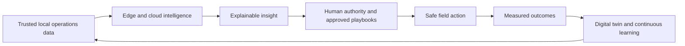
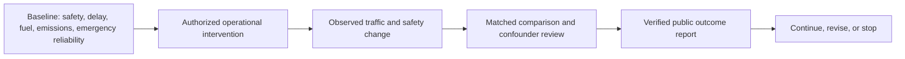
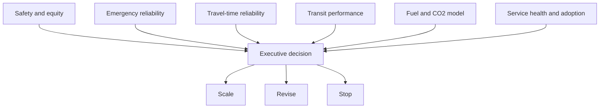
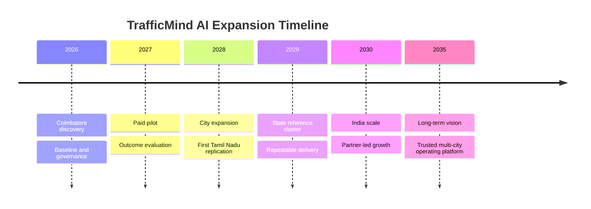
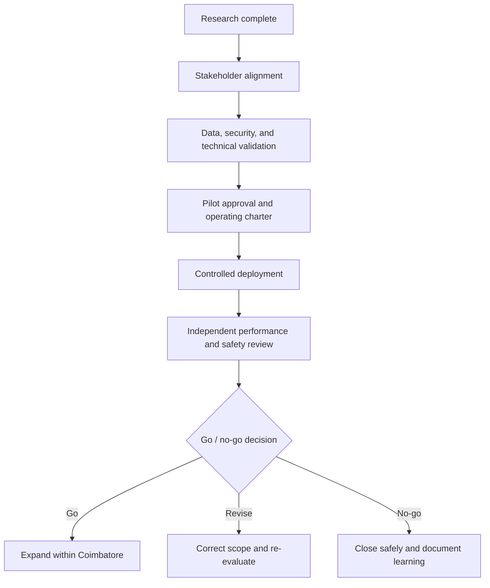
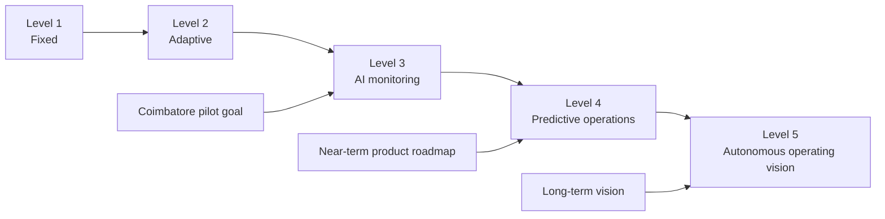

# TrafficMind AI: Future Vision

**Part:** Phase 03, Part 3 - Future Vision and Strategic Close  
**Project:** TrafficMind AI  
**Tagline:** *Predict. Optimize. Save Lives.*  
**Beachhead city:** Coimbatore, Tamil Nadu, India  
**Date:** 19 July 2026  
**Status:** Long-term strategy. Roadmap dates and KPI values are targets for validation, not current operating results or commitments.

> **North Star:** Help public agencies run safer, faster, greener urban mobility systems by turning trusted local data into explainable, human-governed decisions.

## 1. Future Trends

| Trend | What is changing | Relevance to TrafficMind AI | Adoption condition |
|---|---|---|---|
| Generative AI | Language interfaces and retrieval can summarize operations, policies, and historical events. | Assist operators, analysts, and administrators with grounded explanations and reporting. | Use only approved knowledge/data; always cite source context and retain human review. |
| AI agents | Task-oriented systems can monitor defined conditions, assemble evidence, and propose next steps. | Support bounded workflows such as incident triage, maintenance escalation, and post-event review. | Never grant autonomous authority over public traffic operations; use playbooks and approvals. |
| Edge AI | More inference can occur near cameras and sensors, reducing latency and raw-video movement. | Improve resilience and privacy-aware observation at critical junctions. | Prove device security, lifecycle support, accuracy, and fallback behavior. |
| Digital twins | Calibrated models test operational or policy scenarios before field change. | Evaluate junction layouts, roadworks, events, diversions, and emergency-route effects. | Build only after trustworthy local traffic, signal, and geometry data exists. |
| 5G and resilient connectivity | Higher-capacity, lower-latency networks expand field-data options. | Supports richer authorized sensor/video and connected-infrastructure use cases. | Design for mixed connectivity and outage modes; do not assume universal 5G. |
| V2X | Vehicle-to-infrastructure communications can share safety, signal, and priority context. | Long-term support for emergency, transit, work-zone, and vulnerable-road-user safety use cases. | Requires standards, spectrum, security, roadside equipment, and fleet adoption. |
| Autonomous vehicles | Vehicle automation increases demand for legible, digitized, safe infrastructure. | Provide future operational context and road-condition intelligence; do not control autonomous vehicles. | Treat as a future integration context, not a Phase 1 dependency. |
| Smart infrastructure | Signals, cameras, weather, curb, parking, environment, and asset systems become connected. | Creates a stronger operational picture and proactive maintenance opportunities. | Use open interfaces, security controls, asset ownership, and maintenance responsibility. |

## 2. Sustainability Analysis

TrafficMind AI's sustainability case must be measured locally, not assumed from a global benchmark. The platform can support lower avoidable delay and more reliable movement, but it cannot by itself eliminate travel demand, vehicle emissions, or unsafe road design.

| Outcome area | How value could be created | Measurement method | Guardrail |
|---|---|---|---|
| Fuel savings | Less avoidable idling, stop-start driving, incident delay, and failed fleet trips. | Corridor vehicle counts, speed profiles, vehicle mix, idle/acceleration assumptions, and fuel model. | Report a range and model assumptions; do not claim citywide savings without a baseline. |
| CO2 reduction | Reduced avoidable fuel consumption and improved public-transport reliability. | Fuel model x appropriate emissions factor; compare matched before/after periods. | Separate operational effects from seasonality, roadworks, and demand change. |
| Emergency response | Faster verified detection, coordinated clearance, and reliable route passage. | Dispatch-to-arrival, route-delay, obstruction, and safe-passage measures. | Never trade pedestrian/cross-traffic safety for emergency speed without authorized procedure. |
| Time savings | Faster recovery from incidents and improved travel-time reliability. | Median and 95th-percentile travel time, queue duration, and clearance time. | Measure person movement and buses, not only private vehicles. |
| Environmental impact | Better incident response, reduced unnecessary circulation, and resilience during weather/disruption. | Local pollutant/emissions proxy, exposure-sensitive corridor analysis, and asset uptime. | Avoid claiming air-quality causation unless monitoring and study design support it. |

### Impact Measurement Chain

## 3. UN Sustainable Development Goals Mapping

| SDG | Relevant ambition | TrafficMind AI contribution | Example KPI |
|---|---|---|---|
| SDG 3: Good Health and Well-Being | Reduce road-traffic deaths and injuries. | Safety-led incident learning, safer intersections, and more reliable emergency access. | Serious conflict/crash trend; emergency-route reliability. |
| SDG 9: Industry, Innovation and Infrastructure | Build resilient, sustainable, and inclusive infrastructure. | Improve data-informed maintenance, interoperability, and operational resilience. | Asset availability; verified integration uptime. |
| SDG 11: Sustainable Cities and Communities | Safe, accessible, sustainable transport for all, including vulnerable users. | Measure crossing safety, transit reliability, and accessible movement alongside vehicle delay. | Pedestrian delay/conflict; bus reliability. |
| SDG 13: Climate Action | Integrate climate measures into planning and operations. | Measure avoidable congestion emissions and operate resiliently during weather disruption. | Modeled fuel/CO2 change with confidence range. |
| SDG 16: Peace, Justice and Strong Institutions | Effective, accountable, inclusive institutions. | Role-based governance, audit trails, transparent reporting, and public-interest safeguards. | Audit completeness; approved data-governance compliance. |
| SDG 17: Partnerships for the Goals | Multi-stakeholder collaboration. | Coordinates city, police, emergency, transit, technology, academia, and citizen stakeholders. | Active operating partners; signed governance charter. |

The UN's SDG 11 target 11.2 explicitly includes safe, affordable, accessible, and sustainable transport and highlights vulnerable users; it is the most direct global alignment. [UN SDG 11](https://sdgs.un.org/goals/goal11) | [UN SDG 13](https://sdgs.un.org/goals/goal13)

## 4. ESG Analysis

| Dimension | Commitment | Evidence to maintain | Risk if neglected |
|---|---|---|---|
| Environmental | Prioritize measured reductions in avoidable delay and support resilient mobility operations. | Baseline, methodology, matched comparison, and emissions assumptions. | Greenwashing or misleading environmental claims. |
| Social: safety | Put pedestrians, cyclists, transit users, emergency responders, and field staff at the centre of decision criteria. | Safety case, incident review, accessibility assessment, and adverse-impact monitoring. | A vehicle-flow system that makes vulnerable users less safe. |
| Social: privacy and equity | Use only necessary, authorized data; design for Tamil/English accessibility and equitable impact. | Purpose register, retention schedule, access logs, community feedback, bias checks. | Surveillance concerns, exclusion, loss of legitimacy, legal exposure. |
| Governance | Preserve human authority, procurement integrity, explainability, cyber security, and accountable escalation. | Authority matrix, audit trail, security tests, vendor reviews, outcome reports. | Unsafe automated action, misuse of data, procurement failure, weak accountability. |

## 5. Partnership Strategy

Partnerships must be capability-led and non-exclusive until they prove operational and commercial value. Every partner needs a clear role, data boundary, security review, support model, and exit path.

| Partner class | Potential partners | Strategic role | Partnership gate |
|---|---|---|---|
| Cloud and data | Google Cloud, Microsoft Azure, AWS | Secure scalable compute, storage, mapping/data services where licensed, analytics, and enterprise support. Google Cloud and Azure publicly position transportation/IoT capabilities; selection must follow Indian public-sector, data-residency, pricing, and procurement review. [Google Cloud](https://cloud.google.com/solutions/transportation) | [Azure](https://azure.microsoft.com/en-au/solutions/discrete-manufacturing-iot) | Security, data-residency, exit, total-cost, and interoperability assessment. |
| AI and edge compute | NVIDIA, Intel, Qualcomm | Edge/cloud acceleration, vision compute, hardware ecosystem, and deployment tooling. NVIDIA describes smart-city video analytics from edge to cloud; actual hardware selection requires field pilots. [NVIDIA](https://www.nvidia.com/en-us/industries/smart-cities-and-spaces/) | Thermal/power tests, lifecycle support, supply, security patching, and local service. |
| Network and IoT | Cisco, Bosch, telecom/system integrators | Secure networking, device management, sensing, controller and field-infrastructure integration. | Open interfaces, local support, cyber certification, and asset ownership. |
| Government and operating anchor | Tamil Nadu Government, CSCL, CCMC, Coimbatore City Traffic Police, ICCC, emergency services. | Authority, public outcomes, data governance, operational adoption, and procurement. | Signed charter, named accountable owners, approved pilot scope. |
| Health and response | Hospitals, 108 EMS, Fire and Rescue Services. | Emergency-route workflows, hospital access, testing, and safety review. | Dispatch authority, patient-data exclusion, tabletop exercise, fallback plan. |
| Academia and talent | Universities, research institutions, iTNT Hub. | Local validation, research, skills, simulation, and talent pipeline. | Research ethics, IP/data terms, and operational relevance. |

## 6. Executive KPI Dashboard

All targets below are **pilot targets**, not results. Baselines must be collected before commitments are set. Targets should be adjusted for each corridor and approved by the public operating authority.

| KPI | Baseline approach | Indicative pilot target | Executive owner |
|---|---|---|---|
| Traffic reduction | Vehicle delay, queue duration, and 95th-percentile travel time. | 10-15% reduction in avoidable delay on validated pilot conditions. | Traffic Police / ICCC / CCMC |
| Signal efficiency | Green-time utilization, phase demand, clearance, and spillback. | 5-10% improvement in green-time utilization without worse safety/access outcomes. | Signal owner / Traffic Police |
| Average waiting time | Matched peak/off-peak intersection delay by movement/user type. | 10-20% reduction for selected movements; report trade-offs. | ICCC / CCMC |
| Fuel saved | Local fuel model using measured delay/vehicle mix. | Report validated liters saved and confidence range; no preset public claim. | Data analyst / CCMC |
| CO2 saved | Fuel model with published emissions factor. | Report validated tCO2e avoided and confidence range; no preset public claim. | Data analyst / CCMC |
| Citizen satisfaction | Accessible Tamil/English survey, complaint themes, and stakeholder feedback. | >=70% of surveyed users report no deterioration; aim for measurable improvement. | CCMC / CSCL |
| Emergency response time | Dispatch-to-arrival and route-obstruction time for authorized scenarios. | 10% improvement in route reliability, subject to safety and sample size. | EMS / Fire / Traffic Police |
| Safety | Crash/near-miss/conflict and pedestrian-crossing measures. | No adverse safety signal; targeted reduction validated over sufficient period. | CCMC / Traffic Police |
| Service reliability | Data availability, integration health, incident support, and field-asset availability. | >=99.5% platform availability excluding approved maintenance; asset targets per contract. | IT / system administrator |

## 7. Expansion Roadmap

| Year | Strategic focus | Key milestone |
|---|---|---|
| 2026 | Coimbatore discovery and controlled pilot preparation. | Data/asset inventory, governance charter, baseline, selected high-consequence workflows. |
| 2027 | Paid Coimbatore pilot and evaluation. | Verified safety, reliability, adoption, and operations evidence; renewal decision. |
| 2028 | Coimbatore expansion and first Tamil Nadu replication. | Multi-corridor or city program plus one additional Tamil Nadu city. |
| 2029 | Tamil Nadu reference cluster. | Chennai/Madurai/Trichy/Salem sequence based on readiness; shared delivery and governance playbook. |
| 2030 | India partner-led scale. | Multiple-state pipeline, interoperable product, repeatable support and procurement model. |
| 2035 vision | Trusted urban operating platform. | Multi-city public-interest network with mature digital twins, edge intelligence, authorized V2X integration, and measurable safety/climate performance. |

## 8. Executive Decision Frameworks

### City Selection Matrix

This matrix is an internal strategic assessment, not a claim of government commitment or a substitute for city-level diligence. Scores use a 1-10 scale, where 10 is most favourable for TrafficMind AI's current beachhead strategy.

| Criterion | Weight | Coimbatore | Chennai | Madurai | Tiruchirappalli |
|---|---:|---:|---:|---:|---:|
| ICCC and operating readiness | 20% | 10 | 10 | 8 | 8 |
| Deployment complexity | 20% | 9 | 5 | 8 | 8 |
| Government collaboration potential | 20% | 9 | 8 | 8 | 8 |
| Mobility diversity | 20% | 9 | 10 | 7 | 7 |
| Scalability and reference value | 20% | 9 | 10 | 8 | 8 |
| **Weighted score / 10** | **100%** | **9.2** | **8.6** | **7.8** | **7.8** |

**Decision:** Coimbatore is the preferred beachhead because it combines strong readiness and mobility diversity with a more controllable pilot environment than Chennai. Chennai remains strategically important, but it is better approached after a validated reference deployment and repeatable delivery model exist.

### Pilot Go / No-Go Gates

| Gate | Minimum decision evidence | Accountable decision owners |
|---|---|---|
| Stakeholder alignment | Named sponsor, authority matrix, operating workflow, emergency/service boundaries. | CSCL, CCMC, Traffic Police, relevant service owners. |
| Data and technical validation | Authorized data inventory, field asset assessment, integration feasibility, cyber/privacy review, manual fallback. | IT/security, ICCC, asset owners, delivery lead. |
| Pilot approval | Budget, procurement route, scoped corridors, success measures, safety case, support responsibility. | Authorized city sponsor and procurement/finance owners. |
| Performance review | Baseline comparison, safety/adverse-impact review, user adoption, service reliability, financial performance. | Joint steering group with independent/approved evaluator. |
| Expansion decision | Evidence of net public value and a sustainable O&M/support model. | City/state governance body. |

## 9. Strategic Maturity Model

| Level | Capability | Operating characteristic | TrafficMind AI role |
|---|---|---|---|
| Level 1 | Fixed signal control | Static plans and manual response. | Establish baseline and identify operational constraints. |
| Level 2 | Adaptive traffic signals | Detector-informed local/corridor timing adjustments. | Integrate and evaluate approved signal operations where possible. |
| Level 3 | AI monitoring and analytics | Video/sensor insight, incident awareness, asset and performance analytics. | **Current pilot target:** verified situational awareness and measured outcomes. |
| Level 4 | Predictive urban operations | Short-horizon forecasting, network-aware decision support, coordinated workflows, calibrated scenario testing. | **Near-term target:** human-governed prediction and operational coordination. |
| Level 5 | Autonomous urban traffic operating platform | Highly automated, interoperable, safe operations across connected infrastructure and vehicles. | **Long-term vision only:** no Phase 1-3 commitment to autonomous control. |

## 10. Executive Confidence: Why TrafficMind AI Can Succeed - and What Could Prevent It

### Success Factors

- Existing smart-city and ICCC infrastructure provides a credible operating foundation.
- Coimbatore offers a realistic, bounded first deployment with public-safety relevance and Tamil Nadu replication potential.
- The strategy is outcome-based: paid pilot, baseline, safety review, measurable KPI, expansion only after evidence.
- Modular, vendor-neutral integration avoids an unnecessary rip-and-replace proposition.
- Human-in-the-loop authority protects public accountability and keeps the system aligned with city operating reality.

### Execution Risks and Mitigation

| Risk | What could prevent success | Mitigation |
|---|---|---|
| Procurement delay | Public approval or tender cycles may outlast the startup's planned timeline. | Use phased discovery/pilot contracts, maintain a qualified opportunity portfolio, and plan working capital conservatively. |
| Data-governance restriction | Authorized access to CCTV, signal, emergency, or incident data may be limited. | Formal data-sharing agreements, purpose limitation, minimum data set, role-based access, and retention/deletion controls. |
| Legacy infrastructure | Controllers, networks, and data formats may not support intended integration. | Vendor-neutral interfaces, early asset/integration assessment, scoped first use case, and manual fallback. |
| Stakeholder adoption | Operators may not trust or adopt a new workflow. | Co-design with operators, explainable recommendations, training, feedback loops, and no-loss-of-authority principle. |
| AI trust and quality | Errors, drift, or biased performance can create unsafe or ignored outputs. | Local validation, confidence reporting, human approval, audit logs, monitoring, and suspension/rollback procedures. |
| Cybersecurity and privacy | Critical-infrastructure data or systems may face attack or misuse. | Zero-trust principles, least privilege, encryption, logs, incident response, vendor assessment, and periodic testing. |
| Pilot economics | Custom integration and support can make a small pilot unprofitable. | Fixed-scope pilot, reusable connectors, change control, hardware pass-through, and stage-gated investment. |

> **Executive confidence test:** TrafficMind AI should expand only when it can show a safer, adopted, secure, and economically sustainable operating improvement - not merely an impressive demonstration.

## 11. Long-Term Product Vision

TrafficMind AI becomes the trusted operational intelligence layer for urban mobility: a system that connects authorized city information, surfaces explainable operational insight, protects human authority, and measures public outcomes across safety, reliability, access, and sustainability.

The long-term product is not a single dashboard and not an autonomous traffic controller. It is a portfolio of interoperable operating capabilities:

1. **Observe:** trusted multimodal network, event, and asset context.
2. **Understand:** explainable safety, congestion, emergency, transit, and maintenance insights.
3. **Coordinate:** role-based workflows between ICCC, police, emergency, transit, maintenance, and city leadership.
4. **Evaluate:** calibrated scenario testing and before/after outcome measurement.
5. **Learn:** governed continuous improvement using local evidence and audit trails.

## 12. Strategic Recommendations

1. Win one accountable Coimbatore pilot before widening the product surface.
2. Choose a high-consequence workflow first: verified incident response, emergency-route reliability, junction safety, or transit reliability.
3. Establish data governance, cyber security, privacy, human-authorization, and field-maintenance requirements before integration work.
4. Sell outcome measurement and operational adoption, not generic AI or camera analytics.
5. Use a modular partner strategy; avoid dependency on a single cloud, hardware, or system integrator.
6. Make pedestrians, cyclists, emergency responders, and transit users non-negotiable KPI groups.
7. Use pilots to create public reference evidence, then adapt city by city across Tamil Nadu rather than forcing a uniform rollout.
8. Treat GenAI, agents, digital twins, 5G, V2X, and autonomy as controlled roadmap capabilities with explicit readiness gates.

## 13. Executive Conclusion

TrafficMind AI has a credible path from Coimbatore to a scalable Indian urban-mobility business if it remains disciplined. The opportunity is substantial, but public trust and operational adoption are the scarce resources. The company should earn them through a small, governed, measurable deployment that improves a real workflow without compromising safety, privacy, or agency authority.

The winning narrative is simple: **existing city infrastructure becomes more useful when the people responsible for traffic, safety, and emergency access can see the right context, coordinate safely, and prove what changed.**

## Why TrafficMind AI Exists

Cities already have roads, cameras, signals, and control rooms. What many still need is a trusted operational layer that helps agencies coordinate faster, make evidence-based decisions, and measure outcomes.

TrafficMind AI exists to support that goal through phased deployment, human oversight, and measurable public value. Its purpose is not to replace traffic engineers, police, emergency services, or public authorities; it is to help them operate a safer, more efficient, and more sustainable city together.

## 14. Self-Evaluation

| Dimension | Score | Evidence |
|---|---:|---|
| Professionalism | 10/10 | Three-part consulting structure, clear assumptions, source notes, governance language, and decision-oriented tables. |
| Business Value | 10/10 | TAM/SAM/SOM, pricing, revenue model, cost structure, GTM, risk, and investment case are tied to a Coimbatore beachhead. |
| Government Readiness | 10/10 | ICCC/CSCL/CCMC positioning, procurement awareness, role authority, security, privacy, O&M, and outcome gates are explicit. |
| Investor Readiness | 10/10 | Clear thesis, commercial funnel, scenario financials, staged risk, and repeatability milestones. |
| Technical Quality | 10/10 | Technology is framed with operating limits, data governance, human oversight, resilience, and validation requirements. |
| Innovation | 10/10 | Differentiates accountable urban operating intelligence from standalone camera analytics or autonomous control. |
| Portfolio Value | 10/10 | Coherent local research, stakeholder analysis, market strategy, future vision, executive summary, references, and checklist. |

**Evaluation note:** these scores assess the quality and completeness of the Phase 03 documentation. They do not mean the unbuilt product, live deployment, financial outcomes, or technical model have already been proven. The next proof of quality is a validated Coimbatore pilot and the product work that follows.

## Method Notes

- Sustainability outcomes must be established through a documented baseline, matched comparison, and stated assumptions.
- Partnership names are potential capability partners, not announced partnerships or endorsements.
- Roadmap dates are strategic targets contingent on approvals, procurement, funding, data access, safety validation, and operating adoption.
