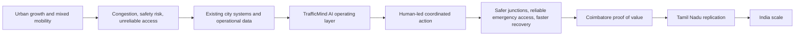
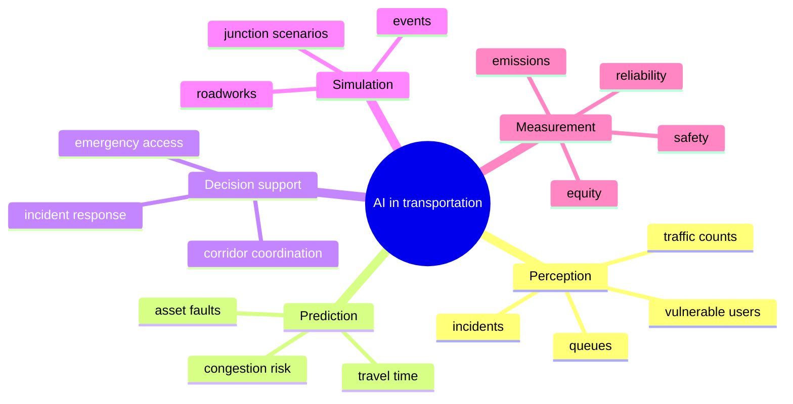
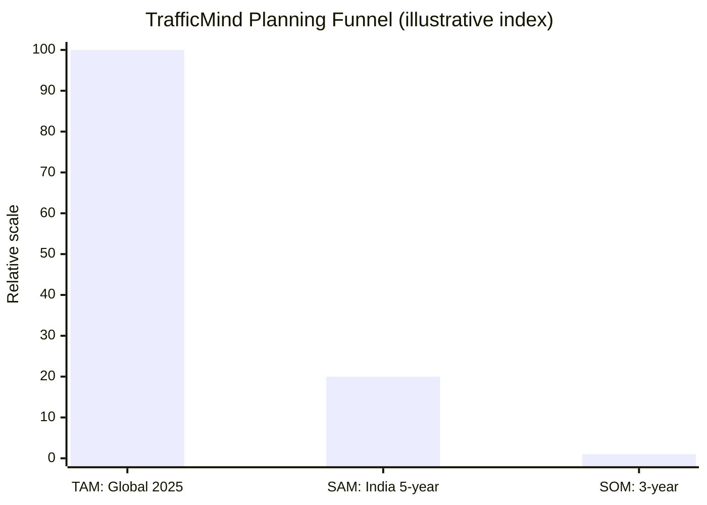
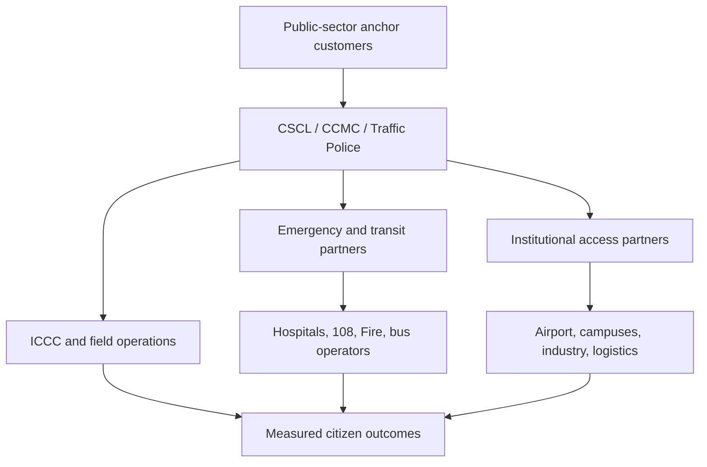

# TrafficMind AI: Market Research

**Part:** Phase 03, Part 1 - Market Analysis  
**Project:** TrafficMind AI  
**Tagline:** *Predict. Optimize. Save Lives.*  
**Mission:** Build India's most intelligent AI-powered Urban Traffic Operating Platform.  
**Beachhead city:** Coimbatore, Tamil Nadu, India  
**Expansion path:** Tamil Nadu -> India -> Global  
**Date:** 19 July 2026  
**Status:** Strategy and market-discovery report. Market forecasts are third-party estimates; local demand and pricing require validation through procurement discovery.

> **Executive takeaway:** TrafficMind AI should not enter the market as a generic camera-analytics product. Its opportunity is a governed operating layer that helps city agencies turn existing ICCC, traffic, incident, emergency, transit, and field-asset information into safer, accountable decisions. Coimbatore is a credible beachhead because it combines a live ICCC, active junction-safety work, a dense industrial and education economy, major transport gateways, and a state ecosystem that can support replication.

## 1. Executive Summary

Urban mobility is becoming an operations problem as much as an infrastructure problem. Cities face recurring congestion, unpredictable incidents, competing road users, pressure on emergency access, and increasingly visible safety and air-quality expectations. Existing traffic-control and command-centre investments generate data, but fragmented operational workflows limit their ability to convert data into timely, coordinated action.

The addressable global smart-traffic category is material: Juniper Research forecasts smart traffic management revenue at **US$20 billion by 2027**, from nearly **US$15 billion in 2025**. This figure is a commercial market-research estimate, not an audited public statistic. Adjacent sectors also show momentum: one commercial estimate values automotive and transport digital twins at **US$8.0 billion in 2025**, while AI-in-transportation estimates vary widely because firms define the category differently. [Juniper Research](https://www.juniperresearch.com/research/sustainability-smart-cities/smart-cities/smart-traffic-management-research-report/) | [Grand View Research digital-twin estimate](https://www.grandviewresearch.com/horizon/statistics/digital-twin-market/end-use/automotive-transport/global)

India is a compelling market because the enabling public infrastructure already exists. The Smart Cities Mission selected 100 cities, with over 8,000 multi-sectoral projects; government reporting states that all 100 had operational ICCCs by late 2024. The mission's central allocation was Rs 48,000 crore, but it is now a legacy-and-operations market rather than a reason to assume new grant funding. [MoHUA/PIB Smart Cities update](https://static.pib.gov.in/WriteReadData/specificdocs/documents/2024/dec/doc20241210468201.pdf)

For TrafficMind AI, the immediate commercial proposition is not citywide signal replacement. It is a phased, outcome-based capability for incident response, junction safety, emergency-route reliability, transit reliability, and operational measurement. The commercial entry point is a controlled Coimbatore pilot with CSCL, CCMC, Coimbatore City Traffic Police, and authorized emergency and ICCC partners.

## 2. Industry Overview

| Industry | Market need | Relevance to TrafficMind AI | Caution |
|---|---|---|---|
| Smart cities | Coordinate services, assets, and public outcomes using digital infrastructure. | ICCCs provide an institutional and data-integration anchor. | Do not duplicate existing command centres or assume integration rights. |
| Intelligent Transportation Systems (ITS) | Improve traffic operations, traveler information, transit, safety, tolling, and incident response. | TrafficMind fits the urban traffic-management and decision-support layer. | ITS is a broad category; procurement may be hardware-led and legacy constrained. |
| AI in transportation | Detect, forecast, classify, optimize, and support decisions across mobility systems. | Enables early warning, network awareness, and measurement. | AI must remain explainable, monitored, and human-governed. |
| Computer vision | Extract counts, queues, turning movements, incidents, and vulnerable-road-user presence from video. | Useful where camera coverage is authorized and field conditions are validated. | Occlusion, weather, privacy, bias, and poor maintenance can degrade results. |
| Digital twins | Test corridor/junction scenarios against a calibrated representation of the network. | Supports policy and operations evaluation before live changes. | Requires local calibration; a visual map alone is not a trustworthy twin. |
| IoT | Connect signals, sensors, environment data, field devices, and assets. | Provides real-time operational evidence and health monitoring. | Device lifecycle, security, power, and data quality are core costs. |
| Edge AI | Process eligible data near the source to reduce latency and unnecessary raw-data transfer. | May support privacy-aware, resilient field operations. | Still requires governance, monitoring, and fallback procedures. |
| Future urban mobility | Prioritizes safety, public transport, accessibility, electrification, freight/curb management, and climate resilience. | Broadens measurement from vehicle delay to people, safety, and reliable access. | Technology cannot replace land-use, street design, enforcement, or transit investment. |

## 3. Global Market Overview

The global market is shaped by five converging forces: rapid urbanization, pressure to use existing road assets more effectively, road-safety targets, digitized city operations, and lower-cost sensing/compute. The buyer, however, is rarely a single entity. Traffic, police, emergency services, public works, transit, IT, procurement, and elected/city leadership all influence adoption.

| Global demand driver | Why it matters | Product implication |
|---|---|---|
| Urbanization and population concentration | More trips compete for limited intersection, curb, and road capacity. | Focus on network reliability and person movement, not only lane throughput. |
| Vehicle growth and mixed mobility | Cars, two-wheelers, buses, freight, pedestrians, and cyclists have conflicting needs. | Measure vulnerable-road-user safety and transit impact explicitly. |
| Congestion and fuel loss | Stop-start operations create time, fuel, business, and public-service costs. | Use local baselines; do not extrapolate global savings claims. |
| Pollution and climate pressure | Transport affects local air quality and greenhouse-gas emissions. | Measure avoided delay/emissions locally and avoid unsupported carbon claims. |
| Road safety | Crashes create human harm first and congestion second. | Put safety controls and crash/conflict outcomes ahead of speed alone. |
| Emergency delays | Access reliability matters more than average travel time during emergencies. | Treat emergency coordination as an authorized, safety-first workflow. |

## 4. Global Smart Traffic Industry

Smart traffic management spans physical infrastructure, software, operations, and services. It includes adaptive signals, traffic management centres, CCTV and incident detection, variable-message signs, traveler information, ramp/parking/curb management, public-transport priority, connected-vehicle services, and performance analytics.

### Market Signals

| Published estimate | What it indicates | Limitation |
|---|---|---|
| Nearly US$15B in 2025, reaching US$20B by 2027 for smart traffic management (Juniper). | A large, growing smart-traffic category supported by urbanisation and sustainability needs. | Commercial estimate; category boundaries and methodology are proprietary. |
| US$8.0B automotive and transport digital-twin market in 2025 (Grand View Research). | Strong adjacent spending on simulation, connected assets, and data platforms. | Wider than traffic operations and not directly comparable to smart-traffic revenue. |
| US$4.4B AI-in-transportation in 2025, reaching US$11.7B by 2032 (Market Glass). | Strong demand for AI capabilities in transportation. | Other firms publish materially different figures; no single number should drive the plan. |

**Industry conclusion:** the market is real, but the winning offer is not a commodity dashboard. City buyers need interoperability, lawful data use, operational adoption, maintenance, cyber resilience, and evidence of safer outcomes.

## 5. AI Transportation Industry

AI in transportation is an enabling capability across five value pools:

For TrafficMind AI, the relevant opportunity is **operational decision support**, not autonomous driving. Public agencies will expect clear confidence, policy constraints, human approval, audit trails, privacy controls, and measured before/after impact. IndiaAI's approved Rs 10,371.92 crore mission over five years reinforces national interest in compute, datasets, application development, startup financing, and safe/trusted AI, but it does not substitute for a city procurement or deployment partner. [IndiaAI Mission, PIB](https://www.pib.gov.in/Pressreleaseshare.aspx?PRID=2012357&lang=2&reg=48)

## 6. Market Opportunity

### Why Now

| Opportunity factor | Market consequence | TrafficMind response |
|---|---|---|
| Urbanization and population growth | Dense trip peaks strain finite public road space. | Corridor and junction operating insight. |
| Vehicle and two-wheeler growth | More conflict, queueing, and demand variability. | Multimodal performance and safety measurement. |
| Congestion | Lost time, unreliable business operations, and public frustration. | Faster verified incident response and network-aware recovery. |
| Fuel loss | Idling and stop-start driving impose costs on households and fleets. | Target avoidable disruption; quantify with local fleet/traffic data. |
| Pollution | Congested corridors increase exposure and emissions. | Support smoother operations, transit reliability, and local measurement. |
| Road safety | Serious crashes affect victims, emergency response, and city confidence. | Prioritize conflict, crossing, and incident outcomes. |
| Emergency delays | Every blocked approach adds uncertainty to time-critical care and response. | Support authorized route visibility and safety-first green-corridor coordination. |

> **Value thesis:** TrafficMind AI has the strongest initial product-market fit where a city already has cameras, control rooms, traffic police, and safety mandates, but lacks a shared operating workflow and outcome measurement. Coimbatore meets this profile more clearly than a greenfield city without institutional readiness.

## 7. Market Size: TAM, SAM, and SOM

### Definitions

| Measure | Definition for this report | Value |
|---|---|---|
| TAM | Global annual smart-traffic-management revenue benchmark. | Nearly **US$15B** in 2025; third-party estimate. |
| SAM | Indian city market TrafficMind could serve with a software, integration, operations, and analytics layer - excluding wholesale road construction and citywide hardware replacement. | **Rs 1,200-3,000 crore** five-year contract value; planning range. |
| SOM | Realistic three-year capture from a Coimbatore proof point plus a small Tamil Nadu expansion set. | **Rs 15-30 crore** three-year contract value; planning target. |

### Bottom-Up Assumptions

| Layer | Assumption | Calculation | Result |
|---|---|---|---|
| TAM | Use Juniper's global 2025 smart-traffic benchmark. | Published category estimate. | Nearly US$15B annual revenue. |
| SAM | 150 addressable Indian urban agencies over time: 100 Smart Cities/ICCC ecosystems plus 50 additional high-readiness municipal, airport, industrial, or campus deployments. | 150 x Rs 8-20 crore average five-year platform/integration/service contract. | Rs 1,200-3,000 crore cumulative five-year opportunity. |
| SOM | 5 city contracts in three years after Coimbatore, with a Rs 3-6 crore average three-year contract. | 5 x Rs 3-6 crore. | Rs 15-30 crore cumulative three-year opportunity. |

**Interpretation:** the chart is a normalized illustration of the commercial funnel; it is not a currency comparison. The table is the authoritative representation. SAM and SOM are internal planning models, not published market facts. They should be replaced with bid-level pricing after discovery of corridor count, hardware reuse, integration scope, support hours, security needs, and procurement terms.

## 8. India Market

| Driver | Market relevance |
|---|---|
| Smart Cities Mission | Created city SPVs, ICCCs, procurement experience, and a large installed base. As of late 2024, 100 cities had more than 8,000 projects and operational ICCCs, though the mission's completion period was extended to March 2025. The opportunity now is integration, outcome improvement, and operations support. [PIB](https://www.pib.gov.in/PressReleasePage.aspx?PRID=2030491&lang=2&reg=48) |
| Digital India | Establishes the policy direction for digital public service, digital infrastructure, and data-enabled government. It supports relevance, not automatic procurement eligibility. [MeitY](https://www.meity.gov.in/sites/upload_files/dit/files/Digital%20India.pdf) |
| National ITS and MoRTH direction | Supports ITS-compatible vehicle and public-transport practices, road safety, and intelligent operations. AIS-140 is relevant to public-transport vehicle operations where an authorized feed exists; it is not a universal integration right. |
| IndiaAI Mission | Rs 10,371.92 crore national mission supports AI compute, datasets, applications, skills, startup financing, and safe/trusted AI. Useful ecosystem tailwind, not direct city revenue. [PIB](https://www.pib.gov.in/Pressreleaseshare.aspx?PRID=2012357&lang=2&reg=48) |
| Government funding | Smart Cities funds have created assets; new budgets require city/state approval, O&M planning, and procurement compliance. Do not assume central funding is available for a new pilot. |
| Startup India | DPIIT recognition can provide tax, IP, procurement, mentorship, and funding-enablement benefits. Startup India explicitly notes easier public-procurement norms for eligible recognized startups. [Startup India](https://www.startupindia.gov.in/) |

## 9. Tamil Nadu Opportunity

Tamil Nadu is an attractive first-state market because it combines large cities with distinct operating environments, a history of Smart Cities/ICCC deployment, industrial and education clusters, and a deep technology ecosystem. iTNT Hub has a regional presence in Coimbatore, Madurai, and Trichy, which can support industry-academia engagement and innovation partnerships. [iTNT Hub](https://itnthub.tn.gov.in/About_Us.html)

| City | Market rationale | Entry implication |
|---|---|---|
| Chennai | Large, complex metropolitan mobility, multimodal networks, and high institutional capacity. | Strategic enterprise market; longer cycles and heavier integration complexity. |
| Coimbatore | ICCC base, active junction-safety programme, airport/rail/bus gateways, industrial and educational economy. | Best controlled beachhead for a credible outcome pilot. |
| Madurai | Major regional city with heritage, health, education, and visitor mobility demand. | Strong second-wave adaptation opportunity after Coimbatore playbook validation. |
| Salem | Industrial/commercial city and Smart City context with corridor and safety needs. | Suitable replication market for municipal/traffic operational model. |
| Tiruchirappalli (Trichy) | Education, industry, rail/airport access, and regional administrative importance. | Good replication market with a different urban network pattern. |

### Why Tamil Nadu Is the Ideal First Market

1. Geographic concentration enables shared delivery, support, and partnership capability after the Coimbatore pilot.
2. The five-city sequence offers a practical test of repeatability from tier-2 city to metro scale.
3. State innovation capacity is tangible: iTNT has regional hubs in Coimbatore, Madurai, and Trichy.
4. Industrial, education, airport, health, and public-transport demand create multiple buyer-adjacent use cases without requiring a consumer-only business model.
5. The state-level rollout remains contingent on each city's governance, data authority, and local safety priorities.

## 10. Coimbatore Market Analysis

### Market Context

Coimbatore is a credible first city because its needs are operationally diverse but still pilotable. CCMC's 2011 census reference lists the old municipal area population as **1,050,721** across **105.6 sq. km**; this is an official historical baseline, not a current population estimate. The municipal area and city-region boundaries have changed, so current market sizing should use a commissioned local demographic and mobility baseline. [CCMC environmental assessment](https://ccmc.gov.in/img/upload/10_Appendix%20FINAL%20IEE%20Coimbatore%20Sewerage.pdf)

| Local factor | Why it creates market need | Validation required |
|---|---|---|
| Traffic hotspots | Gandhipuram, Ukkadam, Avinashi Road, Lakshmi Mills, Hope College, Peelamedu, Singanallur, R.S. Puram, railway-station/GH bus-stand access, and airport corridors are candidate study areas. | Rank corridors using authorized counts, crash data, field audits, bus performance, and emergency-route reviews. |
| Airport | The airport corridor concentrates time-sensitive passenger, employee, freight, and emergency movement. | Validate road-agency/airport jurisdiction, terminal access, peak traffic, and curb constraints. |
| Railway station | Coimbatore Junction is a major public-access node; Southern Railway documentation treats it among stations with average footfall above 25,000 per day for an escalator provision programme. | Map station access, pedestrian crossings, bus/auto/parking interactions, and incident response. [Southern Railway](https://sr.indianrailways.gov.in/cris/uploads/files/1686897884748-law2324%20vol1_Annexure-A.pdf) |
| Bus stands | Gandhipuram and other bus/interchange areas create public-transport and pedestrian movement concentrations. | Collect route, dwell, turning, curb, passenger-flow, and crossing data. |
| Industrial zones | Coimbatore's textile, engineering, and MSME base creates shift-change, freight, and employer-access demand. | Map industrial estate/gate traffic, shift windows, freight movements, and safety concerns. [Coimbatore decarbonisation plan](https://www.tngcc.tn.gov.in/wp-content/uploads/2025/11/Coimbatore-District-Decarbonisation-Action-Plan.pdf) |
| Educational institutions | Official district planning material describes a large education cluster, including universities, engineering colleges, medical colleges, and schools. | Study academic-calendar peaks, school-zone safety, bus/van operations, and pedestrian movements. [Tamil Nadu DEAP](https://msmeonline.tn.gov.in/deap/pdf/012.pdf) |
| Hospitals | Coimbatore Medical College Hospital and other health facilities create life-critical access needs. | Map ambulance routes, gate capacity, emergency arrivals, and incident/green-corridor procedure. |
| Peak periods | Likely weekday hypotheses are approximately 08:00-10:00 and 17:00-20:00, with localized school/industrial shifts and weekend/holiday variation. | Treat as a research hypothesis, not an established fact; validate with timestamped corridor data. |

**Coimbatore market proposition:** begin with selected, high-consequence junction/corridor clusters and emergency approaches. Measure safety, emergency-route reliability, public-transport performance, incident clearance, and maintenance responsiveness before expanding coverage.

## 11. Customer Segmentation

| Segment | Organizations | Primary buying need | Typical role |
|---|---|---|---|
| Primary customers | CCMC, CSCL/ICCC, Coimbatore City Traffic Police, Tamil Nadu urban/road-safety agencies. | City operations, road safety, incident response, integrated governance. | Sponsor, buyer, operating authority. |
| Secondary customers | Public transport authorities/operators, hospitals, airports, industrial estates, universities, large smart campuses. | Reliability, critical access, campus/gate operations, safety. | Partner, co-funder, domain operator. |
| Decision makers | Municipal commissioner/authorized leadership, CSCL leadership, police leadership, city/department administrators, procurement/finance, IT/security heads. | Public value, legal authority, lifecycle cost, security, maintainability. | Approve, govern, procure. |
| End users | ICCC operators, Traffic Police, dispatchers, maintenance engineers, analysts, transit control teams. | Trusted operational context and safe, efficient workflows. | Use, verify, act, maintain. |
| Government agencies | CCMC, CSCL, Traffic Police, Tamil Nadu departments, transport/road authorities, health/emergency services. | Coordinated public service and accountable outcomes. | Regulate, authorize, operate. |
| Private organizations | Logistics firms, industrial campuses, educational institutions, hospitals, airports, technology/service partners. | Access reliability, safety, cost control, and lawful coordination. | Partner or targeted buyer. |

## 12. Stakeholder Value Proposition

| Stakeholder | Value proposition | Proof metric |
|---|---|---|
| Traffic Police | Faster verified awareness, safer field coordination, and clearer incident recovery without losing operational authority. | Detection-to-verification and clearance time; secondary-incident/conflict indicators. |
| Citizens | Safer crossings and more predictable journeys, with public information that reflects verified conditions. | Travel-time reliability, crossing safety, complaint themes, access outcomes. |
| Hospitals | More reliable ambulance approach/egress and visibility of access constraints. | Emergency-route reliability and hospital-approach obstruction events. |
| Fire Department | Earlier awareness of blocked approaches and coordinated, safe movement for fire appliances. | Arrival-route reliability and obstruction resolution time. |
| Government | Evidence-led spending, policy accountability, public safety, and scalable operating governance. | Agreed KPI improvement, audit completeness, cost-to-serve. |
| Smart City Control Room | A role-appropriate common operational picture and accountable cross-agency handoffs. | Verified event response time, operator adoption, service availability. |
| Public Transport | Better disruption awareness and evidence for safer, more reliable bus movement. | Bus travel-time variability, headway regularity, disruption recovery. |

## 13. Summary

TrafficMind AI enters an attractive but demanding market. The global category is growing, India's Smart Cities and IndiaAI programs establish strong ecosystem tailwinds, and Tamil Nadu offers a credible replication path. The opportunity is nonetheless governed by procurement cycles, existing systems, city data rights, public safety, cyber security, maintenance, and agency adoption.

Coimbatore is the right beachhead when approached as an **outcome pilot**, not a citywide technology claim. The recommended sequence is to validate one or two corridor/junction clusters with CSCL, CCMC, Traffic Police, ICCC, emergency, transit, and maintenance partners; prove measurable safety and reliability improvements; then adapt the operating model city by city across Tamil Nadu.

### Part 1 Recommendations

1. Build the commercial offer around controlled pilots, measurable outcomes, and lifecycle operations rather than generic AI licensing.
2. Treat the SAM/SOM figures as planning ranges and replace them with local bid economics after discovery.
3. Prioritize Coimbatore's ICCC, junction-transformation programme, emergency/hospital approaches, and high-consequence interchange corridors.
4. Develop an India/Tamil Nadu procurement, data-governance, cybersecurity, and support playbook before expansion.
5. Proceed next to competitor mapping, procurement pathways, buyer economics, and market-entry strategy in Market Analysis Part 2.

## Source and Method Notes

- Global market figures are commercial estimates with differing definitions. They establish directional context only and are not added together or treated as audited forecasts.
- City hotspot and peak-hour references are pilot-selection hypotheses unless directly supported by authorized field data. This report avoids presenting place names as proven congestion rankings.
- TAM uses Juniper's published global category benchmark. SAM and SOM are transparent internal planning models, deliberately restricted to the software/integration/operations layer and excluding broad civil works or total ITS hardware spend.
- Monetary units are presented in the source currency to avoid false precision from exchange-rate conversion.
