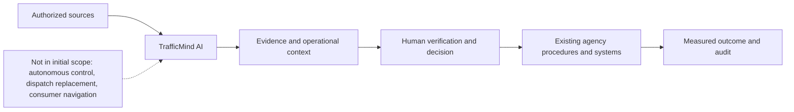
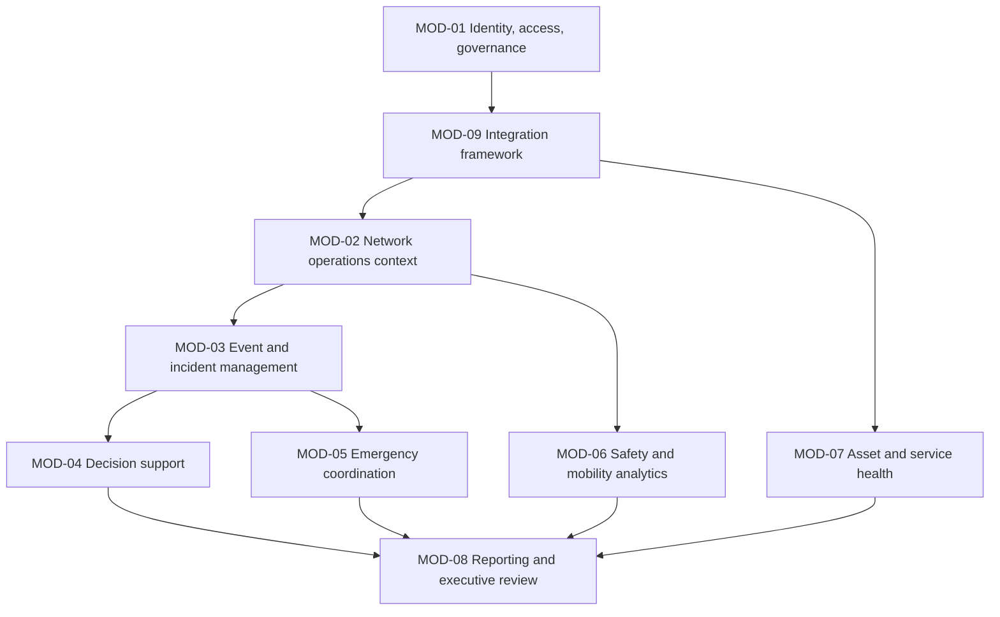
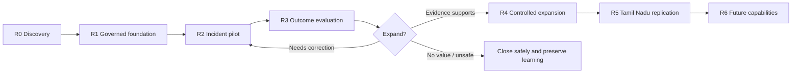
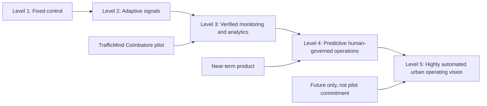

# TrafficMind AI: Master Product Requirements Document

**Tagline:** *Predict. Optimize. Save Lives.*  
**Mission:** Build India's most intelligent AI-powered Urban Traffic Operating Platform.  
**Beachhead:** Coimbatore, Tamil Nadu, India  
**Document ID:** TMA-PRD-001  
**Version:** 0.1 - Product Definition Draft  
**Date:** 19 July 2026  
**Owner:** Loopframe Labs / TrafficMind AI Product Team  
**Classification:** Internal - Product and Delivery Planning  
**Status:** Draft for stakeholder validation

## Document Information

| Field | Value |
|---|---|
| Product | TrafficMind AI |
| Product category | Human-governed Intelligent Urban Traffic Operating Platform |
| Intended customers | CSCL, CCMC, Coimbatore City Traffic Police, authorized ICCC/emergency/transit partners, and later Tamil Nadu agencies |
| Primary operating context | Coimbatore city traffic and safety operations |
| Source context | Phase 01 research/localization, Phase 02 user research, Phase 03 market and strategy artifacts |
| Decision status | Requirements define product intent. They do not authorize a deployment, integration, or traffic-control action. |
| Review cadence | At pilot charter approval, before each delivery release, and after formal pilot evaluation |

### Reading Guide

This document uses four labels deliberately:

| Label | Meaning |
|---|---|
| **Fact** | A statement previously documented from a source or a confirmed stakeholder record. It must retain provenance. |
| **Assumption** | A planning premise that must be validated before a relevant commitment or release. |
| **Requirement** | A product behavior, quality, or control needed to meet a defined user/business outcome. Requirements use identifiers for traceability. |
| **Future roadmap** | A desired later capability. It is not part of the initial pilot commitment unless separately approved. |

## 1. Executive Summary

TrafficMind AI is a government-ready decision-support platform for urban traffic operations. It helps authorized city teams understand changing road conditions, verify incidents, coordinate a safer response, protect critical access, and measure outcomes. It is designed for the operating reality of Coimbatore: mixed road users, finite junction capacity, public safety responsibilities, legacy infrastructure, and multiple agencies with distinct authority.

The initial product must be deliberately narrow. It will not autonomously control signals, replace Traffic Police or emergency dispatch, act as a navigation application, or merely display camera analytics. Its first purpose is to support a limited number of high-consequence workflows in a controlled Coimbatore pilot:

1. Verified traffic-disruption and incident awareness.
2. Human-led multi-agency incident coordination.
3. Safety and network-impact context for selected junction/corridor decisions.
4. Authorized emergency-route coordination support, only after procedure approval.
5. Outcome measurement, auditability, and operational learning.

The product must be modular, secure, explainable, accessible, and maintainable. Any recommendation is advisory unless an authorized human explicitly takes action through an approved external operating process. The platform must make uncertainty visible and support a safe fallback to existing tools and procedures.

> **Product decision:** TrafficMind AI will earn expansion through verified local outcomes, operator adoption, governance acceptance, and sustainable support. A technically impressive demonstration without these conditions is not product success.

## 2. Vision

Create the trusted urban operating intelligence layer that helps public agencies move people and emergency services more safely, reliably, and sustainably.

### Vision Principles

- **Human authority first:** the platform informs and records decisions; statutory agencies retain authority.
- **Safety before speed:** vehicle delay cannot be optimized at the expense of pedestrians, cyclists, transit users, field staff, or emergency-response safety.
- **Explainability by default:** users must understand the evidence, confidence, limitations, and expected impact behind a recommendation.
- **Local operating fit:** each city controls its policies, workflows, data agreements, and deployment scope.
- **Measured public value:** recommendations are judged by safety, reliability, equity, resilience, and operational adoption, not dashboard activity.

## 3. Mission

Build India's most intelligent AI-powered Urban Traffic Operating Platform by combining trusted local data, explainable decision support, human-governed workflows, and measurable public outcomes.

## 4. Problem Statement

Coimbatore's traffic, safety, emergency, transit, maintenance, and municipal teams must manage mixed road users and rapidly changing conditions using information and workflows that can be fragmented across agencies and systems. When an incident, obstruction, unsafe junction condition, or time-critical emergency movement occurs, teams need timely verified context, clearly defined authority, coordinated action, and a way to learn whether the response improved outcomes.

Existing signals, cameras, command centres, dispatch systems, and field teams are necessary but do not automatically create a shared operating picture or an accountable decision process. TrafficMind AI addresses this gap by organizing authorized information into explainable, role-appropriate operational insight and human-led workflows.

## 5. Product Goals

| ID | Goal | Success intent |
|---|---|---|
| PG-01 | Improve verified situational awareness. | Authorized operators can identify, assess, and hand off relevant disruptions faster with evidence and confidence. |
| PG-02 | Improve safe coordination. | Traffic, police, emergency, transit, and maintenance teams can follow clear, accountable operating workflows. |
| PG-03 | Protect vulnerable road users and emergency access. | Safety, accessibility, and emergency-route constraints are visible in operational decisions. |
| PG-04 | Make outcomes measurable. | City teams can establish baselines and review operational impact without false precision. |
| PG-05 | Fit government operations. | The platform supports role-based authority, auditability, security, procurement realities, and lifecycle maintenance. |
| PG-06 | Prove a replicable model. | A Coimbatore pilot produces an adaptable operating and product model for Tamil Nadu expansion. |

## 6. Business Objectives

| ID | Objective | Indicator | Time horizon |
|---|---|---|---|
| BO-01 | Secure a paid, governed Coimbatore pilot. | Signed pilot scope, accountable sponsor, approved budget/procurement path. | Before first production-like deployment. |
| BO-02 | Convert pilot evidence into a multi-year city programme. | Renewal, expansion, or new scoped city contract. | Post-evaluation. |
| BO-03 | Build recurring revenue. | Subscription, support, analytics, and approved premium-module revenue. | Years 2-5. |
| BO-04 | Establish a reference operating model. | Documented governance, data, support, and outcome playbook reusable across cities. | By first pilot completion. |
| BO-05 | Maintain public trust. | No unresolved critical security/privacy/safety incident; documented response process. | Continuous. |
| BO-06 | Maintain delivery discipline. | Pilot remains within approved scope, cost, and safety guardrails. | Every release. |

## 7. Success Metrics

Metrics are divided into product, operational, public-outcome, and business measures. Baselines, target values, statistical method, owner, and data quality must be agreed in a pilot measurement plan before targets are used for performance claims.

| Metric category | Measure | Pilot measurement approach | Initial target posture |
|---|---|---|---|
| Product usability | Operator task completion and perceived usefulness. | Observed scenario testing, usability sessions, and post-shift feedback. | No critical usability blocker; improve after each release. |
| Product reliability | Platform availability, integration health, event-processing latency. | Monitored service metrics and incident logs. | Contract-specific; preliminary target >=99.5% service availability excluding approved maintenance. |
| Incident workflow | Detection-to-verification, verification-to-handoff, and closure completeness. | Timestamped approved event records. | Improvement vs. baseline in selected use case; no unverified automated action. |
| Safety | Pedestrian/cyclist conflicts, unsafe crossing/blocked-box events, incident trend. | Defined local data sources and safety review. | No adverse safety signal; claims require adequate observation period. |
| Emergency reliability | Authorized emergency-route obstruction and route-delay measure. | Dispatch/operational data under approved access agreement. | Improvement target only after service owners validate methodology. |
| Mobility | Median and 95th-percentile travel time, queue duration, transit reliability. | Matched corridor/time comparison and confounder review. | Pilot-specific; report trade-offs by user group. |
| Sustainability | Modeled fuel and CO2 from measured traffic changes. | Published factor/model plus local vehicle mix and uncertainty range. | No preset savings claim. |
| Governance | Audit completeness, access-review completion, security/privacy exceptions. | Audit records and review logs. | 100% for high-risk actions and periodic access certification. |
| Business | Paid pilot, renewal conversion, gross margin, support effort. | Contract and financial reporting. | Staged against approved business plan. |

## 8. Stakeholders

The detailed stakeholder analysis remains the source of truth. This PRD records the product relationship and decision role required for scope control.

| Stakeholder group | Product relationship | Decision role | Product obligation |
|---|---|---|---|
| CSCL / ICCC leadership | Smart-city operating and integration anchor. | Sponsor / governance. | Integrate within authorized operating model; provide accountable reporting. |
| CCMC | Municipal road, safety, asset, and public-realm authority. | Sponsor / asset and policy owner. | Support municipal priorities, maintenance context, and public-value measurement. |
| Coimbatore City Traffic Police | Field traffic and incident-management authority. | Primary operating authority. | Provide field-relevant context; preserve police decision authority. |
| Traffic Control Center Operators | Daily direct users. | Verify, coordinate, record. | Make workflows fast, explainable, and low cognitive load. |
| 108 EMS / Fire and Rescue / Police Emergency Response | Time-critical operational partners. | Emergency workflow authority. | Support only authorized, safety-first coordination; exclude unnecessary sensitive data. |
| Hospitals | Critical approach/egress partners. | Access requirements / outcome stakeholder. | Represent emergency access constraints and support measurement. |
| Public transport authorities and operators | Mobility and passenger-service partners. | Partner / operating input. | Measure bus reliability and prevent car-first optimization. |
| Maintenance engineers and IT administrators | Service and asset owners. | Support / technical control. | Provide asset context, secure administration, diagnostics, and support paths. |
| City administrators and Tamil Nadu agencies | Policy, budget, oversight, replication. | Governance / funding. | Provide outcome, risk, and lifecycle evidence. |
| Citizens, pedestrians, cyclists, commuters | Public outcome stakeholders. | Benefit / accountability stakeholder. | Protect safety, accessibility, privacy, and equitable impact. |
| Private/institutional partners | Campuses, logistics, airport, industry, universities. | Partner / limited buyer. | Maintain jurisdiction boundaries and public-interest priorities. |

## 9. User Roles

| Role | Primary tasks | Authority boundary | Access level |
|---|---|---|---|
| ICCC Traffic Operator | Monitor events, verify evidence, coordinate approved response, record outcome. | Cannot autonomously change external traffic control or override agency command. | Operational context for assigned area/shift. |
| Traffic Police Supervisor | Review incidents, deploy field action, authorize operational response under police procedure. | Retains statutory traffic authority; platform is advisory. | Field and network context, assigned workflows. |
| Emergency Coordination Liaison | Confirm authorized emergency movement/context and coordinate with dispatch/field partners. | Does not expose patient/clinical data or replace dispatch. | Minimum necessary event/route context. |
| Municipal Mobility Manager | Review outcomes, junction/corridor priorities, maintenance and programme implications. | Does not perform real-time operational control by default. | Planning, analytics, and approved operational summaries. |
| Transit Operations Manager | Assess corridor disruptions and bus reliability implications. | Does not control municipal signals without explicit approved interface. | Transit/corridor performance context. |
| Maintenance Engineer | Diagnose asset issues, accept work, update repair status. | Does not alter policy or operational incident status. | Asset health, work orders, and site context. |
| System Administrator | Manage access, roles, configuration, and approved integrations. | Cannot access data beyond role/purpose or alter event evidence. | Privileged administration with audit. |
| IT/Security Administrator | Monitor service health, security events, integrations, and incident response. | Security authority; not traffic operating authority. | Security/service metadata and approved logs. |
| Data Analyst | Prepare governed performance and impact analysis. | Cannot use identified/sensitive data beyond approved purpose. | De-identified/aggregated analysis data where possible. |
| City Executive / Sponsor | Review outcome, risk, adoption, and funding decisions. | Does not perform real-time operations. | Executive dashboard and approved reports. |

## 10. Personas

The following are product personas synthesized from Phase 02 and must be validated with representative Coimbatore users before detailed workflow design.

| Persona | Need | Product implication | Evidence to validate |
|---|---|---|---|
| Asha, ICCC Traffic Operator | Quickly know what is real, urgent, and already being handled. | Evidence-backed event queue, confidence, clear escalation state, low-noise workflow. | Shift observation, incident replay, usability test. |
| Vikram, Traffic Police Supervisor | See field-relevant blockage and likely queue spread before committing scarce officers. | Corridor impact, field/partner status, approved response checklist. | Field shadowing and incident debrief. |
| Meera, EMS Duty Officer | Know whether an authorized emergency route is passable without exposing clinical details. | Minimum-necessary route obstruction and coordination status. | EMS workflow workshop and data-governance review. |
| Priya, Municipal Mobility Manager | Fund interventions that produce defensible safety and mobility value. | Baseline, outcome, equity, maintenance, and uncertainty reporting. | Decision-review interviews and reporting prototype review. |
| Arjun, Transit Operations Manager | Protect service reliability and avoid one local action making headways worse. | Bus/corridor impact and disruption context. | Fleet-control observation and data availability review. |
| Sanjay, Maintenance Engineer | Know what asset has failed, why it matters, and what to inspect first. | Prioritized asset fault context, history, work-status loop. | Field maintenance ride-along and asset inventory review. |
| Neha, Daily Commuter/Pedestrian | Complete a predictable, safe journey and crossing. | Outcome constraints: pedestrian safety, accessibility, reliable public information. | Intercept interviews and walking audits. |

## 11. Product Scope

### Initial Pilot Scope

**Requirement:** Initial pilot scope must be limited to one or two approved Coimbatore corridor/junction clusters and a defined set of operating workflows. No citywide claim or uncontrolled rollout is in scope.

| In-scope outcome | In-scope capability | Explicit boundary |
|---|---|---|
| Incident awareness | Ingest authorized event/camera/sensor/field signals; present evidence and confidence for human verification. | No reliance on a single unverified source; no autonomous incident declaration for action. |
| Incident coordination | Role-based event status, ownership, handoff, response checklist, and closure record. | Does not replace police command, dispatch CAD, or emergency SOPs. |
| Network and safety context | Show selected corridor/junction state, queue/spillback risk, vulnerable-user considerations, and known roadwork/asset issues. | Not a complete citywide digital twin in the initial release. |
| Emergency-route support | Present authorized, minimum-necessary route obstruction/context and approved coordination status. | No signal pre-emption/control or patient information without separately authorized integration. |
| Operational measurement | Baseline, before/after, event history, data quality, and outcome reports. | No public performance claim until methodology is approved and results validated. |
| Asset/service health | Surface approved integration and field-asset health signals and work-status context. | Does not replace enterprise asset-management tools initially. |
| Governance/security | Role-based access, audit, retention controls, privacy/security evidence, and support workflow. | No access is granted merely because a user is part of an agency. |

### Product Boundary Diagram

## 12. Out of Scope

The following are explicitly not initial-product commitments:

1. Autonomous traffic-signal control or unsupervised signal pre-emption.
2. Replacement of Traffic Police, emergency dispatch, hospital, public-transport, or municipal systems.
3. A consumer navigation, ride-hailing, parking, or route-guidance application.
4. Automated enforcement, facial recognition, mass surveillance, or use of personal travel history without explicit legal/policy authorization.
5. Autonomous vehicle control or direct vehicle actuation.
6. Road construction, land-use planning, vehicle manufacturing, driver licensing, or national legal reform.
7. Citywide deployment before pilot evidence, operating ownership, security validation, and procurement approval.
8. Guaranteed reductions in congestion, emergency response time, fuel, emissions, or crashes.

## 13. Assumptions

| ID | Assumption | Validation required | Consequence if false |
|---|---|---|---|
| A-01 | An authorized city sponsor exists for the pilot. | Written sponsor, decision owner, and governance charter. | Do not begin pilot delivery. |
| A-02 | At least one pilot corridor/junction has usable authorized data and field access. | Data/asset inventory and site assessment. | Select a different use case/site or remain in discovery. |
| A-03 | Existing operating teams can participate in workflow design and evaluation. | Shift/field research commitment and named participants. | Product risks becoming unusable or untrusted. |
| A-04 | Relevant agencies can agree on minimum data sharing and retention rules. | Approved data-governance register. | Restrict scope to non-sensitive or aggregate data. |
| A-05 | Existing procedures provide a human authorization path for any recommended action. | Authority matrix and operating playbooks. | Product remains read-only analytics; no coordination workflow release. |
| A-06 | Power, network, camera, controller, and field assets will fail occasionally. | Resilience and fallback test plan. | Design must not assume continuous coverage. |
| A-07 | Tamil and English operational communication may be required. | User research and agency communication policy. | Accessibility and adoption risk. |
| A-08 | Measurement baselines can be created with lawful, sufficiently reliable data. | Measurement plan and data-quality assessment. | Do not make outcome claims. |

## 14. Constraints

| Category | Constraint | Product implication |
|---|---|---|
| Public authority | Only authorized agencies can initiate or approve operational traffic action. | Workflows must show owner, authority, and approval state. |
| Safety | Advice may affect real road users and responders. | Fail safe; show uncertainty; never execute uncontrolled action. |
| Privacy | Video, vehicle location, incident, and emergency information may be sensitive. | Data minimization, role-based access, retention policy, redaction/anonymization where applicable. |
| Legacy systems | Field controllers and platforms can be heterogeneous and proprietary. | Integration adapters must be modular; unsupported integrations cannot block baseline use cases. |
| Connectivity and power | Network/power outages are normal field conditions. | Health status, graceful degradation, offline/manual operating fallback. |
| Procurement | Government purchasing has formal approvals and long cycles. | Scope work into discovery, pilot, evaluation, and scalable service packages. |
| Language and accessibility | Users may need Tamil/English and accessible presentation. | Include localization/accessibility requirements in user acceptance. |
| Budget and O&M | New capability must have a support and maintenance owner. | Track total cost of ownership and avoid hidden operational dependencies. |

## 15. Dependencies

| ID | Dependency | Owner | Needed for | Fallback |
|---|---|---|---|---|
| D-01 | CSCL/CCMC/Traffic Police governance charter. | City sponsor. | Any operational pilot. | Discovery-only engagement. |
| D-02 | Pilot corridor/junction selection and safe field access. | CCMC/Traffic Police. | Baseline, testing, operating workflow. | Select alternate approved cluster. |
| D-03 | Authorized data-source inventory and access agreements. | Data owners and IT/security. | Ingestion, analysis, measurement. | Limited manual/aggregate data pilot. |
| D-04 | Existing ICCC, signal, camera, incident, and asset-system technical assessment. | IT/asset owners. | Integration plan. | Read-only export or manual status workflow. |
| D-05 | Emergency-service procedure approval. | EMS/Fire/Police leadership. | Emergency-route support. | Exclude emergency workflow from pilot. |
| D-06 | Security, privacy, and legal review. | IT/security/legal. | Any sensitive/operational data use. | Use de-identified/synthetic data during discovery. |
| D-07 | Baseline/evaluation methodology. | Joint steering group / analyst. | Outcome claims and expansion decision. | Restrict reporting to product health/adoption. |
| D-08 | Field support and maintenance coordination. | CCMC/contractor/partner. | Reliable operations and asset health. | Flag limitation; do not depend on unavailable field asset. |

## 16. Product Modules

Modules are separable so that a city can begin with a governed need rather than purchase a broad, unmaintainable platform. Each module must work within shared identity, audit, data-governance, and operational-context controls.

| Module ID | Module | Purpose | Initial release | Future evolution |
|---|---|---|---|---|
| MOD-01 | Identity, Access, and Governance | Control roles, permissions, data purpose, audit, and policy configuration. | Required. | Cross-city governance, federated administration. |
| MOD-02 | Network Operations Context | Provide selected corridor/junction state from approved sources. | Required. | Citywide multimodal context and digital-twin view. |
| MOD-03 | Event and Incident Management | Create, verify, assign, hand off, resolve, and review operational events. | Required. | AI-assisted triage and playbook orchestration. |
| MOD-04 | Decision Support | Present evidence, confidence, constraints, and approved response options. | Required in bounded form. | Predictive and scenario-based network decision support. |
| MOD-05 | Emergency Coordination | Support authorized critical-route status and safe multi-agency coordination. | Conditional, after approval. | Authorized V2X/emergency-priority integrations. |
| MOD-06 | Safety and Mobility Analytics | Measure safety, reliability, transit, and equity outcomes. | Required for pilot evaluation. | Network-wide conflict analysis and intervention simulation. |
| MOD-07 | Asset and Service Health | Show integration/device health and maintenance-impact context. | Required at basic level. | Predictive asset maintenance and lifecycle optimization. |
| MOD-08 | Reporting and Executive Review | Generate auditable operational, KPI, and governance reports. | Required. | Statewide benchmarking and portfolio intelligence. |
| MOD-09 | Integration Framework | Connect authorized source/target systems through documented adapters. | Required. | Standardized connector marketplace and multi-city federation. |
| MOD-10 | Public Information Interface | Provide approved public alerts or aggregate service information. | Not initial unless required by pilot. | Multilingual, accessible citizen information channels. |

### Module Dependency Model

## 17. High-Level Features and Requirements

### 17.1 Cross-Cutting Product Requirements

| ID | Requirement | Priority | Acceptance signal |
|---|---|---|---|
| PRD-X-01 | The platform shall identify the source, timestamp, owner, and data-quality status of operational information shown to a user. | Must | A reviewer can trace any displayed event evidence to its approved source and timestamp. |
| PRD-X-02 | The platform shall present confidence/uncertainty and known limitations for automated or inferred insight. | Must | User testing confirms users can distinguish observed evidence from inferred advice. |
| PRD-X-03 | The platform shall require an authorized human action/approval before any integration sends an operational request to an external system. | Must | Audit test proves no uncontrolled external action can occur. |
| PRD-X-04 | The platform shall provide role-based access with least privilege and a reviewable access history. | Must | Access review and negative permission tests pass. |
| PRD-X-05 | The platform shall retain an immutable audit record for operational event creation, evidence update, handoff, decision, approval, and closure. | Must | Audit reconstruction is possible for a sampled event. |
| PRD-X-06 | The platform shall provide Tamil and English support for user-facing operational text where validated by user research and agency policy. | Should | Target users can complete critical workflow in the approved languages. |
| PRD-X-07 | The platform shall expose service and integration health rather than silently presenting stale information as current. | Must | Simulated source outage visibly changes health/freshness state. |
| PRD-X-08 | The platform shall support manual fallback procedure references when data/integration is unavailable. | Must | Operator can locate approved fallback instruction during outage drill. |
| PRD-X-09 | The platform shall conform to agreed retention, deletion, masking, and export controls for each data class. | Must | Data-governance tests demonstrate policy configuration is enforced. |
| PRD-X-10 | The platform shall log configuration, policy, and model/version changes with responsible actor and approval state. | Must | Change audit is complete for a release sample. |

### 17.2 MOD-02: Network Operations Context

| ID | Requirement | Priority | Acceptance signal |
|---|---|---|---|
| PRD-NOC-01 | Display the approved pilot geography, selected junctions/corridors, known roadworks, and source health. | Must | Operators can orient to approved pilot area and freshness state. |
| PRD-NOC-02 | Present observed traffic state using source-appropriate measures such as queue, flow, speed, occupancy, or reported blockage. | Must | Each measure displays its source and timestamp. |
| PRD-NOC-03 | Present vulnerable-road-user, transit, emergency, and field-asset context where approved data exists. | Should | Context is visible without exposing unrelated sensitive information. |
| PRD-NOC-04 | Allow authorized users to annotate a verified local condition with time, status, and evidence reference. | Should | Annotation appears in event context and audit trail. |
| PRD-NOC-05 | Clearly distinguish observed, reported, inferred, and unavailable data states. | Must | Usability test shows users classify state correctly. |

### 17.3 MOD-03: Event and Incident Management

| ID | Requirement | Priority | Acceptance signal |
|---|---|---|---|
| PRD-EVT-01 | Create an event from an authorized automated signal, operator input, or approved partner report. | Must | Event type and source are recorded. |
| PRD-EVT-02 | Support event lifecycle: new, under verification, verified, assigned, active response, monitoring recovery, closed, and rejected/duplicate. | Must | Lifecycle transitions are role-controlled and audited. |
| PRD-EVT-03 | Require evidence and verification rationale before an event is marked verified for operational use. | Must | Cannot verify without required fields/evidence policy. |
| PRD-EVT-04 | Assign an owner, partner, response deadline, and escalation path based on approved playbook. | Must | Assignment and handoff are time-stamped and acknowledged. |
| PRD-EVT-05 | Identify duplicate or related events without deleting original records. | Should | Linked-event history remains auditable. |
| PRD-EVT-06 | Capture closure reason, outcome, unresolved issue, and review requirement. | Must | Closure record supports post-event review. |

### 17.4 MOD-04: Decision Support

| ID | Requirement | Priority | Acceptance signal |
|---|---|---|---|
| PRD-DS-01 | For a verified event, present relevant evidence, affected area, confidence, freshness, and safety constraints. | Must | Operator can explain why the event matters without external interpretation. |
| PRD-DS-02 | Present only pre-approved response options/playbooks appropriate to role and event type. | Must | No unapproved operational action is suggested. |
| PRD-DS-03 | Show expected benefits, known risks, downstream/adjacent impact, and data limitations for any recommendation. | Must | Test users can identify trade-offs before action. |
| PRD-DS-04 | Require human selection/approval and capture rationale before a recommended response is sent to an approved external workflow. | Must | Audit confirms approver, time, action, and rationale. |
| PRD-DS-05 | Allow operator to reject or override a recommendation and record reason. | Must | Override is easy, non-punitive, and available in all critical workflows. |
| PRD-DS-06 | Provide a post-event comparison of predicted/expected and observed outcomes where data quality permits. | Should | Review report includes confidence and limitations. |

### 17.5 MOD-05: Emergency Coordination

| ID | Requirement | Priority | Acceptance signal |
|---|---|---|---|
| PRD-EMR-01 | Emergency coordination shall be disabled until a written operating procedure and authorized data-sharing agreement are active. | Must | Feature is inaccessible without approved policy configuration. |
| PRD-EMR-02 | Show only minimum necessary emergency status, route obstruction, junction/access constraints, and coordination state. | Must | Privacy review confirms no clinical/patient details are exposed. |
| PRD-EMR-03 | Support an authorized temporary coordination workflow with named agency owners and post-passage recovery status. | Must | Tabletop exercise completes with clear handoffs and recovery record. |
| PRD-EMR-04 | Surface pedestrian, cross-traffic, rail/interface, and responder-safety safeguards from the approved procedure. | Must | Safety review approves workflow and drill evidence. |
| PRD-EMR-05 | Record emergency event actions in a protected audit trail suitable for authorized review. | Must | Authorized reviewer can reconstruct procedure compliance. |

### 17.6 MOD-06: Safety and Mobility Analytics

| ID | Requirement | Priority | Acceptance signal |
|---|---|---|---|
| PRD-ANA-01 | Define baseline periods, corridor/junction geography, source coverage, and data-quality limitations for every outcome report. | Must | No report is generated without required methodology metadata. |
| PRD-ANA-02 | Report travel-time reliability, queue duration, event clearance, and transit impact by approved time period. | Should | Analyst validates calculation against test data. |
| PRD-ANA-03 | Report safety indicators, including vulnerable-road-user considerations, without falsely treating proxy conflicts as confirmed crashes. | Must | Labels distinguish observed proxy, report, and confirmed record. |
| PRD-ANA-04 | Support fuel/CO2 estimates only with documented model inputs, vehicle mix, emissions factor, and uncertainty. | Should | Output includes methodology and confidence range. |
| PRD-ANA-05 | Support export of approved aggregate/de-identified reports for governance review. | Must | Export policy and role test pass. |

### 17.7 MOD-07, MOD-08, and MOD-09 Requirements

| ID | Requirement | Priority | Acceptance signal |
|---|---|---|---|
| PRD-AST-01 | Display source/asset health, last successful data time, fault class, and operational impact where available. | Must | Outage/fault simulation is visible and traceable. |
| PRD-AST-02 | Enable maintenance handoff/work-status reference without replacing the system of record. | Should | Work reference and status update are auditable. |
| PRD-RPT-01 | Produce scheduled and ad hoc operational, KPI, governance, and executive reports with source/provenance notes. | Must | Reports can be reproduced from retained data/configuration. |
| PRD-RPT-02 | Provide a pilot scorecard that separates results, assumptions, and unresolved data limitations. | Must | Steering group can review evidence without false certainty. |
| PRD-INT-01 | Use documented, versioned integration contracts and authenticated connection methods. | Must | Integration review approves interface, access, and failure behavior. |
| PRD-INT-02 | Isolate connector failure so that a failed source does not create false current state or broadly disable unrelated functions. | Must | Failure-injection test passes. |
| PRD-INT-03 | Support approved ingestion modes: API, secure file, authorized message feed, and controlled manual entry. | Should | Each enabled mode has ownership and data-quality policy. |

## 18. Non-Functional Requirements

| Area | Requirement | Minimum initial criterion |
|---|---|---|
| Security | Protect data and systems using least privilege, authenticated access, encrypted transport/storage as approved, logging, vulnerability management, and incident response. | Security assessment and critical-control tests completed before pilot. |
| Privacy | Use purpose limitation, minimization, retention, access review, masking/de-identification where relevant, and lawful approval. | Data register approved before sensitive data onboarding. |
| Availability | Design for known source, network, device, and power failures. | Service health visible; manual fallback documented and rehearsed. |
| Performance | Present current approved context fast enough for the defined operational workflow. | Workflow-specific latency objective agreed during pilot design; stale data is labelled. |
| Usability | Support time-pressured operators without excessive navigation or alert noise. | Critical scenario task completion demonstrated with representative users. |
| Accessibility | Support approved language and accessibility needs for role-specific users. | Accessibility acceptance criteria defined before UI work. |
| Maintainability | Use documented configuration, integration, monitoring, deployment, and support procedures. | Handover/runbook approved before live pilot. |
| Interoperability | Avoid hard dependency on one camera, controller, cloud, or system integrator where a documented alternative is viable. | Open/contracted interfaces evaluated in architecture phase. |
| Auditability | Preserve operational and administrative traceability. | Sample incident/action can be reconstructed end-to-end. |
| Scalability | Support phased increase in sources, users, corridors, and cities without changing governance principles. | Load/capacity plan before expansion. |

## 19. Product Roadmap

The roadmap is based on readiness and outcome gates, not calendar confidence alone. A capability may move later if governance, safety, technical validation, or user adoption is incomplete.

| Phase | Product outcome | Key modules | Entry criteria | Exit criteria |
|---|---|---|---|---|
| R0: Product and operating discovery | Validate pilot problem, authority, users, data, assets, and measurement plan. | None in production; prototypes/runbooks only. | Named city sponsor and discovery authorization. | Approved operating charter, pilot scope, data inventory, risk register, and baseline plan. |
| R1: Governed pilot foundation | Establish secure identity, integration, operational context, and audit foundation. | MOD-01, MOD-02, MOD-07, MOD-09. | R0 exit; security/privacy review; test environment. | Authorized source freshness visible; access/audit/fallback controls tested. |
| R2: Incident coordination pilot | Support verified incident lifecycle and human-led coordination on selected workflows. | MOD-03, bounded MOD-04, MOD-08. | R1 exit; approved event playbooks; trained users. | Operators complete simulated/live-approved workflows; post-event audit and usability review pass. |
| R3: Outcome and safety evaluation | Measure pilot operational, mobility, safety, and service outcomes. | MOD-06, MOD-08. | R2 has sufficient observed events/baseline coverage. | Steering group accepts methodology and evidence; no unresolved critical adverse effect. |
| R4: Controlled expansion | Add approved corridors, sources, and additional workflow modules. | Expanded MOD-02/03/04/06/07/09; conditional MOD-05. | R3 expansion decision and support model. | Capacity, support, security, and outcome targets sustained. |
| R5: Tamil Nadu replication | Adapt reusable product/operating model for next city. | Multi-city governance and configured core modules. | Coimbatore reference evidence, city-specific sponsor/data readiness. | Second city achieves local validation; no copy-paste policy assumptions. |
| R6: Future capabilities | Add calibrated digital twins, predictive decision support, approved V2X/connected infrastructure, and public interfaces. | Future roadmap capabilities. | Mature governance, sufficient local data, security and safety case. | Capability-specific evidence and operating approval. |

### Release Policy

- A release must not include a new action pathway without a documented human owner, safety constraint, audit record, and fallback procedure.
- A model/version change affecting operational insight must have local validation evidence, rollback procedure, and stakeholder review proportional to risk.
- An integration cannot be promoted to production without ownership, security review, health monitoring, data-quality policy, and failure behavior.
- Any emergency-related capability requires a tabletop exercise and written service-owner approval before operational availability.

## 20. Risks

| ID | Risk | Category | Likelihood | Impact | Product response | Trigger / escalation |
|---|---|---|---|---|---|---|
| RSK-01 | Stakeholder authority is unclear or contested. | Governance | Medium | Critical | Authority matrix, role controls, operating charter, no-action default. | Conflicting instruction or missing owner stops workflow release. |
| RSK-02 | Sensitive or required source data is unavailable. | Data / legal | High | High | Modular data design, minimum data set, read-only/manual fallback. | Data agreement not approved before milestone. |
| RSK-03 | Legacy controller/camera/network integration fails or is unstable. | Technical | High | High | Early assessment, adapter isolation, health status, scope fallback. | Source freshness breach or integration test failure. |
| RSK-04 | Automated insight is inaccurate, biased, or stale. | Safety / technical | Medium | Critical | Evidence/confidence display, human verification, monitoring, rollback/suspension. | Safety concern, quality threshold breach, or user override pattern. |
| RSK-05 | Operators reject workflow due to burden or lack of trust. | Adoption | Medium | High | Co-design, explainability, training, scenario testing, feedback loop. | Low completion/adoption or repeated workarounds. |
| RSK-06 | Cybersecurity compromise affects information or service. | Security | Medium | Critical | Least privilege, hardening, monitoring, incident response, review. | Security alert, unauthorized access, vulnerability severity threshold. |
| RSK-07 | Privacy concern or data misuse damages legitimacy. | Privacy / social | Medium | High | Purpose limits, minimization, retention, audit, communication, legal review. | Complaint, policy breach, or access anomaly. |
| RSK-08 | Field assets fail during critical condition. | Operational | High | Medium | Asset health, maintenance handoff, source freshness, manual fallback. | Outage/health alarm; operator activates fallback. |
| RSK-09 | Pilot is too broad, late, or unprofitable. | Delivery / business | Medium | High | Fixed scope, change control, stage gates, reusable components. | Scope change without budget/owner approval. |
| RSK-10 | Outcome claims are statistically weak or misleading. | Reputation / governance | Medium | High | Measurement plan, methodology disclosure, independent/approved review. | Insufficient baseline/coverage or confounder issue. |

### Risk Escalation Rules

1. Any suspected safety, emergency, privacy, or cybersecurity incident is escalated immediately through approved agency and product incident processes.
2. Operational recommendation features can be suspended without disabling evidence/audit functions if quality or policy controls fail.
3. A source outage must visibly degrade freshness/context; the platform must never silently present unavailable data as current.
4. Expansion is blocked until critical/high risks have a named owner, mitigation evidence, and an accepted residual-risk decision.

## 21. Future Vision

### Future Roadmap: Not Initial Commitments

| Capability | Intended public value | Preconditions |
|---|---|---|
| Predictive operations | Anticipate queue, incident, transit, asset, and disruption risk before harm spreads. | Local data quality, calibrated evaluation, human decision process, bias/safety review. |
| Digital twin | Test roadwork, event, junction, emergency, and policy scenarios without live risk. | Verified network geometry, demand/signal data, calibration, governance for scenario use. |
| Generative AI assistant | Grounded summary of event history, policy, reports, and operating procedures. | Approved knowledge base, source citations, prompt/security controls, human review. |
| Bounded AI agents | Assemble evidence and prepare operational checklists under a defined playbook. | Explicit task boundary, approval gates, audit, monitoring, and ability to stop. |
| V2X and connected infrastructure | Improve authorized emergency, transit, work-zone, and safety coordination. | Standards, security, roadside/vehicle adoption, regulatory and operator approval. |
| Public information services | Provide verified, accessible multilingual public disruption/safety information. | Public communication owner, misinformation safeguards, accessibility testing. |
| Statewide portfolio intelligence | Compare outcomes, service health, and capability maturity across cities. | City consent, standardized governance, aggregation/privacy design, support capacity. |

### Product Maturity Ambition

TrafficMind AI's long-term purpose is not to remove people from city operations. It is to increase the quality, speed, transparency, and safety of the decisions people make under pressure.

## Approval and Next Steps

This PRD is ready to guide the next product-definition artifacts once these questions have accountable owners:

1. Which exact Coimbatore pilot workflow and corridor/junction cluster is first?
2. Which agency role approves event verification, emergency coordination, and escalation?
3. Which data sources are authorized, with what retention/access policy and data-quality condition?
4. Which outcome metrics are contractually and operationally meaningful for the pilot?
5. What is the approved support, security, procurement, and maintenance model?

The next recommended documents are: detailed functional requirements, user stories, workflow specifications, data requirements, non-functional/security specification, and system architecture. These must remain traceable to the goals, roles, requirements, and boundaries defined here.

## Appendix A: Requirement Traceability Summary

| Product goal | Primary requirements | Primary modules | Evidence |
|---|---|---|---|
| PG-01 Situational awareness | PRD-NOC-01 to 05; PRD-X-01, 02, 07 | MOD-02, MOD-09 | Operator scenario test; source-freshness audit. |
| PG-02 Safe coordination | PRD-EVT-01 to 06; PRD-DS-01 to 05 | MOD-03, MOD-04 | Playbook drill; event audit. |
| PG-03 Safety and emergency access | PRD-EMR-01 to 05; PRD-ANA-03 | MOD-05, MOD-06 | Safety review; approved emergency tabletop exercise. |
| PG-04 Outcome measurement | PRD-ANA-01 to 05; PRD-RPT-01 to 02 | MOD-06, MOD-08 | Baseline and accepted outcome report. |
| PG-05 Government fit | PRD-X-03 to 10; PRD-INT-01 to 03 | MOD-01, MOD-08, MOD-09 | Governance/security/access review. |
| PG-06 Replicable model | PRD-X-04, 09, 10; roadmap gates | MOD-01, MOD-08, MOD-09 | Reusable operating/data/support playbook. |

## Appendix B: Definition of Done for Initial Pilot Capability

A pilot capability is not done when the software is merely demonstrable. It is done when:

- The accountable agency owner accepts the workflow and authority boundary.
- Relevant users can complete critical scenarios without a usability/safety blocker.
- Data source, freshness, failure state, and limitations are visible.
- Security, privacy, access, and audit controls have been tested and accepted.
- Manual fallback and support runbooks have been rehearsed.
- Measurement baseline and post-event review method are ready.
- The product team can suspend or roll back the capability safely.
- The joint steering group accepts residual risk and release evidence.
