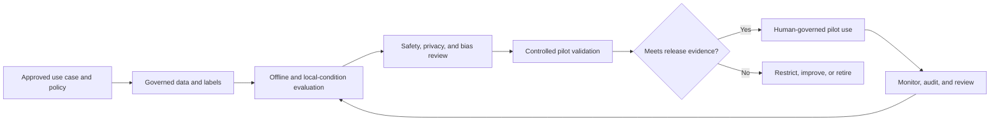

# TrafficMind AI: AI Requirements Specification

**Document ID:** TMA-AI-003  
**Version:** 0.1  
**Date:** 19 July 2026  
**Parent documents:** [Master PRD](01_Product_Requirements.md), [Functional Requirements](02_Functional_Requirements.md)  
**Status:** Draft for AI, product, safety, data-governance, and agency validation

## 1. Purpose and Operating Boundary

This specification defines implementation requirements for AI-assisted perception, prediction, and decision support in the approved Coimbatore pilot. It does not authorize autonomous signal control, emergency dispatch, enforcement, surveillance, or deployment on live city data.

TrafficMind AI may generate observations, confidence-qualified alerts, and approved decision-support options. An authorized human remains responsible for verifying an event and approving any operational action through the relevant agency procedure.

| Term | Meaning in this document |
|---|---|
| **Observed output** | A model-derived result tied to an approved source, time, location, and model version. |
| **Inference** | A prediction, classification, or estimate produced by a deployed model. |
| **Recommendation** | A policy-bounded option generated only from a verified event and approved playbook. |
| **Confidence** | Calibrated measure of model certainty, not a guarantee of correctness or safety. |
| **Human override** | A user decision to reject, correct, suppress, or select an option, recorded with rationale. |

## 2. AI Design Principles

1. **Human authority first:** no model output directly controls a signal, dispatches a vehicle, or initiates enforcement.
2. **Evidence before automation:** every output must retain source, timestamp, location, model/version, freshness, and confidence.
3. **Safety-aware abstention:** low-quality, stale, out-of-scope, or low-confidence input produces an unavailable/needs-verification result rather than fabricated precision.
4. **Local validation:** models must be evaluated against Coimbatore pilot conditions, including mixed traffic, lighting, weather, camera angle, and operational context.
5. **Explainable operation:** the platform must distinguish observed evidence, inferred insight, and playbook recommendation.
6. **Privacy by design:** model pipelines shall use minimum necessary information and prohibit facial recognition, identity tracking, and automated enforcement in the initial scope.

## 3. Capability Requirements

### 3.1 Vehicle Detection

| Field | Requirement |
|---|---|
| ID | AI-DET-01 |
| Purpose | Detect vehicles in authorized camera imagery for traffic-state estimation and event context. |
| Inputs | Authorized camera frame/stream reference, camera calibration/zone configuration, source freshness and health. |
| Outputs | Timestamped detection count, bounding region or privacy-preserving metadata, class candidate, confidence, source/model version. |
| Rules | Only approved pilot cameras and zones may be processed; detections shall not identify drivers, occupants, or registration plates. |
| Acceptance criteria | Test data demonstrates detections are linked to camera, time, zone, model version, and confidence; unavailable camera produces no current-state claim. |
| Safe failure | Suppress detection-derived alert when source is stale, camera health is degraded, or confidence is below configured threshold. |
| Dependencies | Authorized video source, data policy, model registry, zone configuration, monitoring service. |

### 3.2 Vehicle Classification

| Field | Requirement |
|---|---|
| ID | AI-CLS-01 |
| Purpose | Categorize detected traffic into policy-approved classes such as two-wheeler, car, bus, freight vehicle, and emergency-vehicle candidate. |
| Inputs | Vehicle detection candidates, approved taxonomy, camera context, model version. |
| Outputs | Class label, confidence, unknown/ambiguous state, timestamp and provenance. |
| Rules | The taxonomy must be versioned and suited to local road users; an uncertain result shall be labeled unknown rather than forced into a class. |
| Acceptance criteria | Confusion matrix and per-class evaluation are stored for the approved pilot model; user view distinguishes class from verified emergency status. |
| Safe failure | Exclude low-confidence or unknown class from class-specific automation; retain evidence for human review where policy permits. |
| Dependencies | AI-DET-01, labeled validation data, taxonomy governance, model monitoring. |

### 3.3 Congestion Detection and Queue Estimation

| Field | Congestion detection | Queue estimation |
|---|---|---|
| ID | AI-CNG-01 | AI-QUE-01 |
| Purpose | Identify unusual or sustained congestion in approved corridors/junctions. | Estimate queue extent/duration in configured approach zones. |
| Inputs | Counts, speed/occupancy where authorized, camera/sensor state, historic baseline, zone geometry. | Approved camera/sensor observations, stop-line/approach geometry, source health. |
| Outputs | Congestion state, severity, evidence window, confidence, data quality. | Queue length/range or zone occupancy, confidence, observation window. |
| Rules | Thresholds are corridor- and time-context-specific; queue estimate must display unit/method and uncertainty. | No false precision beyond calibrated coverage; spillback risk is an inference, not confirmed blockage. |
| Acceptance criteria | Scenario test correctly labels normal, elevated, and unavailable input states; result includes baseline/method version. | Ground-truth validation records error distribution by camera/zone and produces an abstention state for occlusion. |
| Safe failure | Display "insufficient evidence" when baseline or current coverage is inadequate. | Display unavailable/partial coverage instead of a numeric estimate. |

### 3.4 Emergency Vehicle Candidate Detection

| Field | Requirement |
|---|---|
| ID | AI-EMV-01 |
| Purpose | Flag a potential emergency vehicle only as a verification cue within an approved emergency procedure. |
| Inputs | Authorized visual/sensor candidate, optional authorized emergency-service status token, source health, policy state. |
| Outputs | Candidate alert, evidence reference, confidence, verification-required state. |
| Rules | A visual/audio candidate never establishes emergency status, releases priority, or exposes clinical information; feature is disabled without signed SOP and data agreement. |
| Acceptance criteria | Candidate alert cannot advance to emergency coordination without authorized human/service confirmation; false-positive review is captured. |
| Safe failure | Suppress candidate if policy inactive, evidence stale, or confidence below threshold; provide no automated response. |
| Dependencies | AI-DET-01, FRS-06 emergency workflow, policy configuration, restricted audit trail. |

### 3.5 Incident Detection

| Field | Requirement |
|---|---|
| ID | AI-INC-01 |
| Purpose | Identify approved incident patterns such as stopped vehicle, abnormal queue formation, blocked intersection, or wrong-way candidate. |
| Inputs | Authorized multi-source observations, configured incident taxonomy, time/zone context, source health. |
| Outputs | Candidate incident, event type, evidence references, confidence, affected area, verification-required state. |
| Rules | Model creates a candidate event only; verified status requires the FRS-05 evidence/rationale workflow. Incident taxonomy and escalation rules must be policy-configured. |
| Acceptance criteria | Candidate event includes an evidence window, source timestamps, model version, and confidence; operator can reject/mark duplicate without deleting source history. |
| Safe failure | If inputs conflict or quality is insufficient, present no candidate or mark it as needs-verification without escalation. |
| Dependencies | Event service, AI-DET-01, context/map, notifications, model registry. |

### 3.6 Traffic Prediction

| Field | Requirement |
|---|---|
| ID | AI-PRD-01 |
| Purpose | Forecast approved short-horizon traffic conditions and reliability risk for selected pilot corridors. |
| Inputs | Governed historical observations, current state/freshness, roadworks/events/weather where authorized, model configuration. |
| Outputs | Forecast horizon, predicted range, confidence interval, source coverage, model/version, caveats. |
| Rules | Forecasts must show uncertainty and must not be rendered as observed traffic state. Forecast release requires locality/time-window validation. |
| Acceptance criteria | Forecast view states horizon, interval, data cutoff, confidence, and known missing inputs; back-test results are available to authorized reviewer. |
| Safe failure | Suppress forecast when input coverage/quality is below policy threshold or concept-drift alert is unresolved. |
| Dependencies | Historical data store, approved external context feeds, model monitoring, analytics. |

### 3.7 Decision-Support Recommendation

| Field | Requirement |
|---|---|
| ID | AI-REC-01 |
| Purpose | Rank or present only pre-approved operational playbook options for a verified event. |
| Inputs | Verified event, approved playbook, current evidence, policy/safety constraints, optional validated forecast. |
| Outputs | Approved options, rationale, expected trade-offs, confidence/limitations, no-recommendation state. |
| Rules | The system shall never invent an action, bypass a playbook, or issue a direct actuation command. A recommendation needs explicit authorized human approval before an external request. |
| Acceptance criteria | Every option links to policy/playbook version and evidence; low-confidence/insufficient context yields evidence-only/manual-playbook state; rejection/override is logged. |
| Safe failure | Disable recommendation when relevant policy, model, or input freshness is invalid; retain manual procedure access. |
| Dependencies | FRS-05, FRS-07, policy configuration, audit, AI-PRD-01 where used. |

## 4. Confidence, Explainability, and Human Control

| ID | Requirement | Acceptance criterion |
|---|---|---|
| AI-GOV-01 | Each inference shall expose calibrated confidence, model version, source window, freshness, and data limitations to authorized users. | Test output shows all fields and distinguishes observed versus inferred information. |
| AI-GOV-02 | Confidence thresholds, abstention rules, and escalation eligibility shall be configurable, versioned, and approval-controlled per use case. | Threshold change requires configured approval and is visible in audit trail. |
| AI-GOV-03 | Explainability shall identify the evidence/features at a level appropriate to the model and user without exposing sensitive raw data. | Operator can view a plain-language rationale and authorized reviewer can access technical provenance. |
| AI-GOV-04 | Human users shall be able to verify, reject, correct, suppress, or override inference/recommendation outputs. | Each critical workflow provides an override control and records actor/reason/time. |
| AI-GOV-05 | Human correction and verification outcomes shall be captured as governed feedback for evaluation, not automatically used for retraining. | Feedback is stored with provenance and requires review before dataset admission. |
| AI-GOV-06 | No operational recommendation may be issued if required data is unavailable, stale, out-of-scope, or below accepted quality threshold. | Failure injection results in qualified/unavailable state, never an unlabelled recommendation. |

## 5. Model Lifecycle, Monitoring, and Retraining

### 5.1 Model Governance

| ID | Requirement | Acceptance criterion |
|---|---|---|
| AI-ML-01 | Every model, prompt template, feature pipeline, taxonomy, threshold, and dataset release shall have a unique version and owner. | Model registry shows immutable version, owner, approval, code/configuration reference, data lineage, and status. |
| AI-ML-02 | Promotion from development to pilot environment shall require documented offline evaluation, local-condition testing, safety review, rollback plan, and named approval. | Release evidence package is complete before deployment gate opens. |
| AI-ML-03 | Production/pilot inference shall log model/version, input schema version, output, confidence, latency, and correlation ID without retaining prohibited raw data. | Sample inference is traceable end-to-end. |
| AI-ML-04 | A model shall be independently suspendable without disabling evidence, audit, or manual workflow capabilities. | Suspension test removes inference/recommendation while operator can continue manual process. |

### 5.2 Monitoring Requirements

| Monitoring area | Requirement | Trigger/action |
|---|---|---|
| Data quality | Monitor missingness, freshness, camera/sensor health, schema change, zone calibration, and abnormal values. | Mark output degraded or unavailable; alert source owner. |
| Model quality | Monitor precision/recall or error appropriate to capability using reviewed feedback/ground truth. | Investigate threshold breach; suspend high-risk use if needed. |
| Calibration | Compare stated confidence with observed correctness by class, location, time, and condition. | Recalibrate or restrict release after drift review. |
| Drift | Monitor input, label, performance, and operational-context drift, including lighting/weather/seasonal changes. | Open model review; do not silently retrain. |
| Fairness/bias | Evaluate error and coverage across configured traffic modes, zones, lighting conditions, and relevant non-personal operational contexts. | Document disparity; correct, restrict, or discontinue affected use. |
| Safety/adoption | Monitor override, rejection, false-alert, missed-event, and operator-burden signals. | Product/safety review and playbook/model adjustment. |
| Security | Monitor model/API abuse, unauthorized model change, data poisoning indicators, and anomalous inference use. | Security incident process and credential/version containment. |

### 5.3 Retraining and Change Control

1. Retraining is a governed release process, never an automatic response to new production data.
2. Candidate training data must pass ownership, consent/purpose, quality, privacy, annotation, and bias review before use.
3. The team shall retain a frozen evaluation set and compare candidate models with the current approved version against defined performance, calibration, fairness, latency, and safety criteria.
4. Any material model, threshold, taxonomy, prompt, or feature-pipeline change requires impact assessment, approval, deployment plan, monitoring plan, and rollback capability.
5. High-risk capability changes require representative user validation and a tabletop or controlled simulation before pilot exposure.

## 6. Bias and Safety Evaluation

| ID | Requirement | Acceptance criterion |
|---|---|---|
| AI-BIA-01 | Evaluation datasets shall represent approved Coimbatore pilot conditions, including vehicle mix, day/night, rain/glare where available, camera angles, and selected zones. | Dataset coverage report identifies gaps and release limitations. |
| AI-BIA-02 | The team shall report performance by approved vehicle class, location/zone, time band, and input-quality condition. | Evaluation report includes stratified metrics and confidence intervals where feasible. |
| AI-BIA-03 | Models shall not infer protected personal characteristics or use facial/biometric identity features in the initial scope. | Architecture/data review confirms prohibited fields/models are absent. |
| AI-BIA-04 | A safety review shall define unacceptable false-positive/false-negative patterns for each use case and the required human verification control. | Signed use-case safety case exists before pilot enablement. |

## 7. AI Acceptance Gates

## 8. Explicitly Excluded AI Uses

- Facial recognition, driver/passenger identification, biometric inference, or license-plate-based tracking.
- Automated traffic enforcement or penalty determination.
- Autonomous signal actuation, emergency dispatch, or emergency priority release.
- Unbounded generative AI that creates operational advice outside approved source-grounded playbooks.
- Training on production data without data-governance and model-change approval.

## 9. Implementation Readiness Checklist

- [ ] Approved pilot use case, geography, authority, and human decision owner exist.
- [ ] Input data contracts, retention, quality, and source-health behavior are approved.
- [ ] Model registry, evaluation evidence, calibration, monitoring, and rollback controls are implemented.
- [ ] User-facing confidence, provenance, limitation, verification, and override behavior is tested.
- [ ] Safety, privacy, security, and bias review results are accepted for the intended capability.
- [ ] Manual fallback remains usable when any AI capability is suspended or unavailable.

