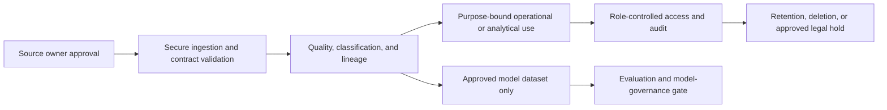

# TrafficMind AI: Data Requirements Specification

**Document ID:** TMA-DATA-004  
**Version:** 0.1  
**Date:** 19 July 2026  
**Parent documents:** [Master PRD](01_Product_Requirements.md), [Functional Requirements](02_Functional_Requirements.md), [AI Requirements](03_AI_Requirements.md)  
**Status:** Draft for data owners, legal/privacy, security, architecture, and agency validation

## 1. Purpose and Data Boundary

This specification defines the data needed to implement and evaluate the approved TrafficMind AI Coimbatore pilot. It establishes data contracts, quality, governance, ownership, privacy, retention, and handling controls. It does not grant access to any city, emergency-service, video, vehicle, or personal data.

The platform shall collect and process only data necessary for an approved operational purpose. Data access remains subject to the authority of the owning agency, written agreements, applicable law and policy, and approved role/purpose controls.

## 2. Data Principles

1. **Purpose limitation:** each data element needs an approved product/operational purpose.
2. **Minimum necessary:** collect the least granular and shortest-lived data that supports that purpose.
3. **Provenance:** every operational record needs source, owner, collection time, receipt time, quality/freshness, and permitted-use classification.
4. **Data quality over false certainty:** missing, stale, conflicting, or unvalidated data must be visible and must not become a current-state claim.
5. **Separation of responsibilities:** raw data custody, integration operation, analytics access, and model training approval are separate controls.
6. **No implicit reuse:** production data may not be used for analytics, model training, research, or external sharing without a separately approved purpose and controls.

## 3. Data Domain Requirements

| Domain | ID | Minimum required data | Primary purpose | Initial pilot status |
|---|---|---|---|---|
| Camera/video | DATA-CAM-01 | Camera ID, approved zone, source/receipt time, health, authorized stream/clip reference, evidence linkage. | Verification and approved aggregate perception. | Conditional on authorization. |
| Traffic sensors | DATA-SEN-01 | Sensor ID, metric/value, unit, observation time, quality/health, location/zone. | Traffic state, queue/congestion context, asset health. | Preferred where available. |
| GPS/fleet location | DATA-GPS-01 | Authorized asset/vehicle pseudonymous ID, time, permitted geometry/segment, quality. | Authorized transit/emergency/fleet operational context. | Conditional and minimum necessary. |
| Weather/environment | DATA-WTH-01 | Source, time, location coverage, observed/forecast condition, quality. | Context for operations, prediction, and safety limitations. | Optional. |
| Historical operations | DATA-HIS-01 | Aggregated historic traffic/event/asset measures, coverage, method/version. | Baselines, analysis, approved model evaluation. | Required for outcome/prediction scope. |
| Events/incidents | DATA-EVT-01 | Event ID/type, time, location, source, lifecycle, evidence reference, owner, closure/review metadata. | Coordination, audit, analytics. | Required. |
| Asset and signal metadata | DATA-AST-01 | Asset ID/type, approved location, status/health, owner, maintenance reference. | Context and fault triage. | Required at basic level. |
| Governance metadata | DATA-MET-01 | Classification, owner, purpose, consent/legal basis where applicable, schema, retention, access policy, lineage. | Control, audit, reproducibility. | Required. |

## 4. Source-Specific Requirements

### 4.1 Camera Streams and Video Evidence

| ID | Requirement | Acceptance criterion |
|---|---|---|
| DATA-CAM-02 | Each camera integration shall maintain a registry record with owner, approved use, zone, source type, health method, retention class, and access policy. | New source cannot be enabled without complete registry approval. |
| DATA-CAM-03 | Video shall be accessed through controlled, short-lived, role- and purpose-authorized references rather than copied into ordinary application logs or general analytics stores. | Access test confirms no raw stream/clip appears in logs or unauthorized export. |
| DATA-CAM-04 | Camera source health shall include last successful observation/receipt time and known coverage limitation. | Outage test labels camera output stale/unavailable. |
| DATA-CAM-05 | Raw video retention shall be set by the owning agency and approved policy; derived aggregates/evidence references shall have separately defined retention. | Retention job and legal-hold behavior are tested against policy. |
| DATA-CAM-06 | Initial pilot processing shall not use facial recognition, biometric templates, license-plate tracking, or identity inference. | Data-flow and model review confirms prohibited processing is absent. |

### 4.2 Sensor and Signal Data

| ID | Requirement | Acceptance criterion |
|---|---|---|
| DATA-SEN-02 | Sensor data shall include source ID, metric, unit, observed time, received time, quality flag, location/zone, and schema version. | Contract validation rejects/inquarantines invalid messages with reason. |
| DATA-SEN-03 | Signal/controller integrations shall be read-only unless a separately authorized external action pathway is approved. | Integration permissions and test evidence show no controller write capability in initial scope. |
| DATA-SEN-04 | Source-health and data-quality rules shall identify stale, missing, implausible, duplicate, and out-of-range readings. | Synthetic quality test labels each condition correctly. |
| DATA-SEN-05 | Raw telemetry and derived traffic measures shall be distinguishable by lineage and transformation version. | Analyst can trace a dashboard value to raw/derived source and transformation record. |

### 4.3 GPS and Sensitive Location Data

| ID | Requirement | Acceptance criterion |
|---|---|---|
| DATA-GPS-02 | GPS location shall be ingested only for an approved fleet/asset purpose and limited to the necessary vehicle category, geography, precision, and time window. | Policy test rejects over-broad scope or disallowed vehicle category. |
| DATA-GPS-03 | Emergency workflows shall use only minimum necessary route/obstruction/coordination status and shall not store clinical or patient data. | Privacy review and field-level scan find no clinical/patient attributes. |
| DATA-GPS-04 | Persistent direct identifiers shall be removed, tokenized, or pseudonymized when a stable identifier is not essential to the approved purpose. | Dataset inspection confirms identity exposure is minimized. |
| DATA-GPS-05 | GPS data shall not be exposed in public interfaces or exported without the owner and policy approval. | Export/access test blocks unapproved disclosure. |

### 4.4 Weather, Roadwork, and External Context

| ID | Requirement | Acceptance criterion |
|---|---|---|
| DATA-CTX-01 | External context feeds shall record provider, license/terms, observation/forecast status, coverage, timestamp, freshness, and permitted use. | Feed registry shows all required metadata. |
| DATA-CTX-02 | Forecast data shall be labeled as forecast and never represented as observed fact. | UI/API test shows data-state label. |
| DATA-CTX-03 | Roadwork/event context shall include responsible owner, validity period, geography, and update time where supplied. | Expired record is flagged/removed from active context per policy. |

## 5. Canonical Operational Data Model

The architecture team shall define physical schemas, but the following logical entities are mandatory for traceability.

| Entity | Required attributes | Rules |
|---|---|---|
| Source | Source ID, owner, type, approved purpose, health, schema/version, permitted geography. | A source is inactive until approval and quality validation complete. |
| Observation | Source ID, observed/received time, zone, measure, value, unit, quality, lineage. | Observations are immutable; corrections create a new version/record. |
| Event | Event ID/type, location/time, lifecycle, evidence references, sensitivity, owner, audit correlation ID. | Verification and closure follow FRS-05. |
| Asset | Asset ID/type, owner, location/zone, health, maintenance reference, criticality. | No device secret is stored in general asset metadata. |
| Recommendation | Event reference, playbook/policy version, evidence, model/version, confidence, human decision. | Recommendation is not an action command. |
| User/access grant | Subject, agency, role, purpose, area/data scope, approver, expiry/review date. | Enforced through IAM/ABAC controls. |
| Dataset | Dataset ID, owner, purpose, source list, transformations, classification, retention, quality, approval. | Training/analytics reuse requires a dataset-specific approved purpose. |

## 6. Data Quality, Validation, and Lineage

| ID | Requirement | Acceptance criterion |
|---|---|---|
| DATA-QLT-01 | Each inbound record shall be validated for schema, source authorization, timestamp reasonableness, location/zone, required fields, and permitted classification. | Invalid record is rejected/quarantined with traceable reason. |
| DATA-QLT-02 | Quality states shall at minimum support valid, degraded, stale, invalid, unavailable, and unknown. | UI/API test maps each source condition to defined status. |
| DATA-QLT-03 | Transformations, aggregations, and derived metrics shall record input dataset/source, code/configuration version, execution time, and owner. | Sample report can be reproduced from lineage data. |
| DATA-QLT-04 | Data correction shall preserve the original record and record correction actor, reason, time, and replacement reference. | Audit review reconstructs correction history. |
| DATA-QLT-05 | The system shall reconcile source time and receipt time and apply configured late-arrival handling. | Delayed data test avoids rewriting previously issued current-state context without version/notice. |
| DATA-QLT-06 | Data-quality thresholds and alerts shall be configurable only by approved change process. | Threshold update needs approval and is audit logged. |

## 7. Ownership, Governance, and Access

### 7.1 Ownership Model

| Role | Responsibility |
|---|---|
| Data owner | Authorizes purpose, access, sharing, retention, and accuracy expectations for the source. |
| Data steward | Maintains dictionary, quality definitions, classification, lineage, and issue resolution. |
| System custodian | Operates approved technical storage/processing controls on behalf of owner. |
| Privacy/legal reviewer | Reviews sensitive processing, purpose limitation, sharing, retention, and rights/obligations. |
| Security owner | Defines/control tests security classification, access, encryption, logging, and incident handling. |
| Analytics/AI owner | Defines approved derived use and model dataset controls; cannot override data-owner restrictions. |

### 7.2 Governance Requirements

| ID | Requirement | Acceptance criterion |
|---|---|---|
| DATA-GOV-01 | Maintain a data register for every source, dataset, and derived data product. | Register includes owner, purpose, classification, access, retention, lineage, and approval status. |
| DATA-GOV-02 | Classify data at least as public, internal operational, confidential operational, and restricted/sensitive. | Access/export policy enforces classification rules. |
| DATA-GOV-03 | Data sharing between agencies/providers shall require documented purpose, minimum fields, approved recipient, transfer method, retention, and incident contact. | No cross-owner feed activates without agreement record. |
| DATA-GOV-04 | Any new use of data, including model training, external research, or public sharing, shall undergo purpose and privacy review. | Change ticket/approval exists before new-use processing begins. |
| DATA-GOV-05 | Data subject/citizen requests and legal obligations, where applicable, shall be routed to the responsible agency through documented procedure. | Operating runbook identifies owner and response process; product does not make legal determinations. |

## 8. Privacy, Retention, and Deletion

| ID | Requirement | Acceptance criterion |
|---|---|---|
| DATA-PRV-01 | Personal and sensitive operational data shall be minimized, purpose-limited, role-restricted, and masked/de-identified where feasible. | Privacy review confirms element-by-element necessity and controls. |
| DATA-PRV-02 | Retention shall be configured by data class, source owner, purpose, and legal/operational requirement, with no indefinite default. | Retention schedule is approved and automated deletion is tested. |
| DATA-PRV-03 | Legal hold/investigation preservation, when lawfully instructed, shall suspend deletion only for the scoped data and be auditable. | Hold test retains scoped record and does not over-retain unrelated data. |
| DATA-PRV-04 | Deletion/expiry shall remove or irreversibly de-identify data from active systems and follow approved backup lifecycle rules. | Deletion evidence and backup expiry policy are available for review. |
| DATA-PRV-05 | Data used for reports/analytics shall default to aggregate or de-identified form unless an approved role/purpose requires otherwise. | Analyst/export test shows minimum-granularity dataset. |

## 9. Storage, Encryption, and Exchange

| ID | Requirement | Acceptance criterion |
|---|---|---|
| DATA-SEC-01 | Data in transit shall use approved encrypted channels and mutually authenticated integration methods where appropriate. | Security test rejects insecure endpoint/invalid certificate. |
| DATA-SEC-02 | Sensitive data at rest shall use approved encryption with managed keys and documented key ownership/rotation. | Storage assessment verifies encryption and key policy. |
| DATA-SEC-03 | API, file, and message exchange shall use versioned contracts, authentication, authorization, integrity checks, and replay/idempotency controls appropriate to feed type. | Integration test handles duplicate/replayed message safely. |
| DATA-SEC-04 | Data exports shall be role/purpose approved, classified, watermarked where required, logged, and time-limited. | Unauthorized export is denied; approved export has audit record. |
| DATA-SEC-05 | Development/test environments shall use synthetic, masked, or de-identified data unless an exception is formally approved. | Environment scan and approval register demonstrate compliance. |

## 10. Data Flow and Release Gates

Before enabling a source or derived dataset, the delivery team must have:

- [ ] Named data owner and steward.
- [ ] Approved purpose, classification, sharing, retention, and access policy.
- [ ] Source schema, ownership, freshness/quality behavior, and failure mode documented.
- [ ] Secure transport/storage and environment controls validated.
- [ ] Lineage, audit, deletion, and incident contact path tested.
- [ ] Separate approval for use in AI training, if requested.

## 11. Explicitly Prohibited or Restricted Data Uses

- Facial templates, biometric identity, or facial-recognition matching.
- License-plate-based or individual travel-history tracking in the initial pilot.
- Clinical, patient, dispatch narrative, or other unnecessary emergency-service detail.
- Use of raw production video/location data in development or training without explicit approved governance.
- Selling, advertising, or unrelated secondary use of government/operational data.

