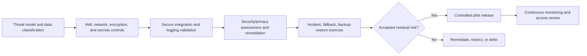

# TrafficMind AI: Security Requirements Specification

**Document ID:** TMA-SEC-005  
**Version:** 0.1  
**Date:** 19 July 2026  
**Parent documents:** [Master PRD](01_Product_Requirements.md), [Functional Requirements](02_Functional_Requirements.md), [AI Requirements](03_AI_Requirements.md), [Data Requirements](04_Data_Requirements.md)  
**Status:** Draft for security architecture, IT, privacy/legal, product, and agency validation

## 1. Purpose and Security Boundary

This specification defines the minimum security requirements for a human-governed, government-ready TrafficMind AI pilot. It applies to user access, services, integrations, data, models, infrastructure, operations, and suppliers.

Security controls are not a substitute for operational authority. The initial product must not directly control traffic signals, emergency dispatch, or physical field devices. Any later external action integration requires a separate safety, security, agency-authorization, and change-control review.

## 2. Security Objectives

| Objective | Required outcome |
|---|---|
| Confidentiality | Sensitive operational, emergency, video, location, and credentials data are accessible only to approved identities for approved purposes. |
| Integrity | Events, evidence, configuration, recommendations, approvals, and audit records cannot be silently altered. |
| Availability | Approved users can identify service/source health and follow a safe manual fallback during platform or dependency failure. |
| Accountability | Material user, system, model, integration, export, and configuration actions are attributable and reviewable. |
| Resilience | The system can contain incidents, recover from disruption, and restore verified service without unsafe hidden degradation. |
| Privacy | Controls enforce purpose limitation, minimization, retention, and appropriate access to sensitive information. |

## 3. Zero Trust Architecture Requirements

TrafficMind AI shall apply Zero Trust principles: explicitly verify every access request, use least privilege, assume breach, continuously evaluate signals, segment resources, and log material activity.

| ID | Requirement | Acceptance criterion |
|---|---|---|
| SEC-ZT-01 | Every user, workload, service, device, and integration shall have a verifiable identity before access to protected resource. | Unauthenticated request is denied; service-to-service request is authenticated and attributable. |
| SEC-ZT-02 | Authorization shall be evaluated per request/session using identity, role, attributes, purpose, geography, data classification, and current policy. | User with same role but different approved area cannot access restricted area data. |
| SEC-ZT-03 | Network location alone shall not grant trust or administrative access. | Internal-network unauthenticated test is denied. |
| SEC-ZT-04 | Sensitive systems and data paths shall be segmented so compromise of one connector/user/service does not grant broad access. | Segmentation test blocks lateral access outside assigned boundary. |
| SEC-ZT-05 | High-risk activity shall require step-up authentication, reauthorization, or dual approval according to policy. | Privileged/export/configuration test requests stronger control. |

## 4. Identity, Authentication, RBAC, and ABAC

| ID | Requirement | Acceptance criterion |
|---|---|---|
| SEC-IAM-01 | Integrate with an approved identity provider or provide a controlled identity service with unique user accounts; shared accounts are prohibited. | Sample accounts are individually attributable; shared credential test fails. |
| SEC-IAM-02 | MFA shall be enforced for privileged users and for access to confidential/restricted data, with agency-approved authentication methods. | Privileged login without second factor is denied. |
| SEC-IAM-03 | RBAC shall implement approved functional roles including operator, supervisor, emergency liaison, analyst, maintenance, system admin, and security admin. | Role test confirms only approved actions/data are available. |
| SEC-IAM-04 | ABAC shall refine RBAC using agency, purpose, geography, data sensitivity, shift/assignment, approval state, and time-bound delegation where applicable. | User outside purpose/geography/expiry scope is denied despite base role. |
| SEC-IAM-05 | Privileged access shall be time-bound, separately approved, monitored, and reviewed; administrators shall not self-grant unauthorized elevation. | Self-elevation test fails; temporary grant expires and is logged. |
| SEC-IAM-06 | Joiner, mover, leaver, and periodic access-review processes shall be defined with accountable agency/system owners. | Expired/terminated account is disabled within agreed policy interval and appears in review report. |
| SEC-IAM-07 | Session management shall use secure expiration, reauthentication for sensitive actions, and revocation behavior. | Revoked user/session cannot continue protected action. |

## 5. Application, API, and Integration Security

| ID | Requirement | Acceptance criterion |
|---|---|---|
| SEC-API-01 | APIs shall use strong authentication, scoped authorization, encrypted transport, input/schema validation, rate limiting, and consistent error handling. | Unauthorized, malformed, and rate-limit tests fail safely without sensitive detail. |
| SEC-API-02 | API tokens shall be scoped, rotated, revocable, time-limited where feasible, and never embedded in client code or logs. | Secret scan finds no token; revoked token is rejected. |
| SEC-API-03 | Inbound messages/files shall verify source, integrity, schema, size/type limits, and replay/duplicate handling before processing. | Malicious, replayed, or invalid message is quarantined/rejected and logged. |
| SEC-API-04 | Outbound integrations shall be allowlisted, purpose-scoped, authenticated, logged, and fail closed for high-risk operational requests. | Unapproved target/request is blocked; failed approval cannot send request. |
| SEC-API-05 | Camera/video and emergency integrations shall use restricted service identities and minimum necessary endpoints/data fields. | Integration review demonstrates least-privilege access. |
| SEC-API-06 | External dependencies shall have documented owner, security posture, failure behavior, and incident contact. | Dependency register is complete before production/pilot enablement. |

## 6. Encryption, Key Management, and Secrets

| ID | Requirement | Acceptance criterion |
|---|---|---|
| SEC-CRY-01 | Sensitive data in transit shall use approved modern encryption; insecure protocols/cipher configurations shall be disabled. | Security scan rejects insecure transport. |
| SEC-CRY-02 | Sensitive data at rest, backups, and approved portable exports shall be encrypted with managed keys. | Storage/backup assessment verifies encryption. |
| SEC-CRY-03 | Keys shall have named owner, lifecycle, rotation, access policy, backup/recovery, and revocation procedure. | Key inventory and rotation test are available. |
| SEC-SEC-01 | Secrets shall be stored only in an approved secrets-management service, injected at runtime where feasible, and never stored in source code, UI configuration, tickets, or logs. | Automated scan and deployment review find no plaintext secret. |
| SEC-SEC-02 | Secret access shall be least-privilege, logged, rotated on suspected exposure, and separated by environment. | Compromised-secret drill demonstrates revocation and rotation. |

## 7. Infrastructure, Endpoint, and Environment Security

| ID | Requirement | Acceptance criterion |
|---|---|---|
| SEC-INF-01 | Development, test, staging, and pilot/production environments shall be logically separated with distinct identities, secrets, and data access. | Cross-environment credential/data access test is denied. |
| SEC-INF-02 | Production-like environments shall use hardened baseline images, supported components, patch/vulnerability management, and configuration management. | Vulnerability/configuration assessment meets accepted release threshold. |
| SEC-INF-03 | Administrative interfaces shall not be publicly exposed without approved protected access path and stronger authentication. | External scan confirms no unintended admin exposure. |
| SEC-INF-04 | Endpoints used for privileged administration shall follow approved device-security policy where agency controls are available. | Privileged access policy/enforcement evidence exists. |
| SEC-INF-05 | Infrastructure changes shall be reviewed, approved, versioned, logged, and recoverable through controlled deployment procedures. | Sample change shows approval, deployment artifact, and rollback evidence. |
| SEC-INF-06 | Test/development environments shall use synthetic, masked, or approved de-identified data by default. | Data scan and exception register validate compliance. |

## 8. Audit Logging, Detection, and Monitoring

| ID | Requirement | Acceptance criterion |
|---|---|---|
| SEC-AUD-01 | Audit logs shall cover authentication, access denial, privilege change, data access/export, event actions, approvals/overrides, configuration, model/version, integration, and security events. | Audit sample reconstructs a complete high-risk workflow. |
| SEC-AUD-02 | Audit records shall be tamper-evident, time-synchronized, access-restricted, and retained under approved policy. | Modification attempt is denied/logged; time consistency check passes. |
| SEC-MON-01 | Monitor service availability, source freshness, authentication anomalies, API abuse, privilege escalation, configuration changes, model/integration health, and data-quality/security alerts. | Simulated alerts route to owner with severity and correlation ID. |
| SEC-MON-02 | Security alerts shall have documented severity, triage, escalation, containment, and evidence-preservation procedure. | Tabletop exercise completes within defined process. |
| SEC-MON-03 | Monitoring must not silently collect prohibited raw video, personal identifiers, secrets, or clinical data. | Telemetry/log review identifies minimization controls. |
| SEC-AUD-03 | Audit storage failure shall block high-risk approvals, exports, and configuration changes; read-only context may remain available only with visible degraded state. | Failure test blocks protected action and creates service alert. |

## 9. Incident Response, Disaster Recovery, and Business Continuity

### 9.1 Incident Response

| ID | Requirement | Acceptance criterion |
|---|---|---|
| SEC-IR-01 | Maintain an incident-response plan covering security, privacy, data-loss, model-integrity, integration, and service-availability incidents. | Plan has named owners, contacts, classification, and review date. |
| SEC-IR-02 | The plan shall define containment actions including account/token revocation, connector/model suspension, access restriction, preservation of evidence, and agency notification path. | Tabletop test demonstrates at least one containment scenario. |
| SEC-IR-03 | Suspected compromise shall not result in unreviewed restoration of operational recommendation or emergency capability. | Recovery checklist requires security/operations approval before re-enable. |
| SEC-IR-04 | Security/privacy incident reporting and external notification shall follow applicable agency/legal direction; the product team shall not make unsupported compliance claims. | Runbook identifies responsible agency/legal decision owner. |

### 9.2 Disaster Recovery and Continuity

| ID | Requirement | Acceptance criterion |
|---|---|---|
| SEC-DR-01 | Define and approve recovery time objective (RTO) and recovery point objective (RPO) by service/data class before pilot release. | Service inventory contains RTO/RPO, owner, and rationale. |
| SEC-DR-02 | Backups shall be encrypted, access-controlled, integrity-checked, retention-managed, and restored through tested procedure. | Restore exercise meets agreed criterion and audit evidence is retained. |
| SEC-DR-03 | The platform shall provide clear degraded/unavailable state and manual fallback procedure when critical services/sources are unavailable. | Outage drill shows no false current state and users locate fallback. |
| SEC-DR-04 | Disaster-recovery tests shall include identity, audit, configuration, event data, and approved integration recovery. | Test report identifies gaps and remediation owner. |

## 10. Secure AI and Data Controls

| ID | Requirement | Acceptance criterion |
|---|---|---|
| SEC-AI-01 | Model artifacts, prompts, configurations, training/evaluation datasets, and deployment permissions shall be versioned, access-controlled, provenance-tracked, and integrity protected. | Unauthorized model/configuration change is prevented and logged. |
| SEC-AI-02 | AI pipelines shall validate input schema/source, detect anomalous volume/content, and prevent untrusted data from triggering uncontrolled action. | Poisoned/malformed input test is rejected or quarantined. |
| SEC-AI-03 | Generative AI, if later introduced, shall be source-grounded, access-controlled, prompt-injection tested, output-limited, and prohibited from unapproved operational actions. | Security evaluation demonstrates refusal/safe response to adversarial prompt scenario. |
| SEC-DAT-01 | Data classification shall control storage, processing, export, logging, and environment access. | Restricted data policy test prevents unauthorized export/test use. |
| SEC-DAT-02 | Privacy/security review is required before onboarding a sensitive new source or changing purpose, retention, sharing, or model use. | Change record includes required approval before enablement. |

## 11. Compliance and Assurance Posture

TrafficMind AI shall be designed to support applicable contractual, agency, privacy, cybersecurity, procurement, and records-management obligations. The applicable legal/regulatory set must be confirmed by the responsible government agency and qualified advisers before deployment.

| Assurance area | Requirement |
|---|---|
| Governance | Maintain risk register, policy evidence, approvals, ownership, and periodic review. |
| Privacy | Maintain data register, purpose/access/retention controls, and incident/rights handling procedure as applicable. |
| Security | Conduct threat modeling, vulnerability management, penetration testing appropriate to pilot risk, and supplier assessment before pilot go-live. |
| Accessibility and operations | Validate security controls do not prevent authorized time-critical fallback procedures; document emergency break-glass process if approved. |
| Evidence | Preserve release, test, access-review, incident, backup-restore, and audit evidence for agency review. |

## 12. Security Release Gates

## 13. Pilot Security Checklist

- [ ] Threat model covers users, agencies, integrations, data flows, models, and administrative paths.
- [ ] RBAC/ABAC, MFA, privileged access, and access-review controls are tested.
- [ ] API/integration authentication, validation, encryption, and failure behavior are approved.
- [ ] Encryption, key management, secrets management, logging, and environment separation are validated.
- [ ] Security monitoring, incident response, audit integrity, backup restore, and manual fallback exercises are completed.
- [ ] Critical/high findings have an owner, mitigation, accepted residual-risk decision, or release block.
- [ ] No emergency/operational external action pathway is enabled without agency procedure, dual control where required, and safety/security approval.

