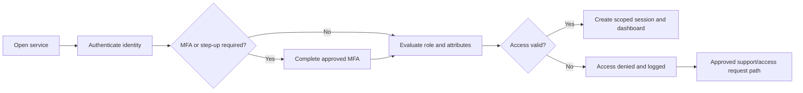
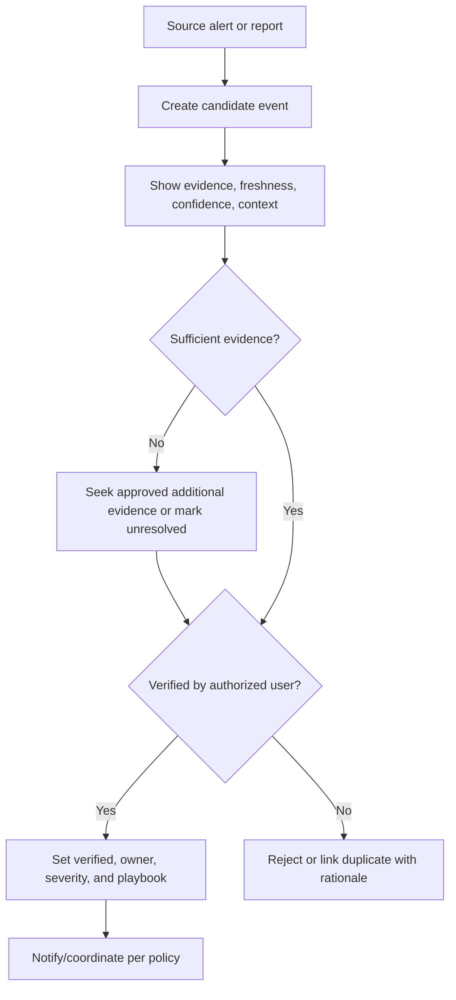
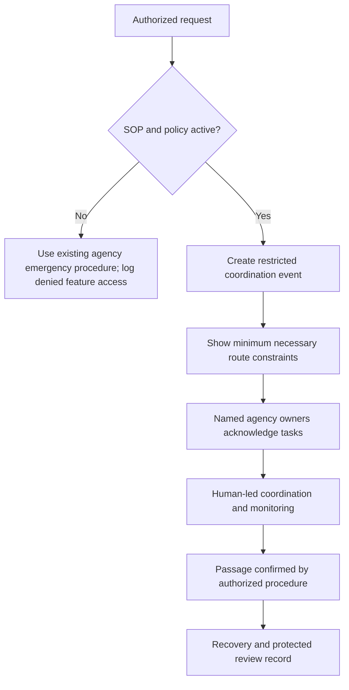
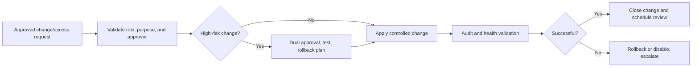

# TrafficMind AI: User Flow Specifications

**Document ID:** TMA-UX-007  
**Version:** 0.1  
**Date:** 19 July 2026  
**Related documents:** [Personas](08_Personas.md), [Functional Requirements](02_Functional_Requirements.md), [Security Requirements](05_Security_Requirements.md)  
**Status:** Draft workflow specification for pilot validation

## 1. Purpose and Flow Conventions

These flows define expected user behavior, system behavior, decision points, authority boundaries, and safe failure paths. They are not UI layouts and do not authorize external traffic control or emergency dispatch.

| Convention | Meaning |
|---|---|
| **User action** | An authorized person performs a step. |
| **System response** | TrafficMind AI processes or presents governed information. |
| **Decision gate** | A human/policy decision determines the next path. |
| **Fallback** | Existing agency procedure/tool remains the safe path when data, policy, or service is unavailable. |

## 2. Flow Summary

| ID | Flow | Primary roles | Outcome |
|---|---|---|---|
| FL-01 | Login and access establishment | All users, IT Administrator | Authenticated, policy-scoped session. |
| FL-02 | Daily monitoring and shift handover | ICCC Operator, Supervisor | Verified shared operating picture and owned open work. |
| FL-03 | Incident detection and verification | ICCC Operator, Traffic Police Supervisor | Verified or rejected event with evidence. |
| FL-04 | Incident resolution and review | Operator, Supervisor, partners | Closed event with outcome and audit. |
| FL-05 | Emergency response coordination | Emergency Liaison, Traffic Police, ICCC | Authorized, safe coordination and recovery record. |
| FL-06 | AI recommendation review | Operator, Supervisor | Human-approved, rejected, or unavailable advisory outcome. |
| FL-07 | Manual override | Authorized operational role | Safe override/rejection with rationale and escalation. |
| FL-08 | Camera failure | Operator, IT/Maintenance | Visible degradation and manual verification path. |
| FL-09 | Signal/asset failure | Operator, Maintenance, Supervisor | Verified fault triage and maintenance handoff. |
| FL-10 | Report generation | Analyst, Administrator, Executive | Governed, reproducible report with limitations. |
| FL-11 | System administration | IT/Security Administrator | Controlled access/configuration/integration change. |

## 3. FL-01: Login and Access Establishment

**Trigger:** user opens the approved TrafficMind AI service.

| Step | Actor | Action/system behavior | Control and exception |
|---|---|---|---|
| 1 | User | Selects approved service access path. | Only approved identity entry point is allowed. |
| 2 | System | Authenticates unique identity and requests MFA/step-up where policy requires. | Failed authentication does not disclose account state beyond approved message. |
| 3 | System | Evaluates role, agency, geography, purpose, sensitivity, assignment, and expiry. | ABAC/RBAC denies access outside current policy. |
| 4 | System | Creates time-limited session and logs successful access. | Session displays approved role/area where appropriate. |
| 5 | User | Sees role-specific dashboard or access-denied support path. | No sensitive event/camera metadata is exposed on denial. |

**Exit criteria:** session is established with minimum privilege, or access is safely denied and logged.

## 4. FL-02: Daily Monitoring and Shift Handover

**Trigger:** start of operator shift or handover period.

| Step | Actor | Action/system behavior | Decision or fallback |
|---|---|---|---|
| 1 | ICCC Operator | Opens dashboard. | System shows assigned area, active events, source health, and outstanding acknowledgements. |
| 2 | Operator | Reviews source freshness and degraded feeds. | If critical source stale, open fallback/SOP and notify owner per policy. |
| 3 | Operator | Reviews active/assigned events and deadlines. | Reassign/escalate only through approved workflow. |
| 4 | Outgoing operator | Records open-event status, evidence, owner, next action, and known limitation. | Handover cannot be marked complete with required fields missing. |
| 5 | Incoming operator | Acknowledges handover and assumes/declines assigned work. | Decline triggers configured supervisor escalation. |
| 6 | System | Logs handover and produces current shift context. | Viewing does not modify operational state. |

**Exit criteria:** every open high-priority event has an acknowledged owner or escalation record; source limitations are visible.

## 5. FL-03: Incident Detection and Verification

**Trigger:** authorized source alert, partner report, or operator observation.

| Step | Actor | Action/system behavior | Control and exception |
|---|---|---|---|
| 1 | System / operator / partner | Creates candidate event with source/type/location/time. | Candidate alone cannot cause external operational action. |
| 2 | System | Presents evidence, source freshness, confidence, map/corridor context, and related events. | Stale or low-confidence state is explicit. |
| 3 | ICCC Operator | Reviews approved evidence and adds verification rationale. | Camera/other source access remains role/purpose limited. |
| 4 | Authorized verifier | Marks verified, unresolved, rejected, or duplicate. | Verified transition requires evidence/rationale. |
| 5 | System | Assigns severity/playbook options and logs transition. | If assignment fails, event is retained and fallback owner is alerted. |

**Exit criteria:** event is verified and owned, or rejected/linked/unresolved with an auditable rationale.

## 6. FL-04: Incident Resolution and Review

**Trigger:** verified event has an owner and approved response path.

| Step | Actor | Action/system behavior | Decision or fallback |
|---|---|---|---|
| 1 | Owner / supervisor | Reviews current evidence, safety constraints, and approved response checklist. | Manual procedure remains available if recommendation/context is unavailable. |
| 2 | Partner roles | Acknowledge assigned actions and update status through approved channel. | Non-response triggers policy-based escalation. |
| 3 | ICCC Operator | Updates monitoring/recovery state as verified evidence changes. | No unverified conclusion is shown as resolved. |
| 4 | Authorized owner | Confirms recovery/closure evidence, outcome, unresolved issue, and review requirement. | Closure is blocked if mandatory fields absent. |
| 5 | System | Creates post-event audit and optional analytic review record. | Data-quality limitations remain attached. |

**Exit criteria:** event is closed with accountable owner, outcome, evidence, limitations, and follow-up if needed.

## 7. FL-05: Emergency Response Coordination

**Trigger:** authorized emergency service invokes an approved emergency coordination SOP.

| Step | Actor | Action/system behavior | Control and exception |
|---|---|---|---|
| 1 | Emergency Liaison | Initiates request using authorized status/reference. | No patient/clinical data is entered or displayed. |
| 2 | System | Confirms policy/SOP, user role, and minimum necessary scope. | If inactive/invalid, feature is unavailable and existing SOP is shown. |
| 3 | System | Creates restricted coordination event and presents route obstruction/access constraints. | Does not claim a route is clear from incomplete/stale data. |
| 4 | Liaison, Police, ICCC | Acknowledge assigned actions and use approved human-led procedure. | No automatic signal pre-emption or dispatch. |
| 5 | Authorized owner | Records passage/recovery status and any review requirement. | Protected audit and retention controls apply. |

**Exit criteria:** emergency procedure completes with explicit recovery state, protected audit, and no unnecessary sensitive data.

## 8. FL-06: AI Recommendation Review

**Trigger:** verified eligible event has valid approved evidence and playbook.

| Step | Actor | Action/system behavior | Decision or fallback |
|---|---|---|---|
| 1 | System | Checks policy, model/version approval, source quality, freshness, and confidence threshold. | Failure produces evidence-only/manual-playbook state. |
| 2 | System | Displays approved option(s), rationale, evidence, expected trade-offs, limitations, and constraints. | Output is advisory; never a direct command. |
| 3 | Operator / supervisor | Reviews and selects, rejects, or requests additional context. | Low confidence suppresses recommendation. |
| 4 | Authorized approver | Approves any external operational request through agency workflow. | No request is sent without explicit approval and audit write. |
| 5 | System | Logs selected/rejected option, rationale, actor, evidence/model version, and later observed outcome link. | Audit failure blocks high-risk action. |

**Exit criteria:** human-approved action, documented rejection/override, or safe no-recommendation outcome.

## 9. FL-07: Manual Override

**Trigger:** authorized user judges an AI output, automated source state, or configured workflow unsuitable for the current condition.

| Step | Actor | Action/system behavior | Control and exception |
|---|---|---|
| 1 | Authorized user | Selects reject, correct, suppress, or override. | User sees source/model/confidence and policy context. |
| 2 | User | Enters required rationale and, if applicable, selects approved alternative/manual procedure. | Critical override requires supervisor approval where configured. |
| 3 | System | Stops/suppresses affected recommendation or labels corrected state; retains original evidence. | Override does not delete history or silently alter data. |
| 4 | System | Logs actor, reason, time, scope, related event, and escalation/review trigger. | Repeated patterns feed model/product review, not automatic retraining. |

**Exit criteria:** manual decision is safely executed through agency process, fully auditable, and available for review.

## 10. FL-08: Camera Failure

**Trigger:** health monitor, operator, or integration reports camera stream/coverage issue.

| Step | Actor | Action/system behavior | Decision or fallback |
|---|---|---|
| 1 | System | Marks source degraded/stale/unavailable with last successful time and affected zone. | It does not show prior image as live. |
| 2 | ICCC Operator | Reviews impact on active events and chooses approved alternate evidence source/manual verification. | No AI event is verified solely on stale camera output. |
| 3 | System | Creates/updates asset-health alert and notifies maintenance owner per policy. | Alerts are deduplicated and prioritized by operational impact. |
| 4 | Maintenance Engineer | Acknowledges, triages, links work reference, and updates verified status. | External work system remains system of record. |
| 5 | System | Restores source status only after configured health validation. | Recovery is logged; unresolved event context retains limitation. |

**Exit criteria:** affected operational context is visibly qualified, maintenance responsibility is clear, and manual fallback is available.

## 11. FL-09: Signal or Field-Asset Failure

**Trigger:** telemetry threshold breach, authorized report, or field observation.

| Step | Actor | Action/system behavior | Decision or fallback |
|---|---|---|
| 1 | System/operator | Creates asset-health alert with asset ID, fault type, last contact, impact area, and quality state. | Alert is not treated as verified physical fault until assessed. |
| 2 | ICCC / police supervisor | Assesses operational safety impact and initiates approved field/manual procedure. | Platform does not write controller configuration. |
| 3 | Maintenance Engineer | Validates fault, triages criticality, and links maintenance reference. | Device credentials remain outside product UI. |
| 4 | System | Shows status to affected operators and logs handoff. | Connector outage preserves manual triage record. |
| 5 | Maintenance / operator | Verifies restoration and closes/updates alert. | Closure requires verified status, not merely telemetry return where policy requires. |

**Exit criteria:** fault status, responsible owner, operational impact, and restoration evidence are recorded.

## 12. FL-10: Report Generation

**Trigger:** scheduled review, approved analyst request, or pilot gate decision.

| Step | Actor | Action/system behavior | Decision or fallback |
|---|---|---|---|
| 1 | Analyst / administrator | Selects approved template, date range, geography, audience, and requested metrics. | Access/purpose/classification checked. |
| 2 | System | Validates source coverage, methodology, baseline, data quality, and export policy. | Incomplete report is blocked or clearly drafted as incomplete. |
| 3 | System | Generates reproducible report with facts, estimates, assumptions, methodology, and limitations separated. | No unsupported outcome claim. |
| 4 | Authorized reviewer | Reviews, approves, shares, or returns report for correction. | Restricted reports/export are watermarked/logged as policy requires. |
| 5 | System | Stores version, inputs, methodology, approver, and export audit record. | Retention follows report/data policy. |

**Exit criteria:** report is governed, reproducible, audience-appropriate, and traceable to data/method versions.

## 13. FL-11: System Administration

**Trigger:** user lifecycle request, configuration change, integration onboarding, access review, or security incident.

| Step | Actor | Action/system behavior | Control and exception |
|---|---|---|---|
| 1 | Administrator | Receives approved request/change with scope, owner, reason, and expiry/rollback where relevant. | No self-approval for elevated/high-risk actions. |
| 2 | System | Validates permissions, configuration schema, dependency/impact, and required approvals. | Invalid change cannot publish. |
| 3 | Administrator | Applies approved access/configuration/integration change through controlled workflow. | Secrets are never entered into ordinary UI configuration. |
| 4 | System | Logs before/after, actor, approver, version, time, and health result. | Failed audit write blocks high-risk change. |
| 5 | Administrator / security | Reviews alerts and rolls back/disables if validation fails. | Previous known-good configuration is preserved. |

**Exit criteria:** change is secure, validated, auditable, recoverable, and reviewed at the required cadence.

## 14. Flow Validation Criteria

- Each flow must be exercised with representative users before release of the related capability.
- Every human approval, escalation, assignment, exception, and fallback must be visible and audit-reconstructible.
- Each critical flow must have an outage/degraded-data scenario and a safe manual alternative.
- Emergency and any external-action pathway require formal SOP approval and tabletop evidence before operational use.
- Flow changes must be traceable to the PRD, functional requirements, security requirements, and approved operating policy.

