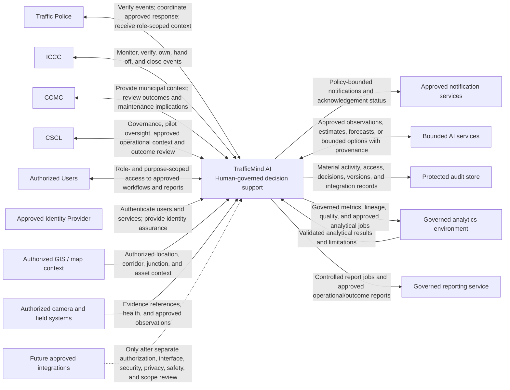
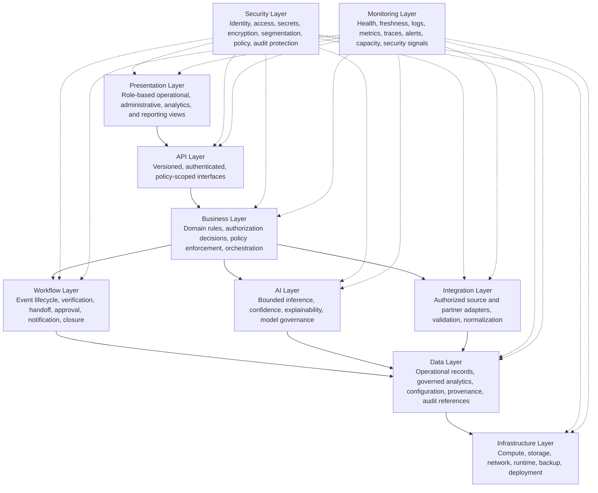

# TrafficMind AI
## Master System Architecture

### Foundation & Vision

**Document ID:** TMA-ARCH-001  
**Version:** 0.1 — Foundation & Vision Draft  
**Date:** 20 July 2026  
**Owner:** Loopframe Labs / TrafficMind AI Architecture Team  
**Classification:** Internal — Architecture and Delivery Planning  
**Status:** Draft for architecture, product, security, data-governance, safety, and agency validation  
**Product:** TrafficMind AI  
**Primary operating context:** Coimbatore, Tamil Nadu, India

> **Document continuity notice:** This is one living architecture document. Later approved installments extend this file; they must not restart, duplicate, or reinterpret the sections established here.

---

# 1. Cover Page

TrafficMind AI is a human-governed urban traffic operating platform for authorized public-sector teams. This architecture defines the enduring foundations for delivering the approved Coimbatore pilot safely, securely, and in a form that can be governed, supported, and extended only through formal approval.

The architecture exists to support verified situational awareness, human-led incident coordination, selected corridor and junction context, authorized emergency-route coordination support where eligible, and accountable outcome measurement. It does not authorize a deployment, integration, traffic-control action, or expansion of the approved product scope.

**Tagline:** *Predict. Optimize. Save Lives.*  
**Mission:** Build India’s most intelligent AI-powered Urban Traffic Operating Platform through trusted local data, explainable decision support, human-governed workflows, and measurable public outcomes.

---

# 2. Document Control

## 2.1 Purpose

This document establishes the master architectural direction for TrafficMind AI. It translates the approved product intent and non-negotiable operating boundaries into architectural goals, principles, and constraints that guide later design decisions.

Its purpose is to ensure that every subsequent architecture section—whether describing components, data flows, security controls, integrations, deployment, operations, or implementation planning—supports the same core outcome: an accountable decision-support platform in which authorized people retain operational authority.

This document is not a technical design specification for a live deployment. It must be used alongside approved pilot charters, operating procedures, data-sharing agreements, security reviews, safety reviews, procurement requirements, and agency approvals before any production-like use.

## 2.2 Audience

| Audience | Use of this document |
|---|---|
| Product and delivery leadership | Confirm that architecture remains aligned to approved product scope, pilot outcomes, and scope-control rules. |
| Solution, software, data, AI, security, and operations architects | Make consistent design decisions and document trade-offs against shared principles and constraints. |
| CSCL, CCMC, Traffic Police, ICCC, and authorized partner leaders | Assess whether the architecture respects authority, governance, operational fit, and public-interest obligations. |
| Traffic Control Center operators, field supervisors, emergency coordination liaisons, transit and maintenance representatives | Validate that proposed systems support—not replace—approved human workflows and existing procedures. |
| IT, security, privacy, data-governance, and compliance teams | Review identity, access, audit, data-handling, resilience, and assurance expectations. |
| Procurement, finance, and programme stakeholders | Evaluate delivery feasibility, lifecycle support, contractual controls, and staged investment. |
| Independent reviewers and auditors | Trace design intent to requirements, approvals, evidence, changes, and operating boundaries. |

## 2.3 Scope

The master architecture covers the architectural foundations for the approved TrafficMind AI product direction and the initial Coimbatore pilot. It provides the common decision frame for:

- A modular, secure, explainable, human-governed decision-support platform.
- Authorized ingestion and use of traffic, incident, camera, sensor, field, asset, and contextual information within agreed policy.
- Evidence-backed incident awareness, verification, coordination, handoff, closure, and outcome measurement.
- Selected corridor and junction context, including queue or spillback risk, vulnerable-road-user considerations, and known roadwork or asset context where authorized.
- Emergency-route coordination support only when the relevant procedure, eligibility, data agreement, and human authority are explicitly approved.
- AI-assisted observations, confidence-qualified alerts, forecasts, and policy-bounded recommendations only within the approved AI requirements and human-control boundary.
- Government-ready identity, access, privacy, security, audit, observability, support, and change-control foundations.
- A staged path from a limited pilot to later approved expansion without pre-committing future scope.

## 2.4 Out of Scope

This document does not authorize or define the following as part of the initial product or pilot:

- Autonomous traffic-signal control, unsupervised signal pre-emption, or any direct traffic-control actuation.
- Replacement of Traffic Police command, emergency dispatch, hospital systems, public-transport operations, municipal systems, or enterprise asset-management systems.
- Consumer navigation, ride-hailing, parking, or route-guidance services.
- Facial recognition, biometric inference, driver or passenger identification, license-plate-based tracking, mass surveillance, or automated enforcement.
- Autonomous vehicle control or direct vehicle actuation.
- Unbounded generative AI operational advice, or any AI output that bypasses an approved playbook, required verification, or authorized human approval.
- Citywide rollout, statewide federation, digital-twin delivery, public information services, connected-infrastructure deployment, or predictive traffic operations unless separately approved through formal scope change and readiness gates.
- Guarantees of congestion, safety, emergency-response, emissions, fuel, or commercial outcomes.
- Detailed solution design, vendor selection, procurement award, data-sharing approval, operational SOP approval, or live deployment authorization.

## 2.5 References

| Reference | Document | Architectural relevance |
|---|---|---|
| TMA-PRD-001 | Master Product Requirements Document | Product mission, scope, users, goals, success measures, governance boundary, and phased roadmap. |
| TMA-FRS-002 | Functional Requirements Specification | Required workflows, roles, human authorization, evidence, and operational acceptance conditions. |
| TMA-AI-003 | AI Requirements Specification | AI boundaries, explainability, model governance, safety, monitoring, and prohibited uses. |
| TMA-SEC-005 | Security Requirements Specification | Security, identity, access, privacy, audit, integration, and assurance requirements. |
| TMA-DATA-004 | Data Requirements Specification | Data ownership, classification, quality, lineage, retention, and governance requirements. |
| TMA-API-009 | API Requirements Specification | Integration, interoperability, versioning, authorization, and interface expectations. |
| TMA-MVP-011 | MVP Scope | Pilot scope, exclusions, phase separation, success evidence, and scope-control rules. |
| TMA-TRC-013 | Traceability Matrix | Requirement-to-delivery traceability and verification discipline. |
| Phase 01–03 research and strategy artifacts | Research, user research, and market-analysis documentation | Local context, stakeholders, operating realities, and staged business rationale. |

Where a reference is updated, the architecture must be assessed for impact. A newer reference does not silently change an approved architecture decision; material changes require documented review and approval.

## 2.6 Revision History

| Version | Date | Author/Owner | Summary of change | Status |
|---|---|---|---|---|
| 0.1 | 20 July 2026 | TrafficMind AI Architecture Team | Initial foundation and vision: document control, executive summary, vision, objectives, principles, and constraints. | Draft |

## 2.7 Approvals

Approval records will be completed as architecture sections and pilot evidence mature. Approval confirms review of the stated scope and boundaries; it does not by itself authorize a production deployment or operational action.

| Approval role | Accountable party | Approval focus | Status |
|---|---|---|---|
| Product owner | Loopframe Labs / TrafficMind AI Product Team | Product alignment and scope control | Pending |
| Chief/lead architect | TrafficMind AI Architecture Team | Architectural coherence, maintainability, and delivery feasibility | Pending |
| Security and privacy lead | Authorized security/privacy reviewer | Security, privacy, access, assurance, and data-protection posture | Pending |
| AI and safety lead | Authorized AI/safety reviewer | AI boundaries, human control, explainability, and safe failure | Pending |
| Pilot sponsor / agency governance representative | Named authorized sponsor | Government fit, operating authority, and pilot governance | Pending |
| Operations representative | ICCC / Traffic Police / authorized operating representative | Workflow fit, fallback, and operational usability | Pending |

---

# 3. Executive Summary

TrafficMind AI is a government-ready, human-governed decision-support platform for urban traffic operations. Its purpose is to help authorized city teams understand changing road conditions, verify incidents, coordinate safer responses, protect critical access, and measure outcomes. The initial operating context is Coimbatore, where mixed road users, finite junction capacity, legacy infrastructure, public-safety responsibilities, and multiple agencies require a shared but carefully governed operating picture.

The platform does not replace public agencies or take autonomous action. Traffic Police, emergency services, municipal teams, transit operators, and other authorized partners retain their statutory and operational authority. TrafficMind AI presents governed information, makes evidence and uncertainty visible, supports approved workflows, and records the decisions and outcomes that humans make. Any recommendation is advisory and must be linked to an approved playbook, verified context, and explicit human approval before an external operating process is requested.

## 3.1 Why This Architecture Exists

Urban traffic operations commonly depend on fragmented information, legacy systems, field observations, and time-critical coordination across institutions with different responsibilities. A camera, sensor, dispatch system, or control room on its own does not provide a reliable, accountable decision process. The architecture is therefore designed to connect authorized information with role-appropriate context, evidence, workflow controls, and traceable governance.

The architecture makes the initial pilot deliberately narrow. It is intended to support a defined set of high-consequence workflows in one or two approved corridor or junction clusters: verified incident and disruption awareness; human-led multi-agency incident coordination; safety and network-impact context; authorized emergency-route coordination support only after procedure approval; and outcome measurement. This focus avoids confusing a technically broad demonstration with a trustworthy operating capability.

The architecture also exists to make safe limitation a first-class system behavior. When input is stale, incomplete, conflicting, out of policy, or below an accepted confidence threshold, the platform must qualify, suppress, or mark information as unavailable rather than create false certainty. Existing agency tools and manual procedures remain available as the operational fallback.

## 3.2 Expected Business Value

TrafficMind AI is expected to create value by improving the quality, speed, and accountability of human-led traffic operations—not by promising unsupported automation. For operating teams, it can reduce the effort required to assemble evidence, establish event ownership, coordinate handoffs, and reconstruct what happened. For city leaders, it can establish a defensible baseline and outcome record for safety, mobility, emergency access, service reliability, governance, and adoption.

For the pilot sponsor and delivery organization, the architecture supports a staged commercial and operational model: prove a useful, governed capability in Coimbatore; document local evidence and support requirements; then consider approved expansion only where outcomes, security, governance, funding, and operating ownership justify it. This approach supports sustainable subscription, support, analytics, and approved future-module opportunities without treating future ambitions as MVP commitments.

Value claims must remain evidence-led. Metrics, baselines, methodologies, data quality, owners, and limitations must be agreed before performance claims are made. The platform must report trade-offs—including effects on pedestrians, cyclists, transit users, field staff, and emergency access—rather than optimize for vehicle delay alone.

## 3.3 Government Readiness

Government readiness is a core architectural quality, not a later compliance exercise. TrafficMind AI must fit the realities of public-sector authority, procurement, data stewardship, public accountability, lifecycle maintenance, and multi-agency operations. It is designed around role-based access, minimum necessary data use, auditable decisions, change control, documented ownership, and controlled integrations.

The architecture preserves jurisdictional boundaries. Access is not granted solely because a person belongs to an agency; it is granted according to an approved role, purpose, area, workflow, and policy. Sensitive contexts such as emergency-route coordination require additional agreement and must avoid unnecessary clinical or personal information. The platform must be capable of providing an evidence trail for high-risk actions, configuration changes, data use, and AI-assisted outputs.

Government readiness also requires operational humility. Deployment proceeds only with a named sponsor, defined pilot scope, usable authorized data, operating participation, approved governance, and clear human authorization paths. Where these conditions do not exist, the architecture supports restriction, deferral, or manual operation rather than unsafe expansion.

## 3.4 Long-Term Scalability

Long-term scalability means the platform can evolve without compromising the pilot’s safety, governance, or maintainability. The architecture must support modular expansion across approved data sources, workflows, corridors, agencies, and cities, while preserving local policy, data ownership, deployment scope, and accountability.

Scalability is therefore more than capacity. It includes reusable interfaces, configuration-led local adaptation, versioned policies and models, observable operations, controlled releases, interoperable standards, and a support model that can grow with adoption. A capability must not become broadly available simply because it is technically deployable; it must pass the applicable operational, legal, security, privacy, safety, funding, and governance gates.

The future direction may include wider regional replication and more advanced capabilities, but these remain conditional. The initial architecture creates the foundation for that possibility while keeping the MVP bounded: human-governed, evidence-led, and safe to restrict when evidence or authorization is insufficient.

---

# 4. Architecture Vision

## 4.1 Business Vision

TrafficMind AI will become a trusted urban operating intelligence layer for public agencies, helping them move people and emergency services more safely, reliably, and sustainably. Its business value is built on credible local outcomes, operator adoption, governance acceptance, and sustainable support—not on dashboard activity or speculative automation.

The first business objective is a paid, governed Coimbatore pilot with an accountable sponsor, approved scope, funding and procurement path, and measurable evaluation plan. The pilot should produce an evidence-based operating and product model that may be adapted for later Tamil Nadu or multi-city use only after appropriate validation. The architecture must therefore support both immediate delivery discipline and a repeatable lifecycle model.

Public value is inseparable from commercial viability. The system must help agencies demonstrate accountable use of funds and measurable improvement without overclaiming. It must treat safety, accessibility, emergency access, transit reliability, resilience, equity, and public trust as material outcomes alongside efficiency.

## 4.2 Technology Vision

The technology vision is a modular, cloud-native, API-first platform that can organize authorized information into an explainable operational context without becoming dependent on a single vendor, data source, or operating team. It must separate concerns so that user experience, workflow, integration, data processing, AI services, policy configuration, audit, and operations can change at different rates under controlled governance.

The platform will use managed and automatable infrastructure patterns where they improve repeatability, recovery, security, and operational visibility. Cloud-native does not mean cloud-only by assumption: deployment choices must satisfy approved data-residency, procurement, connectivity, operational, and agency requirements. The architectural requirement is portability of governed capability and clear control of operational dependencies.

Technology must be appropriate to the pilot. It should start with the smallest reliable set of services and integrations capable of meeting approved workflows and acceptance criteria. Complexity is justified only where it strengthens security, auditability, availability, resilience, or maintainability.

## 4.3 Operational Vision

The operational vision is a dependable shared working environment for authorized teams during normal conditions, disruptions, degraded data conditions, and recovery. Operators must be able to see what is observed, what is inferred, what remains unverified, which policy or procedure applies, who owns the next step, and how the event was resolved.

TrafficMind AI will support human-led verification, coordination, handoff, and closure. It must make data freshness, source health, confidence, limitations, and uncertainty visible at the point of use. When the platform cannot support a reliable conclusion, it must guide users to an evidence-only or manual-procedure state rather than conceal uncertainty.

Operational excellence includes supportability: service health, integration status, configuration changes, model state, audit events, incident response, and recovery must be observable to the appropriate roles. The system must be designed for day-to-day administration and accountable change, not only for initial demonstrations.

## 4.4 Security Vision

The security vision is a zero-trust, defence-in-depth architecture that protects public-sector operations, data, users, interfaces, and evidence. Every access request, integration, administrative action, and high-risk workflow must be authenticated, authorized, policy-bound, logged, and reviewable. Trust is never assumed from network location, agency membership, or system origin alone.

Security must protect availability as well as confidentiality and integrity. An unavailable or compromised traffic-operations platform can create operational risk, even where it never directly controls traffic infrastructure. The architecture must therefore support strong identity controls, least privilege, segmentation, secure configuration, secrets protection, vulnerability management, monitoring, incident response, backup, and tested recovery appropriate to the pilot’s risk profile.

Security decisions must preserve human authority. The platform may constrain or deny unsafe system behavior, but it must not create hidden mechanisms that bypass approved agency decision paths. Security and privacy controls must be demonstrable through evidence rather than assumed from design intent.

## 4.5 AI Vision

AI in TrafficMind AI is a bounded assistant to authorized human judgment. It may help surface observations, candidate events, traffic-state estimates, forecasts, and policy-bounded options where the use case, source data, model, configuration, and operating procedure are approved. AI does not control signals, dispatch vehicles, determine enforcement, establish emergency status, or decide external actions.

Every AI-assisted output must be distinguishable from observed evidence and human-verified information. Authorized users must be able to understand the source, time, location, model or configuration version, confidence, limitations, and rationale appropriate to their role. Low-quality, stale, out-of-scope, conflicting, or low-confidence inputs must result in abstention, qualification, or a verification-required state.

Models, thresholds, taxonomies, prompts, datasets, and feature pipelines are governed releases. Human corrections can contribute to evaluation only through approved data and model-governance processes; the platform must not silently retrain or change behavior from production activity. AI remains independently suspendable so that evidence, audit, and manual workflows can continue if an AI capability is restricted.

## 4.6 Future Vision

The future vision is a resilient, locally governed platform that can support additional approved corridors, city teams, integrations, and jurisdictions while preserving the principles of human authority, explainability, safety, privacy, and public accountability. Expansion must be earned through verified local outcomes, sustainable operations, and formal acceptance—not inferred from the existence of an extensible technical design.

Potential later capabilities—including predictive operations, wider emergency coordination, connected infrastructure, digital-twin functions, or broader geographic deployment—remain future roadmap items. Each requires its own approved business case, data and integration agreements, legal and policy assessment, security/privacy review, safety case where relevant, local validation, operating ownership, funding, and rollout decision. Direct signal action or pre-emption is explicitly outside the MVP and would require a separate safety case, statutory authority, certified integration, dual control, and controlled evidence before it could be considered.

---

# 5. Architecture Objectives

The following objectives guide architectural decisions. Specific service-level targets, recovery objectives, and acceptance thresholds will be set through pilot contracts, risk assessment, and approved non-functional requirements; they must not be invented or treated as universal commitments.

## 5.1 Availability

The platform must be available to authorized users when approved operational workflows require it, subject to agreed maintenance windows and pilot service commitments. Availability design must cover user access, core workflow services, integrations, data freshness indicators, audit, and operational visibility. The architecture must identify critical dependencies and avoid presenting unavailable or stale services as current operational truth.

## 5.2 Reliability

TrafficMind AI must produce consistent, traceable workflow behavior under expected operating conditions. An event record, ownership state, handoff, configuration, recommendation, or audit entry must not be silently lost, duplicated, or changed without controlled traceability. Reliability includes dependable integration handling, idempotent processing where appropriate, clear failure states, and reconciliation paths for data or service interruption.

## 5.3 Scalability

The architecture must support controlled growth in approved users, locations, data volumes, event rates, integrations, and reporting demand without requiring a product redesign. Capacity must scale according to verified pilot demand and future approved scope. Architectural boundaries, configuration, automation, and API contracts should enable incremental expansion while preventing a new city, source, role, or workflow from inheriting access or authority without explicit approval.

## 5.4 Performance

The system must provide timely operational context for its approved use cases. Performance means more than fast rendering: it includes ingestion timeliness, event processing, workflow responsiveness, integration behavior, map or context availability, and the time required to make data-quality limitations visible. Performance targets must be tied to real operator tasks and documented pilot conditions, rather than generic technical benchmarks detached from operational value.

## 5.5 Privacy

The architecture must use the minimum information necessary for an approved purpose and must protect individuals from unnecessary collection, exposure, retention, linkage, or secondary use. It must exclude prohibited identity and surveillance uses from the initial scope, apply role- and purpose-based access, support approved retention and deletion controls, and favor de-identified or aggregated analysis where possible. Privacy impact must be assessed for each new source, integration, role, workflow, and AI use case.

## 5.6 Security

The platform must protect the confidentiality, integrity, and availability of its services, data, evidence, credentials, configurations, and integrations. Security controls must be designed into the architecture and verified through operational evidence. The system must resist unauthorized access, privilege misuse, tampering, insecure integration, exposure of sensitive operational context, and attacks targeting AI or data pipelines.

## 5.7 Auditability

Authorized reviewers must be able to reconstruct material system and operational history. The architecture must retain appropriate records of evidence references, source time and freshness, event lifecycle, human verification and override, recommendation and approval context, access, configuration, policy, model/version, integration activity, and significant administrative actions. Auditability must support accountability without retaining prohibited or unnecessary raw personal information.

## 5.8 Maintainability

The platform must be practical for a named team to support, diagnose, patch, configure, change, and retire. Maintainability requires understandable component boundaries, documented interfaces and ownership, automated build and deployment controls, tested change paths, configuration management, observability, runbooks, and lifecycle planning. A solution that only its original builders can operate is not suitable for government-ready deployment.

## 5.9 Resilience

TrafficMind AI must degrade safely when data sources, integrations, models, dependencies, connectivity, or internal services fail. It must preserve access to relevant evidence and manual procedures wherever possible, accurately mark unavailable or degraded information, prevent unsafe automation, and enable recovery without corrupting audit history. Resilience includes backup, restoration, operational incident response, dependency isolation, and recovery exercises proportionate to risk.

## 5.10 Interoperability

The architecture must integrate with authorized existing and future systems through documented, secure, versioned interfaces and open standards where suitable. Interoperability must preserve source ownership, provenance, data-quality context, policy controls, and operational boundaries. Integration is not an entitlement to data or control: every connection requires an approved purpose, contract, security assessment, data agreement, and operating owner.

## 5.11 Operational Excellence

The platform must be observable and governable in real use. Teams need timely visibility into service health, source quality, latency, errors, model state, security signals, configuration changes, capacity, support issues, and user-impacting incidents. Operational excellence also includes clear ownership, service management, release discipline, change approval, incident learning, and outcome review. The architecture must make it easy to detect and correct issues before they become unsafe or erode operator trust.

## 5.12 Government Readiness

The platform must satisfy the practical requirements of public-sector adoption: transparent authority boundaries, accountable access, records and audit, vendor and lifecycle clarity, supportability, procurement compatibility, policy-configurable local operation, and evidence-based governance. It must accommodate agency review without weakening delivery discipline, and it must support a justified decision to proceed, correct, restrict, or stop after pilot evaluation.

---

# 6. Architecture Principles

## 6.1 Separation of Concerns

The architecture must separate user interaction, operational workflow, policy, integration, data processing, AI inference, audit, security, and infrastructure concerns. This prevents a change in one area—such as a camera integration, a threshold, or a user interface—from silently changing operational authority or unrelated system behavior. Clear boundaries enable focused testing, ownership, access control, and safe replacement of components.

For TrafficMind AI, separation of concerns is essential to preserve the distinction between evidence, inference, recommendation, human decision, and external agency action. No component boundary may obscure that distinction.

## 6.2 Loose Coupling

Components and external systems must depend on stable, documented contracts rather than internal implementation details or point-to-point assumptions. Loose coupling reduces the blast radius of change, allows integrations to be tested and recovered independently, and supports gradual adoption of new approved sources or partners.

Coupling must not be hidden in shared databases, undocumented operational practices, or privileged integrations. Where a dependency fails, the system should identify the impact, retain safe independent functions where possible, and avoid treating missing information as a valid current state.

## 6.3 High Cohesion

Each service or module must have a clear, focused responsibility and a named owner. Related behavior should remain together so that a team can understand, test, secure, and operate it without navigating unrelated concerns. High cohesion makes policy enforcement, auditing, change review, and incident diagnosis more reliable.

The platform should not create technical layers merely for theoretical purity. Boundaries must be justified by business responsibility, risk, scalability, security, or operational maintainability.

## 6.4 Cloud Native

TrafficMind AI should use cloud-native patterns that improve automation, repeatability, scalability, recovery, and observability. Infrastructure and configuration should be managed through controlled, reviewable processes; services should be deployable and observable independently where this provides meaningful operational value.

Cloud-native design remains subject to government requirements. Hosting location, data residency, network connectivity, service-provider selection, and operational controls must be decided through approved governance. The principle does not authorize unmanaged public-cloud use or reduce the need for fallback planning.

## 6.5 API First

Important platform capabilities and integrations must be designed as secure, documented, versioned interfaces before they are coupled to a particular user interface or partner implementation. API-first design enables approved systems to exchange information consistently while preserving authorization, schema validation, rate control, provenance, and audit.

APIs must expose only the minimum necessary data and capability. An interface that can technically request or transmit information must still be constrained by approved purpose, role, policy, and ownership. API-first never means control-first: no API may create direct traffic actuation or bypass human authorization.

## 6.6 Zero Trust

No user, device, workload, network segment, or external system is inherently trusted. Each request must be authenticated, explicitly authorized, limited to the approved purpose, and auditable. Privileged functions require stronger controls appropriate to their risk, including separation of duties and additional approval where necessary.

This principle applies equally to human users, service identities, AI services, administrative tools, integration endpoints, and data pipelines. It protects the platform from lateral movement, excessive privilege, accidental exposure, and assumptions based on agency or network membership.

## 6.7 Human-in-the-Loop

Authorized humans retain responsibility for verification, judgment, approval, and external operating action. The platform may organize evidence, surface candidate events, calculate bounded estimates, and present approved options, but it must not convert these into autonomous traffic control, dispatch, enforcement, or emergency decisions.

Human control must be usable rather than ceremonial. The architecture must show users enough context to verify, accept, reject, correct, suppress, or override an output, and must record the actor, time, rationale, and applicable policy. When no authorized human path exists, the capability must remain unavailable or read-only.

## 6.8 Explainable AI

AI-assisted outputs must be understandable and contestable. The platform must distinguish observed evidence from inferred results and from playbook-based recommendations. It must reveal relevant source, time, location, freshness, model/configuration version, confidence, limitations, and rationale without exposing inappropriate sensitive data.

Explainability is not a promise that every model can be reduced to a single causal statement. It is a commitment to transparent operational use: users know what the output represents, what it does not establish, and when it should not be used. If an output cannot be explained and governed to the required level, it must not support the approved workflow.

## 6.9 Privacy by Design

Privacy requirements must shape architecture from the beginning. Data collection, processing, access, sharing, retention, and deletion must each be connected to an approved purpose and minimum-necessary use. The initial product excludes facial recognition, biometric inference, identity tracking, automated enforcement, and unnecessary personal or clinical data.

Privacy by design requires practical controls: data classification, access segmentation, de-identification or aggregation where suitable, retention rules, secure logging, approval of new data uses, and privacy review of new integrations and AI capabilities. It also requires that operational convenience never becomes a reason to retain or expose more data than authorized.

## 6.10 Security by Design

Security controls must be part of system design, not an after-release layer. Architecture decisions must consider threat exposure, identity, authorization, secrets, encryption, validation, dependency risk, configuration integrity, monitoring, patching, recovery, and incident response from the outset.

Security by design includes secure defaults and safe failure. The system should deny unauthorized behavior, prevent insecure configuration from reaching operational use, and create evidence that controls are working. It must also protect AI and data paths from abuse, unauthorized changes, and poisoned or malformed inputs.

## 6.11 Fail Safe

When TrafficMind AI cannot establish that information, configuration, policy, or system state is reliable and authorized, it must move to a safer state. Safe states include showing an item as unavailable, degraded, stale, partial, or verification-required; suppressing a model output; disabling a recommendation; and directing the user to the approved manual procedure.

Fail-safe behavior must never silently fabricate completeness, freshness, confidence, or operational authority. The platform must fail in a way that preserves evidence and audit where possible and avoids making an external action more likely without valid human review.

## 6.12 Observability First

The system must be designed so that operators and support teams can understand its current and historical behavior. Logs, metrics, traces, health signals, source-quality indicators, audit events, and alerts must be planned with the service—not added only after an incident. Observability must connect technical conditions to operator impact, such as stale source data, failed integration, delayed event processing, unavailable model, or degraded workflow.

Access to observability data must follow privacy and security controls. The goal is actionable operational insight, not unrestricted collection of sensitive telemetry.

## 6.13 Resilience First

The architecture must assume that sources, networks, services, dependencies, and models will sometimes fail or degrade. It should isolate failures, avoid single points of uncontrolled failure where proportionate, preserve essential manual workflows, and enable clear recovery. Resilience planning includes data consistency, backup and restoration, retries and reconciliation, capacity protection, runbooks, incident communication, and tested recovery.

Resilience is measured by the platform’s ability to remain safe and useful under disruption, not merely by whether a process stays running. A functioning interface that displays unreliable data is not resilient behavior.

## 6.14 Configuration over Code

City-specific policies, approved workflows, roles, thresholds, zones, taxonomies, retention settings, escalation rules, and feature eligibility should be represented through controlled, versioned configuration wherever practical. This enables local adaptation without unsafe code changes and creates a clear record of what policy was in effect at a given time.

Configuration is not a shortcut around governance. Material configuration changes must have an owner, approval path, validation, rollback capability, and audit trail. A new data source, geography, role, workflow, external action, or AI model remains a scope change even if it can be toggled on.

## 6.15 Open Standards

The platform should use open, well-documented standards and interoperable patterns where they are suitable for the approved operating context. This supports long-term maintainability, procurement transparency, integration choice, data portability, and reduced vendor lock-in.

Open standards do not remove the need for secure, versioned contracts or local governance. The architecture must choose standards based on fitness, maturity, security, supportability, and agency compatibility rather than adopting them as an end in themselves.

---

# 7. Architecture Constraints

## 7.1 Business Constraints

The architecture must support a staged, evidence-led business model. The initial objective is a paid, governed pilot with a defined sponsor, scope, budget path, and evaluation approach—not a citywide platform commitment. Delivery choices must preserve the ability to measure adoption, operational usefulness, support effort, and outcomes without assuming future contracts or revenue.

Architecture must also avoid premature complexity that raises lifecycle cost before the pilot has demonstrated value. Any capability that materially changes cost, commercial model, procurement exposure, or support responsibility requires explicit business approval.

## 7.2 Legal Constraints

The platform operates in a public-sector context and must comply with applicable law, contractual obligations, data-sharing terms, records obligations, and authorized agency policy. Legal authority for data use, integration, operational workflow, retention, disclosure, and any future external action must be established before release.

Where legal interpretation, consent, purpose limitation, or recordkeeping requirements are unresolved, the capability must be restricted to the authorized minimum or deferred. This architecture does not substitute for legal advice or create authority where none exists.

## 7.3 Operational Constraints

TrafficMind AI must fit real shift patterns, field conditions, incident pressure, varying connectivity, legacy tools, and distinct agency responsibilities. Operators cannot be expected to manage ambiguous, high-noise, or overly complex workflows during a disruption. The system must surface the information needed for a role, make uncertainty explicit, and preserve existing procedures as fallback.

Operating ownership, escalation paths, support arrangements, and training must be defined before a workflow is considered ready. The platform cannot assume that all partners have identical procedures, availability, or authority.

## 7.4 Technology Constraints

The initial architecture must integrate with a heterogeneous environment of approved legacy and modern systems, cameras, sensors, field inputs, maps, and service platforms. Data quality, schema consistency, latency, uptime, network reachability, API maturity, and vendor access may vary considerably. The architecture must tolerate partial coverage and must not create current-state claims from stale or unverified feeds.

Technology choices must remain maintainable by the available delivery and support teams. Dependencies, licensing, hosting, portability, upgrade paths, and observability must be assessed before they become critical operating dependencies.

## 7.5 Pilot Constraints

The MVP is limited to one or two approved Coimbatore corridor or junction clusters and a defined set of workflows. It is not a complete citywide digital twin, command-and-control replacement, or general-purpose smart-city platform. The pilot must have usable authorized data and field access, representative operator participation, named decision owners, and agreed acceptance criteria.

Pilot evidence is a gate, not a formality. If a selected source, workflow, integration, or model cannot demonstrate safety, usability, governance, or data quality appropriate to the use case, it must be constrained, removed, or deferred.

## 7.6 Budget Constraints

The architecture must be proportionate to approved pilot funding and lifecycle affordability. It should favor reusable, supportable building blocks and managed operational patterns where they reduce total risk and effort, while avoiding unnecessary platform breadth, excessive bespoke integration, or ungoverned recurring costs.

Cost decisions must include security, compliance, monitoring, support, training, backup, recovery, vendor dependencies, and eventual change—not only initial development. Budget pressure does not permit removal of required human control, audit, privacy, or security safeguards.

## 7.7 Security Constraints

The platform will handle sensitive operational context and potentially sensitive source information. It must therefore operate under strict identity, access, integration, logging, configuration, and incident-management controls. Not all users or agencies may access the same data, and privileged administration must be limited and auditable.

Security constraints also apply to AI and supply-chain dependencies. Unapproved models, prompts, datasets, endpoints, code, credentials, or configuration changes cannot be introduced into operational workflows. Where a control cannot be evidenced or a risk cannot be accepted by the appropriate authority, the affected capability must not proceed.

## 7.8 AI Constraints

AI functionality is bounded by the approved AI requirements. It may generate observations, confidence-qualified candidate alerts, forecasts, and policy-bounded decision-support options. It may not autonomously control a signal, dispatch a vehicle, establish emergency status, initiate enforcement, identify people, track personal travel, or invent operational actions outside an approved playbook.

AI output depends on local validation, governed data, model/version traceability, data-quality monitoring, bias and safety evaluation, human verification, and an independent suspension path. Production feedback is not automatically admitted into training or used for silent retraining. If confidence, freshness, policy state, or input quality is inadequate, the system must abstain or require verification.

## 7.9 Government Constraints

Government adoption requires transparent accountability, records, procurement compatibility, agency-specific authority, data stewardship, local policy control, and sustainable support. The architecture must be reviewable by multiple stakeholders and must make decision rights explicit. It cannot assume a single centralized owner for all data, operations, or external systems.

Any cross-agency workflow must be supported by agreed operating procedures, minimum-necessary information sharing, and a clear accountable authority. Government readiness also requires the ability to demonstrate what happened, why access or a decision was permitted, and what evidence was available at the time.

## 7.10 Deployment Constraints

No deployment may be treated as live or production-like without the required pilot approvals, security/privacy review, operating ownership, support model, data/integration authorization, training, and acceptance evidence. Hosting and deployment topology must satisfy approved residency, connectivity, procurement, security, availability, and support requirements.

Deployment must be staged, reversible where feasible, observable, and protected by release and rollback controls. A new geography, agency, role, data source, workflow, external action, or AI model is not merely a deployment parameter; it is a governed change subject to scope control. Where conditions are incomplete, the safe deployment decision is to restrict, defer, or stop.

---

# 8. Quality Attributes

Quality attributes define how TrafficMind AI must behave while delivering approved capabilities. They apply to the complete operating system: user experience, services, data, integrations, AI-assisted functions, audit, administration, infrastructure, and support processes. These attributes do not override the product boundary; a fast or highly available system must still be human-governed, privacy-preserving, and safe to restrict.

## 8.1 Availability

TrafficMind AI must make its approved workflows and relevant operational context available to authorized users in accordance with pilot service commitments. Availability applies to the ability to sign in, view event and source status, perform permitted workflow actions, access audit records where required, and receive meaningful service-health information.

The architecture must identify critical dependencies—including identity, core workflow, data stores, audit, integrations, notifications, and AI services—and make each dependency’s status visible. A dependency outage must not be hidden behind stale data or misleading success indicators. Approved maintenance must be planned, communicated, controlled, and recorded. Specific availability targets will be set through the pilot service agreement and risk assessment.

## 8.2 Reliability

The system must behave predictably and preserve the integrity of material operational records. Event lifecycle changes, verification decisions, handoffs, approvals, overrides, notifications, configuration changes, and audit entries must be processed consistently or presented as safely incomplete for recovery.

Reliability requires durable records, validation of workflow state transitions, duplicate and replay protection, idempotent handling of applicable requests, version control, and reconciliation of failed or delayed integrations. It also requires that the user can distinguish a confirmed update from a pending, failed, or conflicted one. The platform must never silently claim that a material action succeeded when it did not.

## 8.3 Performance

Performance is the ability to provide usable operational context and complete approved user tasks within timeframes that fit real traffic operations. It covers interactive screen response, event updates, source-status display, workflow submission, report generation, integration processing, and the retrieval of authorized evidence.

Performance priorities are set by workflow criticality and user impact, not by technology preference alone. The architecture should protect interactive operational work from slow, high-volume analytics or report workloads by using appropriate workload separation and asynchronous processing. Capacity and performance assumptions must be validated against pilot traffic patterns, data volume, geography, source behavior, and supported user concurrency.

## 8.4 Latency

Latency is especially important where users must assess changing conditions. The architecture must measure the time from source observation or receipt through processing, presentation, and any resulting workflow update. It must preserve and display source time, received time, freshness state, and correlation context so users do not mistake delayed information for live state.

Latency targets must be use-case-specific and agreed before release. A camera, sensor, partner feed, model, or notification service that exceeds its acceptable freshness window must be marked as delayed, degraded, or unavailable. Lower latency must never be obtained by bypassing validation, authorization, evidence capture, or human approval.

## 8.5 Scalability

The architecture must support controlled growth in approved users, events, source messages, corridors, reports, and integrations without degrading critical workflows or requiring a redesign. It must scale individual capabilities according to actual demand, and it must provide capacity visibility before a user-impacting limit is reached.

Scalability is governed as well as technical. Adding a city, agency, role, source, model, workflow, or data class remains subject to formal scope, security, privacy, safety, and operating approval. The system must not treat expansion as automatic merely because infrastructure capacity exists.

## 8.6 Elasticity

Traffic demand and incident activity can vary by time, location, event, weather, and disruption. The platform should be able to add or release approved computing capacity in response to measured workload, while maintaining security, cost control, observability, and predictable failure behavior.

Elasticity must be bounded. Autoscaling policies require tested limits, resource quotas, cost monitoring, and protection against malformed or malicious traffic. State-bearing stores, audit, and integration contracts require deliberate capacity and recovery design; they cannot be treated as infinitely elastic by assumption.

## 8.7 Maintainability

The platform must remain understandable and manageable as it evolves. Components must have focused responsibilities, stable interfaces, documentation, automated tests, versioned configuration, clear ownership, and controlled release paths. Technical debt, unsupported dependencies, duplicated business rules, and undocumented manual workarounds must be visible and actively managed.

Maintainability is essential for a government-ready lifecycle. It enables a qualified team to patch vulnerabilities, onboard an approved source, change a local policy, investigate an incident, update a model safely, and retire a capability without disrupting unrelated operations.

## 8.8 Security

The architecture must protect sensitive operational information and system functions from unauthorized access, alteration, disclosure, interruption, and misuse. Security quality includes explicit identity verification, least-privilege authorization, network and workload segmentation, secure interfaces, encryption, secrets management, hardened environments, vulnerability management, monitoring, and incident response.

Controls must be effective in operation, not merely documented. Material actions and access must be attributable, privileged activity must be protected by stronger controls, and external integrations must fail closed when high-risk authorization is unavailable. Security evidence must be available for agency review.

## 8.9 Privacy

Privacy quality means that the system uses and exposes only the information necessary for an approved purpose, role, geography, and retention period. Privacy is maintained through data classification, purpose limitation, minimization, de-identification or aggregation where appropriate, selective access, retention control, secure logging, and review of new data uses.

The platform’s initial boundary excludes facial recognition, biometric inference, identity tracking, automated enforcement, and unnecessary clinical or personal data. Privacy controls must continue to apply during support, monitoring, analytics, exports, model evaluation, and incident response—not just in the primary user interface.

## 8.10 Recoverability

TrafficMind AI must be able to restore approved service and verified data after service failure, security incident, configuration error, dependency outage, or disaster. Recoverability requires an inventory of services and data classes, agreed recovery objectives, encrypted backups, tested restoration procedures, versioned configuration, and controlled re-enablement of integrations and AI capabilities.

Recovery must preserve accountability. The architecture must avoid restoring an unverified state, losing audit context, or automatically re-enabling a high-risk connector, model, or emergency function after an incident. Restore and rollback exercises must provide evidence for the pilot’s recovery plan.

## 8.11 Fault Tolerance

The system must tolerate foreseeable faults without turning them into unsafe operational behavior. It should isolate failing services, contain malformed or duplicate inputs, retry only where safe, prevent cascading overload, and provide clear degraded states. Critical functions must not rely on a single unmonitored point of failure where proportionate alternatives are feasible.

Fault tolerance does not mean pretending that a failed source is still available. When redundancy or recovery is not possible, the platform must show the limitation, preserve manual fallback, and stop AI-assisted or workflow behavior that depends on invalid inputs.

## 8.12 Auditability

The architecture must provide a trustworthy, time-synchronized record of material system and operational activity. This includes authentication, access, event changes, evidence references, human verification, overrides, approvals, configuration and policy versions, model versions, integrations, exports, notifications, and administrative actions.

Audit records must be protected from unauthorized modification, searchable by authorized reviewers, correlated across components, and retained according to approved policy. Auditability must support operational learning, investigation, compliance review, and accountability without becoming a channel for unrestricted exposure of sensitive data.

## 8.13 Accessibility

TrafficMind AI must be usable by authorized users with diverse access needs and under the practical constraints of an operations environment. Interfaces must provide clear hierarchy, understandable status and error information, keyboard-operable core workflows, adequate contrast, non-colour-only indicators, readable language, and accessible alternatives for relevant visual information.

Accessibility must not be treated as separate from operational safety. Alerts, confidence, severity, stale-data warnings, and required user actions must remain understandable when users are under time pressure or use assistive technologies. Accessibility requirements and validation methods must be agreed during detailed interaction design and pilot acceptance.

## 8.14 Supportability

The platform must be supportable by named technical, operational, security, data, and vendor teams. Supportability requires service ownership, contact paths, runbooks, health dashboards, correlation identifiers, diagnostics, controlled access, incident classification, escalation procedures, release records, and a known route for agency communication.

The architecture must enable support teams to diagnose a reported issue without routinely accessing restricted operational content. It must distinguish product defects, source-data problems, integration failures, policy/configuration issues, AI-quality concerns, and user-access problems so each can be routed to the accountable owner.

---

# 9. High-Level System Context

TrafficMind AI sits between authorized information sources, public-sector operating teams, and approved supporting services. It is a decision-support and coordination platform: it ingests and organizes authorized context, presents evidence and bounded insights to permitted users, records human-led workflow decisions, and produces governed operational and outcome records. It does not directly operate traffic signals, dispatch emergency services, control cameras, or enforce traffic rules.

## 9.1 Traffic Police Interaction

Traffic Police are a primary operating authority. Authorized police users receive role- and area-scoped evidence, event status, affected-corridor context, and approved coordination information. They may verify incidents, record field-relevant decisions, accept or reject workflow handoffs, and authorize actions through existing police procedure.

TrafficMind AI does not replace police command or issue police instructions. The platform records approved human actions and their rationale; it does not infer statutory authority from a user interface role.

## 9.2 ICCC Interaction

ICCC operators use TrafficMind AI to monitor approved sources, evaluate candidate events, verify available evidence, assign or acknowledge ownership, coordinate handoffs, maintain event records, and close workflows. The system provides a shared operating picture with source health, confidence, freshness, policy status, and audit context.

The ICCC remains responsible for human-led operational use. If the system, source, or model is degraded, the interface must make that state clear and support the approved manual fallback rather than claim complete awareness.

## 9.3 CCMC Interaction

CCMC users may provide authorized municipal context—such as roadwork, asset, maintenance, or public-realm information—and review governed operational and outcome reporting. Municipal mobility and maintenance roles can use the platform to understand approved corridor effects, asset-service context, and evidence needed for planning or maintenance follow-up.

Their access is limited by role, purpose, geography, and classification. CCMC access does not convey real-time Traffic Police authority or unrestricted access to emergency or restricted operational information.

## 9.4 CSCL Interaction

CSCL acts as a smart-city operating and integration anchor within the approved governance model. Authorized CSCL stakeholders use TrafficMind AI for pilot oversight, approved operational context, integration coordination, outcome review, risk visibility, and lifecycle governance.

The platform supports CSCL’s governance role through traceable access, reports, service evidence, and configuration/change records. It does not replace agency decision rights, data ownership, or statutory authority.

## 9.5 Authorized User Interaction

Authorized users include the approved operational, supervisory, emergency-liaison, municipal, transit, maintenance, administration, security, analyst, and executive roles defined by the product requirements. They interact through a role-appropriate interface and are granted only the access necessary for their current approved purpose.

Access is evaluated using identity, role, agency, purpose, geography, data classification, policy state, and time-bound delegation where applicable. Material views and actions are auditable. Users cannot self-grant privilege, bypass workflow gates, or turn an advisory output into an external command.

## 9.6 GIS Interaction

Authorized GIS and map context provides the spatial frame for approved corridors, junctions, zones, route segments, assets, and operational boundaries. TrafficMind AI uses this context to present location-aware evidence and to relate source observations to configured operating areas.

GIS data must be sourced, licensed, classified, versioned, and refreshed according to approved agreements. Map context supports interpretation; it does not create authority to route consumers, control signals, or claim a route is clear for emergency passage.

## 9.7 Camera and Field-System Interaction

Authorized camera, sensor, signal-health, and field-asset systems may supply approved evidence references, observations, source-health information, and maintenance context. TrafficMind AI validates source identity, schema, freshness, policy scope, and data quality before presenting information for use.

The MVP interface is read-only for traffic-control and camera systems. It does not issue camera-control commands, change signal timing or controller configuration, or directly actuate field devices. A failed or stale source is displayed as degraded or unavailable, never as a current condition.

## 9.8 Identity Provider Interaction

The approved identity provider authenticates users and service identities and supplies the assurance required for access decisions. TrafficMind AI consumes approved identity claims and applies its own role- and attribute-based policy checks for agency, purpose, geography, sensitivity, assignment, and approval state.

Authentication failure, expired access, or unavailable identity assurance prevents protected access. Privileged and restricted actions require stronger controls such as MFA, reauthorization, or configured approval; identity-provider availability must be monitored as a critical dependency.

## 9.9 Analytics Interaction

The governed analytics environment receives approved, appropriately classified operational data and produces reproducible metrics, comparisons, data-quality indicators, and analytical outputs. It supports baseline and outcome measurement while preserving methods, coverage, lineage, assumptions, and limitations.

Analytics workloads are controlled independently from real-time operational workflows. Results are returned to TrafficMind AI only when authorized and must not be represented as certainty or public claims without an approved methodology and review path.

## 9.10 Audit Store Interaction

TrafficMind AI writes material access, workflow, decision, configuration, model, integration, and security events to a protected audit store. The audit store preserves the evidence necessary to reconstruct significant activity and link it to the relevant actor, policy, version, time, and correlation context.

Ordinary users and administrators cannot modify or erase audit history. If audit recording is unavailable, high-risk changes, approvals, and exports must be blocked; any permitted reduced operation must clearly indicate the degraded audit state.

## 9.11 Reporting Interaction

The reporting service creates governed operational, executive, audit, and outcome reports from approved data and templates. Reports must show their data period, methodology or version, coverage, limitations, classification, and approval state where relevant.

TrafficMind AI controls report access and export through policy. Reporting cannot become an unrestricted data-extraction path, and reports must not make unsupported claims about safety, congestion, emergency response, emissions, or other public outcomes.

## 9.12 Notification-Service Interaction

Approved notification services deliver policy-based, role-appropriate alerts, acknowledgements, and escalation information. TrafficMind AI determines whether a notification is permitted according to event state, recipient role, urgency, channel policy, data classification, and approved workflow.

Notifications support human coordination; they do not constitute dispatch, command, or proof of recipient action. Delivery and acknowledgement status are recorded, and failure routes users to the applicable approved fallback rather than sending sensitive details through unapproved channels.

## 9.13 AI-Service Interaction

Bounded AI services may process authorized inputs to create observations, candidate events, estimates, forecasts, or pre-approved playbook options. Each output is returned with required provenance, confidence, version, freshness, limitations, and a verification-required or no-recommendation state where applicable.

TrafficMind AI governs when an AI capability may be used and presents its output as distinct from observed evidence and human verification. No AI service can directly command traffic infrastructure, dispatch a vehicle, determine enforcement, establish emergency status, or invent an action beyond an approved playbook. AI services can be independently suspended without removing manual workflow or audit capabilities.

## 9.14 Future-Integration Interaction

Future integrations may include additional authorized data, systems, or services, but are represented as a controlled boundary rather than an assumed connection. Each prospective integration must have a named owner, approved purpose, data classification, interface contract, security assessment, privacy review, failure behavior, support contact, and applicable safety or operating approval.

The dotted connection in the context diagram is deliberate: no future integration is enabled by architectural intent alone. Particularly high-risk requests—such as emergency, connected-infrastructure, or external-action capabilities—require separate scope change, safety case, statutory authority, and controlled validation.

---

# 10. Layered Architecture

The layered architecture separates the experience of using TrafficMind AI from the policy, workflow, data, integration, AI, and operational mechanisms that support it. Logical layers may be deployed together or separately where appropriate to the pilot, but their responsibilities and control boundaries remain distinct.

## 10.1 Presentation Layer

The presentation layer provides accessible, role-appropriate views for operations, supervision, administration, analytics, security, and executive reporting. It presents events, evidence references, source health, confidence, limitations, workflow state, notifications, and reports in a way that supports safe human judgment.

It does not contain authority rules, source-processing logic, direct infrastructure access, or hidden operational actions. The layer must clearly distinguish observed information, inferred insight, recommendation, and human-verified status; it must surface degraded conditions and accessible alternatives at the point of use.

## 10.2 API Layer

The API layer exposes versioned, authenticated, validated, and policy-scoped interfaces to the presentation layer and approved external consumers. It enforces consistent request and response contracts, correlation identifiers, error handling, rate limits, input validation, and appropriate provenance/freshness metadata.

The API layer is not a bypass around business or workflow policy. It must route state-changing actions through the same authorization, validation, audit, and approval controls as the user experience. No MVP API permits direct signal control, camera control, emergency dispatch, enforcement, or unrestricted export.

## 10.3 Business Layer

The business layer embodies TrafficMind AI’s core domain rules and policy decisions. It evaluates what a user or service may view or do; applies role, agency, purpose, geography, classification, and policy attributes; assembles operational context; and coordinates calls to workflow, data, AI, and integration capabilities.

This layer keeps business rules separate from interface and connector code so they are testable, reusable, versioned, and auditable. It enforces the product boundary: advisory insights do not become external actions without the required verified event, approved playbook, authorized human decision, and external agency procedure.

## 10.4 Workflow Layer

The workflow layer manages the controlled lifecycle of incidents and operational coordination: candidate or reported event, evidence review, verification, assignment, acknowledgement, handoff, response status, closure, and after-action recording. It manages policy-bound notifications, approvals, required rationale, escalation, and manual-procedure references.

Workflow behavior must preserve authority boundaries and make incomplete states visible. It must support correction, rejection, suppression, duplicate handling, and human override while maintaining the audit history. It does not replace external command, dispatch, or statutory procedures.

## 10.5 AI Layer

The AI layer contains only the bounded AI capabilities approved for the use case. It manages inference requests, input-quality checks, confidence qualification, abstention, output provenance, explainability metadata, model/version selection, monitoring signals, and independent suspension.

It must not own event authority or execute external operations. The business and workflow layers determine whether an AI output is eligible for display or use under current policy; human users verify or reject the output in the workflow. Model lifecycle controls, including evaluation, approval, rollback, and retraining governance, remain mandatory.

## 10.6 Integration Layer

The integration layer connects TrafficMind AI to authorized sources and partner systems through controlled adapters and interface contracts. It authenticates connections, validates schema and source integrity, normalizes approved data, captures provenance, detects duplicates or replay, applies rate and error controls, and exposes health and freshness.

It isolates external variability from core business workflows. An adapter failure must be observable and must not corrupt the operational record or cause the platform to infer data availability. The integration layer does not provide unapproved outbound operational control.

## 10.7 Data Layer

The data layer stores and retrieves governed operational records, evidence references, configuration, policies, source metadata, quality states, model metadata, workflow history, analytics data, report artefacts, and audit references. It applies data classification, access controls, retention, integrity, versioning, lineage, backup, and recovery according to approved policy.

Data responsibilities must be separated according to purpose and sensitivity. Operational transaction needs, analytical workloads, protected audit evidence, and configuration state have different access, retention, performance, and recovery profiles. The data layer must support end-to-end traceability without retaining prohibited information.

## 10.8 Infrastructure Layer

The infrastructure layer provides the approved runtime foundation: compute, container orchestration or equivalent runtime, storage, network, load balancing, managed platform services, backup, disaster recovery, environment separation, deployment automation, and capacity controls. It is designed for secure, repeatable, observable operation across development, test, staging, and approved pilot environments.

Infrastructure must meet government, security, residency, connectivity, procurement, and support requirements. It must not expose administrative interfaces without approved protection or rely on undocumented manual configuration. Infrastructure-as-code and controlled deployment practices provide consistency and recovery evidence.

## 10.9 Security Layer

Security is a cross-cutting layer that protects every other layer. It provides or enforces identity, MFA, RBAC and ABAC, service authentication, secrets, encryption, key management, segmentation, secure configuration, vulnerability controls, protected audit, threat detection, and privileged-access governance.

Security controls must operate consistently across user interactions, APIs, workflows, AI, integrations, data, and infrastructure. The security layer must fail safely: unavailable authorization, invalid credentials, unapproved purpose, or failed integrity checks deny protected action and create appropriate evidence and alerts.

## 10.10 Monitoring Layer

The monitoring layer provides the observability needed to operate and improve the system. It collects and correlates approved health checks, logs, metrics, traces, source freshness, data-quality indicators, workflow performance, capacity signals, audit integrity, model health, security events, and support diagnostics.

Monitoring must be designed with privacy and minimization in mind. It must avoid collecting prohibited raw video, secrets, unnecessary personal information, or clinical data. Its purpose is actionable service and security insight: detect degradation, explain user impact, route alerts to owners, and preserve evidence for investigation and improvement.

---

# 11. Architecture Style

TrafficMind AI uses a modular, cloud-native architectural style suited to a government-ready, human-governed platform. The style supports independent evolution, clear ownership, controlled integrations, and safe degradation. It must remain proportionate to the limited pilot: the logical architecture may be implemented with a small number of deployable services at first, provided the boundaries, controls, and future separation path are maintained.

## 11.1 Microservices

The target style is microservices organized around cohesive business capabilities, such as identity/access policy, event context, workflow, notification, integration, analytics/reporting, audit, and bounded AI support. Each service owns a focused responsibility and exposes a controlled interface rather than sharing internal implementation details.

Microservices allow selected capabilities to scale, deploy, suspend, secure, or recover independently. They are particularly valuable for isolating external integrations and AI services from core evidence and workflow records. However, the pilot must avoid creating many small services before operational maturity justifies them. A modular service may initially be deployed together with related modules where contracts, ownership, testing, and future extraction remain clear.

## 11.2 REST

RESTful, versioned HTTPS APIs provide the primary synchronous interface style for user-facing clients, administration, reporting requests, and approved partner interactions. REST supports well-understood resource contracts, standard authorization controls, request validation, pagination, idempotency, correlation, and predictable error handling.

REST is appropriate for immediate reads and commands whose completion state must be communicated to an authorized user. It is not the sole integration mechanism: long-running, bursty, or decoupled processes must use asynchronous patterns where that produces a safer and more resilient result.

## 11.3 Event Driven

The platform uses event-driven patterns for facts and state changes that must be communicated across bounded capabilities without tight synchronous dependency. Examples include source-health changes, data-quality alerts, candidate-event creation, workflow status changes, audit records, notification requests, analytical job completion, and model-health signals.

An event represents something that occurred; it is not an instruction to take an unapproved external action. Events must be authenticated, versioned, correlated, deduplicated where necessary, retained according to policy, and processed with observable failure handling. Consumers must be able to tolerate delayed, duplicate, or unavailable events safely.

## 11.4 Domain-Driven Design

Domain-driven design organizes the system around the real responsibilities and vocabulary of traffic operations rather than generic technical entities alone. Core bounded contexts include operational events and evidence, workflow and approvals, identity and policy, source/integration management, analytics and reporting, audit, and AI/model governance.

This approach helps prevent a single, ambiguous data model from collapsing distinct concepts such as observed evidence, inferred insight, verified event, recommendation, authorization, and external agency action. Shared terms and explicit context boundaries make interfaces easier to review with operators, agencies, security teams, and developers.

## 11.5 Async Messaging

Asynchronous messaging is used when work need not block an interactive user or when reliable decoupling is needed between services. It is appropriate for ingestion, source normalization, notification delivery, audit forwarding, report generation, analytics jobs, non-critical enrichment, and governed AI processing where the workflow can show pending or degraded state.

Async messaging requires disciplined operational design: durable delivery where required, idempotent consumers, dead-letter or quarantine handling, retry policy, back-pressure, monitoring, trace correlation, schema evolution, and reconciliation. A message delay or failure must be visible to users and support teams when it affects operational context.

## 11.6 Containerization

Containerization packages approved services with their runtime dependencies so that they can be built, tested, scanned, deployed, and operated consistently across controlled environments. It supports repeatable releases, workload isolation, scaling, and rollback while reducing environment-specific drift.

Containers are not a security boundary by themselves. Images must be hardened, signed or verified according to approved practice, vulnerability-managed, minimally privileged, and configured through controlled secrets and policy. The platform must avoid embedding credentials, data, or environment-specific configuration into images.

## 11.7 Cloud Native

Cloud-native practices enable automated deployment, managed resilience, elastic capacity, observability, and repeatable infrastructure. They support the staged path from a focused pilot to future approved expansion, while allowing deployment decisions to remain compatible with government hosting, data-residency, connectivity, procurement, and support constraints.

The architecture must not assume that all workloads can use the same cloud service or that public-cloud access is automatically approved. Each managed dependency requires ownership, security assessment, operational monitoring, recovery planning, cost control, and an understood failure mode.

## 11.8 Stateless Services

Where feasible, application services should be stateless between requests. Durable state belongs in governed data stores, workflow records, message infrastructure, or approved session mechanisms. Stateless services improve horizontal scaling, rolling deployment, recovery, and fault isolation.

Not every capability can be purely stateless: workflows, audit, configurations, event records, and secure sessions require durable state. The architectural rule is to make state explicit, protected, recoverable, and owned, rather than relying on hidden in-memory state that is lost or inconsistent during failure.

## 11.9 CQRS

Command Query Responsibility Segregation (CQRS) separates state-changing commands from read-oriented queries where the difference improves performance, authorization clarity, auditability, or resilience. Commands perform validated workflow transitions—such as verify, assign, hand off, acknowledge, approve, or configure—and create durable audit evidence. Queries provide role-scoped views of operational context, history, health, and reports.

CQRS does not require separate infrastructure for every screen or entity. It is applied selectively where the pilot benefits from clear command validation and efficient, independently scalable read models. Read models must preserve freshness and provenance so eventually consistent information is not mistaken for an immediate confirmed update.

## 11.10 Service Isolation

Services, integrations, workloads, and data paths must be isolated according to risk, purpose, and failure behavior. AI services and untrusted external adapters must not have direct authority over core workflow records or external actions. Analytics/reporting workloads must not exhaust capacity needed by interactive operations. Privileged administrative functions must be segregated from ordinary user access.

Isolation uses logical contracts, identity and authorization, network segmentation, independent scaling, resource limits, queues, timeouts, circuit breakers, and separate data permissions as appropriate. The aim is controlled containment: a failing or compromised component must have a limited, observable impact.

## 11.11 Modular AI

AI capabilities are modular services or components with defined inputs, outputs, policy gates, versioning, evaluation evidence, monitoring, and suspension controls. They consume only authorized data and return bounded results with confidence, provenance, rationale, limitations, and abstention behavior. They remain separated from the authority and workflow components that govern human decisions.

Modular AI allows a model or capability to be validated locally, improved, restricted, or suspended without disabling core evidence, audit, or manual coordination. It prevents AI implementation details from spreading through the platform and helps ensure that no model can silently change operational policy or execute autonomous action.

## 11.12 Trade-offs

The chosen style provides strong boundaries and future flexibility, but it introduces distributed-system complexity. Services, APIs, asynchronous messages, separate data stores, and cloud dependencies require more monitoring, testing, release discipline, security design, and support capability than a single tightly coupled application.

| Architectural choice | Principal benefit | Key trade-off and control |
|---|---|---|
| Microservices and service isolation | Independent scaling, security boundaries, and selective recovery. | More deployment and operational complexity; begin with a proportionate number of cohesive deployables and automate observability, testing, and releases. |
| REST APIs | Clear, secure synchronous contracts for users and approved integrations. | Can create synchronous dependency chains; use timeouts, rate limits, caching where safe, and async processing for long-running work. |
| Event-driven and async messaging | Decouples producers and consumers; handles bursts and long-running work. | Creates eventual consistency and failure-handling needs; expose state/freshness, use idempotency, reconciliation, and dead-letter handling. |
| Domain-driven boundaries | Aligns technical design with agency and operational responsibilities. | Requires shared vocabulary and governance effort; maintain domain definitions, ownership, and interface review. |
| Container and cloud-native runtime | Repeatable deployment, recovery, and elastic capacity. | Adds platform and supplier dependency; use controlled environments, hardened images, cost controls, and tested recovery. |
| Stateless services | Improves scaling and deployment resilience. | Durable state design becomes more explicit; use governed stores and clear ownership for workflows, audit, configuration, and sessions. |
| CQRS | Clear commands, auditable state transitions, and scalable reads. | Read views can lag behind writes; display freshness and confirmation state and avoid CQRS where the benefit is not justified. |
| Modular AI | Restricts AI blast radius and supports independent suspension. | Requires model governance, monitoring, and integration discipline; keep AI optional to core manual workflow and enforce policy gates. |

The overriding trade-off is between architectural extensibility and pilot simplicity. TrafficMind AI will preserve clear logical boundaries and government-grade controls while implementing only the level of distribution, automation, and infrastructure complexity that the approved pilot can safely operate and sustain. No style choice permits expansion of the MVP, relaxation of human authority, or introduction of autonomous capability.

---

# 12. Core Architectural Components

This catalogue defines the logical responsibilities and operational boundaries of TrafficMind AI’s core components. Components may be deployed as separate services or combined into a proportionate pilot implementation only where their ownership, security, availability, and failure boundaries remain explicit. All components are subject to the architecture principles, approved scope, and the requirement that statutory and operational authority remain with authorized humans and agencies.

## 12.1 Dashboard Service

**Purpose:** Provide a shift-ready, role-appropriate operational summary for authorized users.

**Responsibilities:** Assemble approved event, assignment, source-health, asset-health, notification, and KPI context; prioritize it using approved policy; show freshness, confidence, data state, and limitations.

**Inputs:** Authenticated user context; permitted geography; event summaries; workflow assignments; source and asset health; configured dashboard policy.

**Outputs:** Role-filtered dashboard views, status cards, prioritized work queues, degradation indicators, and drill-down references.

**Interfaces:** Presentation API; Incident, Workflow, Asset, Notification, Configuration, Authorization, and Monitoring services.

**Dependencies:** Authentication and Authorization services; policy configuration; operational read models; map context; source-health telemetry.

**Failure Modes:** One or more dependent feeds may be unavailable, delayed, unauthorized, inconsistent, or overloaded; dashboard queries may time out.

**Recovery Strategy:** Render available context with per-source last-successful time and degraded labels; retry safe reads; restore complete view when dependencies recover; direct users to approved manual procedure where required.

**Scaling Strategy:** Horizontally scale stateless presentation queries; cache only policy-permitted, short-lived read models; isolate dashboard traffic from reporting and analytics workloads.

**Security:** Enforce role, agency, purpose, geography, classification, and feature-policy filters before data is assembled; do not expose hidden resources through counts, errors, or cached responses.

**Observability:** Track page and API latency, dependency freshness, partial-render rate, error rate, active user demand, and user-facing degraded-state events.

**Health Checks:** Verify service reachability, configuration availability, authorization connectivity, and representative read-model access; report dependency health separately from dashboard process health.

## 12.2 Authentication Service

**Purpose:** Establish and validate the identity assurance required for users and service workloads to access protected TrafficMind AI resources.

**Responsibilities:** Integrate with the approved identity provider; validate tokens or service credentials; manage secure session state where required; support revocation, expiry, MFA/assurance claims, and authentication audit events.

**Inputs:** User sign-in assertions, approved identity-provider tokens, service identity credentials, session refresh or revocation requests.

**Outputs:** Validated subject identity, assurance attributes, short-lived session or token context, revocation outcome, and security audit events.

**Interfaces:** Approved Identity Provider; API Gateway; Authorization Service; Audit Service; Security Monitoring controls.

**Dependencies:** Approved identity provider, time synchronization, secure key or certificate management, protected session/token storage where used.

**Failure Modes:** Identity-provider outage, invalid or expired token, certificate failure, replay attempt, clock skew, or session-store unavailability.

**Recovery Strategy:** Deny new protected access safely; maintain only already-approved sessions within their valid policy window where permitted; surface an actionable sign-in failure; restore through validated identity-provider recovery and key rotation procedures.

**Scaling Strategy:** Use stateless token validation where feasible with horizontally scalable validation nodes; protect identity endpoints through rate limits and avoid unbounded session storage.

**Security:** Require unique identities, prohibit shared accounts, use encrypted transport, protect signing keys and secrets, enforce MFA for applicable roles, and log authentication success, failure, revocation, and anomalous activity.

**Observability:** Monitor sign-in success/failure, token-validation latency, MFA failures, identity-provider dependency health, revocations, and suspicious authentication patterns.

**Health Checks:** Validate trusted-key availability, secure connectivity to the identity provider, time synchronization, and a non-privileged token-validation path without logging credential material.

## 12.3 Authorization Service

**Purpose:** Decide whether an authenticated subject may perform a requested action on a resource under the current approved policy.

**Responsibilities:** Enforce RBAC and ABAC using role, agency, purpose, geography, classification, assignment, approval state, and time-bound delegation; evaluate feature eligibility; issue explainable permit or deny decisions; record material decisions.

**Inputs:** Authenticated subject claims; resource and action; policy version; contextual attributes; active approval or assignment state.

**Outputs:** Allow, deny, require-step-up, or unavailable decision with applicable policy reference and safe reason code.

**Interfaces:** API Gateway; Business and Workflow services; Configuration Service; Audit Service; Identity Provider through Authentication Service.

**Dependencies:** Trusted identity context, approved policy configuration, assignment/role data, reliable time source, protected audit path.

**Failure Modes:** Policy store unavailable, invalid attributes, conflicting policy version, stale delegation, unavailable audit path, or authorization-evaluation timeout.

**Recovery Strategy:** Fail closed for protected actions; permit only narrowly defined, pre-approved read-only degraded access if policy allows; alert support; restore only after policy integrity and audit availability are confirmed.

**Scaling Strategy:** Horizontally scale stateless decision evaluation; use short-lived, invalidation-aware policy caches; isolate high-volume read authorization from privileged administration decisions.

**Security:** Protect policy integrity, prohibit self-elevation, apply least privilege and separation of duties, require step-up controls for high-risk actions, and make every privileged decision attributable.

**Observability:** Measure allow/deny/error rates by policy and service, decision latency, cache freshness, policy-change impact, and anomalous access attempts.

**Health Checks:** Confirm policy version retrieval, rule-evaluation capability, trusted time, audit connectivity for material decisions, and fail-closed behavior when a dependency is unavailable.

## 12.4 Incident Service

**Purpose:** Maintain the authoritative TrafficMind AI record of approved operational events and their evidence, status, ownership, and outcome.

**Responsibilities:** Create, de-duplicate, classify, locate, link evidence, manage lifecycle state, assign sensitivity, preserve provenance, and maintain the event history required for verification, coordination, closure, and review.

**Inputs:** Authorized source alerts, operator or partner reports, location context, evidence references, severity and taxonomy policy, verification and closure information.

**Outputs:** Versioned event records, duplicate relationships, lifecycle updates, assignment references, source/freshness state, and event notifications for permitted consumers.

**Interfaces:** Dashboard, Workflow, Camera, Map, Notification, Analytics, Search, Audit, AI Gateway, Rule Engine, and Integration services.

**Dependencies:** Authorization, Configuration, geospatial context, durable operational data store, audit service, and approved source integrations.

**Failure Modes:** Duplicate or out-of-order source messages, invalid event transition, conflicting update, evidence-link failure, persistence outage, or audit-write failure.

**Recovery Strategy:** Validate and reject/quarantine invalid inputs; use idempotency and version conflict handling; preserve existing event state; reconcile delayed inputs; block high-risk transition if audit cannot be recorded.

**Scaling Strategy:** Partition event processing and reads by approved geography, time, or event identifier; use indexed read models and asynchronous fan-out without sacrificing authoritative write consistency.

**Security:** Apply event-level sensitivity and geography controls; restrict emergency context; encrypt protected records; ensure only permitted roles can verify, assign, or close; audit every material change.

**Observability:** Track event creation/transition volumes, duplicate rate, validation errors, transition latency, assignment backlog, source-to-event delay, and unresolved-event age.

**Health Checks:** Verify durable-store read/write, event-schema validation, audit linkage, configuration availability, and a safe no-op/idempotency path.

## 12.5 Workflow Service

**Purpose:** Enforce the approved human-led process for verification, assignment, handoff, approval, escalation, closure, and review.

**Responsibilities:** Apply workflow and playbook rules; require evidence and rationale; coordinate approvals and acknowledgements; issue policy-bound tasks and notifications; preserve override and correction history; expose manual fallback references.

**Inputs:** Event state, authorized user action, role and policy context, evidence and rationale, assignment data, acknowledgement, configured playbooks, and approval conditions.

**Outputs:** Validated workflow transition, task and handoff state, escalation request, approval/override record, closure requirement, and auditable timeline.

**Interfaces:** Incident, Authorization, Notification, Configuration, Audit, Dashboard, Emergency Coordination, Rule Engine, and Reporting services.

**Dependencies:** Incident record, authorization decision, policy/playbook configuration, durable workflow state, notification delivery, audit integrity.

**Failure Modes:** Invalid transition, missing required evidence, concurrent update conflict, unacknowledged handoff, notification failure, policy mismatch, or unavailable audit storage.

**Recovery Strategy:** Reject unsafe transitions with clear required-action feedback; retain prior valid state; queue retryable notifications; escalate failed handoff through approved fallback; block approvals and protected changes if audit is unavailable.

**Scaling Strategy:** Scale command handling independently from read views; partition by event/workflow identifier; use durable asynchronous delivery for non-blocking tasks and notifications.

**Security:** Require explicit role and policy authorization for every transition; enforce separation of duties where configured; protect emergency workflows; record actor, time, rationale, and policy version.

**Observability:** Monitor transition success/failure, pending approvals, overdue acknowledgements, notification-delivery status, escalation volume, workflow bottlenecks, and manual-fallback use.

**Health Checks:** Confirm workflow-state persistence, policy retrieval, authorization evaluation, audit writing, and notification-queue reachability; verify that invalid transitions are denied.

## 12.6 Camera Service

**Purpose:** Provide authorized, privacy-aware access to camera metadata, health, and time-bounded evidence references for event verification.

**Responsibilities:** Maintain camera registry metadata; request controlled evidence references; expose health and coverage limitations; link authorized evidence to events; enforce retention and purpose policy; avoid raw-video propagation into ordinary logs or analytics.

**Inputs:** Camera entitlement, event reference, approved time window, camera registry metadata, source-health signal, retention policy, and verification annotation.

**Outputs:** Authorized evidence-view reference, camera health state, coverage/freshness information, event-evidence link, and access audit event.

**Interfaces:** Approved video-management or camera systems; Incident, Authorization, Configuration, Audit, Map, Integration, and Dashboard services.

**Dependencies:** Authorized camera source, camera registry, identity/authorization, short-lived secure reference mechanism, retention policy, event service.

**Failure Modes:** Camera source unavailable, stale feed, expired reference, unauthorized request, retention restriction, evidence-link failure, or source-health ambiguity.

**Recovery Strategy:** Display unavailable or partial-coverage state with last health time; deny access safely when entitlement or retention is invalid; retain verification workflow with alternative evidence/manual path; refresh references only after reauthorization.

**Scaling Strategy:** Scale metadata and authorization operations horizontally; stream or retrieve evidence through the approved source rather than copying video through application services; cap concurrent access according to source agreement.

**Security:** Use short-lived, purpose-bound access references, strict role/geography policy, encryption, watermarking where required, and comprehensive viewing/linking audit; prohibit facial recognition, biometric inference, plate tracking, and camera-control actions.

**Observability:** Monitor camera-source availability, evidence-reference issuance, expiry/denial rates, viewing latency, health freshness, source errors, and policy/retention blocks.

**Health Checks:** Verify registry availability, secure source connectivity, reference issuance path, source-health receipt, and that no raw video is emitted into diagnostic logs.

## 12.7 Asset Service

**Purpose:** Maintain approved signal, controller, camera, network, and other field-asset health and maintenance context.

**Responsibilities:** Store asset metadata, ownership, criticality, status, last-contact time, health history, operational impact, and external maintenance-reference links; support read-only fault triage and handoff.

**Inputs:** Asset registry data, approved telemetry, field status, maintenance references, location/zone, source-quality state, and authorized triage updates.

**Outputs:** Asset health state, stale/unknown indication, fault context, impact link to events/corridors, triage record, and maintenance handoff reference.

**Interfaces:** Field telemetry adapters; external maintenance-system references; Map, Incident, Dashboard, Integration, Authorization, Configuration, and Audit services.

**Dependencies:** Approved asset registry, telemetry source, map context, authorization policy, operational store, audit, and maintenance-owner agreement.

**Failure Modes:** Missing telemetry, device/network ambiguity, duplicate measurement, registry mismatch, stale maintenance link, or unavailable external maintenance reference.

**Recovery Strategy:** Distinguish known device fault from communication loss and unknown state; retain last successful contact with freshness warning; reconcile registry and telemetry; direct users to manual inspection/maintenance process.

**Scaling Strategy:** Ingest health telemetry asynchronously and partition by asset/zone; maintain efficient time-series or health read models; isolate telemetry bursts from interactive triage workflows.

**Security:** Use restricted service identities; never expose device secrets or configuration; provide read-only controller integration in MVP; apply role/area controls to sensitive infrastructure context and audit triage activity.

**Observability:** Track telemetry freshness, invalid-message rate, health-state transitions, unclassified assets, integration lag, and fault/triage backlog.

**Health Checks:** Validate registry access, telemetry-adapter status, latest-message processing, operational-store availability, and correct stale-state calculation.

## 12.8 Map Service

**Purpose:** Supply authorized geospatial context for pilot boundaries, corridors, junctions, zones, assets, events, and permitted route segments.

**Responsibilities:** Manage approved map layers and geometry references; apply geography and layer entitlements; relate events and assets to configured zones; expose versioned spatial context and map-data freshness.

**Inputs:** Authorized GIS/base-map data, pilot boundary configuration, event/asset geometry, approved roadwork and contextual layers, user geography permission.

**Outputs:** Role-filtered map layers, spatial relationships, permitted geometry, layer metadata, and freshness/version information.

**Interfaces:** Authorized GIS provider; Dashboard, Incident, Asset, Emergency Coordination, Authorization, Configuration, Integration, and Audit services.

**Dependencies:** Approved GIS source and license/terms, geography policy, pilot configuration, secure spatial data store, event and asset records.

**Failure Modes:** GIS provider outage, expired/invalid layer, geometry mismatch, unavailable tiles, stale base context, or unauthorized layer request.

**Recovery Strategy:** Use last approved static geometry where permitted and visibly label it stale; disable affected dynamic layers; preserve non-map workflow capability; reconcile corrected geometry through versioned update.

**Scaling Strategy:** Cache approved non-sensitive basemap and geometry content, use geographically partitioned queries, and scale map rendering independently from workflow commands.

**Security:** Enforce area and layer access; restrict sensitive emergency and operational geometry; honor provider licensing; avoid exposing hidden locations or route details through map responses or caches.

**Observability:** Monitor tile/query latency, provider health, layer freshness, geometry-validation errors, entitlement denials, and map-render failure rate.

**Health Checks:** Verify GIS connectivity, approved-layer metadata, spatial-query function, configuration version, and safe fallback-layer availability.

## 12.9 Notification Service

**Purpose:** Deliver approved, role-appropriate notifications and maintain acknowledgement and escalation evidence.

**Responsibilities:** Evaluate notification policy received from workflow; select permitted recipient and channel; suppress duplicate/noisy messages; request delivery; record delivery, acknowledgement, retry, and escalation status.

**Inputs:** Workflow event, recipient role or approved delegate, severity, message template, channel policy, acknowledgement state, contact endpoint, and sensitivity classification.

**Outputs:** In-product and approved external notification request, delivery state, acknowledgement record, escalation outcome, and audit event.

**Interfaces:** Workflow, Incident, Authorization, Configuration, Audit, Dashboard, Monitoring, and approved messaging-provider services.

**Dependencies:** Valid policy and templates, authorized recipient/contact data, approved messaging provider, durable queue, audit store, and support escalation path.

**Failure Modes:** Provider outage, invalid endpoint, duplicate trigger, delayed delivery, policy conflict, acknowledgement timeout, or restricted-content channel block.

**Recovery Strategy:** Retain in-product notification; retry only according to policy; record failure; escalate to configured alternate approved channel or owner; never send protected content through an unapproved route.

**Scaling Strategy:** Use asynchronous queue-based delivery, consumer concurrency limits, rate control, and priority lanes for policy-defined high-importance notifications without treating them as dispatch.

**Security:** Encrypt endpoints and provider credentials; minimize content; enforce role/channel policy; prevent recipient enumeration; audit outbound message requests, delivery status, and acknowledgements.

**Observability:** Monitor queue depth, delivery latency, failure/retry rate, duplicate suppression, acknowledgement age, escalation volume, provider health, and channel-policy denials.

**Health Checks:** Confirm queue availability, provider credential validity, template/configuration retrieval, receipt-processing path, and fallback-channel readiness.

## 12.10 Analytics Service

**Purpose:** Produce governed, reproducible operational and outcome analysis from authorized data.

**Responsibilities:** Prepare approved aggregates and comparisons; apply methodology, data-quality, lineage, and access controls; run asynchronous analytical jobs; return coverage, assumptions, uncertainty, and limitations with results.

**Inputs:** Approved operational datasets, analytics request, metric and methodology version, geography/time range, classification and access context, quality/lineage metadata.

**Outputs:** Aggregated metrics, comparison results, data-quality statements, job status, reproducibility metadata, and approved analytical datasets or views.

**Interfaces:** Reporting, Dashboard, Incident, Data stores, Authorization, Configuration, Audit, Search, and Monitoring services.

**Dependencies:** Governed analytics store, data lineage/quality service, approved methodology configuration, job orchestration, access policy, and audit.

**Failure Modes:** Insufficient data coverage, invalid methodology, delayed source data, resource exhaustion, job failure, unauthorized query, or inconsistent aggregate.

**Recovery Strategy:** Return a qualified unavailable or incomplete result rather than false precision; retry idempotent jobs; preserve job evidence; isolate failed job; require review after data/method correction.

**Scaling Strategy:** Run resource-intensive work asynchronously; isolate analytical compute/storage from real-time operations; use workload quotas, partitioning, and controlled concurrency.

**Security:** Default to aggregate or de-identified data; enforce purpose and export policy; restrict raw/sensitive data access; protect analytical credentials and audit all material queries and jobs.

**Observability:** Track job queue and duration, data coverage, quality failures, query cost, resource use, lineage completeness, result publication, and denied-access rate.

**Health Checks:** Validate governed-store connectivity, job-queue operation, metadata and methodology access, representative aggregate query, and audit-record creation.

## 12.11 Reporting Service

**Purpose:** Generate controlled operational, executive, audit, and outcome reports from approved inputs.

**Responsibilities:** Select approved templates; request governed data; render reports; include method/version, time range, quality, coverage, assumptions, limitations, classification, and approval state; manage secure access and exports.

**Inputs:** Report request, authorized audience, template, approved metric/event scope, period, methodology/data version, export format, and review decision.

**Outputs:** Report job status, viewable report, controlled export reference, review/approval record, and audit evidence.

**Interfaces:** Analytics, Incident, Audit, Authorization, Configuration, Notification, Dashboard, and secure export/delivery services.

**Dependencies:** Approved templates, analytics/results availability, rendering engine, export policy, access control, secure storage, and audit.

**Failure Modes:** Insufficient data, template error, rendering failure, export-policy block, unauthorized recipient, job timeout, or pending required review.

**Recovery Strategy:** Retain request with clear state; return limitation or validation error; retry rendering safely; block restricted export; restore from versioned template and governed source result; route review delay to owner.

**Scaling Strategy:** Generate reports asynchronously with quotas and separate worker capacity; cache only approved rendered artifacts within retention policy; keep interactive operational services isolated.

**Security:** Enforce audience, purpose, classification, and segregation-of-duties rules; watermark/time-limit exports where required; avoid embedded secrets or unnecessary sensitive detail; audit generation, viewing, export, and approval.

**Observability:** Monitor request volume, rendering time, failed jobs, pending approvals, export attempts, template-version use, data-coverage warnings, and storage retention status.

**Health Checks:** Verify template retrieval, report-job queue, approved data-access path, renderer readiness, protected storage, and audit integration.

## 12.12 Configuration Service

**Purpose:** Govern versioned operational configuration without treating material scope changes as simple settings.

**Responsibilities:** Store and validate policy, roles, geography, thresholds, playbooks, taxonomies, source eligibility, feature flags, retention settings, and notification rules; manage approval, activation, rollback, and history.

**Inputs:** Approved configuration change request, owner, rationale, policy values, validation evidence, approver reference, activation schedule, and rollback plan.

**Outputs:** Versioned configuration state, validation result, pending/active/retired status, change audit, and rollback reference.

**Interfaces:** Authorization, Workflow, Incident, Notification, AI Gateway, Rule Engine, Integration, Dashboard, Monitoring, and Audit services.

**Dependencies:** Protected configuration store, change-control workflow, authorization, dual-control policy where applicable, audit store, and deployment/release process.

**Failure Modes:** Invalid configuration, conflicting change, incomplete approval, corrupted version, unavailable store, failed activation, or rollback failure.

**Recovery Strategy:** Validate before activation; preserve last known approved version; fail closed for high-risk policy; restore versioned configuration through controlled rollback; notify owner and create incident evidence.

**Scaling Strategy:** Serve immutable or versioned configuration through resilient read distribution and short-lived caches; keep write/change path serialized and strongly audited.

**Security:** Restrict write access, prevent self-approval, require MFA/step-up and dual control where configured, protect secrets separately, and audit all reads of sensitive configuration and every change.

**Observability:** Monitor change volume, validation/activation failure, drift, stale consumers, rollback invocation, emergency-disable actions, and policy-version distribution.

**Health Checks:** Verify current approved-version retrieval, validation engine, audit write, consumer-version compatibility, and rollback availability without changing active state.

## 12.13 Audit Service

**Purpose:** Preserve tamper-evident, time-synchronized evidence of material system, user, model, configuration, integration, and workflow activity.

**Responsibilities:** Accept and protect audit events; correlate records; enforce retention and legal hold policy; support authorized search, integrity verification, controlled export, and evidence preservation.

**Inputs:** Authenticated audit event from platform services, actor/service identity, action, resource, time, before/after reference, correlation identifier, classification, and policy/version context.

**Outputs:** Durable audit record, integrity status, authorized query/export result, retention/hold status, and audit-write acknowledgement or failure.

**Interfaces:** All material platform components; Search, Reporting, Authorization, Monitoring, Logging, and secure archive/storage services.

**Dependencies:** Protected immutable or tamper-evident storage, time synchronization, encryption/key management, authorization, retention/legal-hold configuration, and monitoring.

**Failure Modes:** Storage outage, integrity-check failure, timestamp discrepancy, unauthorized query, export-policy denial, retention job failure, or ingest overload.

**Recovery Strategy:** Buffer audit events only within approved durability limits; alert immediately; block high-risk approvals, configuration changes, and exports when durable audit is unavailable; reconcile buffered events with integrity checks after recovery.

**Scaling Strategy:** Use append-oriented, partitioned ingestion and separately scalable query/index paths; protect integrity and retention before optimizing query speed.

**Security:** Restrict access, encrypt records, enforce separation from ordinary administrators, maintain chain/integrity evidence, audit audit-access itself, and apply controlled export with watermarking/approval where required.

**Observability:** Track ingestion latency, write failures, buffer utilization, integrity exceptions, query/export activity, retention/hold execution, and time-synchronization drift.

**Health Checks:** Verify durable append, integrity metadata, time source, authorized read query, retention-policy availability, and failure behavior for high-risk callers.

## 12.14 Search Service

**Purpose:** Provide fast, authorized discovery of events, assets, reports, audit references, and approved operational records.

**Responsibilities:** Index permitted metadata and content; enforce search scope; support filtering by geography, time, status, type, owner, and classification; expose index freshness and result provenance.

**Inputs:** Authorized indexed entities and metadata, user query, scope filters, role/purpose context, index-update events, and retention instructions.

**Outputs:** Ranked, filtered, policy-scoped result references with freshness and access-safe metadata; no result for hidden resources.

**Interfaces:** Incident, Asset, Reporting, Audit, Authorization, Configuration, Dashboard, Analytics, and Monitoring services.

**Dependencies:** Authoritative source services, authorization policy, secure index store, ingestion/update stream, data classification and retention controls.

**Failure Modes:** Index lag, partial index, stale/deleted record, unauthorized result leakage, query overload, malformed query, or index-store outage.

**Recovery Strategy:** Show index freshness/partial-result state; fall back to controlled direct lookup for essential known identifiers where appropriate; rebuild index from authoritative sources; remove expired/restricted content through reconciliation.

**Scaling Strategy:** Partition indexes by approved geography, time, and domain; scale query and indexing workers separately; apply query limits and rate controls.

**Security:** Apply authorization both before and after search evaluation, minimize indexed sensitive content, prevent inference through counts/suggestions, encrypt index storage, and audit restricted searches.

**Observability:** Monitor index lag, ingestion failures, query latency, zero-result anomalies, authorization filter rate, stale-document count, and query/resource consumption.

**Health Checks:** Verify index-store reachability, recent update ingestion, authorization-filter operation, representative scoped query, and delete/retention propagation.

## 12.15 API Gateway

**Purpose:** Provide a single controlled entry point for approved client and partner API traffic.

**Responsibilities:** Terminate secure transport; route requests; enforce authentication and initial authorization context; validate request size and shape; apply rate limits, correlation identifiers, API versioning, response hardening, and gateway-level audit/telemetry.

**Inputs:** HTTPS requests from approved user interfaces and integrations, identity credentials, API version, request payload, and client/service metadata.

**Outputs:** Routed request, structured response/error, correlation identifier, rate-limit outcome, and security/access telemetry.

**Interfaces:** Authentication, Authorization, all exposed business APIs, Audit, Monitoring, Logging, Integration, and security controls.

**Dependencies:** TLS certificate/key management, route configuration, identity validation, authorization service, service discovery, rate-limit store, and monitoring.

**Failure Modes:** Gateway outage, route misconfiguration, certificate issue, identity dependency failure, rate-limit-store outage, downstream timeout, or malformed/abusive request.

**Recovery Strategy:** Fail closed for protected routes; return safe structured errors with correlation identifiers; apply circuit breakers and bounded retries; restore from versioned route configuration; preserve internal service isolation.

**Scaling Strategy:** Horizontally scale stateless gateway nodes behind approved load balancing; use per-client quotas and back-pressure; isolate public/partner traffic from internal service channels.

**Security:** Enforce encrypted transport, strong identity, scoped access, request validation, payload limits, bot/abuse controls, safe errors, secret protection, and no direct bypass path to protected services.

**Observability:** Monitor request rate, latency, status codes, route errors, authentication failures, authorization denials, rate-limit events, payload rejection, and downstream dependency health.

**Health Checks:** Verify secure listener, certificate validity, route configuration, identity/authorization connectivity, a protected synthetic route, and safe failure for unavailable downstream service.

## 12.16 AI Gateway

**Purpose:** Govern all approved calls to bounded AI capabilities and prevent AI services from becoming an uncontrolled decision or action path.

**Responsibilities:** Enforce model/use-case eligibility, input authorization and minimization, schema validation, model/version selection, prompt or request-template control where applicable, confidence/abstention requirements, output provenance, rate/cost limits, and suspension status.

**Inputs:** Authorized inference or decision-support request, verified event/context reference, permitted source data, policy state, model/configuration version, and user or service identity.

**Outputs:** Governed AI output with confidence, evidence/provenance, model/version, limitations, latency, and explicit unavailable or verification-required state.

**Interfaces:** AI services, Incident, Workflow, Authorization, Configuration, Audit, Monitoring, Logging, and approved governed data services.

**Dependencies:** Active approved model registry, policy configuration, input-quality checks, secure model endpoint, audit storage, and independent feature-suspension control.

**Failure Modes:** Model unavailable, input stale/invalid, policy disabled, low confidence, output-schema failure, rate/cost limit, suspected prompt/injection attack, or audit failure.

**Recovery Strategy:** Return evidence-only/manual-playbook state; suppress invalid outputs; suspend affected model/capability independently; retain non-AI workflow; restore only after validation, security, and policy checks pass.

**Scaling Strategy:** Queue non-interactive inference, rate-limit by approved use case, scale stateless request handling separately from model workers, and keep AI capacity isolated from core workflow operations.

**Security:** Use restricted identities and minimum necessary data; validate inputs and outputs; protect prompts/configuration/model artifacts; prohibit unapproved model calls; prevent direct external action; audit every material request and result reference.

**Observability:** Track inference volume, latency, error and abstention rates, confidence distribution, input-quality failures, model-version use, policy denials, drift signals, and suspension events.

**Health Checks:** Verify model-registry/policy retrieval, secure endpoint reachability, output-schema validation, audit path, independent kill-switch state, and evidence-only fallback.

## 12.17 Rule Engine

**Purpose:** Evaluate approved, deterministic policy and playbook rules that guide prioritization, eligibility, routing, and required workflow conditions.

**Responsibilities:** Apply versioned rule sets to event, source, user, and configuration context; calculate policy outcomes; explain applied rule/version; reject out-of-policy transitions; support controlled testing and activation.

**Inputs:** Event and workflow state, source health/freshness, role and assignment context, geography, policy thresholds, approved playbook, and configuration version.

**Outputs:** Rule outcome, priority or eligibility result, required conditions, explanation reference, and policy-version context for audit.

**Interfaces:** Workflow, Incident, Dashboard, Notification, Configuration, Authorization, AI Gateway, Audit, and Monitoring services.

**Dependencies:** Approved configuration/rule repository, trusted input state, authorization context, audit, and controlled release process.

**Failure Modes:** Invalid rule, conflicting version, missing context, evaluation timeout, configuration corruption, or unsupported rule outcome.

**Recovery Strategy:** Fail to a safe manual-policy or evidence-only state; retain last approved rule set only where version integrity is assured; block automated routing/recommendation eligibility; restore through approved rollback and validation.

**Scaling Strategy:** Use stateless evaluation workers with cached immutable rule versions; scale by event volume while retaining deterministic, traceable outcomes.

**Security:** Limit authoring and activation to approved roles; require review and dual control for high-risk rules; validate rule integrity; prevent rules from creating autonomous external actions; audit all changes and material evaluations.

**Observability:** Monitor evaluation latency, error rate, missing-context frequency, rule-version distribution, unexpected outcome patterns, configuration drift, and override/rejection signals.

**Health Checks:** Confirm approved-rule retrieval, deterministic test evaluation, configuration signature/version integrity, audit connectivity, and safe behavior for missing context.

## 12.18 Emergency Coordination Service

**Purpose:** Support minimum-necessary, human-led coordination of an authorized emergency movement only when all separate eligibility gates are active.

**Responsibilities:** Enforce active SOP, policy, role, and data-sharing eligibility; maintain restricted coordination event, permitted route/obstruction context, agency ownership, acknowledgement, recovery, and protected audit trail; direct users to manual emergency procedure when unavailable.

**Inputs:** Authorized emergency status token/reference, active policy and SOP state, permitted route segment, obstruction/context data, safety constraints, agency acknowledgement, and recovery confirmation.

**Outputs:** Restricted coordination record, status timeline, role-scoped task/acknowledgement, recovery status, manual-fallback instruction, and protected audit evidence.

**Interfaces:** Incident, Workflow, Map, Notification, Authorization, Configuration, Audit, Integration, Dashboard, and Monitoring services.

**Dependencies:** Signed/approved operating procedure, authorized liaison roles, active data agreement, restricted access policy, map/context availability, notification path, audit service, and tabletop/acceptance evidence.

**Failure Modes:** Feature disabled, invalid emergency-status reference, unavailable route context, missing acknowledgement, expired authorization, source failure, policy conflict, or audit unavailability.

**Recovery Strategy:** Default to disabled and inaccessible until eligibility is proven; when active dependencies fail, display minimum safe status and direct users to existing emergency procedure; never infer clear passage, auto-dispatch, or activate signal priority; require controlled recovery review before re-enable.

**Scaling Strategy:** Maintain small, isolated, priority-controlled capacity suitable for approved usage; protect it from general workload spikes; do not treat scale as permission to expand emergency scope.

**Security:** Apply the strongest role, purpose, agency, assignment, geography, and retention controls; exclude clinical/patient data; use heightened audit, encryption, and session assurance; prohibit signal pre-emption, vehicle dispatch, and autonomous action.

**Observability:** Monitor feature eligibility, restricted-access attempts, coordination lifecycle, acknowledgement delay, route/source freshness, notification delivery, manual-fallback activation, and policy changes.

**Health Checks:** Confirm the service is disabled when policy/SOP/data agreement is absent; when enabled, verify restricted authorization, audit, notification, and manual-fallback paths without generating an operational command.

## 12.19 Integration Service

**Purpose:** Safely connect TrafficMind AI to approved external sources and partner systems while isolating their variability from core operations.

**Responsibilities:** Register integrations; authenticate endpoints; validate schema, source, integrity, classification, timestamp, geography, and replay/duplicate conditions; normalize data; capture provenance; expose health; manage controlled outbound requests where separately approved.

**Inputs:** Inbound API, stream, file, or message data; integration credentials; source metadata; interface contract; approved outbound request; configuration and policy.

**Outputs:** Validated normalized record or evidence reference, quality/freshness state, quarantine/rejection reason, integration health event, and controlled outbound delivery status.

**Interfaces:** Camera, Asset, Map, Incident, Analytics, Notification, Emergency Coordination, API Gateway, Authorization, Configuration, Audit, Monitoring, and partner systems.

**Dependencies:** Approved source registry, secrets/certificate management, interface schemas, message/API transport, data-quality rules, quarantine store, audit, and named source owner/support contact.

**Failure Modes:** Source outage, invalid schema, unauthorized sender, duplicate/replay, malformed/malicious payload, rate breach, contract change, delayed message, or outbound dependency failure.

**Recovery Strategy:** Reject or quarantine unsafe inputs with traceable reason; retain last valid state with freshness warning; replay only validated messages; use controlled retry/backoff; disable compromised connector; reconcile after source recovery.

**Scaling Strategy:** Use independently scalable adapters and asynchronous buffers; partition by integration/source; enforce back-pressure, quotas, and isolation so one connector cannot exhaust core capacity.

**Security:** Use mutually authenticated, purpose-scoped identities; encrypt transport; validate input; protect secrets; allowlist targets; minimize fields; prohibit unapproved controller/camera/dispatch commands; audit all material transfers.

**Observability:** Track source health, throughput, lag, schema errors, quarantine volume, duplicate rate, freshness, retries, contract-version use, and outbound delivery outcome.

**Health Checks:** Verify secure source connectivity, credential validity, contract retrieval, sample validation path, queue/buffer health, and safe fail-closed behavior for unauthorized input.

## 12.20 Monitoring Service

**Purpose:** Collect, correlate, and surface approved operational, service, source, capacity, security, and model-health signals.

**Responsibilities:** Receive metrics, traces, health checks, alert conditions, source-freshness signals, capacity data, and service-level indicators; route alerts; maintain dashboards; link technical conditions to operational impact and support ownership.

**Inputs:** Instrumentation from platform components, infrastructure telemetry, integration health, security events, data-quality alerts, model-health signals, alert policy, and support-routing configuration.

**Outputs:** Health dashboards, alerts, incident signals, escalation records, service-level reports, capacity trends, and correlation references.

**Interfaces:** All components; Logging, Audit, Notification, Configuration, Security operations, and approved support tooling.

**Dependencies:** Reliable telemetry ingestion, time synchronization, alert policy, notification path, protected metrics/traces storage, and service ownership registry.

**Failure Modes:** Telemetry pipeline outage, alert storm, stale metrics, misconfigured threshold, storage exhaustion, notification failure, or unauthorized access to operational telemetry.

**Recovery Strategy:** Preserve prioritized critical telemetry where feasible; suppress or group duplicate alerts; indicate monitoring blind spots; use fallback support escalation; restore telemetry through tested capacity and configuration recovery.

**Scaling Strategy:** Use scalable time-series and trace ingestion, aggregation, sampling suitable to risk, retention tiers, and isolated pipelines so monitoring load does not impair operations.

**Security:** Restrict telemetry access by role; redact secrets and prohibited data; authenticate emitters; protect alert-routing credentials; audit access to sensitive operational/security dashboards.

**Observability:** The service monitors its own ingest, processing lag, storage capacity, alert delivery, configuration changes, and blind-spot coverage.

**Health Checks:** Verify telemetry ingestion, alert-rule evaluation, time synchronization, route to an approved test receiver, storage availability, and detection of stale emitters.

## 12.21 Logging Service

**Purpose:** Provide structured, protected diagnostic logs that support operation, incident response, troubleshooting, and correlation without becoming an uncontrolled sensitive-data store.

**Responsibilities:** Ingest structured logs; apply classification, redaction, retention, indexing, access control, correlation, and export policy; support authorized investigation and controlled deletion/hold behavior.

**Inputs:** Application, infrastructure, integration, security, and operational diagnostic log events with correlation identifiers, component context, severity, and approved metadata.

**Outputs:** Searchable authorized log records, alerts or forwarding signals, retention/hold status, and controlled investigation/export evidence.

**Interfaces:** All components; Monitoring, Audit, Search, Authorization, Configuration, secure storage, and incident-response tooling.

**Dependencies:** Secure log transport, storage/index capacity, redaction policy, access control, retention/legal-hold configuration, time synchronization, and monitoring pipeline.

**Failure Modes:** Log-ingestion outage, storage exhaustion, redaction failure, malformed log event, query overload, unauthorized access, or retention-job failure.

**Recovery Strategy:** Buffer bounded critical logs; prioritize security and error records; alert on logging blind spots; restore pipeline capacity; quarantine malformed events; perform controlled remediation if sensitive data is detected.

**Scaling Strategy:** Use asynchronous ingestion, partitioned storage, retention tiers, indexing limits, query quotas, and separate hot/cold storage according to approved policy.

**Security:** Never log secrets, raw video, prohibited identifiers, patient/clinical data, or unmasked sensitive payloads; encrypt transport and storage; enforce role/purpose access; audit sensitive log access and exports.

**Observability:** Monitor ingest rate, drop/buffer rate, indexing lag, redaction exceptions, storage utilization, query latency, retention execution, and sensitive-data detection events.

**Health Checks:** Verify secure ingestion, redaction pipeline, protected storage, representative authorized query, retention-policy retrieval, and alerting for log-delivery failure.

---

# 13. Cross-Cutting Architecture

Cross-cutting concerns apply consistently across every TrafficMind AI component, environment, and approved integration. They are implemented as shared controls and platform capabilities, not left to individual feature teams. These controls preserve the platform’s human-governed boundary: when they detect invalid, unauthorized, stale, or degraded conditions, they must qualify, restrict, or stop the affected capability rather than conceal the condition.

## 13.1 Logging

All services produce structured, classified diagnostic logs with time, component, severity, correlation identifier, safe operational context, and error information. Logs support troubleshooting and incident response but must never contain secrets, raw video, prohibited identifiers, patient or clinical information, or unmasked sensitive payloads. Access, retention, redaction, legal hold, and export are governed by policy.

## 13.2 Monitoring

Monitoring combines service health, infrastructure state, source freshness, data quality, workflow backlog, integration performance, AI-model state, security events, capacity, and user-impact indicators. Alerts must have named owners, severity, escalation paths, and runbooks. Monitoring distinguishes a component being reachable from its ability to deliver reliable operational context.

## 13.3 Distributed Tracing

Distributed tracing follows a request, event, or workflow across gateway, services, messages, integrations, data operations, and approved AI calls. Trace context enables support teams to identify where latency, failure, duplication, or authorization denial occurred without recording prohibited content. Traces must use correlation identifiers and be access-controlled, sampled, and retained according to policy.

## 13.4 Metrics

Metrics measure availability, latency, throughput, error rate, queue depth, dependency freshness, capacity, data quality, workflow completion, audit integrity, security signals, and model health. Metrics are aggregated where possible and must not become an alternative store for sensitive operational or personal data. Definitions, calculation methods, thresholds, and alert rules are versioned configuration.

## 13.5 Audit Logging

Audit logging records material activity that establishes accountability: authentication, access, privileged change, data access or export, event lifecycle, verification, approval, override, policy/configuration changes, model/version use, integration activity, report release, and security actions. Audit records are protected, time-synchronized, tamper-evident, and searchable only by authorized reviewers. Durable audit failure blocks high-risk actions rather than allowing an unaccountable change.

## 13.6 Secrets

Credentials, keys, certificates, tokens, and provider connection values are managed through an approved secrets-management capability. Secrets are encrypted, separately scoped by environment and workload, injected at runtime where feasible, rotated, revoked after suspected exposure, and never stored in source code, UI configuration, tickets, reports, or logs. Every secret has a named owner and lifecycle record.

## 13.7 Configuration

Policy, role scope, geography, thresholds, playbooks, taxonomies, source eligibility, retention, notification routing, and model eligibility are held as versioned configuration. Changes require validation, owner, approval, audit, rollout, and rollback evidence appropriate to risk. Configuration supports local adaptation; it does not permit a new data source, agency, geography, workflow, external action, or AI model to bypass formal scope control.

## 13.8 Feature Flags

Feature flags control the availability of approved capabilities by environment, agency, role, geography, and policy state. They are used for staged release, independent suspension, and safe rollback. Flags must be short-lived where possible, named and owned, audited, tested in both enabled and disabled states, and protected from unauthorized modification. A feature flag cannot enable an otherwise unapproved emergency, AI, or external-control capability.

## 13.9 Localization

The platform must support localization appropriate to the approved Coimbatore operating context, including clear language, local time presentation, date formats, units, and accessible terminology. English and relevant local-language support must be determined through user research and agency approval before release. Localization applies to operational instructions, errors, alerts, reports, and fallback guidance; it must not change the meaning of policy, safety, or legal terms without controlled review.

## 13.10 Caching

Caching improves responsiveness for approved, non-sensitive or safely scoped read content such as static map geometry, configuration versions, reference data, and derived dashboard views. Cache entries must have explicit expiry, invalidation, classification, and access boundaries. Caching must never cause a stale source, event status, authorization decision, emergency context, or configuration change to appear current; responses must retain freshness and data-state indicators.

## 13.11 Retry Policies

Retries are used only for transient, safe, and idempotent failures. They use bounded attempts, exponential backoff, jitter, deadlines, and observability. State-changing operations require idempotency or reconciliation protection before retry. The platform must not retry a notification, integration, workflow approval, export, or external request in a way that duplicates an operational consequence, bypasses human authority, or sends sensitive content to an unapproved channel.

## 13.12 Circuit Breakers

Circuit breakers protect TrafficMind AI from repeatedly calling a failed or slow dependency. They open when failure thresholds are exceeded, return a clear degraded result, and allow controlled recovery probes. Circuit-breaker state is visible to support and, where it affects context, to users. Opening a circuit cannot silently substitute stale data for current state or promote a fallback AI or external-action path.

## 13.13 Timeouts

Every synchronous dependency call has an explicit, use-case-appropriate timeout and cancellation path. Timeouts protect interactive operations from indefinite waiting and prevent thread, connection, or resource exhaustion. Timeouts must return safe, structured errors with correlation context, preserve prior valid workflow state, and trigger asynchronous recovery only where policy permits.

## 13.14 Rate Limiting

Rate limits protect users, services, integrations, storage, and external providers from accidental or malicious overload. Limits are applied by identity, service, API route, integration, action risk, and workload class. They must be transparent to authorized users, monitored, and adjusted through approved configuration. Rate limiting supports safe operation but does not replace emergency SOPs; an unavailable service must route users to existing approved procedure.

## 13.15 Health Monitoring

Health monitoring evaluates liveness, readiness, dependency availability, data freshness, configuration integrity, queue backlog, storage capacity, audit status, and recovery readiness. Health is reported at both component and end-to-end workflow levels. A service may be live but not ready to process approved work; that distinction must be available to orchestration, support teams, and where relevant users.

## 13.16 Service Discovery

Service discovery provides controlled resolution of internal service endpoints and approved runtime instances. It supports resilient routing, deployment rollout, and service isolation while preventing hard-coded or uncontrolled connections. Registered services must have authenticated identity, declared ownership, health status, environment boundary, and policy-controlled network reachability.

## 13.17 Correlation IDs

A correlation identifier is created at the gateway or trusted entry point and propagated through synchronous calls, asynchronous messages, audit events, logs, traces, notifications, and approved integration exchanges. It enables accountable reconstruction of a workflow without placing sensitive content in every telemetry record. Correlation identifiers must be unique, non-sensitive, protected from spoofing where practical, and retained according to the relevant record policy.

---

# 14. Scalability Strategy

Scalability is a controlled capacity strategy for approved pilot workloads and any later authorized expansion. It addresses service demand, data volume, integration throughput, analytics, AI processing, storage, and support operations. Scaling infrastructure does not approve additional geography, data, users, or operational authority.

## 14.1 Horizontal Scaling

Stateless services—including gateway, dashboard-read, authorization-evaluation, integration-adapter, notification-worker, search-query, and approved AI-request capabilities—should scale horizontally by adding controlled instances. Load is distributed through approved routing and service discovery, while shared state remains in governed durable stores or message infrastructure.

Horizontal scaling is preferred for variable interactive and ingestion workloads because it improves availability and enables rolling deployment. Each workload has resource limits, identity, network scope, telemetry, and capacity thresholds so that a scaling event does not create uncontrolled cost or weaken isolation.

## 14.2 Vertical Scaling

Vertical scaling increases the resource allocation of a bounded service, data store, analytical worker, or model-serving instance where the workload cannot be efficiently partitioned or where the pilot does not justify distributed complexity. It is appropriate only within tested platform limits and must have capacity, recovery, and cost evidence.

Vertical scaling is not a substitute for resilience. Components that become critical through larger allocation require backup, restoration, and failure-isolation planning. The pilot must avoid dependence on an unreviewed single oversized instance.

## 14.3 Auto Scaling

Auto scaling uses approved metrics—such as request rate, queue depth, latency, CPU/memory pressure, concurrent job count, and model-inference backlog—to add or remove capacity within defined bounds. Policies must set minimum and maximum instances, cooldown periods, rate limits, cost alerts, and priority protection for core operational workflows.

Auto scaling is tested using representative demand and failure scenarios. It must not scale on untrusted or malformed input alone, create an uncontrolled spend event, or consume capacity needed for protected services. Scale-in must preserve in-flight workflow, audit, and message-processing integrity.

## 14.4 Database Scaling

Operational data stores scale through appropriate indexing, partitioning, read replicas or equivalent read separation, retention management, archival, and carefully governed schema evolution. Transactional event and workflow writes retain consistency, validation, and audit linkage; read models may scale independently where freshness and version state are visible.

Analytical and audit workloads are separated from interactive operational transactions. Database scaling decisions must consider classification, encryption, backup, recovery objectives, access controls, lineage, and cross-agency data boundaries—not only query throughput.

## 14.5 Cache Scaling

Cache capacity scales independently from authoritative operational data, with quotas, eviction policy, replication or recovery appropriate to use, and observability of hit rate, staleness, memory use, and invalidation failure. Cached items are never the sole authority for high-risk workflow or access decisions.

When a cache is unavailable, the platform must either retrieve current authorized data from the source of truth within an accepted time or return a qualified degraded response. Cache scaling must preserve per-user and per-geography isolation.

## 14.6 AI Scaling

AI processing scales independently from core operational services. Non-interactive or deferrable work is queued; high-priority approved requests receive bounded, policy-controlled capacity; model endpoints use concurrency, rate, input-size, and cost controls. Model versions, confidence thresholds, and data-quality gates remain unchanged by scaling activity.

If capacity is insufficient or a model is unavailable, TrafficMind AI returns evidence-only, verification-required, or manual-playbook state. It must not reduce confidence thresholds, skip monitoring, select an unapproved model, or create autonomous action to meet demand.

## 14.7 Storage Scaling

Storage scales by separating operational records, time-series/telemetry, analytics datasets, report artifacts, protected audit, and permitted evidence references according to their classification, access, retention, and recovery needs. Storage tiers may support active, archived, and backup data, but every tier remains encrypted, access-controlled, monitored, and governed by retention and legal-hold policy.

Storage expansion requires capacity forecasting, lifecycle cost review, backup and restoration testing, and owner approval. Raw video and other restricted data are not copied into general-purpose storage merely to simplify scale.

---

# 15. Resilience Strategy

Resilience means that TrafficMind AI continues to behave safely and remains as useful as possible when components, sources, services, networks, data, models, or environments fail. Resilience prioritizes accurate limitation, human fallback, recoverable state, and controlled restoration over an appearance of uninterrupted automation.

## 15.1 Graceful Degradation

When a dependency fails or becomes stale, the platform degrades only the dependent capability and labels the effect clearly. Examples include hiding an unavailable map layer, marking camera evidence stale, suppressing AI output, delaying a report, or presenting a partial dashboard with source-level status. Unrelated authorized functions remain available where safe.

Graceful degradation never turns missing context into zero, normal, or clear status. It preserves source time, last successful state, data-quality label, and manual fallback reference so operators can make an informed decision.

## 15.2 Fallback

Fallback is the approved alternative path when a digital capability cannot safely support the workflow. It may be an existing agency SOP, manual verification, field contact, alternate approved evidence source, static last-approved map geometry with warning, or deferred analytical/reporting process. Fallback is configured, accessible, and tested with the users who must use it.

Fallback is not an ungoverned replacement system. It cannot bypass identity, privacy, security, or authority controls, and it must not introduce direct signal control, emergency dispatch, or autonomous action. Its invocation and outcome are recorded where material.

## 15.3 Circuit Breakers

At the resilience level, circuit breakers isolate a failing dependency before it can exhaust shared resources or cause cascading delays. They are applied to external source calls, AI endpoints, notification providers, reporting/rendering dependencies, and non-essential downstream services. Open state invokes the defined degraded response and recovery probes; it does not retry aggressively or conceal the service failure.

## 15.4 Bulkheads

Bulkheads reserve and separate resources so that a failure or traffic spike in one workload does not exhaust the platform. Examples include distinct worker pools or quotas for interactive operations, analytics/reporting, integration ingestion, notification delivery, logging/monitoring, and AI processing. Sensitive or high-risk paths may also be isolated by network, identity, and storage boundary.

Bulkhead allocation is reviewed against actual pilot priorities. It protects core human-led operational workflows while ensuring that a low-priority report, noisy connector, or expensive inference workload cannot block evidence, audit, or access controls.

## 15.5 Failure Isolation

Failure isolation limits both technical and operational blast radius. Services use bounded contracts, timeouts, resource limits, separate identities, data permissions, queues, and network segmentation. A source connector can fail without corrupting event history; an AI service can be suspended without disabling manual workflow; analytics can be delayed without blocking real-time operations.

Isolation includes change failure. Configuration, model, integration, and deployment changes are versioned, staged, observable, and reversible. A defective change must be capable of restriction or rollback without erasing evidence of what occurred.

## 15.6 Disaster Recovery

Disaster recovery addresses a severe loss or unavailability of an environment, critical data store, identity path, or platform dependency. The recovery plan defines service/data-class priority, accountable owner, approved recovery procedure, communications, validation, and conditions for returning to service. It covers operational records, configuration, audit, identity integration, supported interfaces, and required secrets/key recovery.

Recovery must be exercised before pilot release and periodically thereafter according to approved governance. After a security or integrity incident, model, connector, or emergency functionality is not automatically re-enabled; restoration requires the relevant security, operational, and policy review.

## 15.7 Backup Strategy

Backups protect the authoritative operational data, configuration, audit records, approved report artifacts, and other data classes identified in the service inventory. Backups are encrypted, access-controlled, integrity-checked, retention-managed, and segregated from primary failure domains where feasible. Backup scope and frequency are defined by data classification and approved recovery objectives.

Backups are not assumed valid until restored and verified through a controlled exercise. Recovery testing must demonstrate that restored data retains required integrity, access controls, auditability, configuration versioning, and safe service behavior. Legal hold and deletion policies apply throughout the backup lifecycle.

## 15.8 Recovery Objectives

Recovery time objective (RTO) and recovery point objective (RPO) are defined and approved before pilot release for each service and data class. They reflect workflow criticality, data sensitivity, operational fallback, dependency risk, support capacity, and cost. They are not universal technical targets and must not be inferred from generic cloud capability.

The service inventory records the approved RTO/RPO, owner, rationale, backup/recovery method, manual fallback, test date, and residual risk. Failure to meet an objective triggers review, remediation, restriction, or an explicit risk decision before the affected capability is released.

---

# 16. Deployment Overview

TrafficMind AI uses separated environments to protect operational data, validate changes, and establish release evidence before any approved pilot use. Every environment has distinct identities, secrets, access controls, configuration, monitoring, and change records. Production-like data is never copied into lower environments unless specifically authorized, minimized, and protected; synthetic, masked, or approved de-identified data is the default.

## 16.1 Development

Development is the controlled environment for implementation, component-level testing, local integration work, and early architecture validation. It uses synthetic or non-sensitive test data and does not connect to live city, camera, emergency, signal, or operational systems. Developers have least-privilege access and cannot use development credentials to access higher environments.

The environment supports rapid iteration under version control, automated checks, secret scanning, dependency assessment, and basic observability. It is not evidence of release readiness and may not be used to demonstrate a live operational workflow.

## 16.2 Testing

Testing validates integrated functional, API, security, data-quality, failure-handling, and regression behavior against controlled scenarios. It uses representative but synthetic, masked, or approved de-identified data, contract stubs, and approved test integrations. Test results link to requirements and acceptance criteria.

This environment is where negative tests confirm that unauthorized access, invalid input, stale data, direct external action, unsupported AI behavior, and policy bypass are rejected. It also exercises component, integration, and end-to-end fallback behavior before any change progresses.

## 16.3 QA

Quality assurance is the stable pre-release environment for formal system, regression, performance, accessibility, security, and release-candidate validation. It uses controlled, version-aligned services, configurations, schemas, and infrastructure that closely represent the intended pilot topology without using unapproved production data or live operational authority.

QA produces objective evidence for release decisions: test execution, defect status, performance observations, accessibility findings, vulnerability results, audit reconstruction, and rollback/suspension validation. Changes are promoted through controlled deployment rather than modified directly.

## 16.4 UAT

User acceptance testing provides authorized representative users and agency stakeholders a controlled environment to validate that workflows, terminology, access, reports, alerts, manual fallback, and operational boundaries fit the approved pilot. UAT uses approved scenarios and data appropriate to the review; it is not a live traffic-control or emergency operating environment.

UAT confirms usability and governance acceptance, including that users can recognize source freshness, uncertainty, degraded states, and approval boundaries. Findings are documented, assigned, and resolved, accepted as restrictions, or used to defer the capability before pilot enablement.

## 16.5 Pilot

The pilot environment is the approved, controlled deployment for the limited Coimbatore pilot: one or two authorized corridor or junction clusters and the defined in-scope workflows. It is enabled only after sponsor, security, privacy, data, operations, support, training, acceptance, and release gates are satisfied. Access, integration, data, and feature scope remain restricted to the approved pilot charter.

The pilot is human-governed and evidence-led. It may operate with authorized live or production-like sources only under the agreed policy and monitoring controls. Emergency coordination remains disabled until its separate SOP, data, role, tabletop, and policy gates are active; no pilot environment permits autonomous signal control, dispatch, enforcement, or unapproved external action.

## 16.6 Production

Production is a future operating environment for any approved sustained service beyond the pilot. It is not created or enabled merely because the pilot infrastructure exists or has completed a technical test. A production decision requires verified pilot evidence, accountable operating ownership, support and lifecycle funding, procurement and legal readiness, security/privacy/safety acceptance, recovery evidence, and formal governance approval.

If production is authorized, it retains the same architectural boundaries: staged rollout, least-privilege access, controlled integrations, observable operations, tested backup/recovery, approved change management, and the ability to restrict or suspend a capability. New geographies, agencies, data sources, AI models, external actions, or service commitments require separate approval; they do not inherit authorization from production status.

---

# 17. Architecture Risks

Architecture risks are managed through the TrafficMind AI risk register, release gates, operating procedures, and change-control process. This section identifies architecture-specific risks that must be reviewed throughout design, pilot readiness, and any subsequent expansion. Likelihood and impact are assessed against the approved pilot context and must be refreshed when scope, data, integrations, or operating conditions change.

## 17.1 Technical Risks

| Risk | Potential impact | Mitigation strategy | Trigger / response |
|---|---|---|---|
| Distributed components, asynchronous processing, or eventual consistency create stale or conflicting operational views. | Users may act on incomplete context or lose confidence in workflow records. | Maintain authoritative command records, versioned read models, freshness indicators, idempotency, reconciliation, correlation, and scenario tests. | Investigate inconsistency immediately; qualify affected views; reconcile records; restrict the relevant workflow if integrity cannot be established. |
| Pilot complexity exceeds the delivery team’s ability to operate and support it. | Delays, defects, high support burden, or unreliable service. | Implement the smallest cohesive set of deployables consistent with the logical boundaries; automate testing, deployment, monitoring, and runbooks. | Review architecture when support load, deployment failure, or unresolved technical debt crosses approved threshold; simplify, defer, or restrict capability. |
| Configuration or schema change causes incompatible behavior across components. | Broken workflow, data loss, or incorrect policy application. | Version interfaces and configuration; validate changes; use staged rollout, compatibility checks, audit, and tested rollback. | Stop rollout, revert to last approved version, preserve evidence, and conduct impact review. |

## 17.2 Operational Risks

| Risk | Potential impact | Mitigation strategy | Trigger / response |
|---|---|---|---|
| Operators receive high-noise, unclear, or burdensome workflow prompts. | Workarounds, missed events, reduced adoption, or unsafe interpretation. | Co-design with representative users; apply role-based views, clear data state, explainability, alert suppression, training, and scenario validation. | Review repeated override, rejection, delay, or workaround patterns; revise configuration/workflow or defer feature. |
| Source, network, or field-asset failure occurs during an incident. | Loss of situational context or unsafe confidence in unavailable data. | Source health, freshness labels, graceful degradation, alternate evidence, maintenance handoff, manual fallback, and outage drills. | Mark affected context unavailable; activate approved fallback; notify source owner; do not infer normal or clear conditions. |
| Emergency coordination is used without complete operational readiness. | Safety, authority, privacy, or coordination failure. | Keep feature disabled until approved SOP, data agreement, roles, tabletop evidence, audit, and policy gates are active. | Disable or keep disabled; direct users to existing emergency procedure; escalate to authorized agency owner. |

## 17.3 Infrastructure Risks

| Risk | Potential impact | Mitigation strategy | Trigger / response |
|---|---|---|---|
| Compute, storage, network, identity, or managed-service dependency becomes unavailable. | Partial or total service outage; blocked access or processing. | Multi-instance design where proportionate, dependency monitoring, timeouts, circuit breakers, backup/recovery, environment separation, and manual fallback. | Declare degraded state, isolate failed dependency, follow incident/runbook and recovery plan; validate before restoring. |
| Capacity exhaustion or unbounded cloud/service cost occurs during traffic spike or faulty integration. | Service degradation, cost overrun, or loss of critical workflow responsiveness. | Resource quotas, rate limits, bulkheads, capacity forecasting, autoscaling bounds, cost monitoring, and workload isolation. | Throttle or suspend non-critical workloads first; preserve core approved operations; investigate source or scaling policy. |
| Deployment or infrastructure change introduces insecure or inconsistent environment state. | Service failure, exposure, or inability to recover. | Infrastructure-as-code, reviewed releases, hardened baselines, separate environments, change audit, automated checks, and rollback. | Halt promotion; roll back safely; conduct configuration and security review before retry. |

## 17.4 AI Risks

| Risk | Potential impact | Mitigation strategy | Trigger / response |
|---|---|---|---|
| Model output is inaccurate, biased, stale, overconfident, or unsuitable for local conditions. | Unsafe or inequitable decision support; operator mistrust. | Local validation, calibrated confidence, source/freshness gates, explainability, human verification, monitoring, bias evaluation, model versioning, and independent suspension. | Suppress output or suspend model when quality, drift, safety, or override thresholds breach; retain evidence-only/manual workflow. |
| AI output is confused with observed fact or authorized instruction. | Users may over-rely on an inference or treat it as command. | Distinct data-state presentation, provenance, limitations, policy-bound playbooks, human approval, and user training. | Correct interface/workflow defect; restrict output to evidence-only until interpretation control is validated. |
| Model, prompt, dataset, or threshold changes without governance. | Unreviewed behavior change, security exposure, or loss of reproducibility. | Registry, access control, release approval, audit, evaluation evidence, rollback, and no automatic retraining. | Suspend changed capability; investigate provenance; restore last approved version; complete change review. |

## 17.5 Security Risks

| Risk | Potential impact | Mitigation strategy | Trigger / response |
|---|---|---|---|
| Unauthorized access, privilege escalation, credential exposure, or compromised integration occurs. | Disclosure, tampering, service disruption, or loss of trust. | Zero Trust, MFA, RBAC/ABAC, least privilege, secrets management, segmentation, secure APIs, monitoring, access review, and incident response. | Revoke/rotate credentials, contain affected component, preserve evidence, notify through approved process, and restore only after review. |
| Audit, configuration, or workflow records are altered or cannot be reconstructed. | Loss of accountability and inability to validate decisions. | Tamper-evident audit, protected storage, segregation of duties, immutable/versioned records, integrity checks, and backup/restore exercise. | Block high-risk changes; investigate integrity exception; restore verified records and document impact. |
| Supply-chain or dependency vulnerability affects a deployed component. | Exploitation, downtime, or forced emergency change. | Approved dependency inventory, image hardening, vulnerability management, patch process, supplier review, and environment isolation. | Assess severity; contain or patch according to approved procedure; suspend affected capability if risk is unacceptable. |

## 17.6 Privacy Risks

| Risk | Potential impact | Mitigation strategy | Trigger / response |
|---|---|---|---|
| Data is collected, retained, linked, or shared beyond an approved purpose. | Privacy harm, legal/policy breach, loss of legitimacy. | Data register, purpose limitation, minimization, classification, retention/deletion, role/purpose access, and privacy review for changes. | Stop affected processing or sharing; preserve evidence; notify responsible agency/legal/privacy owner through approved procedure. |
| Restricted video, location, emergency, or operational context appears in logs, analytics, search, or exports. | Unauthorized disclosure or secondary use. | Field-level minimization, redaction, controlled evidence references, aggregate/de-identified defaults, export controls, monitoring, and audits. | Quarantine exposure, revoke access/export, assess scope, remediate storage/index/log data, and perform incident review. |
| Accessibility or language design causes misunderstanding of privacy, consent, or operational status. | Users may misuse information or be excluded from safe workflow. | Approved localization, accessible interaction design, representative UAT, clear labels, and role-specific training. | Correct content/interaction; restrict affected interface until understanding is validated. |

## 17.7 Integration Risks

| Risk | Potential impact | Mitigation strategy | Trigger / response |
|---|---|---|---|
| Legacy or partner system is unavailable, unstable, changes its contract, or supplies poor-quality data. | Incomplete context, failed workflow, or incorrect derived result. | Versioned contracts, named source owner, adapter isolation, schema validation, health/freshness monitoring, quarantine, fallback, and reconciliation. | Mark affected source degraded; isolate connector; revert contract if safe; coordinate repair with source owner. |
| Integration has excessive scope or unapproved outbound authority. | Unauthorized data access or physical/operational action. | Purpose-scoped interfaces, allowlisted endpoints, least-privilege service identities, change review, and explicit prohibition of MVP control endpoints. | Disable connector; investigate authorization; require separate safety and governance approval for any future external action. |
| Duplicate, replayed, delayed, or malformed messages affect state. | Duplicate event, false status, or workload overload. | Authentication, integrity checks, schema validation, idempotency, timestamps, replay protection, queues, and dead-letter/quarantine handling. | Quarantine/reconcile records; prevent unsafe state transition; monitor for source or attack pattern. |

## 17.8 Government Risks

| Risk | Potential impact | Mitigation strategy | Trigger / response |
|---|---|---|---|
| Authority, sponsorship, ownership, procurement, or operating responsibility is unclear. | Delayed release, contested action, unsupported deployment, or unsafe use. | Named sponsor, authority matrix, operating charter, agency approvals, documented roles, service ownership, and no-action default. | Stop affected workflow or deployment until accountable authority is recorded and approved. |
| Architecture does not meet public-sector audit, records, lifecycle, or data-residency expectations. | Governance rejection, contractual failure, or inability to sustain service. | Early agency review, traceable controls, records/retention design, hosting assessment, support model, procurement compatibility, and evidence package. | Restrict design/release; perform gap assessment; remediate or obtain explicit authorized decision. |
| Outcome reporting overstates evidence or obscures limitations. | Public trust and programme credibility damage. | Approved measurement plan, reproducible analytics, methodology/coverage disclosure, review workflow, and no unsupported claims. | Prevent report publication; correct analysis; escalate material claim risk to steering governance. |

## 17.9 Scaling Risks

| Risk | Potential impact | Mitigation strategy | Trigger / response |
|---|---|---|---|
| Demand growth overwhelms database, cache, messaging, AI, storage, or network capacity. | Latency, data loss risk, outage, or degraded operator experience. | Capacity model, load test, partitioning, autoscaling bounds, quotas, bulkheads, storage lifecycle, and priority protection. | Throttle non-critical workloads, scale within approved limits, invoke fallback, and update capacity plan. |
| Scaling creates inconsistent data, access leakage, or uncontrolled cost. | Incorrect operational context, privacy/security exposure, or budget breach. | Authoritative write paths, cache invalidation, tenancy/scope controls, configuration review, cost guards, monitoring, and staged scaling tests. | Freeze scale-out change; investigate consistency/scope; remediate before enabling further expansion. |
| Expansion is treated as technical capacity rather than a governance change. | Unauthorized new geography, agency, data source, or workflow. | Scope-control process, feature/geography policy gates, sponsor approval, city-specific validation, and separate operating readiness. | Deny enablement; return request to formal change review. |

## 17.10 Mitigation Strategy

The common mitigation strategy is prevention, detection, containment, recovery, and governance review:

1. **Prevent:** apply approved architecture principles, least privilege, data minimization, validated contracts, configuration control, automated quality checks, and representative user review.
2. **Detect:** monitor health, freshness, data quality, access, audit integrity, capacity, model quality, workflow exceptions, and user override/adoption signals.
3. **Contain:** isolate the failing connector, service, model, configuration, identity, or workload; disable features through controlled flags; preserve evidence and protect unaffected workflows.
4. **Recover:** use documented manual fallback, rollback, backup/restore, reconciliation, credential/key rotation, and controlled re-enablement after validation.
5. **Govern:** maintain a named risk owner, mitigation evidence, residual-risk decision, review cadence, and escalation path. Critical or high risks block expansion until the appropriate authority accepts or remediates them.

---

# 18. Architecture Decision Records

Architecture Decision Records (ADRs) capture durable architectural choices, their rationale, alternatives, and consequences. They are subject to review when a material change to scope, legal obligations, operating model, risk, or technology assumptions invalidates the original decision.

## ADR-001 — Why Microservices

**Context:** TrafficMind AI must support distinct domains—identity and access, events, workflows, integrations, analytics, audit, and bounded AI—while containing the failure, security, and change impact of each. The platform must remain proportionate to a limited pilot and avoid distributed complexity that the operating team cannot sustain.

**Decision:** Use a modular microservices target architecture organized around cohesive domain responsibilities. In the pilot, closely related modules may be deployed together when boundaries, ownership, interfaces, security controls, and future separation paths remain explicit.

**Alternatives:** A single monolithic application; a large shared enterprise platform; separate custom application for every agency or integration.

**Trade-offs:** Microservices support selective scaling, recovery, suspension, integration isolation, and independent lifecycle, but introduce deployment, observability, interface, data-consistency, and support complexity. A monolith is initially simpler but creates greater coupling and blast radius as integrations and regulated responsibilities grow.

**Consequences:** Teams must define service ownership, contracts, observability, deployment automation, access boundaries, and failure handling. The pilot will not create services merely to maximize count; it will implement only the level of decomposition that delivers clear risk and maintainability value.

## ADR-002 — Why REST

**Context:** Authorized user interfaces, administrative functions, reporting requests, and approved integrations need a familiar, secure, versioned synchronous interface style. They require clear request validation, authorization, provenance, correlation, and error handling.

**Decision:** Use versioned RESTful HTTPS APIs as the primary synchronous interface for approved platform capabilities and partner interactions. APIs enforce authentication, role/attribute policy, schema validation, rate limits, idempotency where applicable, and audit requirements.

**Alternatives:** GraphQL as the primary interface; direct database access; proprietary RPC-only interfaces; unrestricted vendor-specific APIs.

**Trade-offs:** REST provides broad interoperability, inspectable contracts, and mature security tooling, but can produce multiple calls and synchronous dependency chains. GraphQL offers flexible querying but can complicate authorization, caching, cost control, and audit. Direct data access is rejected because it bypasses domain rules and governance.

**Consequences:** Interface contracts, versioning, errors, rate limits, and security controls must be documented and tested before integration. Long-running or decoupled work remains asynchronous; no REST endpoint may create autonomous traffic control, dispatch, enforcement, or unapproved data export.

## ADR-003 — Why Event Driven

**Context:** TrafficMind AI receives changing source conditions and must distribute workflow, health, notification, audit, analytics, and model signals without tightly coupling every component. Some work is bursty, delayed, or long-running and should not block an operator interaction.

**Decision:** Use event-driven patterns and governed asynchronous messaging for relevant internal facts and state changes, while retaining authoritative command handling for material workflow transitions.

**Alternatives:** Fully synchronous request-response integration; periodic batch-only processing; a shared database as the integration mechanism.

**Trade-offs:** Event-driven design improves decoupling, burst handling, isolation, and scalability, but introduces eventual consistency, duplicate/delay handling, schema evolution, and operational monitoring requirements. Fully synchronous design is easier to trace initially but creates fragile dependency chains; shared databases create unsafe coupling and bypass ownership.

**Consequences:** Events must be authenticated, versioned, correlated, observable, idempotently processed where required, and reconciled. User views show freshness and confirmation state. Events represent facts and internal work; they cannot initiate unapproved external action or bypass human authorization.

## ADR-004 — Why Cloud Native

**Context:** The architecture needs repeatable deployment, environment separation, observability, scalable capacity, backup/recovery, and a maintainable path from a limited pilot to later approved expansion. Deployment remains subject to government hosting, data-residency, procurement, connectivity, and support constraints.

**Decision:** Adopt cloud-native practices: containerized workloads, managed or automatable infrastructure where approved, infrastructure-as-code, controlled releases, observability, and scalable runtime patterns. Specific hosting and managed-service choices remain subject to agency approval.

**Alternatives:** Manual server deployment; fixed on-premises-only deployment by default; unmanaged public-cloud services; a single environment shared across lifecycle stages.

**Trade-offs:** Cloud-native practice improves repeatability, recovery, elasticity, and deployment consistency, but adds platform skills, managed-service dependencies, cost governance, and supplier-risk considerations. Fixed manual deployment can reduce initial platform complexity but increases configuration drift, recovery difficulty, and operational risk.

**Consequences:** Environments, identities, secrets, network boundaries, infrastructure configuration, capacity, cost, monitoring, and recovery must be governed as code or equivalent controlled artifacts. Cloud native is an operating approach, not permission to use unapproved cloud services or transfer data outside approved boundaries.

## ADR-005 — Why API Gateway

**Context:** TrafficMind AI needs a consistent control point for approved client and partner access while protecting internal services from direct exposure, inconsistent authentication, malformed requests, abuse, and undocumented interfaces.

**Decision:** Use an API Gateway as the controlled ingress for exposed application APIs. It terminates secure transport, validates initial identity context, applies routing, versioning, rate controls, correlation, request protections, and gateway telemetry before requests reach protected services.

**Alternatives:** Expose each service directly; use only network perimeter controls; provide partner direct database access; create separate bespoke gateways without common policy.

**Trade-offs:** A gateway centralizes protections and improves consistency, but can become a critical dependency and requires careful scaling, configuration control, and fail-safe routing. Direct exposure may be faster to set up but expands attack surface and makes governance inconsistent.

**Consequences:** The gateway is deployed redundantly where appropriate, monitored as a critical component, and backed by versioned configuration and protected identity/secrets. It does not replace service-level authorization or business controls, and it does not provide a bypass to physical-control or emergency-action endpoints.

## ADR-006 — Why Human-in-the-Loop

**Context:** Traffic operations involve public safety, legal authority, incomplete information, cross-agency responsibilities, and local operating procedures. AI and rule-based outputs can be useful decision support but cannot establish statutory authority or safely replace human judgment in the approved MVP.

**Decision:** Require authorized human verification, approval, and accountability for material operational decisions and any external operational request. The system presents evidence, confidence-qualified insights, and policy-bounded options; it records accept, reject, correct, suppress, and override decisions.

**Alternatives:** Autonomous traffic control; fully automated incident declaration or escalation; advisory outputs without explicit human workflow; manual operation without digital decision support.

**Trade-offs:** Human-in-the-loop adds verification time and requires usable interfaces, staffing, training, and clear procedures. It reduces the risk of unsafe automation, preserves authority, supports explainability, and allows users to correct context. Purely manual operation has less technical risk but provides less shared evidence, coordination, and learning.

**Consequences:** Workflows require evidence, rationale, role checks, approval state, audit, and manual fallback. No model, rule, or integration may directly control signals, dispatch vehicles, determine enforcement, establish emergency status, or bypass an approved agency procedure.

## ADR-007 — Why Explainable AI

**Context:** If bounded AI capabilities are used, operators and oversight bodies need to understand what an output represents, what evidence and model/configuration produced it, how current it is, how confident it is, and when it should not be used. Opaque outputs would undermine safe verification, trust, auditability, and government readiness.

**Decision:** Require AI outputs to include role-appropriate provenance, source/time/location context, model/version, confidence, data quality/freshness, limitations, rationale, and an abstention or verification-required state. The interface must distinguish observed evidence, inferred output, recommendation, and human-verified decision.

**Alternatives:** Black-box model outputs with only a score; suppress AI entirely; unrestricted generative explanations; expose raw technical model internals to all users.

**Trade-offs:** Explainability increases design, data-lineage, evaluation, and interface effort and may limit use of models that cannot meet the required transparency. It improves contestability, local validation, human oversight, audit, and safe abstention. Raw internals alone are not useful to most operators and may expose sensitive or security-relevant information.

**Consequences:** Model, prompt/template, taxonomy, threshold, feature pipeline, and dataset releases require governance and traceability. Low-confidence, stale, incomplete, or out-of-policy inputs result in suppression or evidence-only/manual-playbook state; explainability does not authorize an AI output to take action.

---

# 19. Architecture Readiness Checklist

The checklist records the readiness conditions for Phase 05 Step 1. A checked item requires review evidence; an unchecked item is a delivery, validation, or governance obligation for the responsible owner. Completion of this document does not itself authorize deployment.

| Readiness verification | Status | Evidence / validation expectation |
|---|---|---|
| Architecture aligns with the PRD. | [x] | Architecture reflects the government-ready decision-support mission, Coimbatore pilot context, role boundaries, and measurable public-value approach. |
| Architecture preserves the MVP. | [x] | Scope remains limited to approved pilot workflows and excludes autonomous control, dispatch replacement, enforcement, consumer navigation, and citywide commitment. |
| Security is preserved. | [x] | Zero Trust, identity, RBAC/ABAC, secrets, secure interfaces, audit, monitoring, recovery, and incident controls are architecturally defined; implementation evidence remains a release gate. |
| Privacy is preserved. | [x] | Purpose limitation, minimization, classification, restricted access, retention, protected evidence, and excluded biometric/identity uses are architecturally defined; data-owner approval remains required. |
| Human approval is preserved. | [x] | Evidence, verification, policy-bound workflow, explicit authorized approval, override, and manual fallback are required; no direct autonomous operational action is introduced. |
| Scalability is validated. | [ ] | Complete capacity model, representative load and failure tests, autoscaling/cost guard validation, database/cache/AI/storage review, and pilot acceptance evidence. |
| Observability is complete. | [ ] | Implement and test logs, metrics, traces, health, source freshness, alert routing, audit integrity, runbooks, dashboards, and restricted telemetry controls. |
| Risks are documented. | [x] | Technical, operational, infrastructure, AI, security, privacy, integration, government, and scaling risks include mitigation and response strategies. |
| Deployment is defined. | [x] | Development, Testing, QA, UAT, Pilot, and future Production environments, separation, promotion, and release constraints are defined. |
| Ready for Phase 05 Step 2. | [x] | The master architecture foundation, high-level architecture, components, cross-cutting concerns, risk register, ADRs, and readiness conditions are documented for detailed architecture continuation. |

Phase 05 Step 1 Complete.
