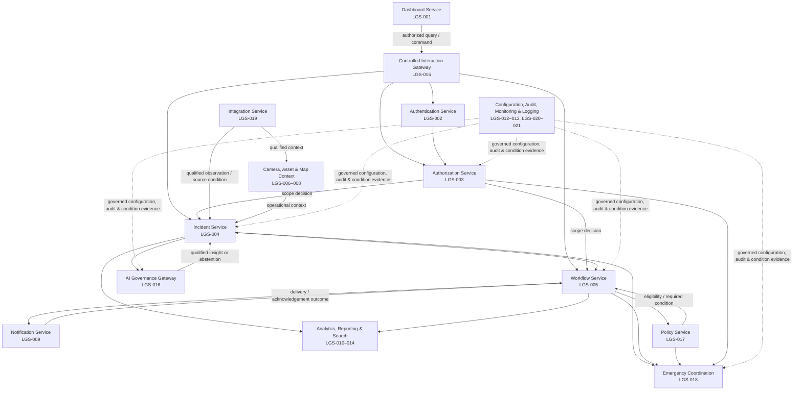
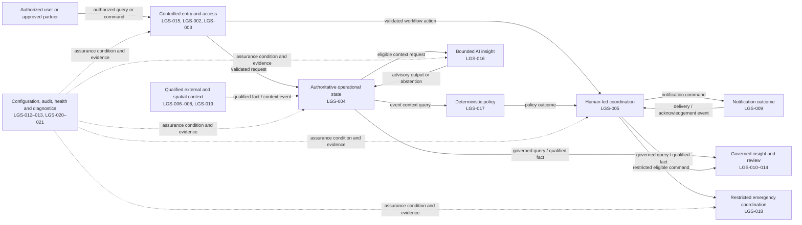

# TrafficMind AI
## Logical Architecture

### Business Domains, Logical Services, and Interaction Boundaries

**Document ID:** TMA-ARCH-002  
**Version:** 0.1 — Logical Architecture Draft  
**Date:** 27 July 2026  
**Owner:** Loopframe Labs / TrafficMind AI Architecture Team  
**Classification:** Internal — Architecture and Delivery Planning  
**Status:** Draft for architecture, product, security, data-governance, safety, and agency validation  
**Product:** TrafficMind AI  
**Primary operating context:** Coimbatore, Tamil Nadu, India  
**Parent architecture:** TMA-ARCH-001 — Master System Architecture

> **Document continuity notice:** This document is the second architecture artifact in the approved TrafficMind AI architecture set. It logically decomposes, and does not amend, the master architecture. Any material change to an approved scope boundary, authority model, architectural decision, or product constraint must be assessed and approved through the master architecture governance process.

---

# 1. Cover Page

TrafficMind AI is a human-governed urban traffic operating platform for authorized public-sector teams. The Logical Architecture defines the enduring business domains, logical service responsibilities, ownership boundaries, and interaction paths that organize the approved platform into coherent and governable capabilities.

It exists to make the approved architecture implementable without weakening its central operating principle: authorized public agencies and named human users retain decision-making and statutory authority. TrafficMind AI assembles authorized evidence, presents bounded operational context, supports approved workflows, records accountable decisions, and measures outcomes. It does not become a command system, external dispatcher, traffic-control actuator, enforcement tool, or autonomous decision-maker.

**Tagline:** *Predict. Optimize. Save Lives.*  
**Mission:** Build India’s most intelligent AI-powered Urban Traffic Operating Platform through trusted local data, explainable decision support, human-governed workflows, and measurable public outcomes.

---

# 2. Purpose

This document translates the approved Master System Architecture into a logical model of the platform. It identifies what the platform must logically do, which responsibility belongs to which business domain or logical service group, how responsibilities are separated, and how governed information and decisions move between those groups.

The Logical Architecture is intended to provide a stable common language for product, architecture, security, data-governance, safety, operational, and delivery stakeholders. It enables later detailed design to preserve the approved boundaries between observed evidence, inferred insight, verified operational event, policy decision, human approval, external agency action, and accountable record.

This document has the following purposes:

- Establish clear bounded responsibilities for the approved TrafficMind AI capabilities.
- Prevent duplication, ambiguous ownership, and inappropriate coupling across operational, policy, AI, integration, reporting, and assurance concerns.
- Define logical ownership and accountability boundaries without reallocating statutory authority or data ownership.
- Describe the approved communication paths and interaction patterns needed to support a shared, human-governed operational picture.
- Provide a logical basis for later detailed architecture, interface, data, security, test, and operational design artifacts.

This document does not authorize a deployment, integration, data use, workflow change, external action, or expansion of pilot scope.

---

# 3. Logical Service Catalogue

This catalogue is the quick-navigation index for the approved logical model. IDs are stable architecture references: they identify logical responsibilities, not implementation units, team names, or procurement packages.

| Domain ID | Logical domain | Service ID | Logical service group | Primary responsibility |
|---|---|---|---|---|
| DOM-001 | Experience and Access | LS-001 | Operational Experience | Present accessible, role-appropriate context, status, limitation, and permitted action. |
| DOM-001 | Experience and Access | LS-002 | Identity and Access Policy | Determine whether an approved user or service may access a protected view or perform a protected interaction. |
| DOM-002 | Operational Coordination | LS-003 | Operational Context and Event Management | Own authoritative operational events, evidence relationships, and qualified event state. |
| DOM-002 | Operational Coordination | LS-004 | Workflow and Coordination | Own the human-led lifecycle of verification, assignment, acknowledgement, handoff, approval, exception, and closure. |
| DOM-002 | Operational Coordination | LS-005 | Policy and Playbook Decisioning | Evaluate approved deterministic eligibility, priority, routing, and required-condition rules. |
| DOM-002 | Operational Coordination | LS-006 | Notification and Acknowledgement | Deliver permitted coordination communications and retain delivery and acknowledgement state. |
| DOM-003 | Intelligence and Context | LS-007 | Integration and Source Management | Admit, qualify, normalize, and monitor approved external information. |
| DOM-003 | Intelligence and Context | LS-008 | Spatial and Asset Context | Provide governed corridor, junction, route-segment, field, and asset interpretation context. |
| DOM-003 | Intelligence and Context | LS-009 | AI-Assisted Insight | Produce bounded, confidence-qualified, explainable, and suspendable advisory insight. |
| DOM-004 | Insight and Governance | LS-010 | Search, Analytics, and Reporting | Support controlled discovery, analysis, measurement, and disclosure. |
| DOM-004 | Insight and Governance | LS-011 | Configuration and Change Governance | Own governed configuration, version, feature-state, and controlled-change context. |
| DOM-004 | Insight and Governance | LS-012 | Audit and Assurance | Preserve protected accountability evidence for material activity and decisions. |
| DOM-004 | Insight and Governance | LS-013 | Service and Operational Observability | Qualify service, source, policy, model, workflow, and support condition. |
| DOM-005 | Restricted Emergency Coordination | LS-014 | Emergency Coordination | Support separately eligible, minimum-necessary, human-led emergency coordination. |

**Catalogue use:** A reference such as **DOM-002 / LS-004** denotes the Workflow and Coordination logical service group. IDs must be retained in subsequent architecture, governance, test, and traceability artifacts unless a formally approved architecture change replaces them.

---

# 4. Scope

## 4.1 In Scope

The Logical Architecture covers the approved pilot capabilities and their logical decomposition, including:

- Identity, access, purpose, and policy evaluation for authorized users and services.
- Operational event, evidence, source-health, corridor, junction, map, camera, field, and asset context.
- Human-led verification, assignment, acknowledgement, handoff, escalation, closure, and after-action workflow support.
- Policy-bound prioritization, playbook eligibility, notifications, and required human approval conditions.
- Bounded AI-assisted observations, forecasts, recommendations, confidence, provenance, explanation, abstention, and suspension.
- Authorized source and partner-system interaction, information validation, normalization, provenance, quality, and freshness handling.
- Governed analytics, reporting, search, audit, configuration, and assurance capabilities.
- The logical relationships through which these capabilities exchange approved requests, facts, decisions, status, and evidence references.

## 4.2 Out of Scope

This document does not define or alter:

- Product requirements, user-interface design, detailed workflows, operating procedures, or agency decision rights.
- Detailed solution, component, data, security, infrastructure, network, hosting, deployment, technology, or database design.
- Interface specifications, endpoint definitions, message contracts, schemas, integration mappings, or implementation code.
- Physical topology, environments, sizing, resilience mechanisms, monitoring tooling, or operational runbooks.
- Autonomous traffic-signal control, signal pre-emption, camera control, emergency dispatch, vehicle control, enforcement, facial recognition, biometric inference, identity tracking, or mass surveillance.
- Any unapproved city, agency, data source, workflow, AI use case, public service, or future integration.

The absence of a logical service from this document must not be interpreted as permission to introduce a new capability. New capability requires the applicable product, governance, security, privacy, safety, and architecture review.

---

# 5. Relationship with Master Architecture

TMA-ARCH-001, *Master System Architecture*, remains the authoritative architecture baseline. It establishes the vision, scope, constraints, principles, quality attributes, context, architecture style, core component catalogue, cross-cutting concerns, risks, and approved architecture decisions. This document is subordinate to that baseline.

The Master System Architecture answers **why the platform exists, what it may and may not do, and what architectural qualities and decisions govern it**. The Logical Architecture answers **how the approved business responsibilities are partitioned into coherent logical domains and how those domains collaborate without crossing authority or ownership boundaries**.

| Master architecture concern | Logical architecture treatment |
|---|---|
| Human-led decision support | Separates evidence, insight, policy, workflow, and human decision responsibilities so no logical service can turn advisory information into an external action. |
| Government authority and role scope | Defines policy and workflow boundaries that preserve agency, role, purpose, geography, assignment, and approval constraints. |
| Approved pilot capabilities | Groups approved capabilities into focused logical services; it neither adds new business capability nor broadens the pilot. |
| Modular, domain-oriented style | Uses bounded logical service groups with high cohesion, controlled collaboration, and explicit ownership. |
| AI governance and safe failure | Keeps bounded AI services separate from authoritative event, workflow, and agency-action decisions. |
| Data, security, privacy, and audit obligations | Treats assurance and governance as cross-cutting logical responsibilities applied to every interaction. |
| Integration isolation | Places authorized external-source variability behind a dedicated logical boundary before information may enter operational use. |

## 5.1 Master Architecture Traceability

The following references enable reviewers to navigate from a logical domain to the governing baseline in TMA-ARCH-001. They are traceability references, not reinterpretations of the master architecture.

| Logical domain | Governing Master System Architecture sections | Traceability intent |
|---|---|---|
| DOM-001 — Experience and Access | §6.2 Loose Coupling; §6.6 Zero Trust; §9.5 Authorized User Interaction; §10.1 Presentation Layer; §10.9 Security Layer; §12.1–12.3 Dashboard, Authentication, and Authorization Services | Preserves role-appropriate presentation and independently governed identity/access decisions. |
| DOM-002 — Operational Coordination | §6.7 Human-in-the-Loop; §9.1–9.5 Agency and authorized-user interactions; §10.3–10.4 Business and Workflow Layers; §12.4–12.5, §12.9, §12.17 Incident, Workflow, Notification, and Rule Engine Services | Preserves authoritative event state, human-led lifecycle, policy conditions, and coordination-only communication. |
| DOM-003 — Intelligence and Context | §6.8 Explainable AI; §6.11 Privacy by Design; §9.6–9.7 GIS and Camera/Field-System Interactions; §10.5–10.6 AI and Integration Layers; §12.6–12.8, §12.16, §12.19 Camera, Asset, Map, AI Gateway, and Integration Services | Preserves qualified source admission, governed context, bounded AI, provenance, and no-actuation boundaries. |
| DOM-004 — Insight and Governance | §6.12–6.15 Observability, Resilience, Configuration, and Open Standards; §9.9–9.12 Analytics, Audit, Reporting, and Notification interactions; §10.7, §10.10 Data and Monitoring Layers; §12.10–12.14, §12.20–12.21 Analytics, Reporting, Configuration, Audit, Search, Monitoring, and Logging Services; §13 Cross-Cutting Architecture | Preserves controlled measurement, configuration, accountability, health visibility, and governance evidence. |
| DOM-005 — Restricted Emergency Coordination | §2.3 Scope; §2.4 Out of Scope; §9.13 AI-Service Interaction; §12.18 Emergency Coordination Service; ADR-006 Human-in-the-Loop; ADR-007 Explainable AI | Preserves conditional eligibility, minimum-necessary information, human authority, manual fallback, and prohibition of dispatch or traffic actuation. |

Where this document appears to conflict with TMA-ARCH-001, the Master System Architecture prevails. No interpretation in this document changes the approved decisions recorded in TMA-ARCH-001.

---

# 6. Logical Architecture Principles

## 6.1 Business Capability Before Technical Structure

Logical boundaries are organized around durable business and operating responsibilities, not around screens, teams, vendors, data sources, or transient implementation choices. A logical service exists because it owns a coherent business responsibility with identifiable rules, outcomes, and accountability.

## 6.2 One Authoritative Responsibility

Each material business rule, operational state, policy outcome, and accountable record has one authoritative logical owner. Other services may consume an approved view or reference, but must not silently reproduce, override, or reinterpret the owning service’s responsibility.

## 6.3 High Cohesion and Bounded Responsibility

Each logical service group contains responsibilities that change for the same business reason. It must not become a general-purpose processing area for unrelated functions. A service group may coordinate with others, but it must not own their rules, state, or authority.

## 6.4 Separation of Evidence, Insight, and Authority

Observed evidence, source-quality information, inferred or AI-assisted insight, verified operational event, policy evaluation, human approval, and external agency action are distinct concepts. The logical architecture preserves these distinctions at every handoff. Inference is not verification; verification is not authorization; authorization is not execution.

## 6.5 Human Authority Is Non-Delegable

Logical services may prepare context, evaluate approved policy, guide workflow, and record decisions. They must not acquire statutory or operational authority from automation, role configuration, data availability, or an AI output. A human user with the appropriate existing agency authority remains accountable for material operational decisions.

## 6.6 Policy Is Explicit, Governed, and Explainable

Eligibility, access, priority, routing, notification, playbook, approval, and feature-state decisions must be traceable to approved policy. Policy must be applied consistently, version-aware, reviewable, and distinguishable from an operational fact or a human decision.

## 6.7 External Variability Is Contained

Authorized sources and partner systems are valuable but variable. Their availability, freshness, quality, and semantics must be assessed at the integration boundary. Core operational responsibilities must receive qualified information rather than unexamined external assertions.

## 6.8 Assurance Is a First-Class Responsibility

Identity, authorization, privacy, audit, configuration, observability, search controls, and governance are not optional utilities. They are logical responsibilities that apply across the platform and preserve public accountability.

## 6.9 Safe Restriction Is Preferable to False Certainty

When evidence, policy, authorization, auditability, or approved capability is unavailable, the logical outcome must be constrained, qualified, suppressed, or directed to the existing manual procedure. The architecture does not manufacture a complete operating picture from incomplete information.

## 6.10 Controlled Evolution Without Scope Drift

Logical boundaries support approved future extension, but a technically reusable service does not create permission for broader use. New users, geography, sources, models, workflow types, data classes, or external actions remain subject to formal approval.

---

# 7. Logical Design Objectives

The Logical Architecture is designed to achieve the following objectives.

| Objective | Logical design response |
|---|---|
| Create a trusted shared operational picture | Separate source qualification, evidence context, event management, and presentation responsibilities; preserve freshness, provenance, quality, and uncertainty. |
| Support accountable human-led coordination | Make workflow, approval, acknowledgement, handoff, exception, closure, and rationale explicit logical responsibilities. |
| Preserve public-sector authority boundaries | Centralize policy evaluation and prevent operational context, AI, notifications, or integration services from issuing external commands. |
| Enable safe use of bounded AI | Place AI assistance behind eligibility, input-quality, confidence, provenance, explainability, and human-verification boundaries. |
| Protect sensitive operational information | Apply identity, access, purpose, geography, classification, retention, and audit responsibilities consistently across logical interactions. |
| Make degraded conditions operationally visible | Treat source health, data quality, service availability, policy state, and pending outcomes as part of the logical operating context. |
| Allow independent evolution | Define collaboration through stable logical responsibilities and approved information exchanges, rather than shared internal state or duplicated rules. |
| Support defensible measurement and review | Separate governed analytical and reporting concerns from time-sensitive operational coordination while maintaining provenance and traceability. |
| Maintain a proportionate pilot | Retain a focused set of service groups that can be realized progressively without altering the logical boundaries or adding unapproved scope. |

---

# 8. Logical Service Classification

Logical services are classified by the nature of the responsibility they own. This is a logical taxonomy, not a prescription for implementation units, team structure, or physical separation.

| Classification | Purpose | Approved logical service groups |
|---|---|---|
| Experience and access | Present role-appropriate context and establish permitted participation. | Operational Experience; Identity and Access Policy |
| Core operational domain | Own the governed operational concepts and human-led lifecycle of traffic coordination. | Operational Context and Event Management; Workflow and Coordination |
| Decision support | Evaluate deterministic policy and provide bounded, non-authoritative assistance. | Policy and Playbook Decisioning; AI-Assisted Insight |
| Connectivity and context acquisition | Admit, qualify, normalize, and relate approved external information. | Integration and Source Management; Spatial and Asset Context |
| Engagement and communications | Deliver approved, role-scoped coordination communications and record their status. | Notification and Acknowledgement |
| Insight and disclosure | Produce controlled discovery, analytical, and reporting outcomes. | Search, Analytics, and Reporting |
| Governance and assurance | Preserve configuration control, accountability, operational visibility, and governance evidence. | Configuration and Change Governance; Audit and Assurance; Service and Operational Observability |
| Restricted conditional domain | Support a tightly bounded, separately eligible operational capability. | Emergency Coordination |

The classifications do not imply equal criticality. Emergency Coordination, for example, is a restricted conditional domain and remains disabled or inaccessible unless all approved eligibility conditions are active. Similarly, AI-Assisted Insight is optional to the core human-led workflow and may be suspended without removing evidence, manual coordination, or audit responsibilities.

---

# 9. High-Level Logical Architecture Overview

## 9.1 Logical Service Groups

The platform is logically organized into the service groups below. Together they form a controlled flow from authorized participation and qualified information, through operational context and human-led workflow, to governed communication, outcome insight, and accountable assurance.

| Logical service group | Primary responsibility | Logical ownership boundary | Interaction philosophy |
|---|---|---|---|
| DOM-001 / LS-001 — Operational Experience | Present role-appropriate operational, supervisory, administrative, analytical, security, and executive views. | Owns interaction composition and clear presentation of status, uncertainty, required action, and accessibility; does not own business rules or authority. | Requests approved context and actions through governing services; never bypasses policy or workflow controls. |
| DOM-001 / LS-002 — Identity and Access Policy | Establish permitted identity, access scope, and policy-based authorization. | Owns evaluation of identity assurance and approved role, agency, purpose, geography, assignment, classification, and delegation conditions. | Provides an authoritative access decision to all protected interactions; fails closed when assurance is inadequate. |
| DOM-002 / LS-003 — Operational Context and Event Management | Maintain authoritative operational events, evidence references, source qualifications, and relevant context. | Owns the distinction between candidate, observed, inferred, verified, duplicate, suppressed, closed, and historical event states. | Consumes qualified source and contextual information; exposes evidence-backed event context without assuming authority to act externally. |
| DOM-002 / LS-004 — Workflow and Coordination | Manage the human-led lifecycle of operational coordination. | Owns assignments, acknowledgements, verification tasks, handoffs, approvals, exceptions, escalation, closure, rationale, and manual-fallback references. | Uses policy outcomes and operational context to guide authorized users; does not replace agency procedures, dispatch, or command. |
| DOM-002 / LS-005 — Policy and Playbook Decisioning | Evaluate approved deterministic policy and playbook conditions. | Owns eligibility, prioritization, routing, required conditions, and explanation of the applied policy version. | Returns traceable decision-support outcomes; cannot create autonomous external actions or override human authority. |
| DOM-003 / LS-009 — AI-Assisted Insight | Produce bounded, qualified AI-assisted observations, estimates, forecasts, or recommendations. | Owns model eligibility, authorized input use, confidence, abstention, provenance, explanation, and suspension state. | Supplies advisory insight to eligible users and workflows; never owns event verification, authorization, or execution. |
| DOM-003 / LS-007 — Integration and Source Management | Govern the relationship with approved external sources and partner systems. | Owns source registration, identity validation, qualification, normalization, provenance, freshness, quality, rejection, and health state. | Contains external variability before information is used operationally; no unapproved outbound control path exists. |
| DOM-003 / LS-008 — Spatial and Asset Context | Provide approved geographic, corridor, junction, route-segment, camera, field, and asset context. | Owns the governed relationship of operational records to configured spatial and asset reference context. | Supplies context for interpretation; does not claim route clearance, alter a field device, or confer operational authority. |
| DOM-002 / LS-006 — Notification and Acknowledgement | Manage policy-bound communication and receipt/acknowledgement state. | Owns notification eligibility, recipient scope, escalation condition, delivery outcome, and acknowledgement record. | Supports coordination rather than dispatch or command; routing is governed by workflow and policy. |
| DOM-004 / LS-010 — Search, Analytics, and Reporting | Enable approved discovery, analysis, measurement, and disclosure. | Owns authorized retrieval, analytical result production, report composition, methodology and limitation presentation, and controlled output scope. | Operates separately from immediate coordination; results retain provenance and cannot become unsupported operational fact or public claim. |
| DOM-004 / LS-011 — Configuration and Change Governance | Manage approved non-code business configuration, policy versions, feature state, and change evidence. | Owns controlled change state, version identity, approval conditions, and rollback/suspension status. | Supplies governed configuration to other groups; no service may silently alter its own policy or operating boundary. |
| DOM-004 / LS-012 — Audit and Assurance | Preserve accountable, protected evidence of material system and operational activity. | Owns the immutable or protected record of access, decisions, approvals, changes, versions, exports, and material interaction outcomes. | Receives material facts from all groups; it is not a substitute for the authoritative operational record. |
| DOM-004 / LS-013 — Service and Operational Observability | Qualify platform, source, policy, model, and workflow health for support and safe use. | Owns health, freshness, quality, correlation, alert, operational-impact, and support-ownership signals. | Makes degradation visible without exposing unnecessary sensitive content or changing business state. |
| DOM-005 / LS-014 — Emergency Coordination | Support minimum-necessary, human-led coordination when separately eligible. | Owns restricted coordination record, eligibility enforcement, permitted context, acknowledgement, recovery, and manual-procedure fallback. | Remains isolated, restrictive, and conditional; it cannot dispatch, control signals, infer clear passage, or act without agency procedure. |

## 9.2 Domain-to-Domain Relationship Matrix

This matrix provides a quick navigation view of the permitted primary logical relationships. **P** indicates that the row domain provides governed context, policy, or evidence to the column domain; **R** indicates that the row domain requests or consumes such content from the column domain; **A** indicates accountability or condition signals flowing from the row domain to DOM-004. A blank cell means no primary direct relationship is assumed; collaboration is mediated by the owning domain.

| From / To | DOM-001 Experience & Access | DOM-002 Operational Coordination | DOM-003 Intelligence & Context | DOM-004 Insight & Governance | DOM-005 Emergency Coordination |
|---|---:|---:|---:|---:|---:|
| DOM-001 Experience & Access | — | R | R | R | R |
| DOM-002 Operational Coordination | P | — | R | A | P |
| DOM-003 Intelligence & Context | P | P | — | A | P |
| DOM-004 Insight & Governance | P | P | P | — | P |
| DOM-005 Emergency Coordination | P | R | R | A | — |

DOM-004 applies cross-cutting policy/configuration, accountability, and condition visibility to all domains; its presence in the matrix does not make it the owner of operational business state. DOM-005 is a conditional domain: relationships shown in the matrix exist only when its separate eligibility controls are active.

## 9.3 Experience and Access Group

The Experience and Access group comprises Operational Experience and Identity and Access Policy. It is the logical entry point for authorized human participation. Its purpose is to ensure that each user sees only the information, actions, and explanations appropriate to their approved responsibility and current operating context.

Operational Experience owns the presentation of the shared working picture: event status, evidence references, source health, confidence, limitations, assignments, notifications, reports, and required human action. It must distinguish observation from inference, inference from verification, and advisory guidance from an approved human decision. It does not embed policy, event-state, workflow, or source-processing logic. This prevents a role-specific view from becoming an uncontrolled source of authority.

Identity and Access Policy owns the interpretation of approved participation conditions. It does not decide what operational action should be taken; it determines whether a given user or service may access a protected view, record, function, or interaction in the current role, agency, purpose, geography, classification, assignment, and policy context. Its decisions are consumed by every protected logical group, ensuring that access is consistent rather than reimplemented locally.

## 9.4 Operational Coordination Group

The Operational Coordination group comprises Operational Context and Event Management, Workflow and Coordination, Policy and Playbook Decisioning, and Notification and Acknowledgement. It is the logical core of the approved pilot.

Operational Context and Event Management owns the authoritative operational representation of an event and its supporting evidence. It retains the meaningful distinctions between a reported or candidate condition, source observation, AI-assisted indication, verified event, duplicate, suppressed record, and closed record. It records evidence references, relevant freshness and quality qualifications, geographic context, and state necessary to reconstruct what was known. It does not own a human task lifecycle, determine access, or issue an external command.

Workflow and Coordination owns the controlled human lifecycle that surrounds an event: verification, assignment, acknowledgement, handoff, approvals, escalation, exception handling, closure, and after-action recording. This service group is where operator accountability and agency procedure are made explicit. It can require rationale, confirmation, policy conditions, or manual-procedure reference, but it never replaces the underlying statutory procedure or implies that a notification is a dispatch instruction.

Policy and Playbook Decisioning owns the deterministic interpretation of approved rules. It may classify an event’s priority, determine whether a workflow step is eligible, identify mandatory conditions, or establish an approved notification route. It returns an explainable policy outcome with a version reference. It does not own the event itself, decide facts from incomplete evidence, or perform an external action.

Notification and Acknowledgement owns the governed delivery of information to approved recipients and the record of delivery or acknowledgement. It receives a valid notification request from a permitted workflow and policy context; it does not independently decide operational urgency, recipients, or action. Acknowledgement is a coordination fact, not proof that an external action has occurred.

## 9.5 Intelligence and Context Group

The Intelligence and Context group comprises Integration and Source Management, Spatial and Asset Context, and AI-Assisted Insight. It converts authorized external information into qualified operational context without allowing source availability or algorithmic output to become ungoverned authority.

Integration and Source Management owns the controlled admission of authorized information. It evaluates source identity, contract conformance, permitted purpose, classification, integrity, freshness, duplicate or replay conditions, and basic quality before producing a qualified observation, evidence reference, or source-health state. It also makes rejection, quarantine, or degradation visible. This boundary protects operational services from external changes and prevents raw source assertions from being treated as validated operational truth.

Spatial and Asset Context owns the approved reference context that allows people to understand an event in place: configured corridors, junctions, zones, route segments, assets, field systems, and related municipal context. It provides interpretation support, not command. It must not infer a safe route, claim that an obstruction has cleared, or create permission to control a signal, camera, or other field device.

AI-Assisted Insight owns only bounded, approved decision-support outputs. Its responsibilities include model and use-case eligibility, minimum-necessary authorized inputs, input-quality checks, confidence qualification, abstention, provenance, explanation, model-version identity, monitoring signal, and independent suspension. Its output remains an advisory item until an authorized human verifies it through the governing workflow. AI-assisted insight neither creates an authoritative event nor modifies policy, access, or agency action.

## 9.6 Insight and Governance Group

The Insight and Governance group comprises Search, Analytics, and Reporting; Configuration and Change Governance; Audit and Assurance; and Service and Operational Observability. It ensures that the platform can be operated, reviewed, changed, measured, and defended without confusing retrospective insight with immediate operational truth.

Search, Analytics, and Reporting supports authorized discovery of approved records, reproducible analysis, and controlled reports. Search returns only content the requester is permitted to discover. Analytics produces qualified measurements, comparisons, trends, and data-quality results within approved methodology. Reporting creates controlled operational, executive, audit, and outcome views that identify their period, coverage, limitations, classification, and relevant approval state. These capabilities do not alter a live event or workflow simply because they surface a finding.

Configuration and Change Governance owns the approved configuration and decision context that logical services use: policy versions, thresholds, playbook versions, role mappings, source registrations, feature eligibility, report definitions, retention settings, and suspension state. It provides a controlled record of who changed what, under which review, and which version was active. Logical services consume this governed context; they do not change their own operating constraints without a controlled change.

Audit and Assurance owns the protected record needed to reconstruct material activity: access, decision, verification, approval, override, configuration, policy, model, integration, notification, export, and administrative facts. The audit record complements rather than replaces authoritative domain records. It establishes accountability across logical boundaries and acts as a safety gate for high-risk activities where durable evidence is required.

Service and Operational Observability owns the health and support signals that qualify whether other logical capabilities can be trusted for their intended purpose. It surfaces service condition, source freshness, quality indicators, workflow delays, policy or configuration anomalies, model health, security signals, and operational impact. It must preserve privacy and must not become an alternate operational record or an ungoverned data-extraction channel.

## 9.7 Restricted Emergency Coordination Group

Emergency Coordination is a separate logical group because its sensitivity, restricted information needs, operational consequences, and eligibility requirements exceed ordinary incident coordination. It is not a general escalation feature.

The group owns a restricted coordination record, active eligibility checks, role-scoped participation, permitted route and obstruction context, acknowledgement, recovery state, and protected audit evidence. It is available only when the approved standard operating procedure, data-sharing agreement, authorized roles, policy state, required context, and human authority conditions are all active.

Its interaction philosophy is deliberately restrictive. If an eligibility condition, audit path, required context, or approved participant is unavailable, the group must direct users to the existing manual emergency procedure. It cannot dispatch an emergency service, disclose clinical or patient information, activate traffic infrastructure, infer clear passage, or supersede agency command.

## 9.8 Separation of Concerns and Ownership Boundaries

The logical design prevents the following forms of inappropriate coupling:

| Concern | Authoritative logical owner | Explicitly not owned by |
|---|---|---|
| Source identity, quality, freshness, and normalization | Integration and Source Management | Event Management, AI-Assisted Insight, Operational Experience |
| Geographic and asset interpretation context | Spatial and Asset Context | Workflow, Notification and Acknowledgement |
| Operational event state and evidence relationship | Operational Context and Event Management | Search, Reporting, AI-Assisted Insight |
| Task, approval, handoff, and closure lifecycle | Workflow and Coordination | Operational Experience, Notification and Acknowledgement |
| Deterministic policy and playbook outcome | Policy and Playbook Decisioning | AI-Assisted Insight, Event Management |
| AI confidence, provenance, abstention, and model state | AI-Assisted Insight | Workflow, Policy and Playbook Decisioning |
| Who may view or act | Identity and Access Policy | Presentation, event, AI, reporting, and integration groups |
| Notification delivery and acknowledgement | Notification and Acknowledgement | Policy and Playbook Decisioning, Event Management |
| Analytical method and governed report composition | Search, Analytics, and Reporting | Operational Experience, Workflow and Coordination |
| Configuration, feature eligibility, and controlled change | Configuration and Change Governance | Any consuming logical service |
| Cross-boundary accountability evidence | Audit and Assurance | Any single operational domain |
| Health, freshness, and support visibility | Service and Operational Observability | Operational Experience, Event Management |

Business ownership remains with the relevant authorized agencies and programme stakeholders. The logical service ownership described here is ownership of information-processing and decision-support responsibility within TrafficMind AI; it does not transfer data ownership, operational command, statutory responsibility, or approval authority from Traffic Police, ICCC, CCMC, CSCL, emergency services, or another authorized agency.

## 9.9 Communication Paths and Interaction Patterns

Logical communication is governed by purpose, authorization, provenance, correlation, policy state, and audit requirements. A path may exchange a request for context, a state-changing workflow request, a qualified operational fact, a policy outcome, a bounded insight, a notification request, an assurance record, or a health signal. A path must never be interpreted as an unapproved external command path.

| Interaction pattern | Participating logical groups | Logical purpose and required behaviour |
|---|---|---|
| Authorized context request | Operational Experience ↔ Identity and Access Policy ↔ Operational Context and Event Management | Provide role- and purpose-scoped context. The response preserves source freshness, confidence, provenance, and any limitation relevant to safe use. |
| Qualified source admission | Authorized external source → Integration and Source Management → Operational Context and Event Management | Admit only authorized, valid, permitted, and qualified information. Invalid, stale, duplicated, or untrusted input is rejected, quarantined, or visibly qualified. |
| Context enrichment | Operational Context and Event Management ↔ Spatial and Asset Context | Relate an event to approved corridor, junction, asset, or map context. Enrichment changes interpretation, not agency authority or field-device state. |
| Human-led workflow command | Authorized user → Operational Experience → Identity and Access Policy → Workflow and Coordination | Record a requested verification, assignment, acknowledgement, handoff, approval, exception, or closure only when the user, role, event state, and policy permit it. |
| Policy evaluation | Workflow and Coordination or Operational Context and Event Management ↔ Policy and Playbook Decisioning | Obtain a deterministic, explainable eligibility, priority, route, or required-condition result. A policy result guides but does not replace an authorized human decision. |
| Bounded AI assistance | Operational Context and Event Management or Workflow and Coordination ↔ AI-Assisted Insight | Request an eligible advisory output using approved context. The result includes confidence, provenance, limitations, and abstention; it returns to human verification rather than an action path. |
| Coordination notification | Workflow and Coordination → Notification and Acknowledgement | Deliver a policy-approved communication to role-scoped recipients and record delivery or acknowledgement condition. It does not constitute dispatch, command, or proof of external completion. |
| Measurement and review | Operational Context and Event Management, Workflow and Coordination, and qualified context → Search, Analytics, and Reporting | Produce authorized discovery, analysis, and reports while preserving methodology, scope, limitations, and access control. Analytical output does not retroactively rewrite an authoritative operational record. |
| Controlled configuration use | Configuration and Change Governance → all consuming logical groups | Supply approved versions of policy, playbooks, role mappings, source registrations, thresholds, feature eligibility, and other controlled configuration. Consumers identify the active version in material outcomes. |
| Accountability evidence | All material logical groups → Audit and Assurance | Record material access, state changes, policy/model/configuration version, approval, override, export, and outcome facts with attributable context. |
| Condition and degradation signal | All logical groups → Service and Operational Observability → Operational Experience and support roles | Make health, freshness, quality, audit, policy, model, and dependency conditions visible to appropriate users. Degradation constrains use; it does not conceal uncertainty. |
| Restricted emergency coordination | Workflow and Coordination ↔ Emergency Coordination ↔ Identity and Access Policy / Policy and Playbook Decisioning / Notification and Acknowledgement | Support only a separately eligible, minimum-necessary coordination process. Missing eligibility redirects to the manual emergency procedure and prevents restricted functionality. |

The preferred interaction philosophy is **request context from the authoritative owner, submit a command to the authoritative lifecycle owner, publish a qualified fact only after validation, and record every material outcome for accountability**. Logical services should not communicate through shared hidden state, direct manipulation of another service’s records, or duplicated business rules.

## 9.10 Logical Interaction Guardrails

The following guardrails apply to every interaction path:

- A source observation must retain its source, time, quality, freshness, and provenance; it must not be silently upgraded to a verified event.
- A bounded AI output must remain distinguishable from observed evidence, deterministic policy, and human verification.
- A workflow outcome must be attributable to an authorized human actor when it represents verification, approval, override, assignment, handoff, or closure.
- A notification request must originate from a permitted workflow and policy condition; delivery does not prove external action or completion.
- An analytical result or report must identify its scope, methodology, coverage, limitations, and approval state where relevant.
- An unavailable, stale, conflicting, unauthorized, or un-auditable dependency must produce an explicit restricted or degraded state rather than a misleading success outcome.
- No logical interaction permits direct traffic-control actuation, camera control, emergency dispatch, enforcement, or other prohibited external action.

---

# 10. Business Domains

## 10.1 Domain Model and Use

This section defines the finer-grained business domains within the logical architecture. These business domains are a navigation and responsibility view; they do not replace the five logical domains (`DOM-001` to `DOM-005`) or the logical service ownership model (`LS-001` to `LS-014`) defined earlier in this document.

A business domain may be realized by one logical service group or may be a bounded business concern shared across several logical service groups. The distinction is intentional: business domains make operational responsibility intelligible to agency and programme stakeholders, while logical services preserve the platform’s processing and accountability boundaries.

| Business domain ID | Business domain | Primary logical alignment |
|---|---|---|
| BDM-001 | Traffic Operations | DOM-002 / LS-003 and LS-004 |
| BDM-002 | Incident Management | DOM-002 / LS-003 and LS-004 |
| BDM-003 | AI Intelligence | DOM-003 / LS-009 |
| BDM-004 | Identity | DOM-001 / LS-002 |
| BDM-005 | Security | Cross-cutting; principally DOM-001 / LS-002, DOM-004 / LS-012 and LS-013 |
| BDM-006 | Configuration | DOM-004 / LS-011 |
| BDM-007 | Notification | DOM-002 / LS-006 |
| BDM-008 | Reporting | DOM-004 / LS-010 |
| BDM-009 | Administration | DOM-001 / LS-001; DOM-004 / LS-011–LS-013 |
| BDM-010 | Analytics | DOM-004 / LS-010 |
| BDM-011 | Audit | DOM-004 / LS-012 |
| BDM-012 | Governance | DOM-004 / LS-011–LS-013; cross-cutting policy and assurance |
| BDM-013 | Maps | DOM-003 / LS-008 |
| BDM-014 | GIS | DOM-003 / LS-007 and LS-008 |
| BDM-015 | Policy | DOM-002 / LS-005; DOM-004 / LS-011 |
| BDM-016 | Emergency Coordination | DOM-005 / LS-014 |

The domain model does not grant business ownership to TrafficMind AI. Public-sector agencies retain their existing statutory authority, operational command, data ownership, and approval rights. “Logical ownership” below means ownership of the platform responsibility that supports the domain.

## 10.2 BDM-001 — Traffic Operations

**Purpose:** Provide the governed shared operational picture through which authorized teams understand changing road conditions, source status, verified events, operational context, and active coordination work.

**Responsibilities:** Assemble approved traffic, disruption, field, source-health, corridor, junction, and asset context; present current and qualified operational status; retain clear distinctions between observed, inferred, verified, and unavailable information; support authorized operational awareness.

**Logical ownership:** Operational Context and Event Management (`DOM-002 / LS-003`) owns the authoritative operational representation. Operational Experience (`DOM-001 / LS-001`) owns role-appropriate presentation. TrafficMind AI does not own traffic command or agency operating decisions.

**Business capabilities:** Shared operating picture; corridor and junction awareness; source-health visibility; operational prioritization context; role-scoped status views; manual-fallback awareness.

**Domain boundaries:** Does not dispatch personnel, control signals or cameras, set traffic rules, enforce violations, provide consumer routing, or convert an advisory condition into an external action.

**Relationships:** Consumes qualified information from GIS, Maps, and Integration; shares verified operational context with Incident Management, Notification, Analytics, Reporting, and Emergency Coordination where eligible.

**Dependencies:** Authorized source information; geographic and asset context; Identity and Security controls; Policy; configuration; auditability; health and freshness signals.

**Isolation rules:** External-source failure, AI degradation, analytical delay, or notification failure must not overwrite the last qualified operational state or imply a current condition. Traffic Operations must show degraded or stale context rather than fabricate completeness.

## 10.3 BDM-002 — Incident Management

**Purpose:** Support the accountable lifecycle of a traffic-related incident or disruption from candidate identification through verification, coordination, handoff, closure, and after-action record.

**Responsibilities:** Maintain event state and evidence relationships; prevent duplicate or conflicting event handling; manage verification, ownership, assignment, acknowledgement, escalation, handoff, rationale, exception, closure, and recovery steps; retain human decisions and required policy conditions.

**Logical ownership:** Operational Context and Event Management (`DOM-002 / LS-003`) owns the authoritative event record. Workflow and Coordination (`DOM-002 / LS-004`) owns the controlled human-led lifecycle. Traffic Police, ICCC, and other authorized agencies retain operational authority for their decisions.

**Business capabilities:** Candidate-event capture; evidence review; verification; ownership assignment; inter-agency handoff; controlled closure; post-incident reconstruction; manual-procedure reference.

**Domain boundaries:** Does not treat a source observation, AI output, notification delivery, or analytical finding as a verified incident. It does not dispatch emergency services, create statutory authority, or execute external commands.

**Relationships:** Uses Traffic Operations context, GIS and Maps context, Policy conditions, AI Intelligence where eligible, Notification delivery, Audit evidence, and Reporting/Analytics outputs. It is the primary initiating domain for ordinary coordination communications.

**Dependencies:** Authorized identity and access; qualified evidence; workflow configuration; policy/playbook versions; durable audit; source and service-health visibility.

**Isolation rules:** Incident state is authoritative only within this domain. Other domains may reference it but must not alter its lifecycle directly. If policy, audit, or essential context is unavailable, the domain restricts the affected transition and directs the user to approved fallback.

## 10.4 BDM-003 — AI Intelligence

**Purpose:** Provide approved, bounded, explainable AI-assisted observations, estimates, forecasts, or recommendations that improve human situational awareness without becoming an autonomous authority.

**Responsibilities:** Determine use-case and model eligibility; accept only authorized and minimum-necessary input context; assess input quality; produce confidence-qualified outputs; abstain where evidence is insufficient; retain provenance, explanation, limitation, model identity, and suspension state.

**Logical ownership:** AI-Assisted Insight (`DOM-003 / LS-009`) owns the bounded AI responsibility. It does not own event verification, access policy, workflow approval, agency decision-making, or external action.

**Business capabilities:** Candidate observation support; bounded forecasting; confidence and uncertainty display; explainability; model-use traceability; independent capability suspension; evidence-only fallback.

**Domain boundaries:** Excludes unbounded generative advice, facial recognition, biometric inference, person or vehicle identity tracking, automated enforcement, direct control, and any output that bypasses human verification or approved playbooks.

**Relationships:** Consumes authorized operational and contextual input; returns advisory output to Traffic Operations and Incident Management through approved policy and workflow conditions; supplies model-use facts to Audit, Governance, and Observability.

**Dependencies:** Approved AI use case and policy; authorized data; source freshness and quality; configuration; identity/access control; auditability; model-health visibility.

**Isolation rules:** AI output must remain separately identifiable from evidence and verified event state. AI unavailability, low confidence, policy suspension, or quality failure results in abstention or evidence-only/manual workflow, not degraded autonomous behaviour.

## 10.5 BDM-004 — Identity

**Purpose:** Establish the trusted identity context from which permitted human and service participation can be evaluated.

**Responsibilities:** Consume approved identity assurance; maintain the logical identity context required for role, agency, assignment, purpose, geography, classification, and time-bound delegation evaluation; distinguish ordinary and privileged participation conditions.

**Logical ownership:** Identity and Access Policy (`DOM-001 / LS-002`) owns the platform’s logical identity and access evaluation responsibility. The approved enterprise identity authority remains external to TrafficMind AI.

**Business capabilities:** Authenticated participation; role and agency context; purpose and assignment context; restricted-function assurance; access expiry and reauthorization handling; attributable interaction identity.

**Domain boundaries:** Does not grant statutory authority, decide incident priority, authorize an external agency action, define operational policy, or own user-interface content.

**Relationships:** Provides verified participation context to every protected business domain, especially Incident Management, Security, Administration, Audit, Policy, and Emergency Coordination.

**Dependencies:** Approved identity authority; governed role and attribute configuration; Security controls; Audit; relevant policy state; service-health condition.

**Isolation rules:** Identity context may be consumed but not locally reinterpreted as broader privilege. Failed or insufficient identity assurance blocks protected interaction; no domain may substitute a cached or inferred identity for a high-risk decision.

## 10.6 BDM-005 — Security

**Purpose:** Preserve the confidentiality, integrity, availability, and accountable use of TrafficMind AI’s approved operational information and functions.

**Responsibilities:** Apply least-privilege participation, purpose limitation, protected administrative conditions, integrity controls, security-event visibility, sensitive-information safeguards, access review evidence, and safe denial of prohibited activity.

**Logical ownership:** Security is cross-cutting. Identity and Access Policy (`LS-002`) owns access evaluation; Audit and Assurance (`LS-012`) owns accountability evidence; Service and Operational Observability (`LS-013`) owns security-condition visibility; Configuration and Change Governance (`LS-011`) owns controlled security-relevant configuration. Enterprise security authority remains with the approved security and agency governance functions.

**Business capabilities:** Protected access; privileged-action safeguards; sensitive-context restriction; security-condition awareness; accountable exception handling; controlled security review support.

**Domain boundaries:** Does not own the operational event lifecycle, determine traffic response, become a general surveillance capability, or expose protected data for convenience or support diagnosis.

**Relationships:** Constrains every domain; receives material access, configuration, workflow, integration, and export facts for assurance; informs Governance and Administration of relevant security conditions.

**Dependencies:** Identity context; approved policy; controlled configuration; audit evidence; observability; data classification and retention decisions; agency security governance.

**Isolation rules:** A security-control failure must constrain protected activity rather than allow bypass. Security signals do not independently change an operational event; they inform authorized review and the relevant controlled response.

## 10.7 BDM-006 — Configuration

**Purpose:** Maintain the controlled business settings, versions, eligibility states, and reference conditions that allow the platform to operate consistently under approved governance.

**Responsibilities:** Manage policy versions, playbook references, thresholds, role mappings, source registrations, geographic scopes, report definitions, retention settings, feature eligibility, and approved suspension or rollback state.

**Logical ownership:** Configuration and Change Governance (`DOM-004 / LS-011`) owns configuration state and controlled-change evidence. Domain owners and authorized governance roles approve the business meaning of changes within their authority.

**Business capabilities:** Versioned configuration; controlled activation; change review; traceable rollback; source onboarding state; feature eligibility; local policy adaptation.

**Domain boundaries:** Does not directly own operational events, execute workflow decisions, create external authority, or alter a logical domain’s state without that domain’s governed processing.

**Relationships:** Supplies controlled context to all domains, particularly Identity, Policy, AI Intelligence, GIS, Reporting, Administration, Governance, and Emergency Coordination; publishes change facts to Audit and Observability.

**Dependencies:** Authorized administrative identity; approval process; Audit; Governance; policy ownership; service-health visibility.

**Isolation rules:** No consuming domain may silently change, override, or locally fork approved configuration. Changes that affect high-risk scope, emergency eligibility, access, retention, or AI use require the applicable controlled approval and attributable evidence.

## 10.8 BDM-007 — Notification

**Purpose:** Support timely, policy-bound coordination communication among approved participants and retain the delivery and acknowledgement facts needed by the workflow.

**Responsibilities:** Determine permitted recipient scope from a valid workflow request; apply approved communication conditions; convey relevant notification context; record delivery state, acknowledgement, failure, escalation condition, and fallback requirement.

**Logical ownership:** Notification and Acknowledgement (`DOM-002 / LS-006`) owns notification and acknowledgement state. Workflow and Coordination (`LS-004`) owns the business request and operational lifecycle that justify a notification.

**Business capabilities:** Role-scoped alerting; acknowledgement capture; escalation support; delivery-status visibility; controlled communication history; fallback prompting.

**Domain boundaries:** Does not determine incident truth, independently select an operational response, dispatch a service, confer authority, or prove that a recipient performed an external action.

**Relationships:** Receives permitted requests from Incident Management and Emergency Coordination; evaluates Identity and Policy conditions; supplies delivery facts to Traffic Operations, Audit, Observability, and Reporting.

**Dependencies:** Valid workflow state; policy; recipient identity and access context; approved configuration; auditability; communication-path health.

**Isolation rules:** Notification failure must be explicit and must invoke approved fallback; it cannot be masked as successful coordination. Notification content is restricted to the recipient’s permitted purpose and classification.

## 10.9 BDM-008 — Reporting

**Purpose:** Produce governed operational, executive, audit, and outcome reports that support accountable review without turning reporting into unrestricted disclosure or unsupported public claims.

**Responsibilities:** Compose approved report views; apply audience, period, scope, classification, methodology, limitation, and approval context; control authorized release and export; retain report provenance.

**Logical ownership:** Search, Analytics, and Reporting (`DOM-004 / LS-010`) owns controlled report composition and delivery. Business owners and authorized agencies remain accountable for the use and approval of report content.

**Business capabilities:** Operational status reports; executive review; audit evidence packs; outcome reporting; controlled export; coverage and limitation disclosure.

**Domain boundaries:** Does not modify operational records, create a new decision, override data ownership, or represent estimates as verified public outcomes without approved methodology and review.

**Relationships:** Consumes authorized Incident Management, Traffic Operations, Analytics, Audit, Governance, and configuration context; makes reports available through Identity and Security controls.

**Dependencies:** Authorized data access; Analytics; policy and report configuration; auditability; classification; retention; approved methodology and review conditions.

**Isolation rules:** Reporting has a read-oriented relationship with operational domains. It must not become an alternate workflow channel or a means to bypass access controls, source limitations, or data-retention policy.

## 10.10 BDM-009 — Administration

**Purpose:** Enable authorized stewardship of the platform’s approved business configuration, access context, support condition, and governance evidence.

**Responsibilities:** Support controlled administration of roles and approved attributes, configuration requests, source registrations, feature state, report definitions, support triage, review evidence, and documented administrative actions.

**Logical ownership:** Operational Experience (`DOM-001 / LS-001`) owns appropriate administrative views; Configuration and Change Governance (`DOM-004 / LS-011`) owns controlled state; Audit and Assurance (`LS-012`) and Service and Operational Observability (`LS-013`) own administration evidence and condition visibility.

**Business capabilities:** Controlled change initiation; administrative review; access administration support; source and feature stewardship; support visibility; accountable administration.

**Domain boundaries:** Does not grant administrators unrestricted access to operational or restricted content, permit self-approval of high-risk changes, replace agency authority, or create unreviewed changes to policy or emergency eligibility.

**Relationships:** Uses Identity and Security for privileged participation; invokes Configuration, Governance, Audit, Observability, Reporting, and the affected business domain’s approval path.

**Dependencies:** Privileged identity assurance; separation-of-duty policy; approved change governance; audit availability; support condition; named accountable owners.

**Isolation rules:** Administration is separated from ordinary operational coordination. Privileged functions require attributable, policy-scoped use and must not silently bypass workflow, audit, or approval conditions.

## 10.11 BDM-010 — Analytics

**Purpose:** Produce reproducible, governed measurement and insight from approved operational information to support pilot baselines, outcome review, data-quality assessment, and learning.

**Responsibilities:** Apply approved analytical methodology; retain input coverage, lineage, period, assumptions, and limitations; produce data-quality indicators, comparisons, trends, and outcome measures; distinguish analysis from real-time operational fact.

**Logical ownership:** Search, Analytics, and Reporting (`DOM-004 / LS-010`) owns the governed analytical responsibility. Domain owners and agency stakeholders approve the relevant measure definitions and interpretation.

**Business capabilities:** Baseline measurement; trend analysis; quality assessment; pilot outcome evaluation; comparative analysis; reproducible evidence.

**Domain boundaries:** Does not independently change an event state, drive an immediate operational command, make unqualified safety or congestion claims, or ingest prohibited information solely for analytical convenience.

**Relationships:** Consumes qualified information from Traffic Operations, Incident Management, GIS, Maps, Audit, and Configuration; supplies governed results to Reporting, Governance, and authorized users.

**Dependencies:** Approved data use; methodology configuration; data quality and provenance; Identity and Security; audit evidence; retention and classification policy.

**Isolation rules:** Analytical processing and results remain distinct from immediate coordination. Delayed, partial, or changed methodology must be visible; it must not silently rewrite operational history or produce claims beyond its evidence.

## 10.12 BDM-011 — Audit

**Purpose:** Provide the protected accountability record required to reconstruct material platform and operational activity.

**Responsibilities:** Record attributable access, verification, decision, approval, override, configuration, policy, model, integration, notification, export, and administrative facts; preserve time, correlation, relevant version, and integrity context; support authorized review.

**Logical ownership:** Audit and Assurance (`DOM-004 / LS-012`) owns the protected audit responsibility. Each business domain remains accountable for emitting complete and meaningful material facts from its own activity.

**Business capabilities:** Decision reconstruction; access accountability; change traceability; investigation support; compliance review; evidence retention; controlled audit inquiry.

**Domain boundaries:** Does not become the authoritative operational event store, determine policy, alter an event, or expose sensitive content to unauthorized reviewers.

**Relationships:** Receives material facts from all domains; supports Security, Governance, Administration, Reporting, and authorized agency review; shares audit-availability condition with operational domains.

**Dependencies:** Attributable identity; time and correlation context; controlled configuration; integrity protection; retention and access policy; observability.

**Isolation rules:** Ordinary domains cannot alter or erase protected audit evidence. When required auditability is unavailable, high-risk decisions, configuration changes, approvals, and exports must be constrained according to approved policy.

## 10.13 BDM-012 — Governance

**Purpose:** Ensure the platform remains within approved public-interest, scope, safety, privacy, security, data, change, and operating boundaries throughout its lifecycle.

**Responsibilities:** Maintain reviewable policy and configuration context; expose change, risk, audit, model, source, and service evidence; support accountable approvals and scope control; retain the basis for restriction, suspension, or escalation.

**Logical ownership:** Governance is cross-cutting and is enabled by Configuration and Change Governance (`LS-011`), Audit and Assurance (`LS-012`), and Service and Operational Observability (`LS-013`). Formal governance decisions remain with the named authorized product, architecture, security, privacy, AI/safety, and agency authorities.

**Business capabilities:** Scope control; decision traceability; change governance; policy stewardship; assurance review; risk visibility; controlled exception and suspension support.

**Domain boundaries:** Does not replace agency command, operational workflow, statutory approval, or detailed legal, procurement, safety, privacy, or security review. It provides the evidence and controls needed for those decisions.

**Relationships:** Governs the allowed operation of every domain; consumes Audit, Observability, Configuration, Analytics, Reporting, Security, and AI Intelligence evidence; authorizes or constrains controlled changes through approved processes.

**Dependencies:** Named accountable roles; approved policy; controlled configuration; protected audit; observable condition; risk and review processes; evidence from affected domains.

**Isolation rules:** Governance must not become an informal route around defined authority or controlled change. A governance view can reveal risk or non-compliance, but operational and statutory actions remain with the appropriate authorized owner.

## 10.14 BDM-013 — Maps

**Purpose:** Present approved map-based operational context that helps authorized users interpret events, corridors, junctions, route segments, assets, and source coverage.

**Responsibilities:** Relate approved operational information to configured spatial reference context; present area, corridor, junction, route-segment, asset, and relevant operational overlays; preserve source, version, scope, and limitation context.

**Logical ownership:** Spatial and Asset Context (`DOM-003 / LS-008`) owns the logical map-context responsibility. Operational Experience (`LS-001`) owns its role-appropriate presentation.

**Business capabilities:** Spatial situational awareness; event localization; corridor context; asset association; approved operational overlays; location-based interpretation.

**Domain boundaries:** Does not create routing instructions, assert a route is clear, control a map source, operate a field device, or independently alter event state.

**Relationships:** Receives governed GIS and asset reference context; serves Traffic Operations, Incident Management, Emergency Coordination, Reporting, and Analytics.

**Dependencies:** Approved GIS reference context; source qualification; Identity and Security; configuration; data-quality and freshness state.

**Isolation rules:** Map presentation is an interpretation aid, not a source of authority. A missing or outdated spatial layer must be identified as limited rather than silently substituted with unverified context.

## 10.15 BDM-014 — GIS

**Purpose:** Govern the spatial reference context that relates operational information to approved locations, boundaries, corridors, junctions, route segments, and relevant assets.

**Responsibilities:** Qualify authorized geographic information; maintain configured spatial scope and reference relationships; preserve spatial source, version, coverage, and refresh qualification; support permitted geographic scoping.

**Logical ownership:** Integration and Source Management (`DOM-003 / LS-007`) owns qualification of authorized spatial input. Spatial and Asset Context (`DOM-003 / LS-008`) owns its approved operational use and relationship to platform context.

**Business capabilities:** Geographic reference management; operational-area definition; corridor and junction association; geography-based access and policy context; spatial coverage qualification.

**Domain boundaries:** Does not own traffic-control geometry, public navigation, property decisions, field-device actuation, or agency boundary authority beyond approved configured reference use.

**Relationships:** Provides contextual input to Maps, Traffic Operations, Incident Management, Policy, Identity access scoping, Analytics, Reporting, and Emergency Coordination where separately eligible.

**Dependencies:** Authorized GIS sources; source agreement; configuration; data classification; Identity and Security; provenance and freshness visibility.

**Isolation rules:** GIS updates must be qualified before they influence operational context or geographic scope. GIS context must not be used to infer operational clearance, authority, or unrestricted access outside approved policy.

## 10.16 BDM-015 — Policy

**Purpose:** Apply approved, deterministic rules and playbooks that guide access, prioritization, eligibility, routing, required workflow conditions, and safe restriction.

**Responsibilities:** Evaluate policy using approved event, user, source, geography, configuration, and workflow context; return a traceable outcome with the applied rule or playbook version; identify unmet conditions and out-of-policy requests.

**Logical ownership:** Policy and Playbook Decisioning (`DOM-002 / LS-005`) owns runtime deterministic evaluation. Configuration and Change Governance (`DOM-004 / LS-011`) owns controlled policy version state. Authorized policy owners retain responsibility for policy content and approval.

**Business capabilities:** Eligibility evaluation; priority classification; workflow gating; notification routing; feature restriction; required-condition explanation; policy-version traceability.

**Domain boundaries:** Does not verify an incident, infer facts, replace professional judgment, change statutory procedure, or execute an external action. Policy outcomes guide authorized people and workflow only.

**Relationships:** Consumes Identity, Incident Management, Traffic Operations, GIS, Configuration, and security context; serves Workflow, Notification, AI Intelligence, Administration, Governance, and Emergency Coordination.

**Dependencies:** Approved and active policy version; trusted context; configuration integrity; identity/access context; auditability; relevant service-health condition.

**Isolation rules:** Policy logic is not duplicated in presentation, integration, AI, or reporting domains. When necessary context or policy integrity is unavailable, the outcome must restrict the affected action or direct the user to the approved manual procedure.

## 10.17 BDM-016 — Emergency Coordination

**Purpose:** Support a separately approved, minimum-necessary, human-led coordination process for an eligible emergency movement or related restricted traffic-operational context.

**Responsibilities:** Enforce active eligibility; maintain restricted coordination records; apply permitted role, purpose, agency, geography, and data constraints; manage acknowledgement and recovery state; provide protected evidence and manual-fallback direction.

**Logical ownership:** Emergency Coordination (`DOM-005 / LS-014`) owns the restricted platform responsibility. Emergency services, Traffic Police, ICCC, and other authorized agencies retain all statutory and operational command responsibilities.

**Business capabilities:** Eligibility confirmation; restricted context view; agency acknowledgement; controlled coordination status; recovery confirmation; manual-procedure fallback; enhanced accountability.

**Domain boundaries:** Does not dispatch emergency resources, disclose patient or clinical information, activate signal priority, control traffic infrastructure, infer clear passage, issue operational command, or override existing emergency procedures.

**Relationships:** Uses Incident Management, Traffic Operations, Maps/GIS, Identity, Security, Policy, Notification, Audit, Governance, and Observability; supplies only restricted, role-scoped status to authorized users.

**Dependencies:** Active approved procedure; data-sharing authority; restricted roles; valid emergency eligibility; permitted geographic context; policy; notification path; audit availability; health visibility.

**Isolation rules:** This domain is disabled by default unless every approved eligibility condition is satisfied. Failure of a required condition immediately restricts the domain and directs users to the existing manual procedure; no partial automation or inferred emergency action is permitted.

## 10.18 Domain Responsibility Matrix

The matrix identifies the principal business accountability for each capability. **A** = accountable logical owner; **R** = responsible contributing domain; **C** = consulted or governing domain; **I** = informed through approved context or evidence. It does not change agency authority or formal approval rights.

| Business capability | Traffic Ops | Incident Mgmt | AI Intel | Identity | Security | Config | Notify | Reporting | Admin | Analytics | Audit | Governance | Maps | GIS | Policy | Emergency |
|---|---:|---:|---:|---:|---:|---:|---:|---:|---:|---:|---:|---:|---:|---:|---:|
| Shared operational picture | A | R | I | C | C | C | I | I | I | I | I | I | R | R | C | I |
| Candidate-to-closed event lifecycle | R | A | I | C | C | C | R | I | I | I | R | I | R | R | R | C |
| Human verification, handoff, approval, and closure | R | A | I | C | C | C | R | I | I | I | R | C | I | I | R | C |
| Bounded AI-assisted insight | R | R | A | C | C | C | I | I | I | I | R | C | R | R | C | I |
| Access and participation evaluation | I | I | I | A | R | C | I | I | R | I | R | C | I | C | R | C |
| Security restriction and accountable protection | I | I | I | R | A | R | I | I | R | I | R | C | I | I | R | C |
| Controlled configuration and feature state | I | I | I | C | C | A | I | C | R | C | R | C | C | C | R | C |
| Policy and playbook evaluation | R | R | C | R | C | R | I | I | I | I | R | C | R | R | A | R |
| Coordination communication and acknowledgement | I | R | I | C | C | C | A | I | I | I | R | I | I | I | R | R |
| Spatial and geographic context | R | R | I | C | C | C | I | I | I | R | I | I | A | R | R | R |
| Controlled analytics and outcome measurement | R | R | I | C | C | C | I | R | I | A | R | C | R | R | I | I |
| Controlled reports and disclosure | I | I | I | C | C | C | I | A | R | R | R | C | I | I | I | I |
| Protected accountability evidence | R | R | R | R | C | R | R | R | R | R | A | C | R | R | R | R |
| Governance, review, and scope-control evidence | I | I | R | C | R | R | I | R | R | R | R | A | I | I | R | R |
| Restricted emergency coordination | R | R | I | C | C | C | R | I | I | I | R | C | R | R | R | A |

## 10.19 Domain Interaction Matrix

The matrix below records the primary permitted logical relationships between business domains. It is intentionally concise: blank intersections mean no primary direct relationship should be assumed. **C** = governed context supplied; **W** = workflow or decision-support collaboration; **E** = accountable evidence or condition signal; **R** = restricted, separately eligible relationship.

| From / To | Traffic Ops | Incident Mgmt | AI Intel | Identity | Security | Config | Notify | Reporting | Admin | Analytics | Audit | Governance | Maps | GIS | Policy | Emergency |
|---|---:|---:|---:|---:|---:|---:|---:|---:|---:|---:|---:|---:|---:|---:|---:|
| Traffic Operations | — | C | C |  | E | C | C | C |  | C | E | E | C | C | W | R |
| Incident Management | C | — | W |  | E | C | W | C |  | C | E | E | C | C | W | R |
| AI Intelligence | C | C | — |  | E | C |  |  |  |  | E | E | C | C | W |  |
| Identity |  |  |  | — | W | C | C | C | W | C | E | E |  | C | W | R |
| Security | E | E | E | W | — | W | E | E | W | E | E | E | E | E | W | R |
| Configuration | C | C | C | C | C | — | C | C | W | C | E | E | C | C | C | R |
| Notification | C | C |  | C | E | C | — |  |  |  | E | E |  |  | W | R |
| Reporting |  | C |  | C | E | C |  | — | C | W | C | E | C | C |  |  |
| Administration |  |  |  | W | W | W |  | C | — |  | E | W |  |  | C |  |
| Analytics | C | C |  | C | E | C |  | W |  | — | C | E | C | C |  |  |
| Audit | E | E | E | E | E | E | E | E | E | E | — | C | E | E | E | E |
| Governance | E | E | E | E | E | W | E | C | W | C | C | — |  |  | W | R |
| Maps | C | C | C |  | E | C |  | C |  | C | E | E | — | W | C | R |
| GIS | C | C | C | C | E | C |  | C |  | C | E | E | W | — | C | R |
| Policy | W | W | W | W | W | C | W |  | C |  | E | W | C | C | — | R |
| Emergency Coordination | R | R |  | R | R | R | R |  |  |  | E | R | R | R | R | — |

The interaction matrix does not authorize direct command between domains. In particular, no intersection represents a path for traffic-signal actuation, camera control, emergency dispatch, enforcement, autonomous action, or disclosure outside approved role, purpose, and classification constraints.

---

# 11. Logical Services

## 11.1 Service Model and Catalogue Use

The logical services in this section are the detailed service view of the approved Master System Architecture component catalogue. They refine the logical service groups (`LS-001` to `LS-014`) and business domains (`BDM-001` to `BDM-016`); they do not introduce a new product capability, change an architecture decision, or prescribe an implementation structure.

Logical service identifiers (`LGS-001` to `LGS-021`) are stable references for detailed design, assurance, test, and traceability. A logical service may be realized with a proportionate number of implementation units provided its responsibility, authority, security, governance, and failure boundaries remain intact.

| Service ID | Logical service | Primary alignment | Master architecture trace | Core logical responsibility |
|---|---|---|---|---|
| LGS-001 | Dashboard Service | DOM-001 / LS-001; BDM-001 | TMA-ARCH-001 §12.1 | Compose role-appropriate operational and administrative views. |
| LGS-002 | Authentication Service | DOM-001 / LS-002; BDM-004 | TMA-ARCH-001 §12.2 | Establish approved user and service identity assurance. |
| LGS-003 | Authorization Service | DOM-001 / LS-002; BDM-004, BDM-005 | TMA-ARCH-001 §12.3 | Evaluate whether an identity may access or act in the current context. |
| LGS-004 | Incident Service | DOM-002 / LS-003; BDM-001, BDM-002 | TMA-ARCH-001 §12.4 | Own authoritative operational-event and evidence state. |
| LGS-005 | Workflow Service | DOM-002 / LS-004; BDM-002 | TMA-ARCH-001 §12.5 | Own human-led verification, coordination, approval, handoff, and closure lifecycle. |
| LGS-006 | Camera Context Service | DOM-003 / LS-007–LS-008; BDM-001 | TMA-ARCH-001 §12.6 | Qualify approved camera evidence references and source-health context. |
| LGS-007 | Asset Context Service | DOM-003 / LS-008; BDM-001 | TMA-ARCH-001 §12.7 | Provide approved field-asset and maintenance context. |
| LGS-008 | Map Context Service | DOM-003 / LS-008; BDM-013 | TMA-ARCH-001 §12.8 | Present governed operational spatial context. |
| LGS-009 | Notification Service | DOM-002 / LS-006; BDM-007 | TMA-ARCH-001 §12.9 | Deliver policy-bound coordination communications and acknowledgement state. |
| LGS-010 | Analytics Service | DOM-004 / LS-010; BDM-010 | TMA-ARCH-001 §12.10 | Produce reproducible, governed analytical outcomes. |
| LGS-011 | Reporting Service | DOM-004 / LS-010; BDM-008 | TMA-ARCH-001 §12.11 | Produce controlled operational, outcome, and assurance reports. |
| LGS-012 | Configuration Service | DOM-004 / LS-011; BDM-006 | TMA-ARCH-001 §12.12 | Own approved business configuration and controlled version state. |
| LGS-013 | Audit Service | DOM-004 / LS-012; BDM-011 | TMA-ARCH-001 §12.13 | Preserve protected evidence of material activity. |
| LGS-014 | Search Service | DOM-004 / LS-010; BDM-008, BDM-010 | TMA-ARCH-001 §12.14 | Provide authorized discovery of approved records and references. |
| LGS-015 | Controlled Interaction Gateway | DOM-001 / LS-001–LS-002 | TMA-ARCH-001 §12.15 | Govern approved client and partner interaction entry without bypassing business controls. |
| LGS-016 | AI Governance Gateway | DOM-003 / LS-009; BDM-003 | TMA-ARCH-001 §12.16 | Govern entry to approved bounded AI capability. |
| LGS-017 | Policy Service | DOM-002 / LS-005; BDM-015 | TMA-ARCH-001 §12.17 | Evaluate approved deterministic policy and playbook rules. |
| LGS-018 | Emergency Coordination Service | DOM-005 / LS-014; BDM-016 | TMA-ARCH-001 §12.18 | Support restricted, separately eligible emergency coordination. |
| LGS-019 | Integration Service | DOM-003 / LS-007; BDM-014 | TMA-ARCH-001 §12.19 | Qualify and isolate approved external information exchange. |
| LGS-020 | Monitoring Service | DOM-004 / LS-013; BDM-005, BDM-012 | TMA-ARCH-001 §12.20 | Qualify service, source, model, and workflow health. |
| LGS-021 | Logging Service | DOM-004 / LS-013; BDM-005 | TMA-ARCH-001 §12.21 | Preserve protected diagnostic records and correlation context. |

**Traffic Operations logical composition:** The approved architecture does not define a separate “Traffic Service.” Traffic Operations is a business domain and logical composition owned principally by the Incident Service, supported by Camera Context, Asset Context, Map Context, Integration, Policy, and Dashboard services. This preserves the Master System Architecture’s approved component boundaries and avoids creating a duplicate source of operational truth.

**GIS logical composition:** The approved architecture does not define a separate “GIS Service.” GIS source qualification is owned by the Integration Service; governed operational use of approved spatial context is owned by the Map Context Service. This preserves the separation between external-source qualification and operational interpretation.

**Security logical composition:** The approved architecture treats security as a cross-cutting responsibility, not as an isolated service. Authentication, Authorization, Configuration, Audit, Monitoring, and Logging services collectively enforce the approved logical security boundary. This preserves consistent control without creating an alternative route around identity, policy, or accountable governance.

## 11.2 LGS-001 — Dashboard Service

- **Purpose:** Present an accessible, role-appropriate shared working picture for authorized operational, supervisory, administrative, analytical, security, and executive users.
- **Responsibilities:** Compose approved event, evidence, source-health, asset, assignment, notification, policy, confidence, limitation, and report context; distinguish observed, inferred, verified, and unavailable states.
- **Consumers:** Authorized operational users, supervisors, administrators, analysts, security reviewers, and executives.
- **Produced information:** Role-scoped views, actionable task context, status indicators, limitation warnings, and references to authoritative records.
- **Consumed information:** Authorization decisions; qualified event, workflow, source, asset, map, notification, report, policy, and health context.
- **Dependencies:** Authentication, Authorization, Incident, Workflow, Map Context, Notification, Reporting, Configuration, Monitoring, and Logging services.
- **Failure behaviour:** Shows a clear restricted, unavailable, stale, or partial state; never substitutes cached or inferred content for confirmed current status.
- **Logical scaling:** Scales by user role, geography, operational workload, and view complexity without owning or duplicating underlying business state.
- **Ownership:** DOM-001 / LS-001 owns presentation composition; authoritative business content remains with the respective owning service.
- **Security boundary:** Enforces only information and actions already permitted by Authorization; it cannot elevate access through view composition.
- **Governance:** Displayed status must retain source, freshness, confidence, policy, and classification context; material user actions are attributable and auditable.

## 11.3 LGS-002 — Authentication Service

- **Purpose:** Establish the approved identity assurance required before a human or service can participate in protected TrafficMind AI activity.
- **Responsibilities:** Validate approved identity assertions; establish session or interaction identity context; distinguish ordinary, privileged, and expired identity assurance; supply attributable identity references.
- **Consumers:** Dashboard, Controlled Interaction Gateway, Authorization, Workflow, Administration, Audit, and all protected logical services.
- **Produced information:** Authenticated identity context, assurance level, session validity, and authentication outcome.
- **Consumed information:** Approved enterprise identity assertions, configured trust conditions, and relevant identity-policy configuration.
- **Dependencies:** Approved identity authority, Configuration, Security governance, Monitoring, and Audit services.
- **Failure behaviour:** Denies protected participation when identity assurance is unavailable, invalid, expired, or insufficient; does not silently downgrade a protected action.
- **Logical scaling:** Scales by concurrent identity-verification demand while preserving consistent assurance semantics for every protected interaction.
- **Ownership:** DOM-001 / LS-002 owns TrafficMind AI’s authentication interpretation; the enterprise identity authority retains ownership of identity issuance.
- **Security boundary:** Separates proof of identity from authorization and business authority; authentication alone never grants access or operational permission.
- **Governance:** Authentication assurance, privileged reauthentication conditions, and failures are governed by approved security policy and recorded where material.

## 11.4 LGS-003 — Authorization Service

- **Purpose:** Determine whether an authenticated user or service may view information or request an action within the current approved context.
- **Responsibilities:** Evaluate role, agency, purpose, geography, assignment, classification, delegation, policy, feature eligibility, and required approval conditions; return an attributable allow, deny, or restricted outcome.
- **Consumers:** Every protected logical service, particularly Dashboard, Incident, Workflow, Notification, Reporting, Search, Administration, and Emergency Coordination.
- **Produced information:** Access and action decision, permitted scope, restriction reason, and policy context.
- **Consumed information:** Authenticated identity, role/attribute configuration, resource classification, workflow and assignment context, geography, policy, and feature state.
- **Dependencies:** Authentication, Policy, Configuration, Audit, Monitoring, and authoritative contextual services.
- **Failure behaviour:** Fails closed for protected activity; a missing, ambiguous, or expired authorization context results in denial or explicitly restricted access.
- **Logical scaling:** Scales independently with protected decision demand and remains stateless with respect to the business resources it protects.
- **Ownership:** DOM-001 / LS-002 owns authorization evaluation; domain owners define the resources and conditions to which decisions apply.
- **Security boundary:** Is the authoritative platform decision point for access scope; other services must not replicate or bypass its rules.
- **Governance:** Decisions are based on approved policy and versioned configuration; high-risk denials, grants, and exceptions are auditable.

## 11.5 LGS-004 — Incident Service

- **Purpose:** Maintain the authoritative operational event record and its evidence-backed lifecycle state.
- **Responsibilities:** Register candidate, observed, inferred, verified, duplicate, suppressed, resolved, and closed event states; relate evidence, source quality, freshness, location, and relevant context; prevent conflicting ownership of event truth.
- **Consumers:** Dashboard, Workflow, Policy, AI Governance Gateway, Notification, Search, Analytics, Reporting, Audit, Monitoring, and Emergency Coordination services.
- **Produced information:** Authoritative event reference, state, evidence relationship, quality and freshness qualification, ownership context, and event-history facts.
- **Consumed information:** Qualified source observations, asset/map context, authorized user actions, workflow outcomes, policy results, and bounded AI insight.
- **Dependencies:** Integration, Camera Context, Asset Context, Map Context, Authorization, Workflow, Policy, Configuration, Audit, and Monitoring services.
- **Failure behaviour:** Preserves the last confirmed state with clear freshness and availability qualification; blocks ambiguous state changes and directs users to approved manual handling where required.
- **Logical scaling:** Scales by event volume, geography, and event complexity while preserving one authoritative event state per governed event.
- **Ownership:** DOM-002 / LS-003 owns operational-event and evidence relationship state; agencies retain real-world operational authority.
- **Security boundary:** All reads and changes are role-, purpose-, geography-, classification-, and workflow-scoped; restricted event context remains protected.
- **Governance:** Material transitions, evidence associations, overrides, and state corrections are attributable, policy-aware, and auditable.

## 11.6 LGS-005 — Workflow Service

- **Purpose:** Govern the human-led coordination lifecycle surrounding an operational event.
- **Responsibilities:** Manage verification tasks, assignment, acknowledgement, handoff, approval, escalation, exception, closure, rationale, and manual-procedure references; enforce required workflow conditions.
- **Consumers:** Authorized operators, supervisors, agency liaisons, Dashboard, Notification, Reporting, Audit, Monitoring, and Emergency Coordination services.
- **Produced information:** Workflow state, task ownership, required actions, approvals, handoff status, exception state, and closure/after-action facts.
- **Consumed information:** Authoritative event context, authorization outcome, policy result, user decisions, notification acknowledgement, configuration, and emergency eligibility where relevant.
- **Dependencies:** Incident, Authentication, Authorization, Policy, Notification, Configuration, Audit, Monitoring, and Logging services.
- **Failure behaviour:** Prevents incomplete or un-auditable material transitions; exposes pending or restricted state and directs users to existing approved manual procedures when required.
- **Logical scaling:** Scales by active workflow volume and agency/role participation without merging separate event or policy ownership.
- **Ownership:** DOM-002 / LS-004 owns the coordination lifecycle; authorized agencies and humans retain decision and command authority.
- **Security boundary:** Only authorized identities may initiate or complete permitted transitions; privileged approvals require the applicable stronger assurance and policy conditions.
- **Governance:** Workflow definitions, approval conditions, overrides, and exceptions are versioned, attributable, and subject to audit and policy review.

## 11.7 LGS-006 — Camera Context Service

- **Purpose:** Provide qualified, read-only camera evidence references, approved observations, and source-health context for operational interpretation.
- **Responsibilities:** Relate approved camera-source information to permitted operational context; expose source identity, availability, freshness, quality, and evidence references; prevent any camera-control responsibility from entering the pilot scope.
- **Consumers:** Incident, Dashboard, AI Governance Gateway, Analytics, Reporting, Monitoring, and authorized reviewers.
- **Produced information:** Camera evidence references, approved observations, coverage context, freshness, source-health, and limitation state.
- **Consumed information:** Qualified camera-source information from Integration, spatial context, source configuration, and access/policy conditions.
- **Dependencies:** Integration, Map Context, Authorization, Configuration, Audit, Monitoring, and Logging services.
- **Failure behaviour:** Marks source or evidence as unavailable, stale, degraded, or incomplete; never represents a failed source as current visual evidence.
- **Logical scaling:** Scales by approved evidence-reference and source-status demand, keeping raw-source variability isolated from core event and workflow responsibilities.
- **Ownership:** DOM-003 / LS-007–LS-008 owns qualified camera context; camera-system owners retain control and source ownership.
- **Security boundary:** Provides only approved, role-scoped evidence references and does not expose camera-control capability or prohibited identity-related inference.
- **Governance:** Source approval, permitted use, retention, classification, and quality limitations are controlled and auditable.

## 11.8 LGS-007 — Asset Context Service

- **Purpose:** Provide approved field-asset, maintenance, roadwork, and relevant municipal context to support interpretation and coordination.
- **Responsibilities:** Relate asset identity, status, maintenance context, and relevant operational limitation to governed location and event context; maintain source qualification and freshness.
- **Consumers:** Traffic Operations, Incident, Dashboard, Analytics, Reporting, Emergency Coordination, and authorized municipal or maintenance users.
- **Produced information:** Asset reference, approved status, maintenance/roadwork context, location relationship, source qualification, and freshness state.
- **Consumed information:** Qualified partner information, GIS context, configuration, authorization, and source-health condition.
- **Dependencies:** Integration, Map Context, Authorization, Configuration, Audit, Monitoring, and Logging services.
- **Failure behaviour:** Qualifies the asset context as stale, unavailable, or incomplete; it does not infer asset condition or issue maintenance or control instructions.
- **Logical scaling:** Scales by approved asset and contextual relationship demand while retaining separation from operational-event and field-control ownership.
- **Ownership:** DOM-003 / LS-008 owns platform asset context; source agencies retain asset lifecycle and field-operation ownership.
- **Security boundary:** Access is constrained by agency, purpose, geography, classification, and approved operational need.
- **Governance:** Source agreements, configuration, context quality, and material use in workflow remain reviewable and auditable.

## 11.9 LGS-008 — Map Context Service

- **Purpose:** Provide approved, role-scoped map-based context for corridors, junctions, route segments, zones, events, sources, and assets.
- **Responsibilities:** Relate authoritative operational records to governed spatial context; present location-aware context with source, version, coverage, and limitation information.
- **Consumers:** Dashboard, Incident, Workflow, Camera Context, Asset Context, Emergency Coordination, Analytics, Reporting, and authorized users.
- **Produced information:** Configured map context, spatial relationship references, corridor/junction/zone context, and spatial coverage/freshness qualification.
- **Consumed information:** Qualified GIS information, incident and asset references, configuration, authorization, and policy scope.
- **Dependencies:** Integration, Authorization, Configuration, Incident, Asset Context, Audit, Monitoring, and Logging services.
- **Failure behaviour:** Displays missing, stale, or partial spatial context explicitly; does not infer a clear route, create routing advice, or alter field infrastructure.
- **Logical scaling:** Scales by authorized spatial-context demand and configured operating areas without owning GIS-source qualification or event lifecycle state.
- **Ownership:** DOM-003 / LS-008 owns operational map-context assembly; GIS source owners retain geographic source ownership.
- **Security boundary:** Geographic views and layers are restricted by approved role, purpose, geographic scope, and classification.
- **Governance:** Spatial versions, permitted scope, source provenance, and use in restricted workflows remain controlled and auditable.

## 11.10 LGS-009 — Notification Service

- **Purpose:** Deliver policy-bound coordination communication and preserve delivery and acknowledgement facts.
- **Responsibilities:** Receive valid workflow requests; evaluate permitted recipient and channel scope; issue approved alerts or updates; record delivery, acknowledgement, failure, escalation, and fallback state.
- **Consumers:** Workflow, Incident, Emergency Coordination, Dashboard, Audit, Monitoring, Reporting, and authorized recipients.
- **Produced information:** Notification request outcome, recipient-scope record, delivery condition, acknowledgement state, and escalation/failure context.
- **Consumed information:** Authorized workflow request, event context, recipient identity and role context, policy, configuration, and communication-condition status.
- **Dependencies:** Workflow, Authorization, Policy, Configuration, Audit, Monitoring, Logging, and approved communication capability.
- **Failure behaviour:** Clearly records failure or pending delivery and triggers the applicable manual fallback; it never reports notification success without evidence of the relevant delivery state.
- **Logical scaling:** Scales by approved notification volume, severity, recipient scope, and acknowledgement demand while remaining separate from incident truth and external dispatch.
- **Ownership:** DOM-002 / LS-006 owns notification and acknowledgement state; Workflow owns the business justification for its use.
- **Security boundary:** Restricts content and recipients by role, purpose, classification, urgency, and approved communication policy.
- **Governance:** Delivery, acknowledgement, escalation, failure, and sensitive notification use are auditable and governed by approved workflow and policy.

## 11.11 LGS-010 — Analytics Service

- **Purpose:** Produce reproducible, governed analytical results for pilot measurement, data-quality assessment, trend analysis, and outcome review.
- **Responsibilities:** Apply approved analytical methodology; preserve input coverage, lineage, period, assumptions, and limitations; produce authorized measures, comparisons, trends, and quality indicators.
- **Consumers:** Reporting, Governance, Dashboard, authorized analysts, executives, product leadership, and agency reviewers.
- **Produced information:** Governed analytical result, methodology reference, coverage, limitation, quality indicator, and confidence/interpretation context.
- **Consumed information:** Authorized operational, workflow, source, asset, spatial, audit, and configuration context according to approved purpose and retention conditions.
- **Dependencies:** Authorization, Configuration, Incident, Workflow, Integration, Map/Asset Context, Audit, Monitoring, and Logging services.
- **Failure behaviour:** Marks a result delayed, partial, unavailable, or invalid; it does not create a live operational fact or silently substitute incomplete analysis for measured evidence.
- **Logical scaling:** Scales by approved analytical workload and reporting demand independently of immediate operational coordination priorities.
- **Ownership:** DOM-004 / LS-010 owns analytical result production; measure definitions and interpretation remain subject to authorized governance.
- **Security boundary:** Uses only minimum-necessary approved information and prevents analysis from becoming a channel for unauthorized discovery or disclosure.
- **Governance:** Methodology, data use, quality thresholds, result limitations, and outcome claims require traceable configuration and appropriate review.

## 11.12 LGS-011 — Reporting Service

- **Purpose:** Create controlled operational, executive, audit, and outcome reports for authorized audiences.
- **Responsibilities:** Assemble approved report content; apply audience scope, classification, period, methodology, coverage, limitation, and approval context; control authorized disclosure and export.
- **Consumers:** Authorized operational leaders, agency stakeholders, auditors, governance bodies, analysts, product leadership, and approved support roles.
- **Produced information:** Governed report artefact, metadata, classification, scope, methodology/coverage statement, limitation statement, and delivery record.
- **Consumed information:** Authorized event, workflow, analytical, audit, configuration, policy, and reporting-definition context.
- **Dependencies:** Analytics, Incident, Workflow, Audit, Authorization, Configuration, Search, Monitoring, and Logging services.
- **Failure behaviour:** Indicates pending, partial, unavailable, or out-of-policy report state; does not release incomplete, unauthorized, or unsupported claims as final output.
- **Logical scaling:** Scales by report demand, scope, and authorized audience without impeding time-sensitive operational coordination.
- **Ownership:** DOM-004 / LS-010 owns controlled report composition; business and agency owners approve the use of report content where required.
- **Security boundary:** Enforces role, purpose, classification, export, and retention restrictions; reports cannot become unrestricted data-extraction paths.
- **Governance:** Report definitions, methodologies, approvals, distribution, and exports are versioned and auditable.

## 11.13 LGS-012 — Configuration Service

- **Purpose:** Maintain approved business configuration and controlled version state used across the platform.
- **Responsibilities:** Manage governed role mappings, source registration, policy and playbook references, thresholds, geographic scope, report definitions, feature eligibility, retention settings, and suspension/rollback state.
- **Consumers:** Authentication, Authorization, Incident, Workflow, Camera/Asset/Map Context, Notification, Analytics, Reporting, Policy, Integration, Monitoring, and Emergency Coordination services.
- **Produced information:** Approved configuration version, eligibility state, controlled reference data, change status, and rollback/suspension context.
- **Consumed information:** Authorized change requests, domain-owner approvals, governance rules, policy content, and controlled change evidence.
- **Dependencies:** Authentication, Authorization, Audit, Governance, Monitoring, Logging, and named domain-owner approval conditions.
- **Failure behaviour:** Prevents unverified change activation; retains only verified active configuration where integrity is assured and exposes restriction when required configuration is unavailable.
- **Logical scaling:** Scales by controlled configuration-read and change-review demand while retaining one authoritative version for each governed setting.
- **Ownership:** DOM-004 / LS-011 owns configuration state; authorized business, security, policy, and agency owners retain approval responsibility.
- **Security boundary:** Configuration change is privileged, policy-scoped, attributable, and separated from ordinary operational use; no service may silently modify its own governing configuration.
- **Governance:** Changes, approvals, activation, rollback, and suspension are versioned, auditable, and subject to applicable separation of duties.

## 11.14 LGS-013 — Audit Service

- **Purpose:** Preserve protected, attributable accountability evidence for material platform and operational activity.
- **Responsibilities:** Record access, decision, verification, approval, override, configuration, policy, model, integration, notification, export, and administrative facts with time, correlation, identity, and version context.
- **Consumers:** Authorized auditors, security reviewers, governance bodies, incident reviewers, administrators, reporting, and investigation functions.
- **Produced information:** Protected audit record, integrity state, query result for authorized review, retention/hold context, and audit-availability condition.
- **Consumed information:** Material facts from every logical service, identity context, configuration/retention policy, and time/correlation context.
- **Dependencies:** Authentication, Authorization, Configuration, Monitoring, Logging, and approved audit-retention governance.
- **Failure behaviour:** Signals loss or restriction of durable auditability; high-risk approvals, configuration changes, and exports are constrained according to approved policy.
- **Logical scaling:** Scales by material-event ingest and authorized review demand while preserving completeness, attributable context, and integrity over query convenience.
- **Ownership:** DOM-004 / LS-012 owns protected accountability records; each service remains responsible for emitting meaningful material facts.
- **Security boundary:** Protected from ordinary modification or erasure; audit access itself is controlled, attributable, and purpose-scoped.
- **Governance:** Retention, review, legal hold where applicable, integrity, export, and high-risk gate conditions are governed and auditable.

## 11.15 LGS-014 — Search Service

- **Purpose:** Enable authorized discovery of approved events, assets, reports, audit references, and other permitted operational records.
- **Responsibilities:** Locate approved records by authorized criteria; apply result scope, classification, geography, time, status, ownership, and purpose constraints; expose result freshness and provenance.
- **Consumers:** Dashboard, authorized operators, supervisors, analysts, administrators, auditors, Reporting, and investigation functions.
- **Produced information:** Policy-scoped record references, filtered result set, freshness state, provenance context, and no-result or partial-result indication.
- **Consumed information:** Authorized searchable record metadata, authorization decision, classification/retention constraints, query context, and update/freshness information.
- **Dependencies:** Authorization, Incident, Asset Context, Reporting, Audit, Configuration, Monitoring, and Logging services.
- **Failure behaviour:** Shows unavailable, partial, stale, or restricted discovery state; it never leaks the existence or content of a record outside permitted scope.
- **Logical scaling:** Scales by authorized query and indexing demand while remaining a discovery capability rather than an alternative source of record ownership.
- **Ownership:** DOM-004 / LS-010 owns governed discovery; source domains remain authoritative for their records.
- **Security boundary:** Authorization applies to both query intent and returned content; restricted content, suggestions, counts, and metadata must not create inference leakage.
- **Governance:** Search scope, retention propagation, sensitive query review, and result freshness are governed and auditable where required.

## 11.16 LGS-015 — Controlled Interaction Gateway

- **Purpose:** Provide a single governed logical entry path for approved user-interface and partner interactions without allowing any interaction to bypass business, policy, workflow, or audit controls.
- **Responsibilities:** Establish interaction context; validate permitted request shape and scope; apply initial identity and access checks; route an approved request to the owning logical service; preserve correlation and safe error context.
- **Consumers:** Dashboard, approved partner interactions, Authentication, Authorization, and all exposed logical services.
- **Produced information:** Governed interaction context, routing outcome, correlation reference, validation/denial outcome, and interaction telemetry.
- **Consumed information:** Incoming approved request, identity context, authorization decision, route/configuration context, and downstream service condition.
- **Dependencies:** Authentication, Authorization, Configuration, Audit, Monitoring, Logging, and the invoked owning logical service.
- **Failure behaviour:** Denies or safely restricts protected interaction when validation, identity, authorization, route, or owning-service condition is unavailable; it does not create a bypass route.
- **Logical scaling:** Scales by approved interaction demand and isolates high-volume or malformed interaction patterns from core business-service responsibility.
- **Ownership:** Supports DOM-001 / LS-001–LS-002; it owns entry-governance responsibility, not underlying business state or workflow decisions.
- **Security boundary:** Enforces a controlled interaction boundary and prevents direct access to protected logical services outside approved participation conditions.
- **Governance:** Interaction rules, permitted routes, version context, denial conditions, and material access telemetry are controlled, reviewable, and auditable.

## 11.17 LGS-016 — AI Governance Gateway

- **Purpose:** Govern all requests to approved bounded AI capabilities and ensure that AI remains an advisory, explainable, policy-bound service.
- **Responsibilities:** Evaluate use-case and model eligibility; enforce authorized minimum-necessary input; apply input-quality and policy checks; attach confidence, provenance, explanation, limitation, model identity, and suspension state to outputs.
- **Consumers:** Incident, Workflow, Dashboard, Policy, Audit, Monitoring, and approved AI capabilities.
- **Produced information:** Governed AI request outcome; eligible AI output or abstention; confidence, provenance, explanation, model/version, limitation, and policy state.
- **Consumed information:** Authorized event/context reference, permitted source input, authorization decision, policy, model configuration, source-quality state, and feature eligibility.
- **Dependencies:** Authorization, Policy, Configuration, Incident, Integration, Audit, Monitoring, Logging, and approved AI capability.
- **Failure behaviour:** Returns abstention, unavailable, verification-required, or evidence-only/manual-playbook state; it never converts unavailable AI into an unqualified operational recommendation.
- **Logical scaling:** Scales by approved use-case demand and isolates AI workload variability from core incident and workflow responsibility.
- **Ownership:** DOM-003 / LS-009 owns governed AI interaction; model governance authorities retain approval responsibility for model use.
- **Security boundary:** Restricts AI to approved identity, purpose, input scope, use case, and output handling; it prohibits direct external action and unauthorized model use.
- **Governance:** Every material request and output is attributable; model eligibility, suspension, version, quality, and exception conditions are governed and auditable.

## 11.18 LGS-017 — Policy Service

- **Purpose:** Evaluate approved deterministic policy and playbook rules used for access conditions, priority, eligibility, routing, and required workflow actions.
- **Responsibilities:** Apply approved policy to trusted event, workflow, source, user, geography, and configuration context; return an explainable outcome and the governing policy version; reject or restrict out-of-policy conditions.
- **Consumers:** Authorization, Incident, Workflow, Notification, AI Governance Gateway, Dashboard, Configuration, Emergency Coordination, Audit, and Monitoring services.
- **Produced information:** Policy decision, eligibility/priority/routing result, required condition, explanation reference, and policy-version context.
- **Consumed information:** Approved policy configuration, event/workflow state, identity and assignment context, source health/freshness, geography, and feature state.
- **Dependencies:** Configuration, Authorization, Incident, Workflow, Audit, Monitoring, and Logging services.
- **Failure behaviour:** Produces a safe restricted or manual-policy outcome when rules, integrity, or necessary context are unavailable; it does not guess a permissive result.
- **Logical scaling:** Scales by deterministic evaluation demand while maintaining one governed policy outcome for the same approved context and version.
- **Ownership:** DOM-002 / LS-005 owns policy evaluation; policy owners and governance bodies own rule approval and change authority.
- **Security boundary:** Policy authoring and activation are privileged; consuming services cannot alter rules or create autonomous external actions from a policy outcome.
- **Governance:** Rule versions, approvals, activation, exceptions, evaluations, and high-risk changes are explainable, attributable, and auditable.

## 11.19 LGS-018 — Emergency Coordination Service

- **Purpose:** Support a restricted, minimum-necessary, human-led emergency coordination workflow only when all separately approved eligibility conditions are active.
- **Responsibilities:** Enforce active procedure, role, data-sharing, policy, geographic, and assignment eligibility; maintain restricted coordination state, acknowledgement, recovery, and manual-fallback context.
- **Consumers:** Authorized emergency liaisons, Traffic Police, ICCC operators, Dashboard, Incident, Workflow, Notification, Audit, Monitoring, and governance reviewers.
- **Produced information:** Restricted coordination record, eligibility state, role-scoped status, acknowledgement/recovery context, manual-fallback instruction, and enhanced audit facts.
- **Consumed information:** Authorized incident context, permitted map/asset/source context, identity/access decision, policy, procedure state, notification outcome, configuration, and health condition.
- **Dependencies:** Incident, Workflow, Authorization, Policy, Map Context, Notification, Configuration, Audit, Monitoring, and Logging services.
- **Failure behaviour:** Defaults to restricted or unavailable and directs users to the existing manual emergency procedure when any required condition fails; it never infers clear passage or partial authority.
- **Logical scaling:** Maintains isolated, priority-controlled logical capacity for the approved restricted use case; demand does not create permission to expand its scope.
- **Ownership:** DOM-005 / LS-014 owns the platform’s restricted coordination responsibility; authorized emergency and traffic agencies retain all command and dispatch authority.
- **Security boundary:** Uses the strongest role, purpose, agency, assignment, geography, classification, session-assurance, and audit controls; excludes clinical/patient content.
- **Governance:** Activation, eligibility, procedure version, data agreement, restricted use, recovery, and suspension are subject to enhanced governance and audit.

## 11.20 LGS-019 — Integration Service

- **Purpose:** Connect TrafficMind AI to approved external sources and partner systems while containing external variability and preserving qualified provenance.
- **Responsibilities:** Register approved sources; validate source identity, permitted purpose, integrity, format, classification, freshness, geography, duplicate/replay conditions, and basic quality; normalize permitted information; expose source condition and rejection/quarantine outcome.
- **Consumers:** Camera Context, Asset Context, Map Context, Incident, Analytics, Notification, Emergency Coordination, Monitoring, Audit, and authorized source owners.
- **Produced information:** Qualified normalized observation or context reference, provenance, quality/freshness state, source-health condition, and rejection/quarantine reason.
- **Consumed information:** Approved external information, source registration/configuration, identity/trust context, contract/rule context, and authorized outbound request where separately approved.
- **Dependencies:** Configuration, Authorization, Policy, Audit, Monitoring, Logging, and named source-owner/support conditions.
- **Failure behaviour:** Rejects, quarantines, or qualifies invalid, untrusted, stale, duplicated, or unavailable input; retains a clear last-valid reference only with visible freshness limitation.
- **Logical scaling:** Scales by source, information volume, and source variability while isolating a failing or malformed source from core event and workflow responsibilities.
- **Ownership:** DOM-003 / LS-007 owns platform integration qualification; source agencies retain source-data and partner-system ownership.
- **Security boundary:** Enforces approved source identity, purpose, minimum data use, and destination restrictions; no unapproved control, dispatch, or field-device action path exists.
- **Governance:** Source onboarding, permitted use, changes, quality, provenance, exception, and suspension are controlled and auditable.

## 11.21 LGS-020 — Monitoring Service

- **Purpose:** Provide governed visibility of service, source, workflow, policy, model, security, and support condition so degradation is operationally understood and routed to an accountable owner.
- **Responsibilities:** Collect and correlate approved health, freshness, quality, performance, condition, alert, and operational-impact signals; expose condition state and escalation context without becoming an alternative business record.
- **Consumers:** Support teams, authorized operational users, administrators, security reviewers, governance bodies, Dashboard, Audit, and all logical service owners.
- **Produced information:** Health condition, freshness/quality indicator, alert, correlation reference, support-routing context, and operational-impact statement.
- **Consumed information:** Approved signals from all logical services, configuration, service ownership context, security events, and notification-routing conditions.
- **Dependencies:** Configuration, Notification, Audit, Logging, Authentication, Authorization, and condition signals from every participating service.
- **Failure behaviour:** Declares monitoring blind spots, stale condition, or alert-delivery limitation; it does not claim a service is healthy when it cannot establish that state.
- **Logical scaling:** Scales by signal volume, correlation demand, and support visibility needs while remaining isolated from direct operational workflow mutation.
- **Ownership:** DOM-004 / LS-013 owns condition and support visibility; each logical service owns the accuracy of its emitted condition facts.
- **Security boundary:** Limits access to operational and security telemetry by role and purpose; minimizes sensitive content and does not expose restricted information through diagnostics.
- **Governance:** Alert conditions, routing, retention, access, blind-spot review, and service ownership are controlled and auditable.

## 11.22 LGS-021 — Logging Service

- **Purpose:** Preserve structured, protected diagnostic records that support correlation, troubleshooting, security investigation, and accountable support without becoming an uncontrolled sensitive-information store.
- **Responsibilities:** Receive approved diagnostic records; apply classification, redaction, retention, access, correlation, and controlled investigation conditions; expose protected diagnostic context to authorized users.
- **Consumers:** Monitoring, Audit, authorized support teams, security reviewers, incident-response functions, and investigation workflows.
- **Produced information:** Protected diagnostic record, correlation reference, redaction status, retention/hold context, and authorized investigation result.
- **Consumed information:** Structured diagnostic facts from logical services, identity/access context, redaction and retention configuration, and time/correlation information.
- **Dependencies:** Authentication, Authorization, Configuration, Audit, Monitoring, and approved diagnostic governance.
- **Failure behaviour:** Declares logging blind spot or restricted diagnostic availability; prioritizes approved critical diagnostic evidence and does not expose unredacted content as a recovery shortcut.
- **Logical scaling:** Scales by diagnostic-event volume and authorized investigation demand while separating diagnostic retention from authoritative operational and audit records.
- **Ownership:** DOM-004 / LS-013 owns diagnostic-record responsibility; emitting services own the correctness and minimization of what they emit.
- **Security boundary:** Prohibits secrets, raw video, prohibited identifiers, patient/clinical content, and unmasked sensitive payloads; access and export are tightly controlled.
- **Governance:** Redaction, classification, retention, hold, access, export, and remediation of sensitive-record exceptions are governed and auditable.

## 11.23 Logical Service Catalogue Summary

The complete catalogue contains twenty-one approved logical services. Their interaction model is deliberately layered and bounded:

- LGS-001 to LGS-003 establish role-appropriate participation and access control.
- LGS-004 to LGS-009 govern operational events, human workflow, qualified camera/asset/map context, and coordination communications.
- LGS-010 to LGS-014 provide controlled insight, reporting, configuration, accountability, and discovery.
- LGS-015 to LGS-017 control interaction entry, AI use, and deterministic policy decisioning without bypassing business ownership.
- LGS-018 applies a restricted, separately eligible emergency coordination boundary.
- LGS-019 to LGS-021 isolate external information variability and provide accountable condition and diagnostic visibility.

No logical service has authority to directly control traffic infrastructure, dispatch emergency services, perform enforcement, identify people, or convert AI output into an autonomous external action. The catalogue preserves the Master System Architecture’s human-governed, evidence-led, and safe-restriction model.

---

# 12. Communication Patterns

## 12.1 Communication Principles

Communication between logical services exists to exchange approved context, request a controlled business outcome, publish a qualified fact, or preserve accountable condition. It must not bypass the authoritative owner of business state, identity, policy, workflow, or audit.

Every material communication must preserve the information necessary for safe interpretation: initiating identity where applicable, authorized purpose, correlation, source or decision provenance, time/freshness context, classification, policy/configuration version where relevant, and an explicit success, pending, restricted, or failed outcome. A service that consumes information is responsible for interpreting it only within its approved bounded responsibility.

## 12.2 Synchronous Communication

Synchronous communication is used when an authorized user or logical service needs an immediate, bounded answer before it can safely continue. Typical logical uses include access evaluation, retrieval of current authorized event context, policy eligibility evaluation, validation of a workflow transition, and confirmation that a protected action is accepted for processing.

The caller must not assume that a synchronous response proves a real-world outcome. For example, an accepted notification request does not prove receipt; a workflow acceptance does not prove an external agency action; and retrieved source context does not remove its freshness or quality limitation. Synchronous dependencies must be kept narrow, bounded by time and purpose, and visible when unavailable.

## 12.3 Asynchronous Communication

Asynchronous communication is used where a producer and consumer do not need to complete work in the same interaction, where processing may be delayed, or where isolation from a variable source or workload improves operational safety. Logical uses include qualified source admission, notification delivery, analytical result production, report preparation, audit recording, search refresh, model-health signalling, and support-condition updates.

An asynchronous handoff represents a pending, qualified work item or fact. It must provide a traceable state that allows users and dependent services to distinguish accepted, in-progress, completed, delayed, rejected, failed, or unavailable work. Delayed processing must not be represented as immediate confirmation.

## 12.4 Event-Driven Interactions

An event-driven interaction publishes a fact that has occurred within the owning bounded context so that authorized interested services can respond independently. Examples include source-health changed, candidate event recorded, event verified, workflow handoff accepted, notification acknowledgement received, policy version activated, AI capability suspended, report completed, or audit availability degraded.

Domain events are facts, not commands. A consuming service may update its own qualified context, initiate a permitted follow-on workflow, create an audit fact, or expose a condition to an authorized user. It must not interpret an event as permission to take an unapproved external action.

## 12.5 Publish/Subscribe

Publish/subscribe communication enables one logical service to publish an approved domain event without knowing every interested consumer. It is appropriate where several services need to react independently to the same fact, such as a change to event state, source health, workflow status, configuration eligibility, or model condition.

The publisher remains authoritative only for the fact it owns. Subscribers maintain their own bounded responsibility and must tolerate a delayed, duplicate, incomplete, or unavailable event. Subscription does not create access to the publisher’s full record; consumers receive only the approved event context required for their purpose.

## 12.6 Command Patterns

A command is an attributable request to the logical service that owns a state-changing responsibility. Commands are used for actions such as recording a candidate event, requesting verification, assigning ownership, acknowledging a handoff, approving an eligible workflow transition, changing approved configuration, or initiating restricted emergency coordination.

Commands must be authorized, validated against current policy and state, attributable to the requesting identity, auditable, and explicit about their outcome. A command is never sent to a service that does not own the relevant state. Commands cannot directly perform traffic-control actuation, emergency dispatch, enforcement, camera control, or another prohibited external action.

## 12.7 Query Patterns

A query is a request for authorized information that does not change authoritative business state. Queries provide role- and purpose-scoped operational context, workflow status, source health, policy explanation, report result, search result, audit reference, or service condition.

Queries must preserve applicable freshness, provenance, confidence, classification, and limitation context. Read-oriented views must not silently issue state changes or cause policy, workflow, or event transitions. Where a query result is delayed or incomplete, that condition is part of the returned logical meaning.

## 12.8 Domain Events

The following domain-event classes are approved logical examples. Detailed event names and information contracts belong to later design artifacts and must remain consistent with this ownership model.

| Owning service | Domain-event class | Meaning for consumers |
|---|---|---|
| LGS-002 Authentication | Identity assurance changed | A protected interaction may need re-evaluation or restriction. |
| LGS-003 Authorization | Access decision or scope changed | A protected view or action is allowed, denied, restricted, or requires re-evaluation. |
| LGS-004 Incident | Operational event state changed | An authoritative candidate, verification, suppression, resolution, or closure fact changed. |
| LGS-005 Workflow | Workflow lifecycle changed | Assignment, acknowledgement, handoff, approval, exception, escalation, or closure status changed. |
| LGS-006–LGS-008 Context services | Source, asset, or spatial context changed | Context availability, quality, freshness, coverage, or interpretation changed. |
| LGS-009 Notification | Delivery or acknowledgement changed | A governed coordination communication reached a new delivery or acknowledgement state. |
| LGS-010–LGS-011 Insight services | Analytical or reporting outcome changed | A governed result or report is available, qualified, restricted, or failed. |
| LGS-012 Configuration | Controlled configuration changed | An approved version, eligibility, feature state, or rollback/suspension condition changed. |
| LGS-013 Audit | Auditability condition changed | A material accountability condition is available, restricted, or degraded. |
| LGS-016 AI Governance | AI capability condition changed | A governed AI output, abstention, model state, or suspension condition changed. |
| LGS-017 Policy | Policy outcome or active version changed | A policy decision, eligibility condition, or approved rule version changed. |
| LGS-018 Emergency Coordination | Restricted coordination condition changed | Eligibility, acknowledgement, recovery, or manual-fallback state changed. |
| LGS-019 Integration | Source admission or integration condition changed | An external-source input was qualified, rejected, quarantined, or its health changed. |
| LGS-020–LGS-021 Assurance services | Service/diagnostic condition changed | An approved health, alert, correlation, or diagnostic condition changed. |

## 12.9 Bounded Context Communication

Bounded contexts communicate through explicit, governed logical meanings rather than shared internal records. The Incident Service owns event state; Workflow owns human coordination state; Policy owns deterministic policy outcome; AI Governance owns bounded insight state; Integration owns external-source qualification; Configuration owns controlled version state; Audit owns accountability evidence.

Consequently, a receiving service may reference an event, workflow, policy, or model outcome, but it must not re-create the owner’s rules or alter the owner’s state. A context boundary is also a safety boundary: it prevents an AI result from becoming a verified event, a notification from becoming a dispatch order, a map from becoming a route-clearance decision, or an analytical result from rewriting an operational record.

## 12.10 Failure Isolation in Communication

Failure isolation is a logical rule that limits how far an unavailable, delayed, malformed, untrusted, or policy-ineligible dependency can affect another service. The affected service must preserve its own bounded responsibility, expose a qualified state, and invoke the relevant restriction or manual fallback rather than propagate false certainty.

| Failure condition | Required logical response |
|---|---|
| Identity or authorization condition unavailable | Restrict protected access and actions; do not substitute prior privilege for high-risk decisions. |
| Source or integration condition degraded | Qualify source context as stale, unavailable, rejected, or incomplete; retain no unqualified operational conclusion. |
| Policy or configuration condition unavailable | Block or restrict affected state-changing action; direct users to approved manual policy where defined. |
| AI capability unavailable or ineligible | Return abstention, evidence-only, or manual-playbook state; preserve non-AI workflow. |
| Notification delivery uncertain | Record pending or failed communication and invoke the approved escalation or fallback condition. |
| Analytics or reporting delayed | Preserve an explicit pending/partial state without affecting live operational coordination. |
| Auditability degraded | Restrict high-risk approvals, configuration changes, and exports in accordance with policy; expose the limitation. |
| Emergency eligibility incomplete | Disable restricted coordination and direct users to the existing emergency procedure. |

---

# 13. Dependency Model

## 13.1 Dependency Principles

Dependencies are governed relationships in which one logical service requires another service’s approved outcome, context, or condition to perform a defined responsibility. Dependencies are not ownership transfers. A service must depend only on the minimum information and decision it requires, and it must preserve the distinction between a required dependency, an optional enrichment, and an assurance dependency.

The logical dependency model uses four dependency types:

| Type | Meaning | Required treatment |
|---|---|---|
| **Authoritative dependency** | A service requires a decision or state from the owning service before it may perform a protected or state-changing responsibility. | Must be explicit, policy-bound, and safely restrictive when unavailable. |
| **Context dependency** | A service uses qualified information to improve interpretation but may continue in a visibly limited state without it. | Must retain freshness, quality, provenance, and limitation. |
| **Assurance dependency** | A service requires identity, access, audit, configuration, policy, or condition evidence to act accountably. | Must constrain material activity when the assurance requirement is unavailable. |
| **Outcome dependency** | A service consumes a completed or pending result produced by another service, such as notification, analysis, report, or AI outcome. | Must represent pending, delayed, rejected, or failed state explicitly. |

## 13.2 Dependency Management

Dependency management is the discipline of minimizing unnecessary coupling, declaring the purpose of every material dependency, assigning a clear owner, and defining the safe logical state when it is unavailable. It prevents a general availability problem from becoming an unqualified operational conclusion.

Each service owner must maintain the following for its material dependencies: the owning service; dependency type; permitted use; required information quality; authorization/policy condition; expected outcome state; limitation or fallback behaviour; accountable escalation owner; and audit significance. These details will be expanded in later detailed architecture and operational artifacts without altering the logical model.

No service may treat an optional enrichment as an authoritative dependency, or an authoritative dependency as optional, without formal review. In particular, Identity, Authorization, Policy, Configuration, and Audit are assurance dependencies for the high-risk situations identified in the Master System Architecture.

## 13.3 Dependency Matrix

This matrix identifies the principal dependencies at logical-service level. **A** = authoritative dependency; **C** = context dependency; **S** = assurance dependency; **O** = outcome dependency. Blank means no principal direct dependency is required. The matrix is not an interface specification.

| Service / Depends on | Authn | Authz | Incident | Workflow | Context | Notify | Insight | Config | Audit | Search/Report | Policy | Emergency | Integration | Observe/Log |
|---|---:|---:|---:|---:|---:|---:|---:|---:|---:|---:|---:|---:|---:|---:|
| Dashboard (LGS-001) | S | S | C | C | C | O | O | S | C | O | C | O |  | O |
| Authentication (LGS-002) | — |  |  |  |  |  |  | S | S |  |  |  |  | O |
| Authorization (LGS-003) | A | — | C | C | C |  |  | S | S |  | A | C |  | O |
| Incident (LGS-004) | S | S | — | O | A |  | O | S | S |  | A | C | A | O |
| Workflow (LGS-005) | S | S | A | — | C | O | C | S | S |  | A | C |  | O |
| Context services (LGS-006–008) |  | S | C |  | — |  |  | S | S |  | C | C | A | O |
| Notification (LGS-009) | S | S | C | A |  | — |  | S | S |  | A | C |  | O |
| Analytics/Reporting/Search (LGS-010–014) | S | S | C | C | C |  | O | S | S | — | C |  | A | O |
| AI Governance (LGS-016) | S | S | A | C | A |  | — | S | S |  | A |  | A | O |
| Policy (LGS-017) | S | C | C | C | C | C | C | A | S |  | — | C |  | O |
| Emergency Coordination (LGS-018) | S | A | A | A | A | O |  | S | S |  | A | — | C | O |
| Integration (LGS-019) | S | S | C |  | C |  |  | S | S |  | C | C | — | O |
| Monitoring/Logging (LGS-020–021) | S | S | C | C | C | C | C | S | S | C | C | C | C | — |

## 13.4 Dependency Summary

The dependency model establishes five core architectural conclusions:

1. Identity, Authorization, Policy, Configuration, and Audit are material assurance dependencies. Their absence constrains protected or high-risk activity rather than allowing a permissive default.
2. Incident and Workflow are separate authoritative owners: event truth and human coordination lifecycle must not be collapsed into one ambiguous state.
3. Context, Integration, and AI are qualified information dependencies. They enrich decision-making but do not independently create verification, authority, or external action.
4. Notification, Analytics, Reporting, Search, Monitoring, and Logging are outcome or assurance dependencies. They must surface their own pending, partial, failed, or restricted condition without rewriting core operational state.
5. Emergency Coordination depends on the strongest combination of authoritative, context, and assurance conditions and is therefore restrictive by design.

---

# 14. Service Collaboration

## 14.1 Collaboration Model

Service collaboration follows four controlled moves: an authorized participant requests context; a participant or service submits a command to the authoritative owner; an owning service publishes a qualified fact or outcome; interested services consume the minimum approved information required to perform their own responsibility. Audit and condition evidence accompany material collaboration.

No collaboration path transfers statutory authority. Operational decisions remain with authorized humans and agencies. Services provide governed information, decision support, workflow control, and accountability evidence; they do not issue traffic commands, dispatch emergency services, control cameras, or act autonomously.

## 14.2 Interaction Matrix

The interaction matrix records the primary logical collaboration patterns. **Q** = authorized query; **CMD** = attributable command; **EVT** = published qualified fact; **SUB** = subscribed outcome; **ASSURE** = assurance decision or evidence; **CTX** = qualified context; **R** = restricted conditional interaction.

| Initiator | Collaborating service | Pattern | Logical collaboration purpose |
|---|---|---|---|
| Dashboard | Authentication / Authorization | Q, ASSURE | Establish and maintain permitted user participation and action scope. |
| Dashboard | Incident / Workflow | Q, CMD | Read role-scoped operational context and submit authorized human-led actions. |
| Incident | Integration / Context services | CTX, SUB | Consume qualified source, asset, camera, and spatial context. |
| Incident | Policy / AI Governance | Q, CTX | Obtain deterministic eligibility and, where approved, bounded advisory insight. |
| Workflow | Incident | Q, CMD, SUB | Validate and record workflow actions against authoritative event context. |
| Workflow | Policy | Q | Evaluate required conditions, priorities, routing, and playbook eligibility. |
| Workflow | Notification | CMD, SUB | Initiate permitted coordination communication and consume delivery/acknowledgement outcome. |
| Integration | Context / Incident | EVT | Publish qualified observations, source status, rejection, or freshness facts. |
| AI Governance | Incident / Workflow | Q, CTX, EVT | Consume authorized context and return a qualified AI output or abstention. |
| Configuration | All governed services | EVT, CTX | Publish approved configuration, policy, feature, eligibility, or suspension state. |
| Audit | All material services | SUB, ASSURE | Receive material activity facts and provide auditability condition to high-risk consumers. |
| Monitoring / Logging | All services | SUB, EVT | Receive condition facts and publish governed health, alert, or diagnostic context. |
| Analytics / Reporting / Search | Authoritative domain services | Q, CTX | Produce controlled discovery, analysis, and reports without modifying live operational state. |
| Emergency Coordination | Incident / Workflow / Policy / Identity | R, Q, CMD, ASSURE | Support separately eligible restricted coordination and manual-fallback conditions. |

## 14.3 Service Relationship Diagram

The diagram shows logical responsibility relationships only. Solid arrows represent primary controlled collaboration; dotted arrows represent cross-cutting configuration, accountability, and condition responsibilities. It does not depict deployment, runtime topology, data storage, or an external-control path.

## 14.4 Logical Communication Diagram

This diagram distinguishes command, query, qualified fact, outcome event, and assurance communication. It deliberately contains no path from any service to traffic infrastructure, camera control, emergency dispatch, enforcement, or autonomous external action.

## 14.5 Architectural Notes

1. **Authority follows ownership.** A state-changing command goes only to the service that owns the relevant business state. A response or event from another service cannot be used to mutate that state directly.
2. **Facts and requests are distinct.** Commands request an outcome; domain events state that an outcome or condition occurred. Treating a fact as a command would weaken accountability and policy control.
3. **Context is qualified.** Every source-derived, spatial, AI-assisted, analytical, or service-condition context carries the limitation necessary for safe operational interpretation.
4. **Assurance is cross-cutting, not optional.** Identity, authorization, policy, configuration, audit, and condition evidence constrain protected and high-risk collaboration.
5. **Asynchrony does not hide delay.** A pending notification, report, audit record, source input, or AI result remains visibly pending or qualified until its owning service reports an approved outcome.
6. **Failure is contained.** A service’s failure changes its own logical availability or quality state. It must not silently corrupt the authoritative event record, create a permissive access decision, or cause an external action.
7. **Emergency coordination is deliberately restrictive.** Its collaboration path exists only while separate eligibility, procedure, authorized role, data, policy, and audit conditions are active.
8. **No shared hidden authority.** Logical collaboration does not permit a dashboard, integration, map, notification, model, report, or analytical result to bypass human verification, agency procedure, or the owning workflow.

---

# 15. Logical Architecture Summary

TrafficMind AI’s Logical Architecture decomposes the approved Master System Architecture into a disciplined set of business domains and logical service groups. It separates operational context from human-led workflow, deterministic policy from AI-assisted insight, external information qualification from authoritative event state, notification from command, analytics from live coordination, and platform accountability from agency authority.

The logical model preserves the approved Coimbatore pilot boundary. Authorized public-sector teams receive a role-appropriate, evidence-backed operating picture; they verify, coordinate, approve, hand off, and close activities through governed workflow. External sources, spatial and asset context, policy, AI assistance, notifications, reporting, configuration, audit, and observability each have a focused responsibility and may not silently cross into another domain’s authority.

This architecture is intentionally conservative where operational risk is high. It requires explicit authorization, provenance, quality, policy, human decision, and accountability before a material outcome is represented as reliable. Emergency coordination remains conditional and restrictive; AI remains bounded and advisory; all prohibited control, surveillance, enforcement, dispatch, and autonomous functions remain outside the logical scope.

The result is a coherent logical foundation for detailed architecture work: one that supports modular evolution and future approved extension while preserving human authority, government accountability, safe limitation, and the product decisions established by TMA-ARCH-001.
